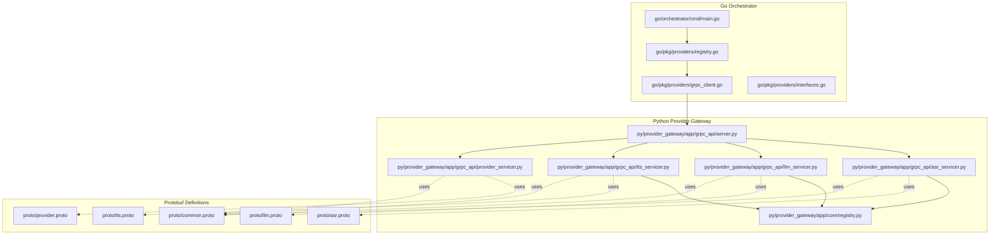
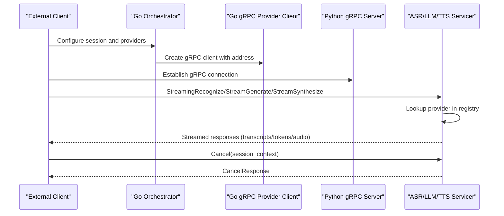
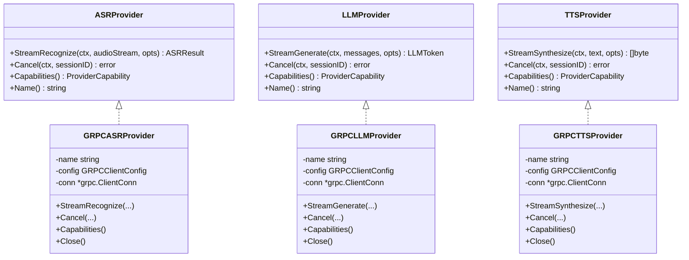
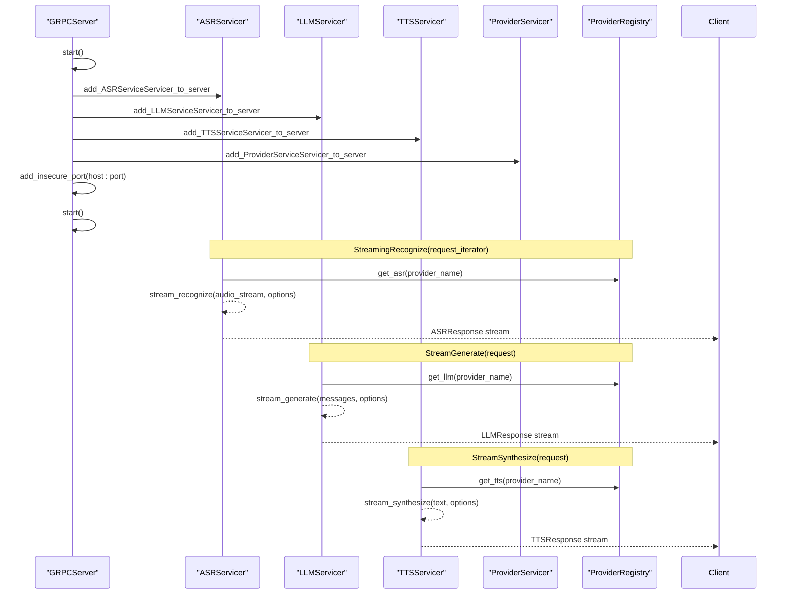
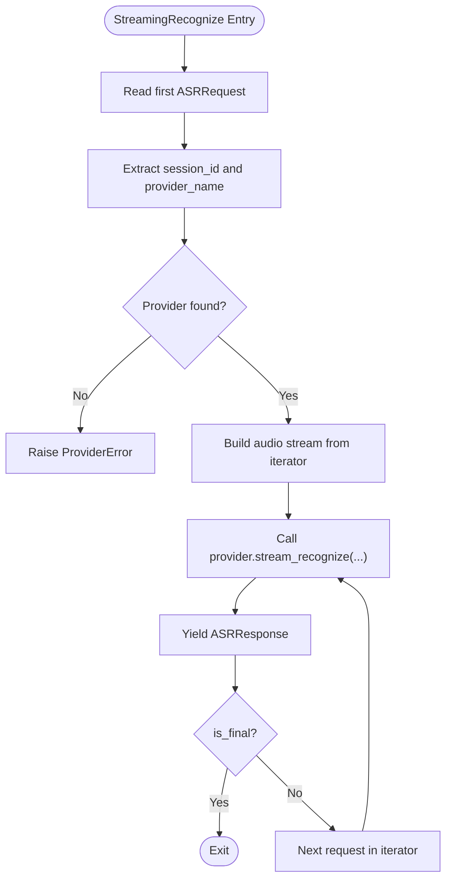
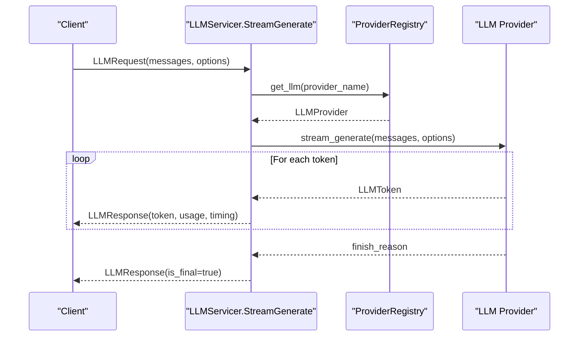
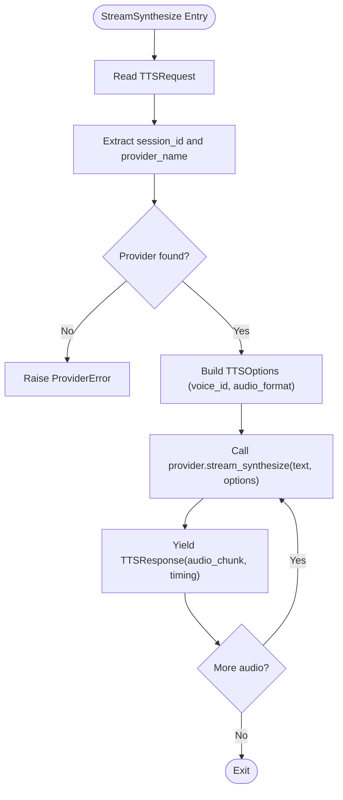
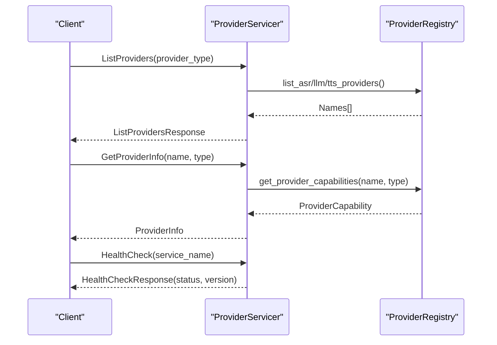
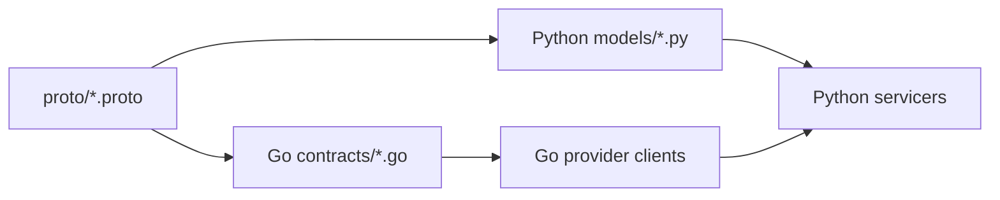
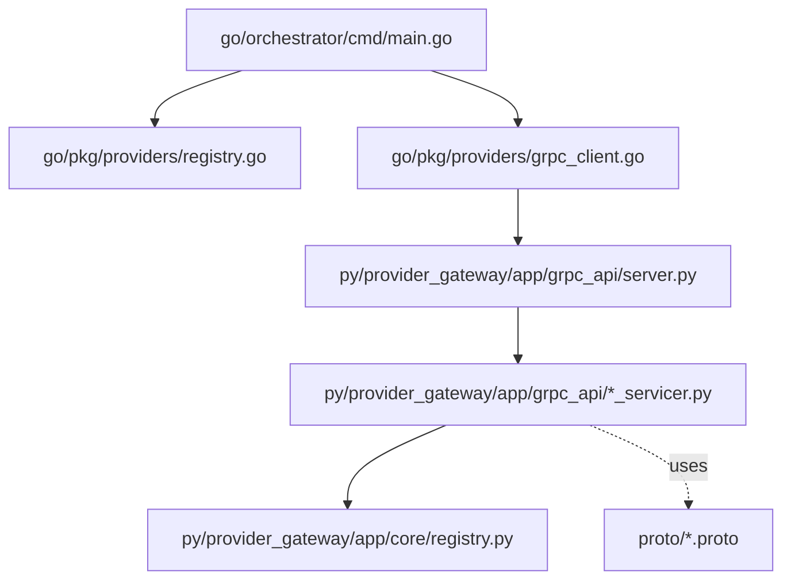

# gRPC Service Implementation

<cite>
**Referenced Files in This Document**
- [main.go](file://go/orchestrator/cmd/main.go)
- [grpc_client.go](file://go/pkg/providers/grpc_client.go)
- [interfaces.go](file://go/pkg/providers/interfaces.go)
- [registry.go](file://go/pkg/providers/registry.go)
- [server.py](file://py/provider_gateway/app/grpc_api/server.py)
- [asr_servicer.py](file://py/provider_gateway/app/grpc_api/asr_servicer.py)
- [llm_servicer.py](file://py/provider_gateway/app/grpc_api/llm_servicer.py)
- [tts_servicer.py](file://py/provider_gateway/app/grpc_api/tts_servicer.py)
- [provider_servicer.py](file://py/provider_gateway/app/grpc_api/provider_servicer.py)
- [registry.py](file://py/provider_gateway/app/core/registry.py)
- [asr.proto](file://proto/asr.proto)
- [llm.proto](file://proto/llm.proto)
- [tts.proto](file://proto/tts.proto)
- [provider.proto](file://proto/provider.proto)
- [common.proto](file://proto/common.proto)
- [config.go](file://go/pkg/config/config.go)
</cite>

## Table of Contents
1. [Introduction](#introduction)
2. [Project Structure](#project-structure)
3. [Core Components](#core-components)
4. [Architecture Overview](#architecture-overview)
5. [Detailed Component Analysis](#detailed-component-analysis)
6. [Dependency Analysis](#dependency-analysis)
7. [Performance Considerations](#performance-considerations)
8. [Troubleshooting Guide](#troubleshooting-guide)
9. [Conclusion](#conclusion)

## Introduction
This document explains the gRPC service implementation for the Parlona CloudApp, focusing on the asynchronous gRPC server setup and service handlers. It covers the server architecture, connection management, and service registration patterns for ASR, LLM, TTS, and Provider services. It also documents request/response handling, streaming support, error propagation, server configuration, threading model, graceful shutdown, and cross-language communication patterns between the Go orchestrator and the Python provider-gateway.

## Project Structure
The gRPC implementation spans two languages:
- Go orchestrator registers gRPC provider clients and coordinates sessions.
- Python provider-gateway exposes gRPC services for ASR, LLM, TTS, and Provider management.

**Diagram sources**
- [main.go:195-257](file://go/orchestrator/cmd/main.go#L195-L257)
- [grpc_client.go:14-288](file://go/pkg/providers/grpc_client.go#L14-L288)
- [registry.go:14-262](file://go/pkg/providers/registry.go#L14-L262)
- [interfaces.go:10-107](file://go/pkg/providers/interfaces.go#L10-L107)
- [server.py:25-171](file://py/provider_gateway/app/grpc_api/server.py#L25-L171)
- [asr_servicer.py:28-239](file://py/provider_gateway/app/grpc_api/asr_servicer.py#L28-L239)
- [llm_servicer.py:24-218](file://py/provider_gateway/app/grpc_api/llm_servicer.py#L24-L218)
- [tts_servicer.py:27-228](file://py/provider_gateway/app/grpc_api/tts_servicer.py#L27-L228)
- [provider_servicer.py:28-190](file://py/provider_gateway/app/grpc_api/provider_servicer.py#L28-L190)
- [registry.py:19-287](file://py/provider_gateway/app/core/registry.py#L19-L287)
- [asr.proto:1-53](file://proto/asr.proto#L1-L53)
- [llm.proto:1-59](file://proto/llm.proto#L1-L59)
- [tts.proto:1-45](file://proto/tts.proto#L1-L45)
- [provider.proto:1-63](file://proto/provider.proto#L1-L63)
- [common.proto:1-110](file://proto/common.proto#L1-L110)

**Section sources**
- [main.go:195-257](file://go/orchestrator/cmd/main.go#L195-L257)
- [server.py:25-171](file://py/provider_gateway/app/grpc_api/server.py#L25-L171)

## Core Components
- Go gRPC provider clients: Implement ASR, LLM, and TTS provider interfaces and manage gRPC connections to the Python provider-gateway.
- Python gRPC server: Asynchronous gRPC server exposing ASRService, LLMService, TTSService, and ProviderService.
- Provider registry: Manages provider factories and instances in Python; orchestrator registers gRPC provider clients in Go.
- Protobuf contracts: Define messages and services for cross-language compatibility.

Key responsibilities:
- Streaming recognition, generation, and synthesis with bidirectional/server streaming semantics.
- Capability queries and cancellation support.
- Session context propagation and timing metadata.
- Graceful shutdown and signal handling.

**Section sources**
- [grpc_client.go:14-288](file://go/pkg/providers/grpc_client.go#L14-L288)
- [interfaces.go:10-107](file://go/pkg/providers/interfaces.go#L10-L107)
- [server.py:25-171](file://py/provider_gateway/app/grpc_api/server.py#L25-L171)
- [asr_servicer.py:28-239](file://py/provider_gateway/app/grpc_api/asr_servicer.py#L28-L239)
- [llm_servicer.py:24-218](file://py/provider_gateway/app/grpc_api/llm_servicer.py#L24-L218)
- [tts_servicer.py:27-228](file://py/provider_gateway/app/grpc_api/tts_servicer.py#L27-L228)
- [provider_servicer.py:28-190](file://py/provider_gateway/app/grpc_api/provider_servicer.py#L28-L190)
- [registry.go:14-262](file://go/pkg/providers/registry.go#L14-L262)
- [registry.py:19-287](file://py/provider_gateway/app/core/registry.py#L19-L287)

## Architecture Overview
The system uses a hybrid architecture:
- Go orchestrator registers gRPC provider clients and delegates work to the Python provider-gateway.
- Python provider-gateway exposes asynchronous gRPC services with streaming support and capability discovery.

**Diagram sources**
- [main.go:195-257](file://go/orchestrator/cmd/main.go#L195-L257)
- [grpc_client.go:45-60](file://go/pkg/providers/grpc_client.go#L45-L60)
- [server.py:54-90](file://py/provider_gateway/app/grpc_api/server.py#L54-L90)
- [asr_servicer.py:42-122](file://py/provider_gateway/app/grpc_api/asr_servicer.py#L42-L122)
- [llm_servicer.py:38-105](file://py/provider_gateway/app/grpc_api/llm_servicer.py#L38-L105)
- [tts_servicer.py:41-110](file://py/provider_gateway/app/grpc_api/tts_servicer.py#L41-L110)

## Detailed Component Analysis

### Go gRPC Provider Clients
The Go implementation defines provider interfaces and stubbed gRPC clients that connect to the Python provider-gateway. These clients:
- Dial the provider-gateway address using insecure credentials.
- Implement streaming methods with channels and context cancellation.
- Expose capability queries and provider names.
- Support graceful closing of connections.

**Diagram sources**
- [interfaces.go:21-76](file://go/pkg/providers/interfaces.go#L21-L76)
- [grpc_client.go:35-277](file://go/pkg/providers/grpc_client.go#L35-L277)

**Section sources**
- [grpc_client.go:14-288](file://go/pkg/providers/grpc_client.go#L14-L288)
- [interfaces.go:10-107](file://go/pkg/providers/interfaces.go#L10-L107)

### Python gRPC Server and Servicers
The Python provider-gateway runs an asynchronous gRPC server with:
- ThreadPoolExecutor-based worker pool.
- Registration of ASRService, LLMService, TTSService, and ProviderService.
- Signal handling for graceful shutdown.
- Per-service streaming handlers delegating to provider registries.

**Diagram sources**
- [server.py:54-90](file://py/provider_gateway/app/grpc_api/server.py#L54-L90)
- [asr_servicer.py:42-122](file://py/provider_gateway/app/grpc_api/asr_servicer.py#L42-L122)
- [llm_servicer.py:38-105](file://py/provider_gateway/app/grpc_api/llm_servicer.py#L38-L105)
- [tts_servicer.py:41-110](file://py/provider_gateway/app/grpc_api/tts_servicer.py#L41-L110)
- [registry.py:85-169](file://py/provider_gateway/app/core/registry.py#L85-L169)

**Section sources**
- [server.py:25-171](file://py/provider_gateway/app/grpc_api/server.py#L25-L171)
- [asr_servicer.py:28-239](file://py/provider_gateway/app/grpc_api/asr_servicer.py#L28-L239)
- [llm_servicer.py:24-218](file://py/provider_gateway/app/grpc_api/llm_servicer.py#L24-L218)
- [tts_servicer.py:27-228](file://py/provider_gateway/app/grpc_api/tts_servicer.py#L27-L228)
- [provider_servicer.py:28-190](file://py/provider_gateway/app/grpc_api/provider_servicer.py#L28-L190)
- [registry.py:19-287](file://py/provider_gateway/app/core/registry.py#L19-L287)

### ASR Service Implementation
- StreamingRecognize: Bidirectional streaming for audio input and transcript output. Extracts session context and provider name from the first request, looks up the provider, streams audio chunks, and yields ASRResponse messages.
- Cancel: Cancels an ongoing recognition by delegating to the provider’s cancel method.
- GetCapabilities: Returns provider capability flags.

**Diagram sources**
- [asr_servicer.py:42-122](file://py/provider_gateway/app/grpc_api/asr_servicer.py#L42-L122)

**Section sources**
- [asr_servicer.py:28-239](file://py/provider_gateway/app/grpc_api/asr_servicer.py#L28-L239)
- [asr.proto:9-53](file://proto/asr.proto#L9-L53)

### LLM Service Implementation
- StreamGenerate: Server streaming for prompt input and token output. Converts ChatMessage list and options, streams tokens, and yields LLMResponse messages.
- Cancel: Cancels an ongoing generation.
- GetCapabilities: Returns provider capability flags.

**Diagram sources**
- [llm_servicer.py:38-105](file://py/provider_gateway/app/grpc_api/llm_servicer.py#L38-L105)

**Section sources**
- [llm_servicer.py:24-218](file://py/provider_gateway/app/grpc_api/llm_servicer.py#L24-L218)
- [llm.proto:9-59](file://proto/llm.proto#L9-L59)

### TTS Service Implementation
- StreamSynthesize: Server streaming for text input and audio output. Converts audio format and options, streams audio chunks, and yields TTSResponse messages.
- Cancel: Cancels an ongoing synthesis.
- GetCapabilities: Returns provider capability flags.

**Diagram sources**
- [tts_servicer.py:41-110](file://py/provider_gateway/app/grpc_api/tts_servicer.py#L41-L110)

**Section sources**
- [tts_servicer.py:27-228](file://py/provider_gateway/app/grpc_api/tts_servicer.py#L27-L228)
- [tts.proto:9-45](file://proto/tts.proto#L9-L45)

### Provider Service Implementation
- ListProviders: Lists providers by type or all providers, mapping internal capabilities to proto ProviderInfo.
- GetProviderInfo: Retrieves detailed info for a specific provider.
- HealthCheck: Returns service health status and version.

**Diagram sources**
- [provider_servicer.py:43-187](file://py/provider_gateway/app/grpc_api/provider_servicer.py#L43-L187)

**Section sources**
- [provider_servicer.py:28-190](file://py/provider_gateway/app/grpc_api/provider_servicer.py#L28-L190)
- [provider.proto:26-63](file://proto/provider.proto#L26-L63)

### Cross-Language Communication Patterns
- Protobuf contracts define messages and enums shared across languages.
- Go orchestrator uses provider interfaces and stubbed gRPC clients; Python provider-gateway implements the actual streaming logic.
- SessionContext, AudioFormat, TimingMetadata, and ProviderCapability are mirrored in both proto and Go contracts.

**Diagram sources**
- [common.proto:33-110](file://proto/common.proto#L33-L110)
- [asr.proto:26-52](file://proto/asr.proto#L26-L52)
- [llm.proto:39-58](file://proto/llm.proto#L39-L58)
- [tts.proto:26-44](file://proto/tts.proto#L26-L44)
- [provider.proto:43-62](file://proto/provider.proto#L43-L62)
- [config.go:9-94](file://go/pkg/config/config.go#L9-L94)

**Section sources**
- [common.proto:1-110](file://proto/common.proto#L1-L110)
- [config.go:1-276](file://go/pkg/config/config.go#L1-L276)

## Dependency Analysis
- Go orchestrator depends on provider registry and gRPC client implementations to connect to the Python provider-gateway.
- Python provider-gateway depends on provider registries and servicers to expose streaming APIs.
- Protobuf definitions define the contract for cross-language compatibility.

**Diagram sources**
- [main.go:195-257](file://go/orchestrator/cmd/main.go#L195-L257)
- [registry.go:14-262](file://go/pkg/providers/registry.go#L14-L262)
- [grpc_client.go:14-288](file://go/pkg/providers/grpc_client.go#L14-L288)
- [server.py:25-171](file://py/provider_gateway/app/grpc_api/server.py#L25-L171)
- [asr_servicer.py:28-239](file://py/provider_gateway/app/grpc_api/asr_servicer.py#L28-L239)
- [llm_servicer.py:24-218](file://py/provider_gateway/app/grpc_api/llm_servicer.py#L24-L218)
- [tts_servicer.py:27-228](file://py/provider_gateway/app/grpc_api/tts_servicer.py#L27-L228)
- [provider_servicer.py:28-190](file://py/provider_gateway/app/grpc_api/provider_servicer.py#L28-L190)
- [registry.py:19-287](file://py/provider_gateway/app/core/registry.py#L19-L287)
- [asr.proto:1-53](file://proto/asr.proto#L1-L53)
- [llm.proto:1-59](file://proto/llm.proto#L1-L59)
- [tts.proto:1-45](file://proto/tts.proto#L1-L45)
- [provider.proto:1-63](file://proto/provider.proto#L1-L63)

**Section sources**
- [main.go:195-257](file://go/orchestrator/cmd/main.go#L195-L257)
- [grpc_client.go:14-288](file://go/pkg/providers/grpc_client.go#L14-L288)
- [registry.go:14-262](file://go/pkg/providers/registry.go#L14-L262)
- [server.py:25-171](file://py/provider_gateway/app/grpc_api/server.py#L25-L171)
- [registry.py:19-287](file://py/provider_gateway/app/core/registry.py#L19-L287)

## Performance Considerations
- Threading model: Python server uses a ThreadPoolExecutor to handle concurrent RPCs; tune max_workers according to CPU and provider latency characteristics.
- Message sizes: gRPC server options configure maximum send/receive message length; adjust based on audio payload sizes.
- Streaming: Prefer server-streaming for tokenized outputs and bidirectional streaming for real-time audio to minimize latency.
- Backpressure: Channel buffer sizes in Go clients should match downstream processing rates to avoid blocking.
- Connection lifecycle: Reuse gRPC connections per provider; close gracefully during shutdown.
- Observability: Enable metrics and tracing to monitor latency, throughput, and error rates.

[No sources needed since this section provides general guidance]

## Troubleshooting Guide
Common issues and resolutions:
- Provider not found: Ensure provider names match between orchestrator and gateway; verify registration steps.
- Streaming errors: Check session context propagation and provider capability support for streaming.
- Cancellation failures: Verify provider cancel implementation and session tracking in servicers.
- Connection errors: Validate provider-gateway address and network connectivity; confirm insecure credentials usage.
- Graceful shutdown: Confirm signal handlers and server stop routines are invoked.

Operational checks:
- Health endpoints: Use readiness probes to validate Redis connectivity and service status.
- Logs and traces: Enable logging and OpenTelemetry tracing for end-to-end visibility.

**Section sources**
- [asr_servicer.py:112-122](file://py/provider_gateway/app/grpc_api/asr_servicer.py#L112-L122)
- [llm_servicer.py:97-105](file://py/provider_gateway/app/grpc_api/llm_servicer.py#L97-L105)
- [tts_servicer.py:101-109](file://py/provider_gateway/app/grpc_api/tts_servicer.py#L101-L109)
- [main.go:125-145](file://go/orchestrator/cmd/main.go#L125-L145)

## Conclusion
The gRPC implementation combines a Go orchestrator with a Python provider-gateway to deliver asynchronous streaming services for ASR, LLM, and TTS. The design leverages protobuf contracts for cross-language compatibility, supports capability discovery and cancellation, and provides robust streaming semantics. Proper configuration of threading, timeouts, and graceful shutdown ensures reliable operation at scale.