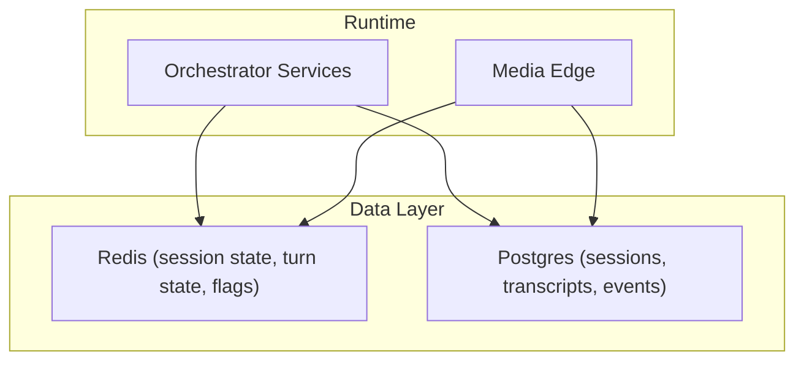
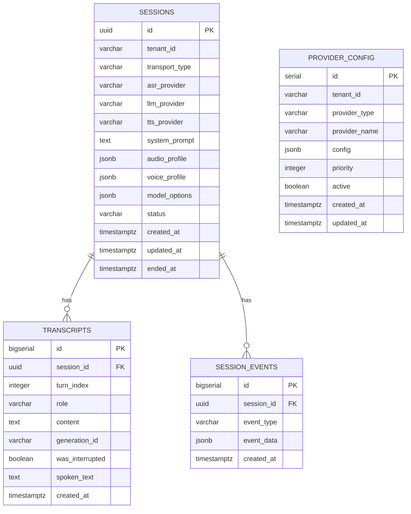
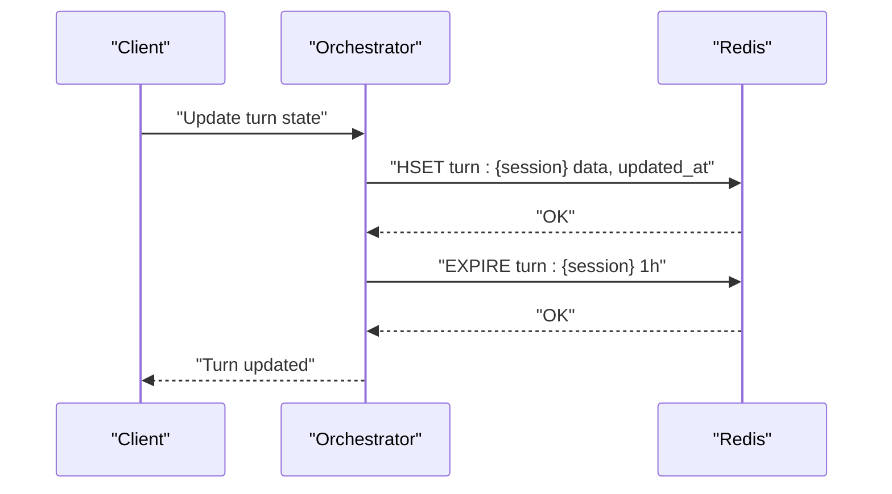
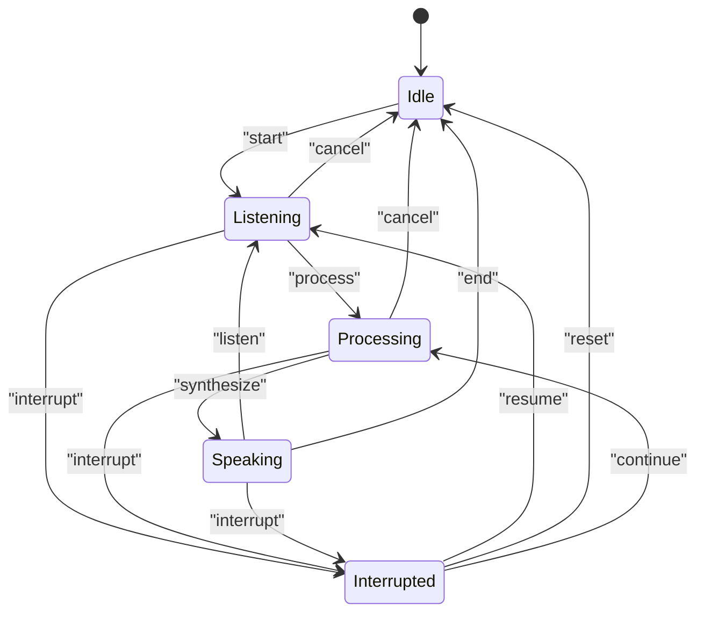
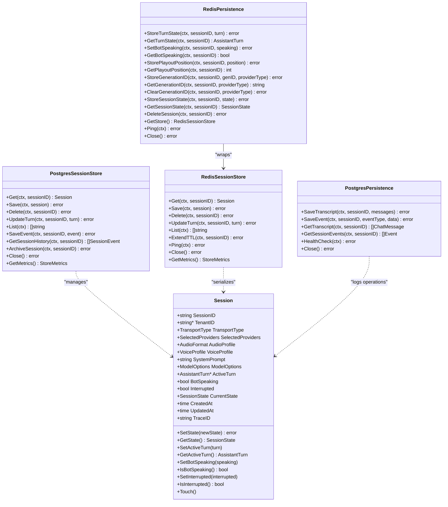
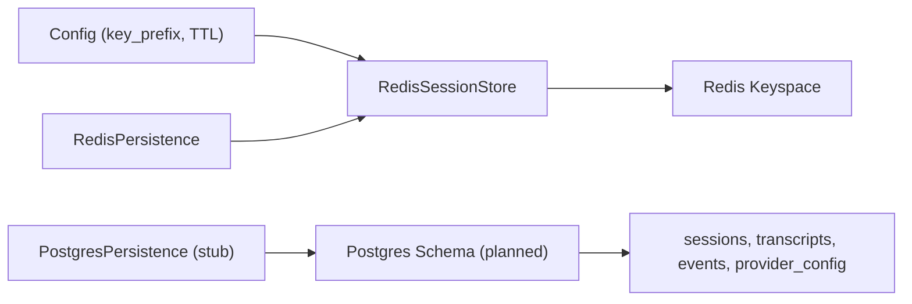

# Database Schema

<cite>
**Referenced Files in This Document**
- [001_initial_schema.up.sql](file://infra/migrations/001_initial_schema.up.sql)
- [001_initial_schema.down.sql](file://infra/migrations/001_initial_schema.down.sql)
- [postgres_store.go](file://go/pkg/session/postgres_store.go)
- [redis_store.go](file://go/pkg/session/redis_store.go)
- [postgres.go](file://go/orchestrator/internal/persistence/postgres.go)
- [redis.go](file://go/orchestrator/internal/persistence/redis.go)
- [session.go](file://go/pkg/session/session.go)
- [history.go](file://go/pkg/session/history.go)
- [state.go](file://go/pkg/session/state.go)
- [turn.go](file://go/pkg/session/turn.go)
- [store.go](file://go/pkg/session/store.go)
- [postgres.yaml](file://infra/k8s/postgres.yaml)
- [redis.yaml](file://infra/k8s/redis.yaml)
- [run-migrations.sh](file://scripts/run-migrations.sh)
- [config.go](file://go/pkg/config/config.go)
</cite>

## Table of Contents
1. [Introduction](#introduction)
2. [Project Structure](#project-structure)
3. [Core Components](#core-components)
4. [Architecture Overview](#architecture-overview)
5. [Detailed Component Analysis](#detailed-component-analysis)
6. [Dependency Analysis](#dependency-analysis)
7. [Performance Considerations](#performance-considerations)
8. [Troubleshooting Guide](#troubleshooting-guide)
9. [Conclusion](#conclusion)
10. [Appendices](#appendices)

## Introduction
This document provides comprehensive data model documentation for CloudApp’s database schema with a focus on PostgreSQL and Redis. It details entity relationships, field definitions, data types, constraints, and indexes for session management and conversation persistence. It also explains Redis data structures used for caching, session state, and temporary runtime data, along with operational patterns, caching strategies, performance considerations for high concurrency, data lifecycle and retention, migration and schema evolution, and security and access control.

## Project Structure
CloudApp separates durable persistence (PostgreSQL) from hot-state caching (Redis). The schema is defined via SQL migrations and complemented by stubbed or partial implementations in the orchestrator. Redis is used for short-lived session state, turn state, playout positions, generation IDs, and session state flags. PostgreSQL is intended for durable session records, conversation transcripts, and lifecycle events.

**Diagram sources**
- [postgres.go:13-191](file://go/orchestrator/internal/persistence/postgres.go#L13-L191)
- [redis.go:13-317](file://go/orchestrator/internal/persistence/redis.go#L13-L317)

**Section sources**
- [postgres.go:13-191](file://go/orchestrator/internal/persistence/postgres.go#L13-L191)
- [redis.go:13-317](file://go/orchestrator/internal/persistence/redis.go#L13-L317)

## Core Components
- PostgreSQL schema: Sessions, Transcripts, Session Events, Provider Configuration.
- Redis schema: Keyspace for session data, turn state, speaking flag, playout position, generation IDs, and session state.
- Session model: Encapsulates runtime state, provider selections, audio/voice/model options, and thread-safe mutation helpers.
- Conversation history: Manages prompt context and spoken-only history entries.
- State machine: Enforces valid session state transitions.
- Assistant turn: Tracks generation text, queued TTS text, spoken text, playout cursor, and interruption.

**Section sources**
- [001_initial_schema.up.sql:4-74](file://infra/migrations/001_initial_schema.up.sql#L4-L74)
- [session.go:61-84](file://go/pkg/session/session.go#L61-L84)
- [history.go:11-233](file://go/pkg/session/history.go#L11-L233)
- [state.go:8-153](file://go/pkg/session/state.go#L8-L153)
- [turn.go:9-230](file://go/pkg/session/turn.go#L9-L230)

## Architecture Overview
The system uses Redis for high-throughput, low-latency session hot-state and ephemeral metadata, while PostgreSQL is reserved for durable records and audit trails. The orchestrator provides stubbed PostgreSQL persistence for future implementation, while Redis persistence is fully implemented.

**Diagram sources**
- [001_initial_schema.up.sql:5-56](file://infra/migrations/001_initial_schema.up.sql#L5-L56)

**Section sources**
- [001_initial_schema.up.sql:4-74](file://infra/migrations/001_initial_schema.up.sql#L4-L74)

## Detailed Component Analysis

### PostgreSQL Schema and Constraints
- sessions
  - Primary key: id (UUID)
  - Fields: tenant_id, transport_type, provider identifiers, system_prompt, JSONB profiles/options, status, timestamps
  - Not-null constraints: transport_type, status
  - Default values: status='idle', timestamps default to NOW()
- transcripts
  - Primary key: id (BIGSERIAL)
  - Foreign key: session_id -> sessions.id (ON DELETE CASCADE)
  - Composite index: (session_id, turn_index)
  - Fields: turn_index, role, content, generation_id, was_interrupted, spoken_text, created_at
- session_events
  - Primary key: id (BIGSERIAL)
  - Foreign key: session_id -> sessions.id (ON DELETE CASCADE)
  - Indexes: session_id, event_type
  - Fields: event_type, event_data (JSONB), created_at
- provider_config
  - Primary key: id (SERIAL)
  - Unique constraint: (tenant_id, provider_type, provider_name)
  - Fields: tenant_id, provider_type, provider_name, config (JSONB), priority, active, timestamps

Indexes for performance:
- transcripts(session_id), transcripts(session_id, turn_index)
- session_events(session_id), session_events(event_type)
- sessions(tenant_id), sessions(status), sessions(created_at)
- provider_config(tenant_id, provider_type), provider_config(active)

**Section sources**
- [001_initial_schema.up.sql:4-74](file://infra/migrations/001_initial_schema.up.sql#L4-L74)

### Redis Data Structures and Access Patterns
Redis is used for:
- Hot session state: serialized Session object with TTL
- Turn state: hash with JSON payload and updated timestamp
- Speaking flag: string "1"/"0" with TTL
- Playout position: hash with position and updated timestamp
- Generation IDs: hash with provider-type-specific fields
- Session state: hash with state string and updated timestamp
- Cleanup: batch deletion of all keys for a session

Access patterns:
- GET/SET with TTL for session hot state
- HSET/HGET for structured fields (turn, playout, generation, state)
- SCAN with prefix for listing active sessions
- EXPIRE to enforce TTL on hot keys
- Pipeline for atomic writes (e.g., turn state update)

**Diagram sources**
- [redis.go:38-91](file://go/orchestrator/internal/persistence/redis.go#L38-L91)

**Section sources**
- [redis_store.go:12-166](file://go/pkg/session/redis_store.go#L12-L166)
- [redis.go:13-317](file://go/orchestrator/internal/persistence/redis.go#L13-L317)

### Session Model and State Machine
- Session encapsulates runtime state, provider selections, audio/voice/model options, and thread-safe setters/getters.
- State machine enforces valid transitions among idle, listening, processing, speaking, interrupted.
- AssistantTurn tracks generation text, queued TTS text, spoken text, playout cursor, and interruption.

**Diagram sources**
- [state.go:37-76](file://go/pkg/session/state.go#L37-L76)

**Section sources**
- [session.go:61-249](file://go/pkg/session/session.go#L61-L249)
- [state.go:8-153](file://go/pkg/session/state.go#L8-L153)
- [turn.go:9-230](file://go/pkg/session/turn.go#L9-L230)

### Conversation History and Prompt Context
- ConversationHistory maintains ordered messages and trims to a configured maximum size while preserving system messages.
- Prompt context construction includes system prompt and recent user/assistant messages.
- Only spoken text is committed to history, not unspoken generated text.

**Section sources**
- [history.go:11-233](file://go/pkg/session/history.go#L11-L233)

### Persistence Implementations
- RedisSessionStore (pkg/session): Implements Get, Save, Delete, UpdateTurn, List, TTL extension, metrics, and ping.
- PostgresSessionStore (pkg/session): Stubbed interface with TODO markers; not implemented yet.
- PostgresPersistence (orchestrator): Stubbed persistence layer logging operations; intended for future implementation.
- RedisPersistence (orchestrator): Wraps RedisSessionStore and exposes helpers for turn state, speaking flag, playout position, generation IDs, session state, and cleanup.

**Diagram sources**
- [session.go:61-249](file://go/pkg/session/session.go#L61-L249)
- [redis_store.go:12-166](file://go/pkg/session/redis_store.go#L12-L166)
- [postgres_store.go:10-93](file://go/pkg/session/postgres_store.go#L10-L93)
- [postgres.go:13-191](file://go/orchestrator/internal/persistence/postgres.go#L13-L191)
- [redis.go:13-317](file://go/orchestrator/internal/persistence/redis.go#L13-L317)

**Section sources**
- [redis_store.go:12-166](file://go/pkg/session/redis_store.go#L12-L166)
- [postgres_store.go:10-93](file://go/pkg/session/postgres_store.go#L10-L93)
- [postgres.go:13-191](file://go/orchestrator/internal/persistence/postgres.go#L13-L191)
- [redis.go:13-317](file://go/orchestrator/internal/persistence/redis.go#L13-L317)

### Sample Data and Typical Records
- Session record
  - id: UUID
  - tenant_id: string
  - transport_type: "websocket"|"sip"|"webrtc"
  - asr_provider,llm_provider,tts_provider: strings
  - system_prompt: text
  - audio_profile, voice_profile, model_options: JSONB
  - status: "idle"|"listening"|"processing"|"speaking"|"interrupted"
  - created_at, updated_at, ended_at: timestamptz
- Transcript entry
  - session_id: UUID (FK)
  - turn_index: integer
  - role: "user"|"assistant"|"system"
  - content: text
  - generation_id: string
  - was_interrupted: boolean
  - spoken_text: text
  - created_at: timestamptz
- Session event
  - session_id: UUID (FK)
  - event_type: string
  - event_data: JSONB
  - created_at: timestamptz
- Provider configuration
  - tenant_id, provider_type, provider_name: strings
  - config: JSONB
  - priority: integer
  - active: boolean
  - timestamps: timestamptz

**Section sources**
- [001_initial_schema.up.sql:5-56](file://infra/migrations/001_initial_schema.up.sql#L5-L56)

## Dependency Analysis
- Redis keys are prefixed and TTL-managed; the orchestrator composes keys and applies expiration.
- PostgreSQL schema defines foreign keys and indexes; the orchestrator stubs persistence but documents a future SQL schema with sessions, conversation_history, and session_events.
- Configuration controls Redis key prefixes and TTL defaults.

**Diagram sources**
- [config.go:30-36](file://go/pkg/config/config.go#L30-L36)
- [redis_store.go:21-36](file://go/pkg/session/redis_store.go#L21-L36)
- [redis.go:20-36](file://go/orchestrator/internal/persistence/redis.go#L20-L36)
- [postgres.go:149-191](file://go/orchestrator/internal/persistence/postgres.go#L149-L191)

**Section sources**
- [config.go:30-36](file://go/pkg/config/config.go#L30-L36)
- [redis_store.go:21-36](file://go/pkg/session/redis_store.go#L21-L36)
- [redis.go:20-36](file://go/orchestrator/internal/persistence/redis.go#L20-L36)
- [postgres.go:149-191](file://go/orchestrator/internal/persistence/postgres.go#L149-L191)

## Performance Considerations
- Redis
  - Use hashes for structured fields to minimize key count and enable atomic updates.
  - Apply TTLs to prevent memory accumulation; extend TTL on activity.
  - Use pipelines for multi-field writes to reduce RTTs.
  - Leverage SCAN with prefix for listing sessions; avoid KEYS.
- PostgreSQL
  - Use composite indexes on (session_id, turn_index) for ordered retrieval.
  - Partition or archive old sessions/transcripts if growth becomes significant.
  - Batch writes for high-frequency transcript updates.
- Concurrency
  - Redis operations are atomic per command; use Lua scripts or transactions for multi-key atomicity if needed.
  - Session and turn objects are thread-safe internally; avoid concurrent mutations outside the provided methods.

[No sources needed since this section provides general guidance]

## Troubleshooting Guide
- Redis connectivity
  - Use Ping to verify connectivity; inspect metrics for errors.
  - Confirm key prefix and TTL configuration.
- Session not found
  - Redis returns a typed not-found error; verify key composition and TTL.
- Persistence stubs
  - PostgreSQL persistence logs operations; ensure a real implementation replaces stubs.
  - Verify migration scripts are applied and indexes exist.
- TTL and cleanup
  - Extend TTL on activity; ensure scheduled cleanup jobs remove expired keys if needed.

**Section sources**
- [redis_store.go:146-166](file://go/pkg/session/redis_store.go#L146-L166)
- [postgres.go:128-134](file://go/orchestrator/internal/persistence/postgres.go#L128-L134)

## Conclusion
CloudApp’s data model leverages Redis for high-performance, short-lived session state and ephemeral metadata, and PostgreSQL for durable session records, conversation transcripts, and lifecycle events. The schema supports efficient querying via targeted indexes, and the session model enforces safe state transitions and thread-safe updates. While PostgreSQL persistence remains a stub, the documented schema and indexes provide a clear path for future implementation. Redis structures are optimized for atomic updates and TTL-based lifecycle management.

[No sources needed since this section summarizes without analyzing specific files]

## Appendices

### Database Lifecycle, Retention, and Archival
- Redis
  - TTL-based eviction; extend TTL on activity; consider periodic cleanup for stale keys.
- PostgreSQL
  - Define retention windows for sessions and transcripts; archive completed sessions to cold storage if needed.
  - Use partitioning by date for large-scale growth.

[No sources needed since this section provides general guidance]

### Migration Paths, Version Management, and Schema Evolution
- Use SQL migrations to evolve schema safely; maintain up/down scripts.
- Apply migrations via the provided script with support for local and Dockerized databases.
- Plan breaking changes with shadow tables or versioned JSONB fields.

**Section sources**
- [001_initial_schema.up.sql:1-74](file://infra/migrations/001_initial_schema.up.sql#L1-L74)
- [001_initial_schema.down.sql:1-8](file://infra/migrations/001_initial_schema.down.sql#L1-L8)
- [run-migrations.sh:1-139](file://scripts/run-migrations.sh#L1-L139)

### Data Security, Privacy, and Access Control
- Redis
  - Enforce network-level access control; consider ACLs and TLS if exposed externally.
- PostgreSQL
  - Use strong credentials, SSL connections, and least-privilege roles.
  - Mask or redact sensitive fields in logs and events.
- Configuration
  - Centralize secrets and prefixes via configuration; avoid hardcoding.

**Section sources**
- [postgres.yaml:34-46](file://infra/k8s/postgres.yaml#L34-L46)
- [redis.yaml:34-41](file://infra/k8s/redis.yaml#L34-L41)
- [config.go:30-44](file://go/pkg/config/config.go#L30-L44)