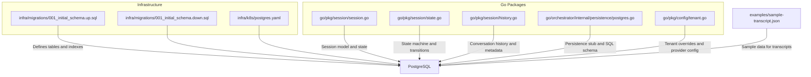
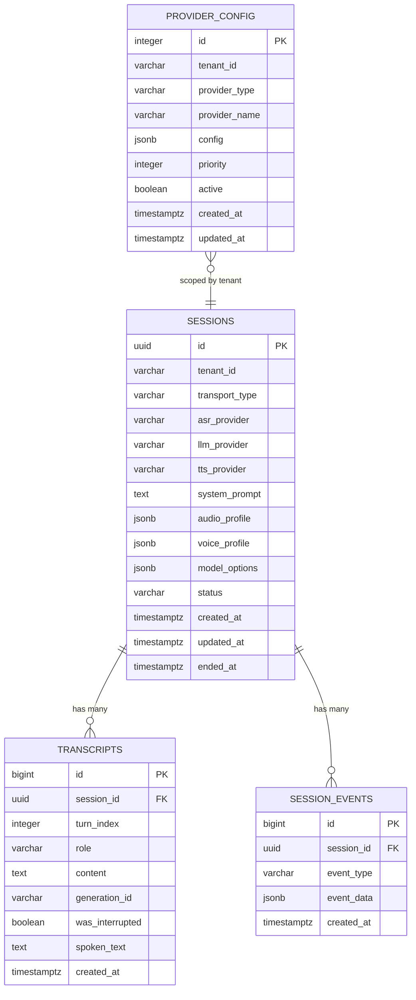
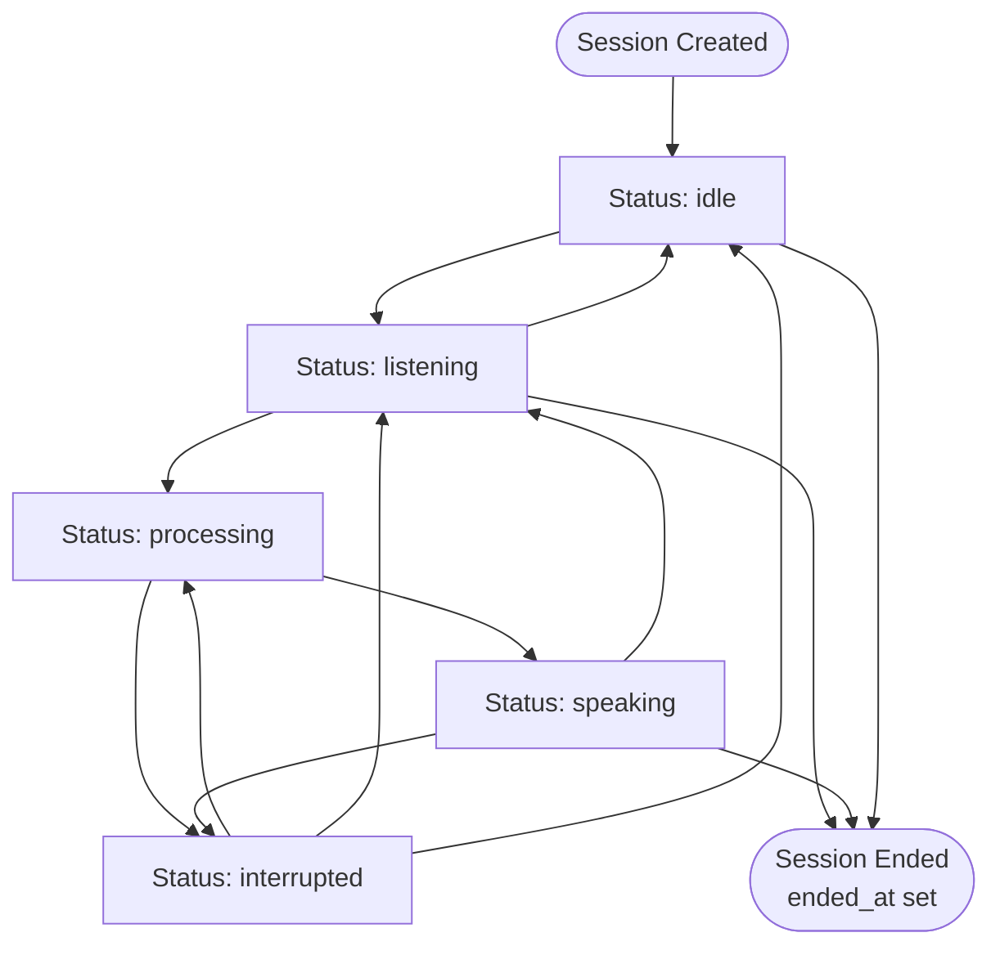
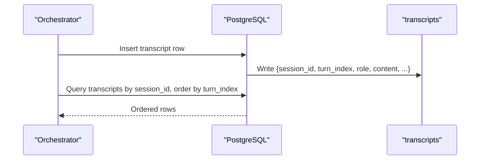
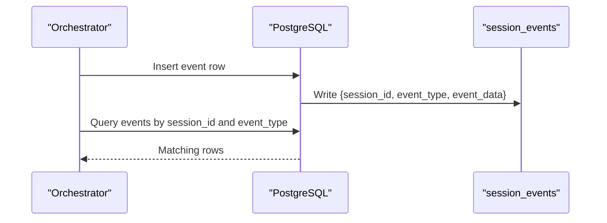
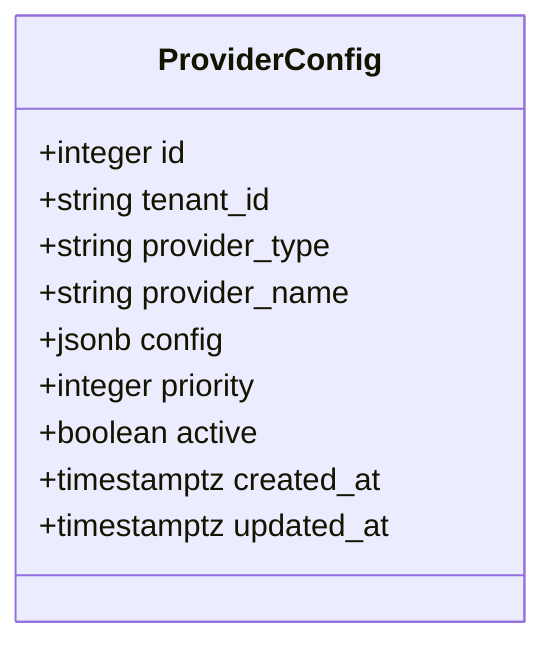
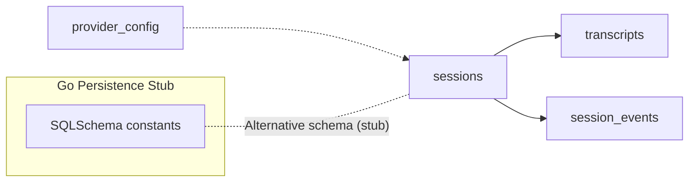

# PostgreSQL Schema

<cite>
**Referenced Files in This Document**
- [001_initial_schema.up.sql](file://infra/migrations/001_initial_schema.up.sql)
- [001_initial_schema.down.sql](file://infra/migrations/001_initial_schema.down.sql)
- [postgres.go](file://go/orchestrator/internal/persistence/postgres.go)
- [session.go](file://go/pkg/session/session.go)
- [state.go](file://go/pkg/session/state.go)
- [history.go](file://go/pkg/session/history.go)
- [sample-transcript.json](file://examples/sample-transcript.json)
- [postgres.yaml](file://infra/k8s/postgres.yaml)
- [tenant.go](file://go/pkg/config/tenant.go)
</cite>

## Table of Contents
1. [Introduction](#introduction)
2. [Project Structure](#project-structure)
3. [Core Components](#core-components)
4. [Architecture Overview](#architecture-overview)
5. [Detailed Component Analysis](#detailed-component-analysis)
6. [Dependency Analysis](#dependency-analysis)
7. [Performance Considerations](#performance-considerations)
8. [Troubleshooting Guide](#troubleshooting-guide)
9. [Conclusion](#conclusion)
10. [Appendices](#appendices)

## Introduction
This document describes the PostgreSQL schema for CloudApp’s voice conversation platform, focusing on four core tables: sessions, transcripts, session_events, and provider_config. It explains entity relationships, field definitions, data types, constraints, indexes, and operational patterns. It also covers session lifecycle tracking, conversation history storage, event logging, tenant-specific provider configuration, high-concurrency data access patterns, retention strategies, and schema evolution via migrations.

## Project Structure
The schema is defined and maintained as part of the repository’s infrastructure migrations. Supporting Go packages define session models, state machines, and persistence interfaces that drive how data is written to and queried from the database.

**Diagram sources**
- [001_initial_schema.up.sql:1-74](file://infra/migrations/001_initial_schema.up.sql#L1-L74)
- [001_initial_schema.down.sql:1-8](file://infra/migrations/001_initial_schema.down.sql#L1-L8)
- [postgres.go:149-191](file://go/orchestrator/internal/persistence/postgres.go#L149-L191)
- [session.go:62-84](file://go/pkg/session/session.go#L62-L84)
- [state.go:37-62](file://go/pkg/session/state.go#L37-L62)
- [history.go:211-232](file://go/pkg/session/history.go#L211-L232)
- [sample-transcript.json:1-69](file://examples/sample-transcript.json#L1-L69)
- [postgres.yaml:1-116](file://infra/k8s/postgres.yaml#L1-L116)
- [tenant.go:9-45](file://go/pkg/config/tenant.go#L9-L45)

**Section sources**
- [001_initial_schema.up.sql:1-74](file://infra/migrations/001_initial_schema.up.sql#L1-L74)
- [001_initial_schema.down.sql:1-8](file://infra/migrations/001_initial_schema.down.sql#L1-L8)
- [postgres.go:149-191](file://go/orchestrator/internal/persistence/postgres.go#L149-L191)
- [session.go:62-84](file://go/pkg/session/session.go#L62-L84)
- [state.go:37-62](file://go/pkg/session/state.go#L37-L62)
- [history.go:211-232](file://go/pkg/session/history.go#L211-L232)
- [sample-transcript.json:1-69](file://examples/sample-transcript.json#L1-L69)
- [postgres.yaml:1-116](file://infra/k8s/postgres.yaml#L1-L116)
- [tenant.go:9-45](file://go/pkg/config/tenant.go#L9-L45)

## Core Components
This section documents the four core tables and their roles in the system.

- sessions
  - Purpose: Tracks voice sessions with lifecycle metadata, provider selections, and configuration blobs.
  - Primary key: id (UUID)
  - Timestamps: created_at, updated_at, ended_at (with time zone support)
  - Status: status field drives lifecycle state
  - JSONB fields: audio_profile, voice_profile, model_options
  - Tenant scoping: tenant_id
  - Foreign keys: none
  - Unique indexes: none
  - Additional indexes: tenant_id, status, created_at

- transcripts
  - Purpose: Stores conversation turns with turn ordering and optional interruption metadata.
  - Primary key: id (auto-incrementing integer)
  - Foreign key: session_id → sessions.id (CASCADE DELETE)
  - Ordering: turn_index per session
  - JSONB fields: none
  - Boolean flags: was_interrupted
  - Text fields: role, content, spoken_text, generation_id
  - Timestamps: created_at (time zone aware)
  - Additional indexes: session_id, (session_id, turn_index)

- session_events
  - Purpose: Records lifecycle and debug events for auditing and monitoring.
  - Primary key: id (auto-incrementing integer)
  - Foreign key: session_id → sessions.id (CASCADE DELETE)
  - JSONB fields: event_data
  - Text fields: event_type
  - Timestamps: created_at (time zone aware)
  - Additional indexes: session_id, event_type

- provider_config
  - Purpose: Manages tenant-specific provider settings with priority and activation controls.
  - Primary key: id (auto-incrementing integer)
  - Tenant scoping: tenant_id, provider_type, provider_name form a unique constraint
  - JSONB fields: config
  - Flags: active
  - Numeric: priority
  - Timestamps: created_at, updated_at (time zone aware)
  - Additional indexes: (tenant_id, provider_type), active

**Section sources**
- [001_initial_schema.up.sql:5-20](file://infra/migrations/001_initial_schema.up.sql#L5-L20)
- [001_initial_schema.up.sql:23-33](file://infra/migrations/001_initial_schema.up.sql#L23-L33)
- [001_initial_schema.up.sql:36-42](file://infra/migrations/001_initial_schema.up.sql#L36-L42)
- [001_initial_schema.up.sql:45-56](file://infra/migrations/001_initial_schema.up.sql#L45-L56)
- [001_initial_schema.up.sql:58-67](file://infra/migrations/001_initial_schema.up.sql#L58-L67)

## Architecture Overview
The schema supports a session-centric architecture where each session has a conversation history and associated events. Provider configuration is tenant-scoped and can influence runtime behavior.

**Diagram sources**
- [001_initial_schema.up.sql:5-20](file://infra/migrations/001_initial_schema.up.sql#L5-L20)
- [001_initial_schema.up.sql:23-33](file://infra/migrations/001_initial_schema.up.sql#L23-L33)
- [001_initial_schema.up.sql:36-42](file://infra/migrations/001_initial_schema.up.sql#L36-L42)
- [001_initial_schema.up.sql:45-56](file://infra/migrations/001_initial_schema.up.sql#L45-L56)

## Detailed Component Analysis

### Sessions Table
- Purpose: Central record of a voice session including transport, provider selection, and configuration.
- Lifecycle fields:
  - status: drives state progression (see State Machine below)
  - created_at/updated_at: timestamps with time zone
  - ended_at: completion marker
- Configuration fields:
  - audio_profile, voice_profile, model_options: JSONB blobs for flexible configuration
- Tenant scoping: tenant_id enables multi-tenant separation
- Indexes: tenant_id, status, created_at

**Diagram sources**
- [state.go:37-62](file://go/pkg/session/state.go#L37-L62)
- [state.go:104-118](file://go/pkg/session/state.go#L104-L118)

**Section sources**
- [001_initial_schema.up.sql:5-20](file://infra/migrations/001_initial_schema.up.sql#L5-L20)
- [state.go:37-62](file://go/pkg/session/state.go#L37-L62)
- [state.go:104-118](file://go/pkg/session/state.go#L104-L118)

### Transcripts Table
- Purpose: Stores ordered conversation turns with optional interruption metadata.
- Turn ordering: (session_id, turn_index) ensures per-session ordering.
- Content fields:
  - role: user/assistant/system
  - content: raw content
  - spoken_text: text committed to history (used for TTS)
  - generation_id: identifies model generation for correlation
  - was_interrupted: indicates if the turn was cut short
- Timestamps: created_at (time zone aware)
- Foreign key: session_id → sessions.id (CASCADE DELETE)

**Diagram sources**
- [001_initial_schema.up.sql:23-33](file://infra/migrations/001_initial_schema.up.sql#L23-L33)
- [history.go:211-232](file://go/pkg/session/history.go#L211-L232)

**Section sources**
- [001_initial_schema.up.sql:23-33](file://infra/migrations/001_initial_schema.up.sql#L23-L33)
- [history.go:211-232](file://go/pkg/session/history.go#L211-L232)
- [sample-transcript.json:12-59](file://examples/sample-transcript.json#L12-L59)

### Session Events Table
- Purpose: Captures lifecycle and diagnostic events for monitoring and debugging.
- Fields:
  - event_type: categorizes the event
  - event_data: JSONB payload for arbitrary event details
  - created_at: time zone aware
- Foreign key: session_id → sessions.id (CASCADE DELETE)
- Indexes: session_id, event_type

**Diagram sources**
- [001_initial_schema.up.sql:36-42](file://infra/migrations/001_initial_schema.up.sql#L36-L42)

**Section sources**
- [001_initial_schema.up.sql:36-42](file://infra/migrations/001_initial_schema.up.sql#L36-L42)

### Provider Configuration Table
- Purpose: Tenant-scoped provider configuration with priority and activation.
- Uniqueness: (tenant_id, provider_type, provider_name) ensures one effective config per tenant/provider tuple.
- Fields:
  - config: JSONB provider settings
  - priority: numeric ordering for selection
  - active: enable/disable flag
  - timestamps: created_at, updated_at (time zone aware)
- Indexes: (tenant_id, provider_type), active

**Diagram sources**
- [001_initial_schema.up.sql:45-56](file://infra/migrations/001_initial_schema.up.sql#L45-L56)

**Section sources**
- [001_initial_schema.up.sql:45-56](file://infra/migrations/001_initial_schema.up.sql#L45-L56)
- [tenant.go:9-45](file://go/pkg/config/tenant.go#L9-L45)

## Dependency Analysis
- sessions is the root entity; transcripts and session_events both reference it with CASCADE DELETE.
- provider_config is scoped by tenant and does not directly reference sessions.
- The Go persistence layer includes a separate SQL schema definition for a different table layout (sessions, conversation_history, session_events). This is a stub and not used in the current migration-defined schema.

**Diagram sources**
- [001_initial_schema.up.sql](file://infra/migrations/001_initial_schema.up.sql#L25)
- [001_initial_schema.up.sql](file://infra/migrations/001_initial_schema.up.sql#L38)
- [postgres.go:149-191](file://go/orchestrator/internal/persistence/postgres.go#L149-L191)

**Section sources**
- [001_initial_schema.up.sql](file://infra/migrations/001_initial_schema.up.sql#L25)
- [001_initial_schema.up.sql](file://infra/migrations/001_initial_schema.up.sql#L38)
- [postgres.go:149-191](file://go/orchestrator/internal/persistence/postgres.go#L149-L191)

## Performance Considerations
- Index coverage
  - sessions: tenant_id, status, created_at
  - transcripts: session_id, (session_id, turn_index)
  - session_events: session_id, event_type
  - provider_config: (tenant_id, provider_type), active
- Time zone timestamps
  - Using timestamptz ensures consistent time comparisons across regions.
- JSONB flexibility
  - JSONB fields allow evolving configuration without schema churn but may benefit from selective indexing or materialized columns if frequently filtered.
- Concurrency patterns
  - Use advisory locks or idempotent inserts when writing transcripts and events concurrently.
  - Batch writes for high-volume event logging to reduce round trips.
- Partitioning and retention
  - Consider time-based partitioning on created_at for large-scale event and transcript tables.
  - Implement automated purging jobs for old sessions/transcripts/events to control growth.

[No sources needed since this section provides general guidance]

## Troubleshooting Guide
- Missing or incorrect indexes
  - Symptoms: slow queries on session_id, event_type filters, or tenant/provider lookups.
  - Action: Verify indexes exist as defined in the migration.
- Cascade delete behavior
  - Deleting a session deletes transcripts and events automatically; confirm this is desired for your retention policy.
- Time zone discrepancies
  - Ensure application and database clients handle timestamptz consistently to avoid off-by-zone errors.
- JSONB payload sizes
  - Large event_data payloads can increase storage and IO; consider compressing or archiving heavy payloads externally if needed.
- Tenant scoping
  - provider_config uniqueness spans tenant_id, provider_type, and provider_name; ensure these values are set correctly to avoid conflicts.

**Section sources**
- [001_initial_schema.up.sql:58-67](file://infra/migrations/001_initial_schema.up.sql#L58-L67)
- [001_initial_schema.up.sql](file://infra/migrations/001_initial_schema.up.sql#L25)
- [001_initial_schema.up.sql](file://infra/migrations/001_initial_schema.up.sql#L38)

## Conclusion
The schema provides a robust foundation for session lifecycle tracking, conversation history, event logging, and tenant-scoped provider configuration. The defined indexes and time zone-aware timestamps support efficient querying and reliable cross-timezone operations. For production, complement the schema with retention policies, partitioning, and careful monitoring of JSONB usage.

[No sources needed since this section summarizes without analyzing specific files]

## Appendices

### Sample Data References
- Typical session record fields: session_id, tenant_id, transport_type, provider selections, status, timestamps.
- Transcript entries: role, content, turn_index, generation_id, was_interrupted, spoken_text.
- Event logs: event_type, event_data, created_at.

**Section sources**
- [sample-transcript.json:1-69](file://examples/sample-transcript.json#L1-L69)
- [001_initial_schema.up.sql:5-20](file://infra/migrations/001_initial_schema.up.sql#L5-L20)
- [001_initial_schema.up.sql:23-33](file://infra/migrations/001_initial_schema.up.sql#L23-L33)
- [001_initial_schema.up.sql:36-42](file://infra/migrations/001_initial_schema.up.sql#L36-L42)

### Database Deployment Notes
- PostgreSQL containerization and readiness probes are defined in the Kubernetes manifest. For production, prefer managed services and secure secrets management.

**Section sources**
- [postgres.yaml:1-116](file://infra/k8s/postgres.yaml#L1-L116)

### Migration Strategies
- Up migration: Creates tables and indexes; safe for initial rollout.
- Down migration: Drops tables; use cautiously in production environments.
- Future evolutions: Add new columns with defaults, create indexes in separate migration steps, and use reversible operations where possible.

**Section sources**
- [001_initial_schema.up.sql:1-74](file://infra/migrations/001_initial_schema.up.sql#L1-L74)
- [001_initial_schema.down.sql:1-8](file://infra/migrations/001_initial_schema.down.sql#L1-L8)