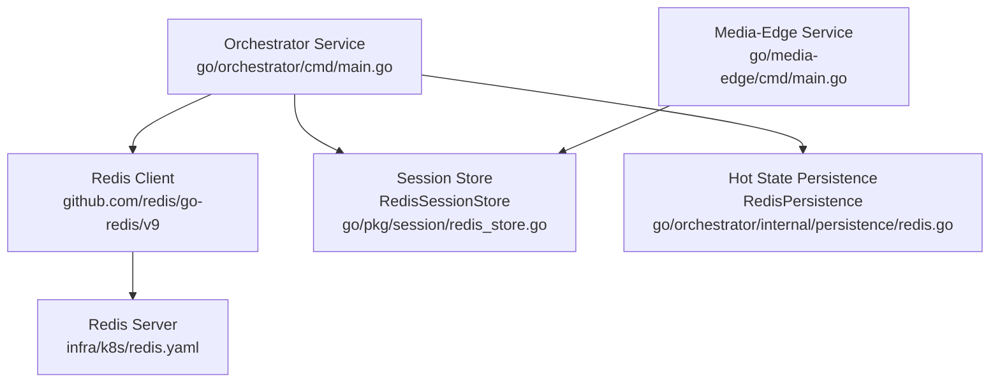
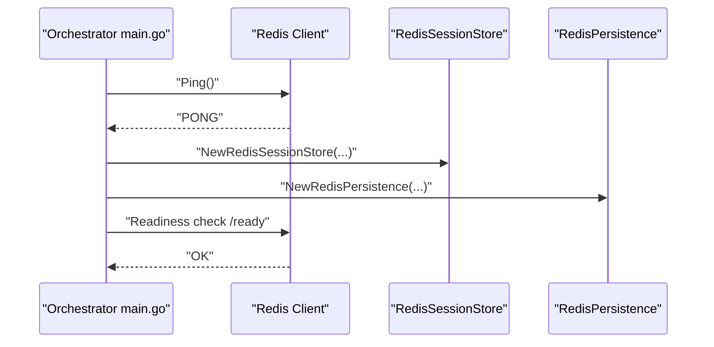
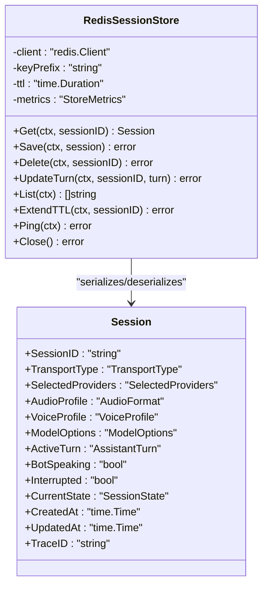
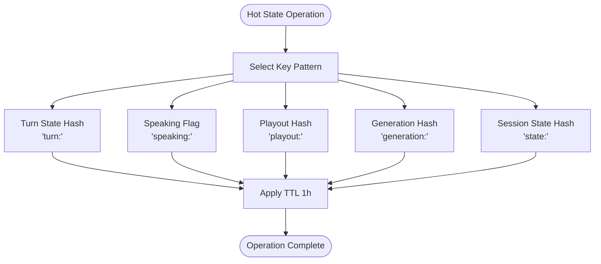
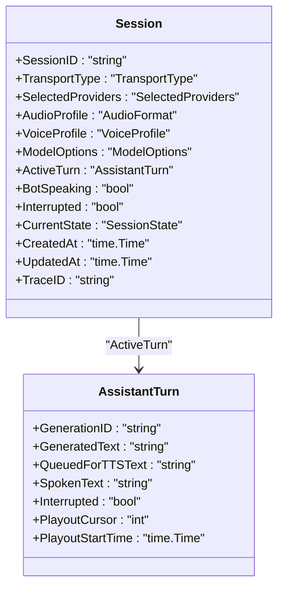
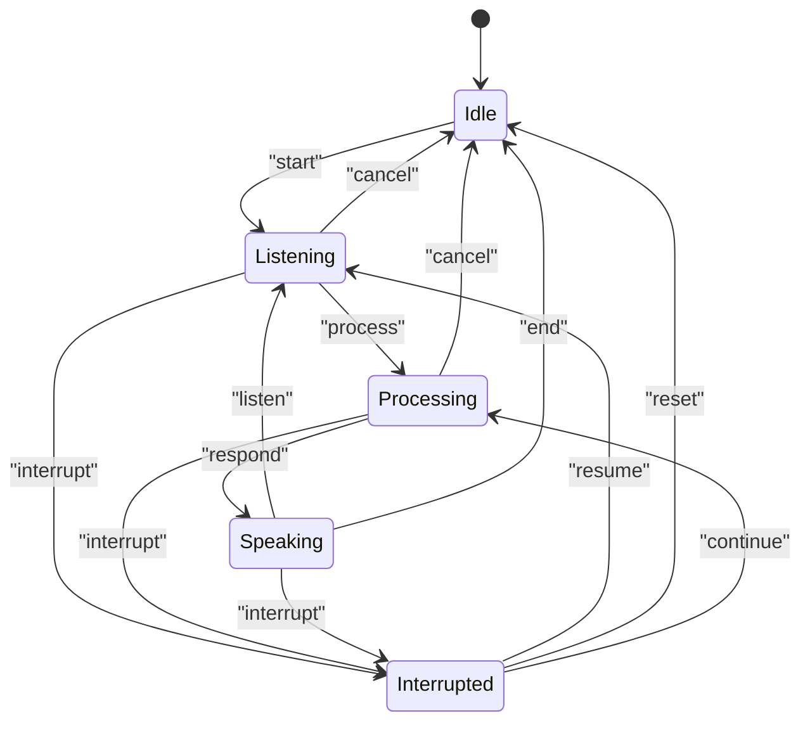
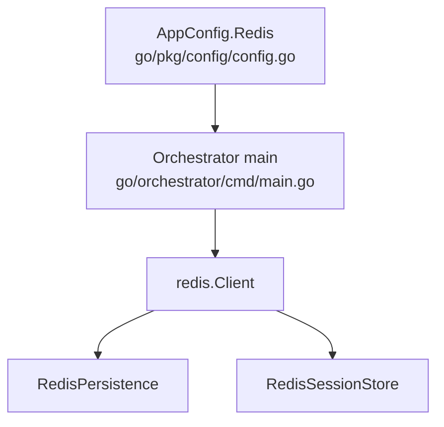

# Redis Data Structures

<cite>
**Referenced Files in This Document**
- [redis_store.go](file://go/pkg/session/redis_store.go)
- [redis.go](file://go/orchestrator/internal/persistence/redis.go)
- [session.go](file://go/pkg/session/session.go)
- [store.go](file://go/pkg/session/store.go)
- [state.go](file://go/pkg/session/state.go)
- [turn.go](file://go/pkg/session/turn.go)
- [postgres_store.go](file://go/pkg/session/postgres_store.go)
- [main.go](file://go/orchestrator/cmd/main.go)
- [config.go](file://go/pkg/config/config.go)
- [redis.yaml](file://infra/k8s/redis.yaml)
- [metrics.go](file://go/pkg/observability/metrics.go)
</cite>

## Table of Contents
1. [Introduction](#introduction)
2. [Project Structure](#project-structure)
3. [Core Components](#core-components)
4. [Architecture Overview](#architecture-overview)
5. [Detailed Component Analysis](#detailed-component-analysis)
6. [Dependency Analysis](#dependency-analysis)
7. [Performance Considerations](#performance-considerations)
8. [Troubleshooting Guide](#troubleshooting-guide)
9. [Conclusion](#conclusion)

## Introduction
This document explains CloudApp’s Redis data structures and caching strategy for session state management and real-time conversation state. It focuses on how active sessions, session metadata, and transient runtime state are modeled, stored, and accessed. It also covers expiration policies, caching patterns for high-frequency operations, cache invalidation, and consistency between Redis and PostgreSQL. Guidance is included for connection pooling, failover handling, monitoring, persistence configuration, backups, and operational troubleshooting.

## Project Structure
CloudApp’s Redis usage spans two primary areas:
- Session store: a Redis-backed store for full session objects and high-frequency operations.
- Hot state persistence: Redis hashes and string keys for real-time, short-lived conversation state (turn state, speaking flag, playout position, generation IDs, and session state).

**Diagram sources**
- [main.go:73-95](file://go/orchestrator/cmd/main.go#L73-L95)
- [redis_store.go:13-36](file://go/pkg/session/redis_store.go#L13-L36)
- [redis.go:14-36](file://go/orchestrator/internal/persistence/redis.go#L14-L36)
- [redis.yaml:28-41](file://infra/k8s/redis.yaml#L28-L41)

**Section sources**
- [main.go:73-95](file://go/orchestrator/cmd/main.go#L73-L95)
- [redis_store.go:13-36](file://go/pkg/session/redis_store.go#L13-L36)
- [redis.go:14-36](file://go/orchestrator/internal/persistence/redis.go#L14-L36)
- [redis.yaml:28-41](file://infra/k8s/redis.yaml#L28-L41)

## Core Components
- RedisSessionStore: Implements the session store interface using Redis with JSON-serialized session objects and TTL-based expiration.
- RedisPersistence: Provides hot-state helpers using Redis hashes and strings for turn state, speaking flag, playout position, generation IDs, and session state.
- Session and AssistantTurn: Core data models for session runtime state and per-turn tracking.
- Configuration: Centralized Redis connection and key-prefix configuration.

Key-value organization and TTL:
- Full session object: key pattern is "<keyPrefix>session:<sessionID>" with JSON payload and default TTL.
- Turn state: hash "<keyPrefix>turn:<sessionID>" with fields "data" and "updated_at".
- Speaking flag: key "<keyPrefix>speaking:<sessionID>" storing "1" or "0" with TTL.
- Playout position: hash "<keyPrefix>playout:<sessionID>" with fields "position" and "updated_at".
- Generation IDs: hash "<keyPrefix>generation:<sessionID>" with provider-type suffixed fields (e.g., "<provider>_id") and TTL.
- Session state: hash "<keyPrefix>state:<sessionID>" with fields "state" and "updated_at".

Expiration policy:
- All hot-state keys use 1-hour TTL to ensure automatic cleanup of inactive sessions.
- Session object TTL is configured via store options and defaults to 1 hour.

Caching patterns:
- High-frequency reads/writes for turn state, speaking flag, and playout position use Redis hashes for partial updates.
- Session object caching uses full-object JSON serialization with periodic TTL extension.

Consistency with PostgreSQL:
- Redis is the hot cache; PostgreSQL is a stubbed durable store for future archival and audit trails. Current implementation does not enforce cross-store consistency.

**Section sources**
- [redis_store.go:13-36](file://go/pkg/session/redis_store.go#L13-L36)
- [redis_store.go:38-103](file://go/pkg/session/redis_store.go#L38-L103)
- [redis_store.go:125-144](file://go/pkg/session/redis_store.go#L125-L144)
- [redis.go:38-91](file://go/orchestrator/internal/persistence/redis.go#L38-L91)
- [redis.go:93-129](file://go/orchestrator/internal/persistence/redis.go#L93-L129)
- [redis.go:131-168](file://go/orchestrator/internal/persistence/redis.go#L131-L168)
- [redis.go:170-225](file://go/orchestrator/internal/persistence/redis.go#L170-L225)
- [redis.go:227-278](file://go/orchestrator/internal/persistence/redis.go#L227-L278)
- [redis.go:280-301](file://go/orchestrator/internal/persistence/redis.go#L280-L301)
- [session.go:62-84](file://go/pkg/session/session.go#L62-L84)
- [turn.go:10-25](file://go/pkg/session/turn.go#L10-L25)
- [state.go:8-35](file://go/pkg/session/state.go#L8-L35)
- [config.go:30-36](file://go/pkg/config/config.go#L30-L36)

## Architecture Overview
The orchestrator initializes Redis and exposes readiness checks. It composes a session store and a hot-state persistence layer. Media-edge uses the session store for session operations. Hot-state persistence is used for real-time conversation state.

**Diagram sources**
- [main.go:73-95](file://go/orchestrator/cmd/main.go#L73-L95)
- [main.go:132-145](file://go/orchestrator/cmd/main.go#L132-L145)

**Section sources**
- [main.go:73-95](file://go/orchestrator/cmd/main.go#L73-L95)
- [main.go:132-145](file://go/orchestrator/cmd/main.go#L132-L145)

## Detailed Component Analysis

### RedisSessionStore: Session Object Caching
Responsibilities:
- Get, Save, Delete, UpdateTurn, List, ExtendTTL, Ping, Close.
- Uses JSON-serialized session objects with TTL.
- Maintains counters for Gets, Saves, Deletes, UpdateTurns, and Errors.

Data model:
- Key: "<keyPrefix>session:<sessionID>"
- Value: JSON-encoded Session object.
- Expiration: TTL applied on Save and ExtendTTL.

Concurrency and safety:
- Session object is protected by a mutex; store operations serialize to avoid races.

Operational notes:
- List uses SCAN to enumerate active sessions by prefix.
- ExtendTTL refreshes the TTL for long-running sessions.

**Diagram sources**
- [redis_store.go:13-36](file://go/pkg/session/redis_store.go#L13-L36)
- [session.go:62-84](file://go/pkg/session/session.go#L62-L84)

**Section sources**
- [redis_store.go:38-103](file://go/pkg/session/redis_store.go#L38-L103)
- [redis_store.go:125-144](file://go/pkg/session/redis_store.go#L125-L144)
- [redis_store.go:156-160](file://go/pkg/session/redis_store.go#L156-L160)
- [session.go:62-84](file://go/pkg/session/session.go#L62-L84)

### RedisPersistence: Real-Time Conversation State
Responsibilities:
- Store and retrieve turn state (partial updates via hash).
- Track speaking flag (boolean stored as "1"/"0").
- Track playout position (integer cursor).
- Track generation IDs per provider type.
- Track session state (enum-like string) with transitions.

Data model:
- Turn state: hash "<keyPrefix>turn:<sessionID>" with "data" (JSON) and "updated_at".
- Speaking: key "<keyPrefix>speaking:<sessionID>" with "1"|"0".
- Playout: hash "<keyPrefix>playout:<sessionID>" with "position" and "updated_at".
- Generation IDs: hash "<keyPrefix>generation:<sessionID>" with "<provider>_id" fields.
- Session state: hash "<keyPrefix>state:<sessionID>" with "state" and "updated_at".

Expiration:
- All hot-state keys expire after 1 hour.

**Diagram sources**
- [redis.go:38-91](file://go/orchestrator/internal/persistence/redis.go#L38-L91)
- [redis.go:93-129](file://go/orchestrator/internal/persistence/redis.go#L93-L129)
- [redis.go:131-168](file://go/orchestrator/internal/persistence/redis.go#L131-L168)
- [redis.go:170-225](file://go/orchestrator/internal/persistence/redis.go#L170-L225)
- [redis.go:227-278](file://go/orchestrator/internal/persistence/redis.go#L227-L278)

**Section sources**
- [redis.go:38-91](file://go/orchestrator/internal/persistence/redis.go#L38-L91)
- [redis.go:93-129](file://go/orchestrator/internal/persistence/redis.go#L93-L129)
- [redis.go:131-168](file://go/orchestrator/internal/persistence/redis.go#L131-L168)
- [redis.go:170-225](file://go/orchestrator/internal/persistence/redis.go#L170-L225)
- [redis.go:227-278](file://go/orchestrator/internal/persistence/redis.go#L227-L278)

### Session and AssistantTurn: Data Structures
- Session: Contains transport info, provider selections, audio/voice/model options, runtime flags (bot speaking, interrupted), current state, timestamps, and active turn.
- AssistantTurn: Tracks generated text, queued-for-TTS text, spoken text, playout cursor, interruption, and timing.

Thread-safety:
- Both types use RWMutex to protect concurrent reads/writes.

**Diagram sources**
- [session.go:62-84](file://go/pkg/session/session.go#L62-L84)
- [turn.go:10-25](file://go/pkg/session/turn.go#L10-L25)

**Section sources**
- [session.go:62-84](file://go/pkg/session/session.go#L62-L84)
- [turn.go:10-25](file://go/pkg/session/turn.go#L10-L25)

### Session State Machine
- Defines allowed state transitions and provides methods to validate and execute transitions.
- Used to manage session lifecycle (idle, listening, processing, speaking, interrupted).

**Diagram sources**
- [state.go:37-62](file://go/pkg/session/state.go#L37-L62)
- [state.go:81-132](file://go/pkg/session/state.go#L81-L132)

**Section sources**
- [state.go:37-62](file://go/pkg/session/state.go#L37-L62)
- [state.go:81-132](file://go/pkg/session/state.go#L81-L132)

### Redis Commands Used for Session Management
- Get/Set/Expire/Delete for session object and hot-state keys.
- HSet/HGet/Expire for hash-based hot state.
- Pipeline for atomic multi-key operations.

Examples (command semantics):
- Retrieve session: GET "<keyPrefix>session:<sessionID>"
- Store session: SET "<keyPrefix>session:<sessionID>" <JSON> EX 3600
- Update turn state: HSET "<keyPrefix>turn:<sessionID>" data <JSON> updated_at <RFC3339> EX 3600
- Set speaking flag: SET "<keyPrefix>speaking:<sessionID>" "1" EX 3600
- Get playout position: HGET "<keyPrefix>playout:<sessionID>" position
- Store generation ID: HSET "<keyPrefix>generation:<sessionID>" "<provider>_id" <id> EX 3600
- Get session state: HGET "<keyPrefix>state:<sessionID>" state

Note: Replace "<keyPrefix>" with the configured prefix and "<sessionID>" with the session identifier.

**Section sources**
- [redis_store.go:38-103](file://go/pkg/session/redis_store.go#L38-L103)
- [redis.go:38-91](file://go/orchestrator/internal/persistence/redis.go#L38-L91)
- [redis.go:93-129](file://go/orchestrator/internal/persistence/redis.go#L93-L129)
- [redis.go:131-168](file://go/orchestrator/internal/persistence/redis.go#L131-L168)
- [redis.go:170-225](file://go/orchestrator/internal/persistence/redis.go#L170-L225)
- [redis.go:227-278](file://go/orchestrator/internal/persistence/redis.go#L227-L278)

## Dependency Analysis
- Orchestrator depends on Redis client initialization and readiness checks.
- RedisSessionStore and RedisPersistence both depend on the Redis client.
- Configuration drives key prefixes and connection parameters.

**Diagram sources**
- [config.go:30-36](file://go/pkg/config/config.go#L30-L36)
- [main.go:73-95](file://go/orchestrator/cmd/main.go#L73-L95)
- [redis_store.go:13-36](file://go/pkg/session/redis_store.go#L13-L36)
- [redis.go:14-36](file://go/orchestrator/internal/persistence/redis.go#L14-L36)

**Section sources**
- [config.go:30-36](file://go/pkg/config/config.go#L30-L36)
- [main.go:73-95](file://go/orchestrator/cmd/main.go#L73-L95)
- [redis_store.go:13-36](file://go/pkg/session/redis_store.go#L13-L36)
- [redis.go:14-36](file://go/orchestrator/internal/persistence/redis.go#L14-L36)

## Performance Considerations
- Memory optimization:
  - Use hash structures for hot-state updates to minimize memory churn.
  - Apply 1-hour TTLs to prevent unbounded growth.
  - Limit session object size by avoiding large payloads; prefer hashes for granular updates.
- Throughput:
  - Use pipelining for multi-key operations to reduce RTTs.
  - Batch updates where possible (e.g., updating playout position and timestamp atomically).
- Scaling:
  - Single Redis instance is deployed for MVP; consider clustering or managed Redis for production.
  - Ensure consistent hashing or sharding if horizontal scaling is introduced later.
- Connection handling:
  - The orchestrator creates a single Redis client; extend with connection pooling and retry/backoff for resilience.
  - Use health/readiness endpoints to gate traffic until Redis is reachable.

[No sources needed since this section provides general guidance]

## Troubleshooting Guide
Common issues and remedies:
- Redis connectivity failures:
  - Verify address, password, and DB index in configuration.
  - Confirm readiness endpoint returns healthy when Redis is reachable.
- High memory usage:
  - Review maxmemory and maxmemory-policy settings; ensure eviction aligns with hot-state TTLs.
- Stale or missing hot-state:
  - Confirm TTLs are being refreshed and keys are not expired prematurely.
- Session not found:
  - Check key prefix and session ID correctness; ensure LIST scans match the configured prefix.

Operational signals:
- Monitor active sessions and hot-state operations via Prometheus metrics exposed by services.
- Use Redis INFO and monitor commands to observe memory, evictions, and slowlog.

**Section sources**
- [main.go:132-145](file://go/orchestrator/cmd/main.go#L132-L145)
- [redis.yaml:38-41](file://infra/k8s/redis.yaml#L38-L41)
- [metrics.go:10-82](file://go/pkg/observability/metrics.go#L10-L82)

## Conclusion
CloudApp leverages Redis for fast, short-lived session and conversation state management. Sessions are cached as JSON objects with TTL, while real-time state is modeled as Redis hashes and strings with 1-hour TTLs. The orchestrator initializes Redis, validates connectivity, and exposes readiness checks. While PostgreSQL remains a stub for durable storage, Redis serves as the primary cache for high-frequency operations. For production, consider managed Redis, connection pooling, cluster topology, and robust monitoring and alerting aligned with the provided metrics.