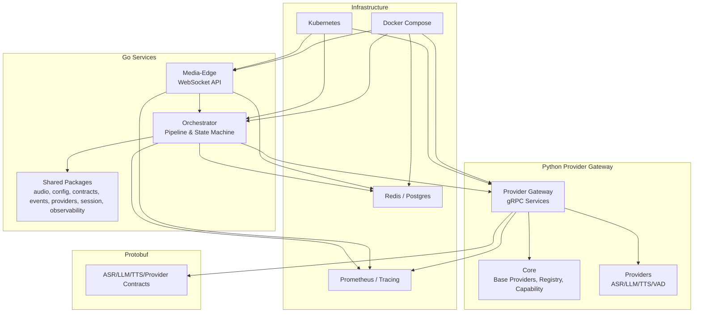
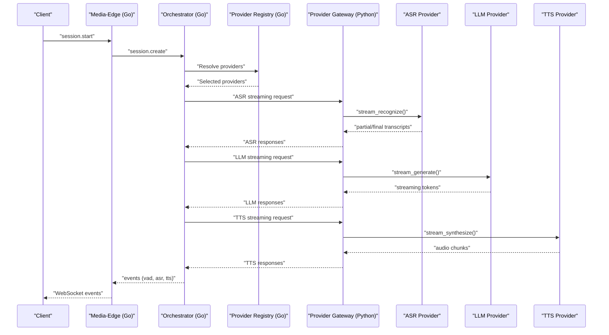
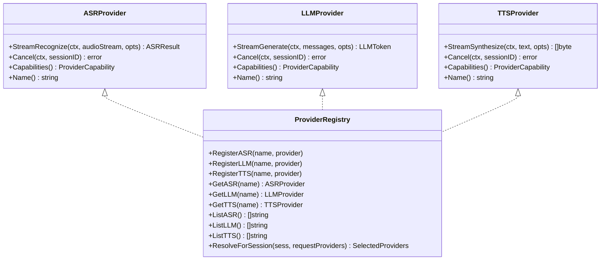
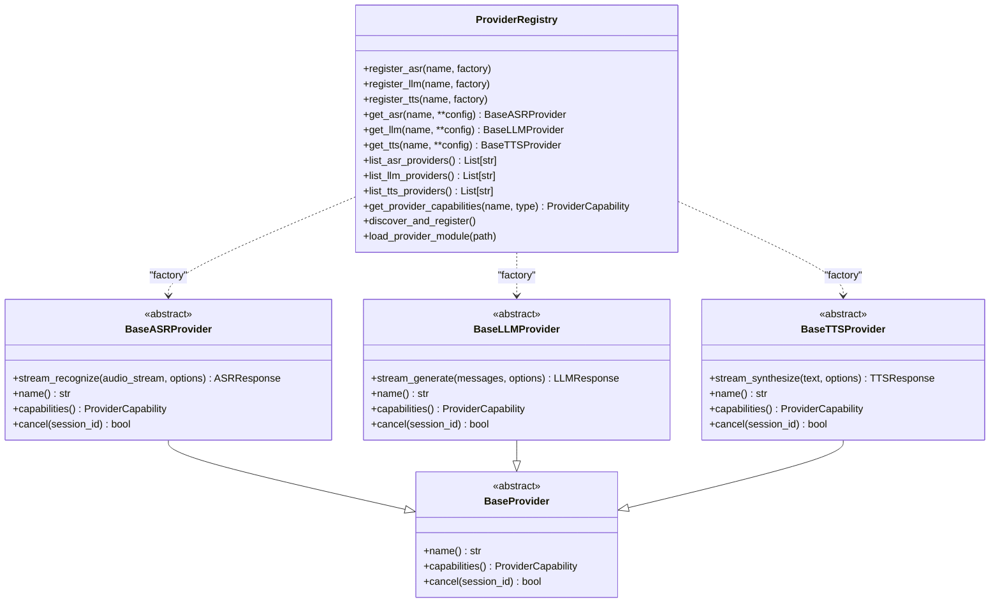
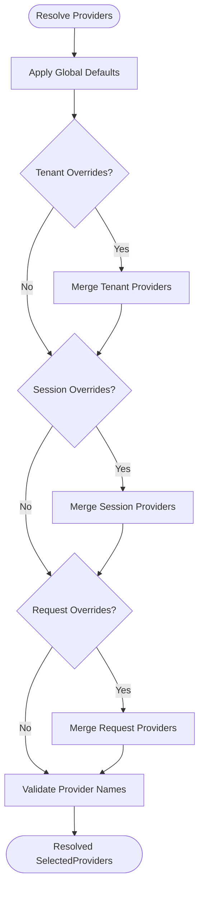
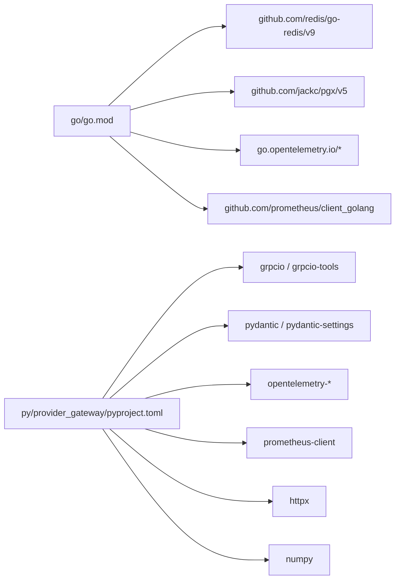

# Development Guidelines

<cite>
**Referenced Files in This Document**
- [README.md](file://README.md)
- [requirements.md](file://requirements.md)
- [go/go.mod](file://go/go.mod)
- [py/provider_gateway/pyproject.toml](file://py/provider_gateway/pyproject.toml)
- [docs/provider-architecture.md](file://docs/provider-architecture.md)
- [docs/testing.md](file://docs/testing.md)
- [scripts/run-local.sh](file://scripts/run-local.sh)
- [go/pkg/providers/interfaces.go](file://go/pkg/providers/interfaces.go)
- [go/pkg/providers/registry.go](file://go/pkg/providers/registry.go)
- [go/pkg/contracts/provider.go](file://go/pkg/contracts/provider.go)
- [py/provider_gateway/app/core/base_provider.py](file://py/provider_gateway/app/core/base_provider.py)
- [py/provider_gateway/app/core/registry.py](file://py/provider_gateway/app/core/registry.py)
- [py/provider_gateway/app/providers/asr/mock_asr.py](file://py/provider_gateway/app/providers/asr/mock_asr.py)
- [py/provider_gateway/app/providers/llm/mock_llm.py](file://py/provider_gateway/app/providers/llm/mock_llm.py)
- [py/provider_gateway/app/providers/tts/mock_tts.py](file://py/provider_gateway/app/providers/tts/mock_tts.py)
</cite>

## Table of Contents
1. [Introduction](#introduction)
2. [Project Structure](#project-structure)
3. [Core Components](#core-components)
4. [Architecture Overview](#architecture-overview)
5. [Detailed Component Analysis](#detailed-component-analysis)
6. [Dependency Analysis](#dependency-analysis)
7. [Performance Considerations](#performance-considerations)
8. [Troubleshooting Guide](#troubleshooting-guide)
9. [Contribution and Release Procedures](#contribution-and-release-procedures)
10. [Appendices](#appendices)

## Introduction
This document defines CloudApp’s development guidelines for code organization, provider development patterns, and contribution workflows. It explains the Go module structure, dependency management, and coding conventions, and documents the Python provider framework, base provider interfaces, and implementation requirements. It also provides guidance on adding new providers, maintaining code quality, setting up the development environment, debugging, performance profiling, testing strategies, and release procedures.

## Project Structure
CloudApp is a monorepo with:
- go/: Real-time orchestration and media/session handling (WebSocket API, pipeline orchestration, session state machine, audio processing, observability)
- py/provider_gateway/: Pluggable ASR/LLM/TTS provider gateway (gRPC services, provider registry, base provider abstractions)
- proto/: Protocol Buffer contracts for gRPC communication
- infra/: Docker Compose, Kubernetes manifests, migrations, and monitoring
- examples/: Configuration templates for mock, cloud, and local vLLM modes
- scripts/: Local run, migration, and simulation utilities

**Diagram sources**
- [README.md:47-102](file://README.md#L47-L102)
- [docs/provider-architecture.md:16-31](file://docs/provider-architecture.md#L16-L31)

**Section sources**
- [README.md:47-102](file://README.md#L47-L102)
- [requirements.md:210-250](file://requirements.md#L210-L250)

## Core Components
- Go module dependencies and versions are declared in go/go.mod. External libraries include gRPC, Redis, PostgreSQL, Prometheus, OpenTelemetry, and YAML parsing.
- Python project metadata, dependencies, and linting/formatting configuration are defined in py/provider_gateway/pyproject.toml, including grpcio, protobuf, pydantic, prometheus-client, opentelemetry, httpx, and numpy.
- Provider architecture is implemented via gRPC between the Go orchestrator and Python provider gateway, with provider registries and capability models in both languages.

Key implementation anchors:
- Go provider interfaces and registry: [go/pkg/providers/interfaces.go:21-97](file://go/pkg/providers/interfaces.go#L21-L97), [go/pkg/providers/registry.go:14-261](file://go/pkg/providers/registry.go#L14-L261)
- Python provider base classes and registry: [py/provider_gateway/app/core/base_provider.py:12-176](file://py/provider_gateway/app/core/base_provider.py#L12-L176), [py/provider_gateway/app/core/registry.py:19-286](file://py/provider_gateway/app/core/registry.py#L19-L286)
- Provider capability model and selection hierarchy: [docs/provider-architecture.md:121-176](file://docs/provider-architecture.md#L121-L176)

**Section sources**
- [go/go.mod:1-43](file://go/go.mod#L1-L43)
- [py/provider_gateway/pyproject.toml:1-64](file://py/provider_gateway/pyproject.toml#L1-L64)
- [go/pkg/providers/interfaces.go:1-107](file://go/pkg/providers/interfaces.go#L1-L107)
- [go/pkg/providers/registry.go:1-262](file://go/pkg/providers/registry.go#L1-L262)
- [py/provider_gateway/app/core/base_provider.py:1-177](file://py/provider_gateway/app/core/base_provider.py#L1-L177)
- [py/provider_gateway/app/core/registry.py:1-287](file://py/provider_gateway/app/core/registry.py#L1-L287)
- [docs/provider-architecture.md:121-176](file://docs/provider-architecture.md#L121-L176)

## Architecture Overview
CloudApp uses a pluggable provider architecture:
- Go Media-Edge handles WebSocket audio streaming, normalization, VAD, and session lifecycle.
- Go Orchestrator coordinates the ASR→LLM→TTS pipeline, manages session state, and persists transcripts.
- Python Provider Gateway exposes gRPC services for ASR, LLM, and TTS, hosting pluggable provider implementations and a registry.
- Providers implement base interfaces, advertise capabilities, and support cancellation and streaming.

**Diagram sources**
- [docs/provider-architecture.md:177-220](file://docs/provider-architecture.md#L177-L220)
- [go/pkg/providers/registry.go:172-251](file://go/pkg/providers/registry.go#L172-L251)
- [py/provider_gateway/app/core/registry.py:206-241](file://py/provider_gateway/app/core/registry.py#L206-L241)

**Section sources**
- [docs/provider-architecture.md:16-320](file://docs/provider-architecture.md#L16-L320)
- [README.md:5-46](file://README.md#L5-L46)

## Detailed Component Analysis

### Go Provider Interfaces and Registry
- Provider interfaces define streaming recognition, generation, synthesis, cancellation, capabilities, and names for ASR, LLM, TTS, and optional VAD.
- The Go registry supports registration, lookup, listing, and provider resolution with priority: request-level overrides, session-level, tenant-level, and global defaults. It validates provider availability and concurrency-safe access.

**Diagram sources**
- [go/pkg/providers/interfaces.go:21-97](file://go/pkg/providers/interfaces.go#L21-L97)
- [go/pkg/providers/registry.go:14-261](file://go/pkg/providers/registry.go#L14-L261)

**Section sources**
- [go/pkg/providers/interfaces.go:1-107](file://go/pkg/providers/interfaces.go#L1-L107)
- [go/pkg/providers/registry.go:1-262](file://go/pkg/providers/registry.go#L1-L262)
- [go/pkg/contracts/provider.go:1-79](file://go/pkg/contracts/provider.go#L1-L79)

### Python Provider Base Classes and Registry
- Base provider classes define abstract methods for streaming recognition, generation, synthesis, cancellation, and capability reporting.
- The Python registry supports dynamic discovery, factory-based instantiation, caching, and capability retrieval. It auto-registers built-in providers and supports loading external modules.

**Diagram sources**
- [py/provider_gateway/app/core/base_provider.py:12-176](file://py/provider_gateway/app/core/base_provider.py#L12-L176)
- [py/provider_gateway/app/core/registry.py:19-286](file://py/provider_gateway/app/core/registry.py#L19-L286)

**Section sources**
- [py/provider_gateway/app/core/base_provider.py:1-177](file://py/provider_gateway/app/core/base_provider.py#L1-L177)
- [py/provider_gateway/app/core/registry.py:1-287](file://py/provider_gateway/app/core/registry.py#L1-L287)

### Provider Selection and Capability Model
- Provider selection follows a strict priority: request-level, session-level, tenant-level, and global defaults. The orchestrator validates provider existence before use.
- Capability model includes streaming input/output, word timestamps, voice support, interruptibility, preferred sample rates, and supported codecs. Providers advertise capabilities for compatibility checks.

**Diagram sources**
- [go/pkg/providers/registry.go:172-251](file://go/pkg/providers/registry.go#L172-L251)
- [docs/provider-architecture.md:144-176](file://docs/provider-architecture.md#L144-L176)

**Section sources**
- [go/pkg/providers/registry.go:172-251](file://go/pkg/providers/registry.go#L172-L251)
- [docs/provider-architecture.md:121-176](file://docs/provider-architecture.md#L121-L176)

### Adding New Providers (Implementation Details)
- Implement a provider class inheriting from the appropriate base class (ASR/LLM/TTS) and return a capability object reflecting supported features.
- Export a factory function named create_<provider>_provider that constructs the provider with configuration.
- Register the provider in the Python registry via a register_providers function exported by the provider module. The registry discovers and registers providers automatically.

Concrete examples:
- Mock ASR provider demonstrates deterministic partial and final transcripts, cancellation handling, and capability reporting: [py/provider_gateway/app/providers/asr/mock_asr.py:16-221](file://py/provider_gateway/app/providers/asr/mock_asr.py#L16-L221)
- Mock LLM provider demonstrates streaming token generation, cancellation, and usage metadata: [py/provider_gateway/app/providers/llm/mock_llm.py:15-218](file://py/provider_gateway/app/providers/llm/mock_llm.py#L15-L218)
- Mock TTS provider demonstrates PCM16 audio chunk generation, cancellation, and timing metadata: [py/provider_gateway/app/providers/tts/mock_tts.py:17-206](file://py/provider_gateway/app/providers/tts/mock_tts.py#L17-L206)

**Section sources**
- [py/provider_gateway/app/providers/asr/mock_asr.py:16-221](file://py/provider_gateway/app/providers/asr/mock_asr.py#L16-L221)
- [py/provider_gateway/app/providers/llm/mock_llm.py:15-218](file://py/provider_gateway/app/providers/llm/mock_llm.py#L15-L218)
- [py/provider_gateway/app/providers/tts/mock_tts.py:17-206](file://py/provider_gateway/app/providers/tts/mock_tts.py#L17-L206)
- [docs/provider-architecture.md:313-320](file://docs/provider-architecture.md#L313-L320)

### Coding Conventions and Patterns
- Go
  - Idiomatic Go with context propagation, small packages with clear responsibilities, and strong typing.
  - Use interfaces and dependency injection to keep orchestration provider-agnostic.
  - Favor error wrapping and deterministic tests.
- Python
  - Async-first design with async generators for streaming.
  - Pydantic models for configuration and request/response types.
  - Clear separation of concerns: core abstractions, gRPC services, provider implementations, telemetry, and tests.

**Section sources**
- [requirements.md:514-537](file://requirements.md#L514-L537)
- [py/provider_gateway/pyproject.toml:23-36](file://py/provider_gateway/pyproject.toml#L23-L36)

## Dependency Analysis
- Go dependencies include gRPC, Redis, PostgreSQL, Prometheus, OpenTelemetry, and YAML parsing. These enable provider communication, session storage, metrics/tracing, and configuration loading.
- Python dependencies include grpcio, protobuf, pydantic, prometheus-client, opentelemetry, httpx, and numpy. These enable gRPC server generation, typed configuration, observability, HTTP client needs, and numeric computations.

**Diagram sources**
- [go/go.mod:5-17](file://go/go.mod#L5-L17)
- [py/provider_gateway/pyproject.toml:23-36](file://py/provider_gateway/pyproject.toml#L23-L36)

**Section sources**
- [go/go.mod:1-43](file://go/go.mod#L1-L43)
- [py/provider_gateway/pyproject.toml:1-64](file://py/provider_gateway/pyproject.toml#L1-L64)

## Performance Considerations
- Streaming-first design: Both Go and Python implementations use streaming channels/generators to minimize latency.
- Cancellation: Providers support cancellation to stop in-flight operations promptly.
- Metrics and tracing: Structured logs, Prometheus metrics, and OpenTelemetry spans are integrated across services.
- Audio processing: Canonical PCM16 mono 16 kHz for internal ASR/VAD pipeline; resampling and chunking abstractions reduce overhead.
- Backpressure and timeouts: Input validation, bounded queues, and timeouts improve resilience.

**Section sources**
- [docs/provider-architecture.md:397-432](file://docs/provider-architecture.md#L397-L432)
- [requirements.md:311-335](file://requirements.md#L311-L335)

## Troubleshooting Guide
- Development environment setup
  - Use the local run script to start services in mock, vLLM, or cloud configurations: [scripts/run-local.sh:1-95](file://scripts/run-local.sh#L1-L95)
  - Configure environment variables for providers and databases as needed.
- Debugging
  - Go tests: run with verbose output, race detector, CPU/memory profiling.
  - Python tests: use pytest with --pdb, long tracebacks, and asyncio debug mode.
- Performance profiling
  - Use Go profiling tools (pprof) and Python profiling tools (cProfile, pytest-profiling).
- Observability
  - Inspect logs from Media-Edge, Orchestrator, and Provider Gateway; verify Prometheus metrics and traces.

**Section sources**
- [docs/testing.md:479-542](file://docs/testing.md#L479-L542)
- [scripts/run-local.sh:1-95](file://scripts/run-local.sh#L1-L95)

## Contribution and Release Procedures
- Contribution guidelines
  - Follow the established architecture: keep provider-specific logic isolated behind interfaces.
  - Add unit tests for new providers and integration tests for end-to-end flows.
  - Maintain deterministic behavior for mock providers to support local testing.
- Code review process
  - Use PRs with clear descriptions linking to docs and tests.
  - Ensure dependency updates are reflected in go.mod and pyproject.toml.
- Release procedures
  - Tag releases with semantic versioning.
  - Update Docker images and Kubernetes manifests accordingly.
  - Publish artifacts and update example configurations.

[No sources needed since this section summarizes without analyzing specific files]

## Appendices

### Development Environment Setup
- Prerequisites: Docker, Docker Compose, Go 1.22+, Python 3.11+.
- Quick start:
  - Run local stack with mock providers: [scripts/run-local.sh:89-94](file://scripts/run-local.sh#L89-L94)
  - Start services individually: Media-Edge, Orchestrator, Provider Gateway, Redis, Postgres, Prometheus.
- Configuration
  - YAML-based configuration with environment variable overrides; see examples for mock, cloud, and vLLM modes.

**Section sources**
- [README.md:106-128](file://README.md#L106-L128)
- [README.md:143-150](file://README.md#L143-L150)
- [scripts/run-local.sh:1-95](file://scripts/run-local.sh#L1-L95)

### Testing Strategies
- Go tests: package-specific runs, coverage, and race detection.
- Python tests: pytest with asyncio support, coverage, and fixtures.
- Integration tests: WebSocket client and session simulator with mock providers.
- Load testing: k6 scripts for WebSocket load testing.

**Section sources**
- [docs/testing.md:7-61](file://docs/testing.md#L7-L61)
- [docs/testing.md:104-140](file://docs/testing.md#L104-L140)
- [docs/testing.md:226-280](file://docs/testing.md#L226-L280)
- [docs/testing.md:306-364](file://docs/testing.md#L306-L364)

### Adding New Providers (Step-by-Step)
- Implement a provider class inheriting from the appropriate base class and export a factory function.
- Register the provider in the Python registry via a module-level register_providers function.
- Ensure capability reporting matches supported features.
- Write unit and integration tests; validate with the mock provider suite.

**Section sources**
- [py/provider_gateway/app/core/base_provider.py:12-176](file://py/provider_gateway/app/core/base_provider.py#L12-L176)
- [py/provider_gateway/app/core/registry.py:206-241](file://py/provider_gateway/app/core/registry.py#L206-L241)
- [docs/provider-architecture.md:313-320](file://docs/provider-architecture.md#L313-L320)