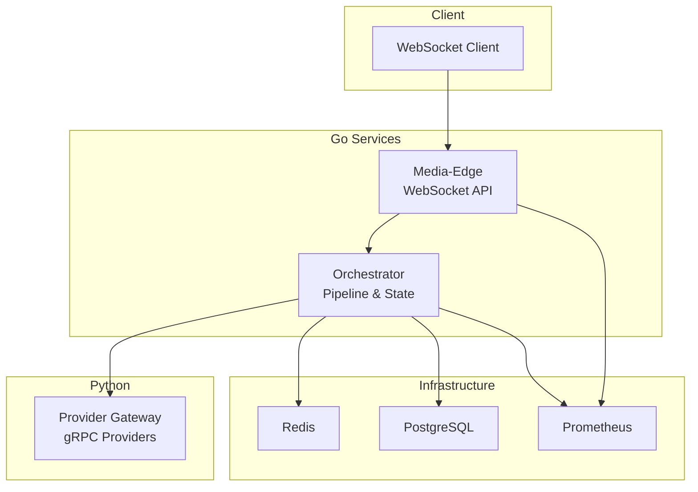

# Getting Started

<cite>
**Referenced Files in This Document**
- [README.md](file://README.md)
- [requirements.md](file://requirements.md)
- [docker-compose.yml](file://infra/compose/docker-compose.yml)
- [run-local.sh](file://scripts/run-local.sh)
- [config-mock.yaml](file://examples/config-mock.yaml)
- [config-cloud.yaml](file://examples/config-cloud.yaml)
- [config-vllm.yaml](file://examples/config-vllm.yaml)
- [ws-client.py](file://scripts/ws-client.py)
- [simulate-session.py](file://scripts/simulate-session.py)
- [Dockerfile.media-edge](file://infra/docker/Dockerfile.media-edge)
- [Dockerfile.orchestrator](file://infra/docker/Dockerfile.orchestrator)
- [Dockerfile.provider-gateway](file://infra/docker/Dockerfile.provider-gateway)
- [config.go](file://go/pkg/config/config.go)
- [loader.go](file://go/pkg/config/loader.go)
- [settings.py](file://py/provider_gateway/app/config/settings.py)
- [main.go (media-edge)](file://go/media-edge/cmd/main.go)
- [main.go (orchestrator)](file://go/orchestrator/cmd/main.go)
</cite>

## Table of Contents
1. [Introduction](#introduction)
2. [Prerequisites](#prerequisites)
3. [Quick Start](#quick-start)
4. [Environment Setup and Configuration](#environment-setup-and-configuration)
5. [Basic Usage Patterns](#basic-usage-patterns)
6. [Architecture Overview](#architecture-overview)
7. [Troubleshooting Guide](#troubleshooting-guide)
8. [Conclusion](#conclusion)

## Introduction
CloudApp is a production-grade, real-time voice conversation platform built with Go and Python. It exposes a WebSocket API for clients to stream audio and receive voice responses, with pluggable providers for ASR, LLM, and TTS. The system supports barge-in, multi-tenant configuration, and enterprise-grade observability.

## Prerequisites
- Docker and Docker Compose
- Go 1.22+ (for local development)
- Python 3.11+ (for provider gateway development)

These requirements are enforced by the project’s Dockerfiles and Python project configuration.

**Section sources**
- [Dockerfile.media-edge](file://infra/docker/Dockerfile.media-edge#L5)
- [Dockerfile.orchestrator](file://infra/docker/Dockerfile.orchestrator#L5)
- [Dockerfile.provider-gateway](file://infra/docker/Dockerfile.provider-gateway#L5)
- [pyproject.toml](file://py/provider_gateway/pyproject.toml#L10)

## Quick Start
Follow these steps to launch all services with mock providers and run the example WebSocket client.

1) Start the stack with Docker Compose using the mock environment:
- Navigate to the compose directory and run the stack with the mock environment file.

2) Verify services:
- Media-Edge: ws://localhost:8080/ws
- Orchestrator: http://localhost:8081
- Provider Gateway: localhost:50051
- Redis: localhost:6379
- Prometheus: http://localhost:9090

3) Run the example WebSocket client:
- Install the client dependency.
- Stream synthetic audio or a WAV file to the WebSocket endpoint.

Notes:
- The README provides the canonical commands and links to configuration references.
- The run-local.sh script offers a convenient way to start the stack with different configurations.

**Section sources**
- [README.md:104-141](file://README.md#L104-L141)
- [docker-compose.yml:1-164](file://infra/compose/docker-compose.yml#L1-L164)
- [run-local.sh:1-95](file://scripts/run-local.sh#L1-L95)
- [ws-client.py:1-326](file://scripts/ws-client.py#L1-L326)

## Environment Setup and Configuration
CloudApp loads configuration from YAML files with environment variable overrides. Both Go and Python services implement configuration loading and validation.

- Go configuration:
  - Root structure includes server, redis, postgres, providers, audio, observability, and security sections.
  - Environment variables are applied with a CLOUDAPP_ prefix and underscore-separated keys.
  - Validation ensures defaults and sane limits.

- Python provider gateway:
  - Settings are loaded from a YAML file path provided by an environment variable, then overlaid with environment variables.
  - Provider configuration supports default providers and per-provider config blocks.

- Example configurations:
  - Mock providers for local development.
  - Cloud providers (Google Speech, Groq) with API keys.
  - Local vLLM configuration.

**Section sources**
- [config.go:9-94](file://go/pkg/config/config.go#L9-L94)
- [loader.go:14-81](file://go/pkg/config/loader.go#L14-L81)
- [settings.py:53-112](file://py/provider_gateway/app/config/settings.py#L53-L112)
- [config-mock.yaml:1-44](file://examples/config-mock.yaml#L1-L44)
- [config-cloud.yaml:1-39](file://examples/config-cloud.yaml#L1-L39)
- [config-vllm.yaml:1-31](file://examples/config-vllm.yaml#L1-L31)

## Basic Usage Patterns
This section explains how to connect WebSocket clients, send audio chunks, and receive voice responses.

- Client connects to the WebSocket endpoint and sends a session start event with audio format and system prompt.
- The client streams audio chunks; each chunk is base64-encoded in the payload.
- The server emits events such as ASR partial/final transcripts, LLM partial/final text, and TTS audio chunks.
- The client can optionally send an input interrupt event to support barge-in.
- The session ends with a session stop event.

The example client demonstrates:
- Creating session.start, audio.chunk, and session.stop events.
- Streaming audio from a WAV file or generating synthetic audio.
- Receiving and printing server events.

The session simulator demonstrates:
- A full lifecycle including interruption and multi-turn exchanges.
- Metrics collection and state transitions.

**Section sources**
- [README.md:162-188](file://README.md#L162-L188)
- [ws-client.py:29-70](file://scripts/ws-client.py#L29-L70)
- [ws-client.py:125-178](file://scripts/ws-client.py#L125-L178)
- [simulate-session.py:161-259](file://scripts/simulate-session.py#L161-L259)
- [simulate-session.py:290-356](file://scripts/simulate-session.py#L290-L356)

## Architecture Overview
The system consists of three Go services and a Python provider gateway connected via gRPC. Docker Compose orchestrates Redis, PostgreSQL, and Prometheus for persistence and observability.

**Diagram sources**
- [docker-compose.yml:6-164](file://infra/compose/docker-compose.yml#L6-L164)
- [main.go (media-edge):94-126](file://go/media-edge/cmd/main.go#L94-L126)
- [main.go (orchestrator):122-148](file://go/orchestrator/cmd/main.go#L122-L148)

**Section sources**
- [README.md:5-35](file://README.md#L5-L35)
- [docker-compose.yml:6-164](file://infra/compose/docker-compose.yml#L6-L164)

## Troubleshooting Guide
Common setup issues and resolutions:

- Docker Compose not found:
  - Ensure Docker and Docker Compose are installed and accessible in PATH.

- Services fail to start or health checks fail:
  - Confirm the environment file path exists and is readable.
  - Check service logs for Redis/PostgreSQL connectivity and gRPC provider gateway readiness.

- WebSocket connection errors:
  - Verify the WebSocket URL matches the Media-Edge configuration.
  - Ensure the client dependency is installed and reachable.

- Provider gateway not ready:
  - Confirm the gRPC port is exposed and reachable from the orchestrator.
  - Validate provider configuration in the YAML and environment variables.

- Configuration issues:
  - Validate YAML syntax and keys.
  - Confirm environment variable prefixes and nesting match the loaders’ expectations.

Operational tips:
- Use the run-local.sh script to simplify starting with different configurations.
- Inspect Prometheus metrics endpoints for runtime diagnostics.
- Review README for environment variable references and deployment options.

**Section sources**
- [run-local.sh:58-68](file://scripts/run-local.sh#L58-L68)
- [docker-compose.yml:29-91](file://infra/compose/docker-compose.yml#L29-L91)
- [ws-client.py:236-248](file://scripts/ws-client.py#L236-L248)
- [README.md:104-141](file://README.md#L104-L141)

## Conclusion
You can achieve a working demonstration quickly by starting all services with mock providers, connecting a WebSocket client, and streaming audio. The configuration system supports both YAML files and environment variables, enabling flexible setups for local development and production. Use the example scripts to validate the end-to-end flow and consult the troubleshooting section for common issues.