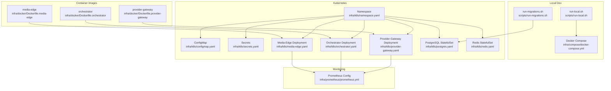
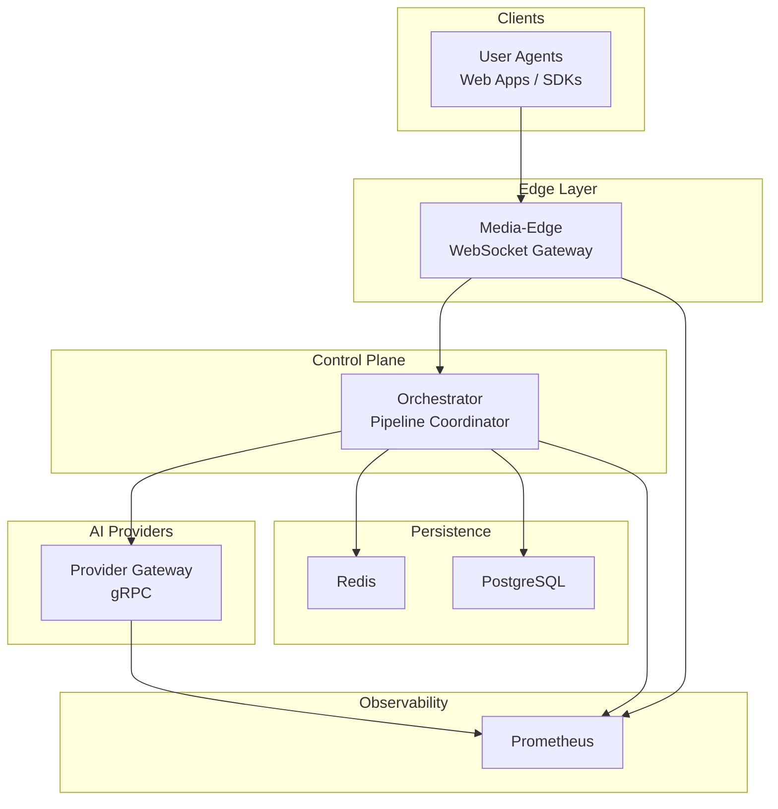
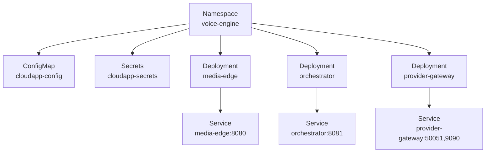
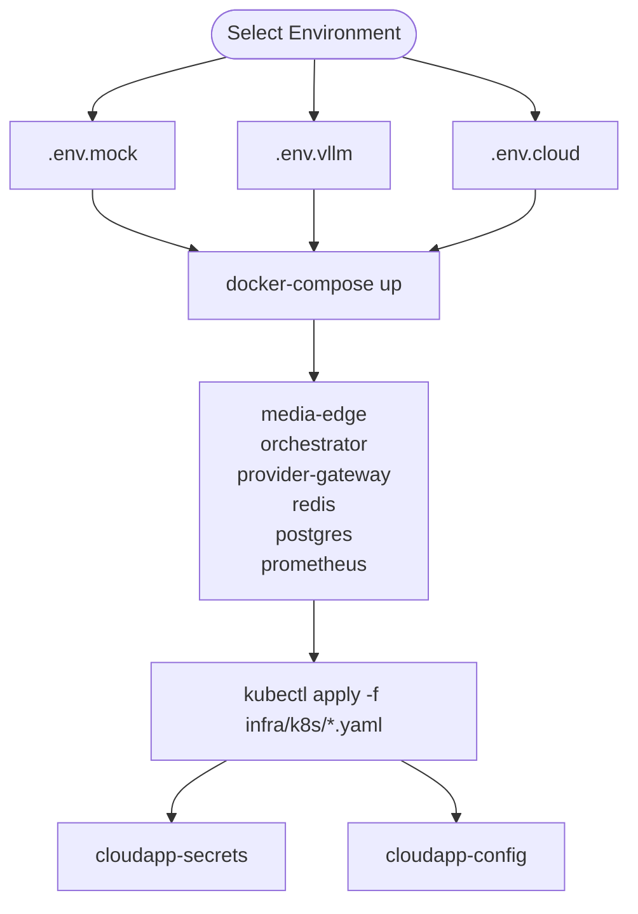
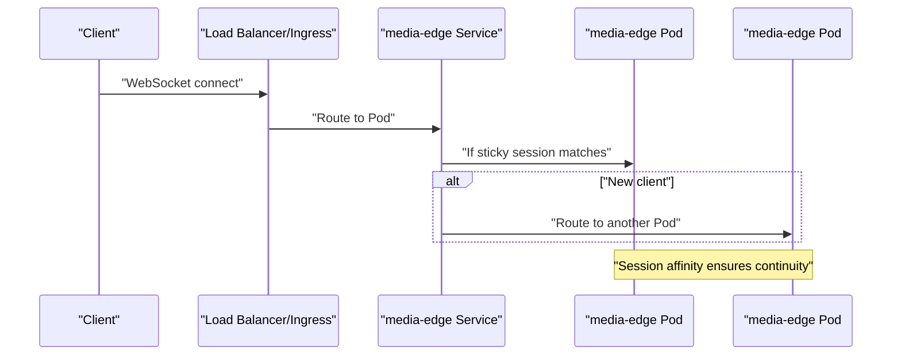
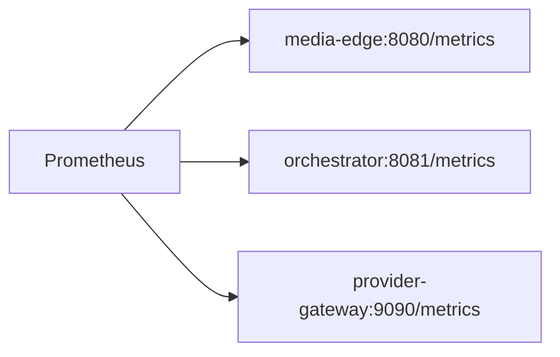
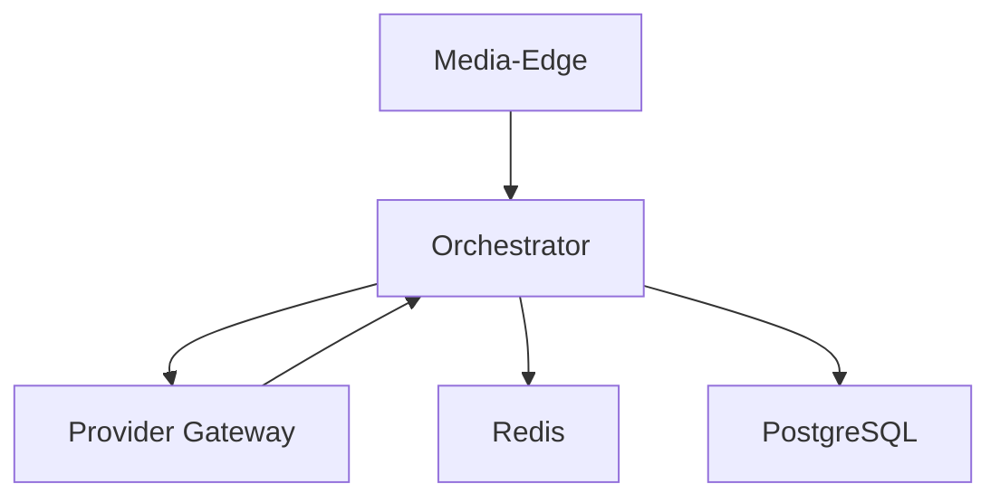

# Infrastructure & Deployment

<cite>
**Referenced Files in This Document**
- [docker-compose.yml](file://infra/compose/docker-compose.yml)
- [run-local.sh](file://scripts/run-local.sh)
- [run-migrations.sh](file://scripts/run-migrations.sh)
- [Dockerfile.media-edge](file://infra/docker/Dockerfile.media-edge)
- [Dockerfile.orchestrator](file://infra/docker/Dockerfile.orchestrator)
- [Dockerfile.provider-gateway](file://infra/docker/Dockerfile.provider-gateway)
- [namespace.yaml](file://infra/k8s/namespace.yaml)
- [configmap.yaml](file://infra/k8s/configmap.yaml)
- [secrets.yaml](file://infra/k8s/secrets.yaml)
- [media-edge.yaml](file://infra/k8s/media-edge.yaml)
- [orchestrator.yaml](file://infra/k8s/orchestrator.yaml)
- [provider-gateway.yaml](file://infra/k8s/provider-gateway.yaml)
- [postgres.yaml](file://infra/k8s/postgres.yaml)
- [redis.yaml](file://infra/k8s/redis.yaml)
- [deployment.md](file://docs/deployment.md)
- [prometheus.yml](file://infra/prometheus/prometheus.yml)
</cite>

## Table of Contents
1. [Introduction](#introduction)
2. [Project Structure](#project-structure)
3. [Core Components](#core-components)
4. [Architecture Overview](#architecture-overview)
5. [Detailed Component Analysis](#detailed-component-analysis)
6. [Dependency Analysis](#dependency-analysis)
7. [Performance Considerations](#performance-considerations)
8. [Troubleshooting Guide](#troubleshooting-guide)
9. [Conclusion](#conclusion)
10. [Appendices](#appendices)

## Introduction
This document explains CloudApp’s infrastructure and deployment system with a focus on containerized deployment, Kubernetes orchestration, and production scaling strategies. It documents Docker configurations for each service component, multi-stage builds, and container optimization. It also covers Kubernetes manifests, service deployments, cluster configuration, environment-specific configurations, secret management, resource allocation, scaling strategies, load balancing, high availability, and monitoring setup for production environments.

## Project Structure
CloudApp organizes infrastructure assets under the infra directory, separating Dockerfiles, Docker Compose, Kubernetes manifests, and Prometheus configuration. Scripts support local development and database migrations. The documentation provides environment-specific deployment guidance.

**Diagram sources**
- [docker-compose.yml:1-164](file://infra/compose/docker-compose.yml#L1-L164)
- [run-local.sh:1-95](file://scripts/run-local.sh#L1-L95)
- [run-migrations.sh:1-139](file://scripts/run-migrations.sh#L1-L139)
- [Dockerfile.media-edge:1-62](file://infra/docker/Dockerfile.media-edge#L1-L62)
- [Dockerfile.orchestrator:1-62](file://infra/docker/Dockerfile.orchestrator#L1-L62)
- [Dockerfile.provider-gateway:1-62](file://infra/docker/Dockerfile.provider-gateway#L1-L62)
- [namespace.yaml:1-14](file://infra/k8s/namespace.yaml#L1-L14)
- [configmap.yaml:1-60](file://infra/k8s/configmap.yaml#L1-L60)
- [secrets.yaml:1-47](file://infra/k8s/secrets.yaml#L1-L47)
- [media-edge.yaml:1-112](file://infra/k8s/media-edge.yaml#L1-L112)
- [orchestrator.yaml:1-92](file://infra/k8s/orchestrator.yaml#L1-L92)
- [provider-gateway.yaml:1-108](file://infra/k8s/provider-gateway.yaml#L1-L108)
- [postgres.yaml:1-116](file://infra/k8s/postgres.yaml#L1-L116)
- [redis.yaml:1-97](file://infra/k8s/redis.yaml#L1-L97)
- [prometheus.yml](file://infra/prometheus/prometheus.yml)

**Section sources**
- [deployment.md:1-533](file://docs/deployment.md#L1-L533)

## Core Components
- Media-Edge: WebSocket gateway service responsible for audio streaming and session lifecycle.
- Orchestrator: Pipeline coordinator and state manager that interacts with provider gateway and persistence stores.
- Provider Gateway: Python gRPC service exposing ASR, LLM, TTS providers.
- Redis: Session state and caching.
- PostgreSQL: Persistent storage for transcripts and session history.
- Prometheus: Metrics collection and scraping for observability.

Operational highlights:
- Local development via Docker Compose with environment profiles.
- Kubernetes manifests for namespace, secrets, config, and deployments.
- Health checks and probes for liveness/readiness.
- Resource requests/limits and horizontal autoscaling guidance.

**Section sources**
- [docker-compose.yml:6-164](file://infra/compose/docker-compose.yml#L6-L164)
- [deployment.md:123-533](file://docs/deployment.md#L123-L533)

## Architecture Overview
CloudApp runs as a distributed system with three primary services and two shared infrastructure components. Media-Edge exposes WebSocket endpoints and communicates with Orchestrator. Orchestrator coordinates pipeline stages and interacts with Provider Gateway for AI model inference. Redis and PostgreSQL provide session and persistence layers. Prometheus scrapes metrics from all services.

**Diagram sources**
- [media-edge.yaml:1-112](file://infra/k8s/media-edge.yaml#L1-L112)
- [orchestrator.yaml:1-92](file://infra/k8s/orchestrator.yaml#L1-L92)
- [provider-gateway.yaml:1-108](file://infra/k8s/provider-gateway.yaml#L1-L108)
- [postgres.yaml:1-116](file://infra/k8s/postgres.yaml#L1-L116)
- [redis.yaml:1-97](file://infra/k8s/redis.yaml#L1-L97)
- [prometheus.yml](file://infra/prometheus/prometheus.yml)

**Section sources**
- [deployment.md:123-533](file://docs/deployment.md#L123-L533)

## Detailed Component Analysis

### Docker Configuration and Multi-Stage Builds
Each service uses a multi-stage Docker build to produce small, secure runtime images:
- media-edge: Go Alpine-based builder, static binary with ldflags for version info, non-root user, health check, and exposed port.
- orchestrator: Similar Go Alpine-based builder and runtime with non-root user and health check.
- provider-gateway: Python slim image with virtual environment, non-root user, gRPC and metrics ports, health check via TCP socket.

Key optimizations:
- Static linking for Go binaries reduces attack surface.
- Minimal base images and single concern per stage.
- Non-root user and minimal capabilities.
- Health checks embedded in images.

**Section sources**
- [Dockerfile.media-edge:1-62](file://infra/docker/Dockerfile.media-edge#L1-L62)
- [Dockerfile.orchestrator:1-62](file://infra/docker/Dockerfile.orchestrator#L1-L62)
- [Dockerfile.provider-gateway:1-62](file://infra/docker/Dockerfile.provider-gateway#L1-L62)

### Kubernetes Manifests and Cluster Configuration
- Namespace: Provides isolation for the voice-engine stack.
- ConfigMap: Centralized non-sensitive configuration for servers, Redis, providers, observability, security, and provider gateway settings.
- Secrets: Opaque secrets for database credentials and provider API keys; placeholders for production use.
- Deployments: media-edge, orchestrator, provider-gateway with probes, resource requests/limits, and annotations for Prometheus scraping.
- Services: ClusterIP services for internal access; ingress stub for external exposure.
- StatefulSets: PostgreSQL and Redis with persistent volumes and probes.

**Diagram sources**
- [namespace.yaml:1-14](file://infra/k8s/namespace.yaml#L1-L14)
- [configmap.yaml:1-60](file://infra/k8s/configmap.yaml#L1-L60)
- [secrets.yaml:1-47](file://infra/k8s/secrets.yaml#L1-L47)
- [media-edge.yaml:1-112](file://infra/k8s/media-edge.yaml#L1-L112)
- [orchestrator.yaml:1-92](file://infra/k8s/orchestrator.yaml#L1-L92)
- [provider-gateway.yaml:1-108](file://infra/k8s/provider-gateway.yaml#L1-L108)

**Section sources**
- [namespace.yaml:1-14](file://infra/k8s/namespace.yaml#L1-L14)
- [configmap.yaml:1-60](file://infra/k8s/configmap.yaml#L1-L60)
- [secrets.yaml:1-47](file://infra/k8s/secrets.yaml#L1-L47)
- [media-edge.yaml:1-112](file://infra/k8s/media-edge.yaml#L1-L112)
- [orchestrator.yaml:1-92](file://infra/k8s/orchestrator.yaml#L1-L92)
- [provider-gateway.yaml:1-108](file://infra/k8s/provider-gateway.yaml#L1-L108)
- [postgres.yaml:1-116](file://infra/k8s/postgres.yaml#L1-L116)
- [redis.yaml:1-97](file://infra/k8s/redis.yaml#L1-L97)

### Environment-Specific Configurations and Secret Management
- Docker Compose supports environment profiles (.env.mock, .env.vllm, .env.cloud) and health checks for each service.
- Kubernetes ConfigMap centralizes non-sensitive configuration; Secrets store sensitive values (DSN, API keys).
- Scripts manage local startup and migrations, including optional Docker mode for database operations.

**Diagram sources**
- [docker-compose.yml:1-164](file://infra/compose/docker-compose.yml#L1-L164)
- [run-local.sh:1-95](file://scripts/run-local.sh#L1-L95)
- [configmap.yaml:1-60](file://infra/k8s/configmap.yaml#L1-L60)
- [secrets.yaml:1-47](file://infra/k8s/secrets.yaml#L1-L47)

**Section sources**
- [docker-compose.yml:1-164](file://infra/compose/docker-compose.yml#L1-L164)
- [run-local.sh:1-95](file://scripts/run-local.sh#L1-L95)
- [configmap.yaml:1-60](file://infra/k8s/configmap.yaml#L1-L60)
- [secrets.yaml:1-47](file://infra/k8s/secrets.yaml#L1-L47)

### Scaling Strategies, Load Balancing, and High Availability
- Horizontal scaling: Adjust replica counts in Deployments for media-edge and orchestrator.
- HPA: Example autoscaler configuration targets CPU and a custom metric for active WebSocket connections.
- Session affinity: Sticky sessions for WebSocket traffic to ensure session continuity.
- HA for Redis: Use Redis Cluster/Sentinel or managed services.
- HA for PostgreSQL: Prefer managed services (e.g., RDS, Cloud SQL) for production.

**Diagram sources**
- [deployment.md:366-414](file://docs/deployment.md#L366-L414)

**Section sources**
- [deployment.md:366-427](file://docs/deployment.md#L366-L427)

### Monitoring and Observability
- Prometheus configuration defines jobs for media-edge, orchestrator, and provider-gateway metrics endpoints.
- Kubernetes manifests annotate pods for Prometheus scraping.
- Key metrics include active WebSocket connections, session duration, and provider latency metrics.

**Diagram sources**
- [prometheus.yml](file://infra/prometheus/prometheus.yml)
- [media-edge.yaml:24-27](file://infra/k8s/media-edge.yaml#L24-L27)
- [orchestrator.yaml:24-27](file://infra/k8s/orchestrator.yaml#L24-L27)
- [provider-gateway.yaml:24-27](file://infra/k8s/provider-gateway.yaml#L24-L27)

**Section sources**
- [deployment.md:428-474](file://docs/deployment.md#L428-L474)

## Dependency Analysis
Service-to-service dependencies:
- Media-Edge depends on Orchestrator and Redis/PostgreSQL.
- Orchestrator depends on Provider Gateway, Redis, and PostgreSQL.
- Provider Gateway depends on external AI providers and credentials.

**Diagram sources**
- [docker-compose.yml:6-164](file://infra/compose/docker-compose.yml#L6-L164)
- [media-edge.yaml:38-51](file://infra/k8s/media-edge.yaml#L38-L51)
- [orchestrator.yaml:38-51](file://infra/k8s/orchestrator.yaml#L38-L51)
- [provider-gateway.yaml:41-54](file://infra/k8s/provider-gateway.yaml#L41-L54)

**Section sources**
- [docker-compose.yml:6-164](file://infra/compose/docker-compose.yml#L6-L164)
- [media-edge.yaml:38-51](file://infra/k8s/media-edge.yaml#L38-L51)
- [orchestrator.yaml:38-51](file://infra/k8s/orchestrator.yaml#L38-L51)
- [provider-gateway.yaml:41-54](file://infra/k8s/provider-gateway.yaml#L41-L54)

## Performance Considerations
- Container optimization: Static binaries, minimal base images, non-root users, and embedded health checks reduce overhead and risk.
- Resource allocation: Requests and limits defined in Kubernetes manifests; adjust based on observed utilization and latency targets.
- Probes: Liveness and readiness probes prevent routing unhealthy pods and speed recovery.
- GPU acceleration: Provider Gateway supports GPU scheduling for local inference workloads.
- Network: Use Ingress with WebSocket support and enable TLS termination at the edge.

[No sources needed since this section provides general guidance]

## Troubleshooting Guide
Common operational checks:
- Verify service logs for pods and containers.
- Test connectivity between services using netcat-style probes from within pods.
- Inspect resource usage with top commands.
- Review provider gateway logs for API key or credential issues.

**Section sources**
- [deployment.md:489-533](file://docs/deployment.md#L489-L533)

## Conclusion
CloudApp’s infrastructure combines lightweight containers with robust Kubernetes primitives to deliver a scalable, observable, and production-ready voice engine platform. The documented Docker configurations, Kubernetes manifests, and operational procedures provide a blueprint for local development and production-grade deployments, including environment-specific configurations, secret management, resource allocation, scaling, and monitoring.

[No sources needed since this section summarizes without analyzing specific files]

## Appendices

### Deployment Commands and Operational Procedures
- Local development with Docker Compose:
  - Select environment profile and start services.
  - Build images optionally and run in foreground/background.
- Kubernetes deployment:
  - Apply namespace, secrets, config, and stateful/core deployments in order.
  - Optionally enable Ingress for external access.
- Database migrations:
  - Run migrations via script against local or Docker Compose database.

**Section sources**
- [deployment.md:123-211](file://docs/deployment.md#L123-L211)
- [run-local.sh:1-95](file://scripts/run-local.sh#L1-L95)
- [run-migrations.sh:1-139](file://scripts/run-migrations.sh#L1-L139)

### Infrastructure Requirements and Networking Considerations
- Kubernetes prerequisites and GPU node preparation are documented in the deployment guide.
- Networking: Ingress for WebSocket support, TLS termination, and optional session affinity for sticky sessions.

**Section sources**
- [deployment.md:242-294](file://docs/deployment.md#L242-L294)
- [deployment.md:400-414](file://docs/deployment.md#L400-L414)