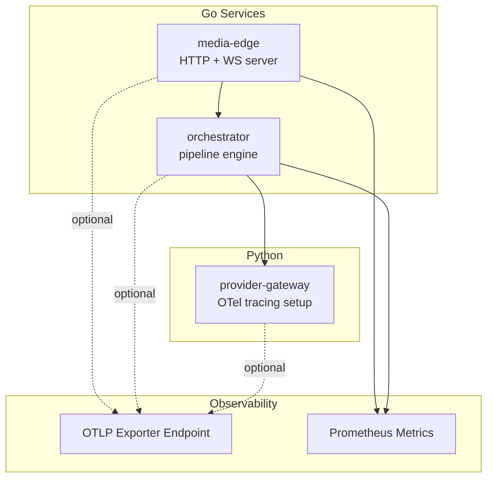
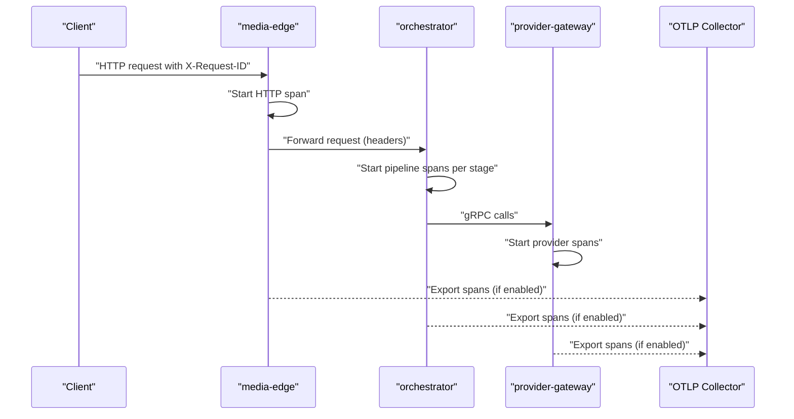
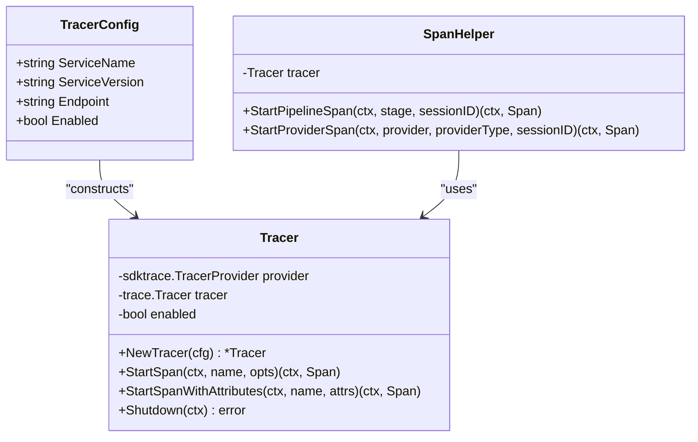
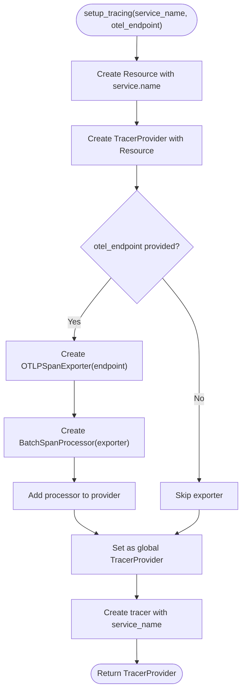
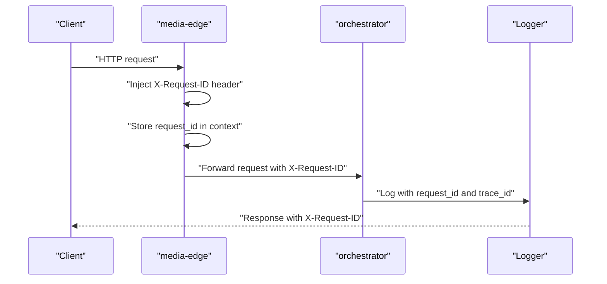
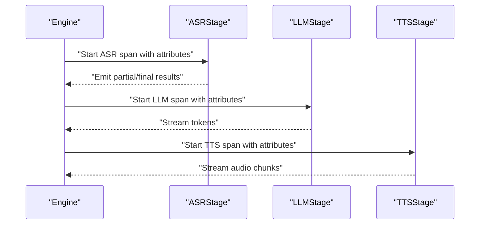
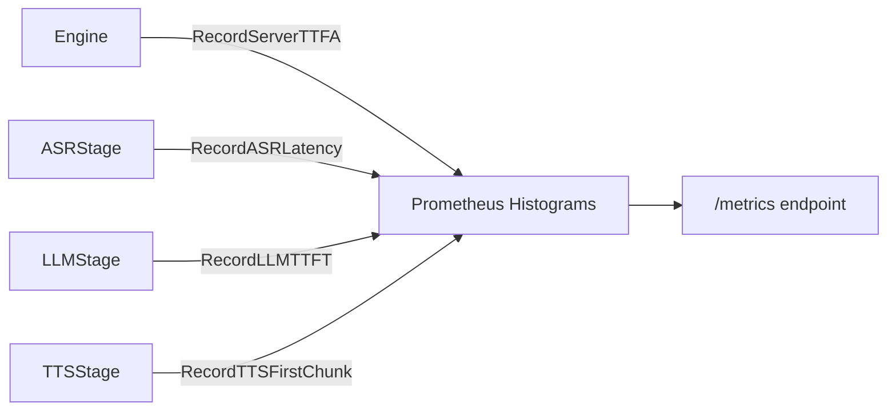
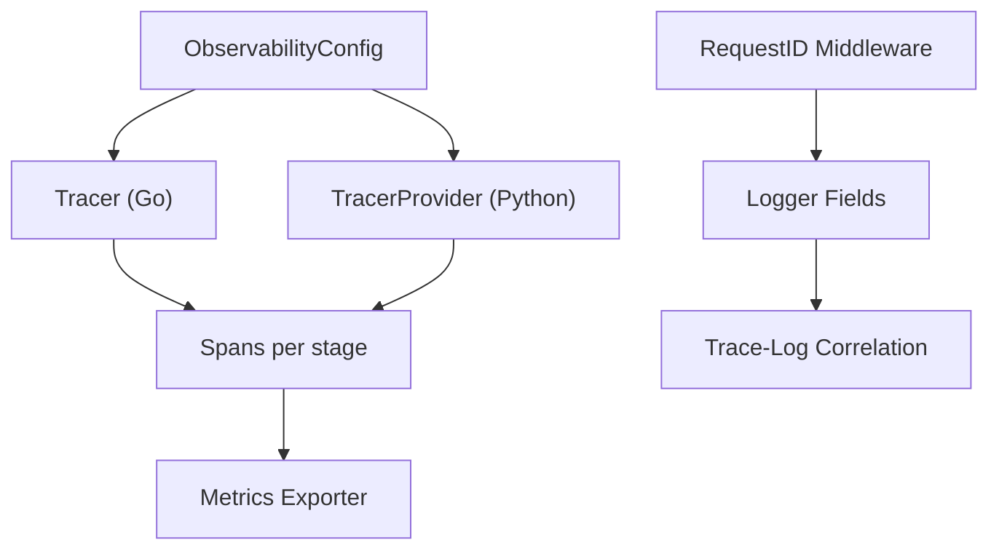

# Distributed Tracing

<cite>
**Referenced Files in This Document**
- [tracing.go](file://go/pkg/observability/tracing.go)
- [logger.go](file://go/pkg/observability/logger.go)
- [metrics.go](file://go/pkg/observability/metrics.go)
- [main.go (media-edge)](file://go/media-edge/cmd/main.go)
- [main.go (orchestrator)](file://go/orchestrator/cmd/main.go)
- [middleware.go](file://go/media-edge/internal/handler/middleware.go)
- [engine.go](file://go/orchestrator/internal/pipeline/engine.go)
- [asr_stage.go](file://go/orchestrator/internal/pipeline/asr_stage.go)
- [llm_stage.go](file://go/orchestrator/internal/pipeline/llm_stage.go)
- [tts_stage.go](file://go/orchestrator/internal/pipeline/tts_stage.go)
- [tracing.py](file://py/provider_gateway/app/telemetry/tracing.py)
- [config.go](file://go/pkg/config/config.go)
- [config-local.yaml](file://examples/config-local.yaml)
</cite>

## Table of Contents
1. [Introduction](#introduction)
2. [Project Structure](#project-structure)
3. [Core Components](#core-components)
4. [Architecture Overview](#architecture-overview)
5. [Detailed Component Analysis](#detailed-component-analysis)
6. [Dependency Analysis](#dependency-analysis)
7. [Performance Considerations](#performance-considerations)
8. [Troubleshooting Guide](#troubleshooting-guide)
9. [Conclusion](#conclusion)
10. [Appendices](#appendices)

## Introduction
This document explains CloudApp’s distributed tracing system built on OpenTelemetry. It covers how traces are configured, propagated across service boundaries, correlated with logs, and exported for visualization. It also documents span creation patterns, attributes, sampling strategies, and integration with external systems such as Jaeger or Zipkin via OTLP. Guidance is included for high-throughput environments, trace performance impact, and operational best practices.

## Project Structure
CloudApp comprises:
- Go services: media-edge (WebSocket ingress) and orchestrator (core pipeline).
- Python provider-gateway exposing providers behind a gRPC interface.
- Shared observability utilities for tracing, metrics, and logging.
- Example configuration enabling OTLP export and metrics exposure.

**Diagram sources**
- [main.go (media-edge):57-71](file://go/media-edge/cmd/main.go#L57-L71)
- [main.go (orchestrator):60-71](file://go/orchestrator/cmd/main.go#L60-L71)
- [tracing.py:17-51](file://py/provider_gateway/app/telemetry/tracing.py#L17-L51)
- [metrics.go:10-82](file://go/pkg/observability/metrics.go#L10-L82)

**Section sources**
- [main.go (media-edge):57-71](file://go/media-edge/cmd/main.go#L57-L71)
- [main.go (orchestrator):60-71](file://go/orchestrator/cmd/main.go#L60-L71)
- [tracing.py:17-51](file://py/provider_gateway/app/telemetry/tracing.py#L17-L51)
- [metrics.go:10-82](file://go/pkg/observability/metrics.go#L10-L82)

## Core Components
- Tracer provider and span helpers in Go:
  - Tracer initialization with resource attributes and optional OTLP exporter.
  - Span creation helpers with attributes and pipeline-stage tagging.
- Python provider-gateway OTel setup:
  - Global TracerProvider with optional BatchSpanProcessor and OTLP exporter.
- Middleware and request ID propagation:
  - Request ID injection into HTTP headers and context for cross-service correlation.
- Metrics integration:
  - Histograms and counters for latency and throughput, exposed via Prometheus.

**Section sources**
- [tracing.go:19-63](file://go/pkg/observability/tracing.go#L19-L63)
- [tracing.go:65-87](file://go/pkg/observability/tracing.go#L65-L87)
- [tracing.go:317-344](file://go/pkg/observability/tracing.go#L317-L344)
- [tracing.py:17-51](file://py/provider_gateway/app/telemetry/tracing.py#L17-L51)
- [middleware.go:172-189](file://go/media-edge/internal/handler/middleware.go#L172-L189)
- [metrics.go:10-82](file://go/pkg/observability/metrics.go#L10-L82)

## Architecture Overview
CloudApp’s tracing architecture centers on:
- Per-service TracerProvider instances configured from application configuration.
- Optional OTLP exporter for Jaeger/Zipkin backends.
- Request ID propagation via HTTP headers and context to correlate logs and traces.
- Pipeline stages emitting spans and timestamps for latency analysis.

**Diagram sources**
- [main.go (media-edge):57-71](file://go/media-edge/cmd/main.go#L57-L71)
- [main.go (orchestrator):60-71](file://go/orchestrator/cmd/main.go#L60-L71)
- [tracing.py:17-51](file://py/provider_gateway/app/telemetry/tracing.py#L17-L51)
- [engine.go:108-208](file://go/orchestrator/internal/pipeline/engine.go#L108-L208)
- [asr_stage.go:47-162](file://go/orchestrator/internal/pipeline/asr_stage.go#L47-L162)
- [llm_stage.go:58-185](file://go/orchestrator/internal/pipeline/llm_stage.go#L58-L185)
- [tts_stage.go:41-127](file://go/orchestrator/internal/pipeline/tts_stage.go#L41-L127)

## Detailed Component Analysis

### Go Tracer and Span Helpers
- TracerConfig supports enabling/disabling tracing and setting OTLP endpoint.
- Tracer wraps OpenTelemetry SDK TracerProvider and exposes StartSpan and StartSpanWithAttributes.
- SpanHelper creates spans tagged with pipeline_stage, provider, provider_type, and session_id.

**Diagram sources**
- [tracing.go:19-63](file://go/pkg/observability/tracing.go#L19-L63)
- [tracing.go:65-87](file://go/pkg/observability/tracing.go#L65-L87)
- [tracing.go:317-344](file://go/pkg/observability/tracing.go#L317-L344)

**Section sources**
- [tracing.go:19-63](file://go/pkg/observability/tracing.go#L19-L63)
- [tracing.go:65-87](file://go/pkg/observability/tracing.go#L65-L87)
- [tracing.go:317-344](file://go/pkg/observability/tracing.go#L317-L344)

### Python Provider-Gateway OTel Setup
- Global TracerProvider initialized with Resource containing service name.
- Optional OTLP exporter configured via endpoint; BatchSpanProcessor added when endpoint is present.
- Helper functions for getting current span, setting attributes, adding events, and starting spans.

**Diagram sources**
- [tracing.py:17-51](file://py/provider_gateway/app/telemetry/tracing.py#L17-L51)

**Section sources**
- [tracing.py:17-51](file://py/provider_gateway/app/telemetry/tracing.py#L17-L51)

### Request ID Propagation and Correlation
- Request ID header injection and extraction for cross-service correlation.
- Middleware attaches X-Request-ID to responses and stores it in context.
- Logger integrates request_id and trace_id into log fields for unified correlation.

**Diagram sources**
- [middleware.go:172-189](file://go/media-edge/internal/handler/middleware.go#L172-L189)
- [logger.go:85-109](file://go/pkg/observability/logger.go#L85-L109)

**Section sources**
- [middleware.go:172-189](file://go/media-edge/internal/handler/middleware.go#L172-L189)
- [logger.go:85-109](file://go/pkg/observability/logger.go#L85-L109)

### Pipeline Stage Spans and Timestamps
- Each pipeline stage (ASR, LLM, TTS) starts spans with attributes identifying provider and stage.
- TimestampTracker and SessionTimestampTracker record key events for latency calculations.
- Metrics are emitted for latency and throughput.

**Diagram sources**
- [engine.go:108-208](file://go/orchestrator/internal/pipeline/engine.go#L108-L208)
- [asr_stage.go:47-162](file://go/orchestrator/internal/pipeline/asr_stage.go#L47-L162)
- [llm_stage.go:58-185](file://go/orchestrator/internal/pipeline/llm_stage.go#L58-L185)
- [tts_stage.go:41-127](file://go/orchestrator/internal/pipeline/tts_stage.go#L41-L127)
- [tracing.go:327-344](file://go/pkg/observability/tracing.go#L327-L344)

**Section sources**
- [engine.go:108-208](file://go/orchestrator/internal/pipeline/engine.go#L108-L208)
- [asr_stage.go:47-162](file://go/orchestrator/internal/pipeline/asr_stage.go#L47-L162)
- [llm_stage.go:58-185](file://go/orchestrator/internal/pipeline/llm_stage.go#L58-L185)
- [tts_stage.go:41-127](file://go/orchestrator/internal/pipeline/tts_stage.go#L41-L127)
- [tracing.go:327-344](file://go/pkg/observability/tracing.go#L327-L344)

### Metrics and Export Configuration
- Prometheus metrics for sessions, turns, latency histograms, and provider stats.
- Metrics endpoint exposed on HTTP server when enabled.
- Tracer initialization in services reads observability config for OTLP endpoint and enable flags.

**Diagram sources**
- [metrics.go:10-82](file://go/pkg/observability/metrics.go#L10-L82)
- [engine.go:344-346](file://go/orchestrator/internal/pipeline/engine.go#L344-L346)
- [asr_stage.go:140-145](file://go/orchestrator/internal/pipeline/asr_stage.go#L140-L145)
- [llm_stage.go:152-159](file://go/orchestrator/internal/pipeline/llm_stage.go#L152-L159)
- [tts_stage.go:108-115](file://go/orchestrator/internal/pipeline/tts_stage.go#L108-L115)

**Section sources**
- [metrics.go:10-82](file://go/pkg/observability/metrics.go#L10-L82)
- [main.go (media-edge):123-127](file://go/media-edge/cmd/main.go#L123-L127)
- [main.go (orchestrator):147-149](file://go/orchestrator/cmd/main.go#L147-L149)

## Dependency Analysis
- Tracer initialization depends on configuration flags and endpoint.
- Pipeline stages depend on Tracer for span creation and on TimestampTracker for latency.
- Provider-gateway initializes OTel independently and can export to the same backend.
- Middleware and logger cooperate to propagate and correlate request identifiers.

**Diagram sources**
- [config.go:77-85](file://go/pkg/config/config.go#L77-L85)
- [main.go (media-edge):57-71](file://go/media-edge/cmd/main.go#L57-L71)
- [main.go (orchestrator):60-71](file://go/orchestrator/cmd/main.go#L60-L71)
- [tracing.py:17-51](file://py/provider_gateway/app/telemetry/tracing.py#L17-L51)
- [middleware.go:172-189](file://go/media-edge/internal/handler/middleware.go#L172-L189)
- [logger.go:85-109](file://go/pkg/observability/logger.go#L85-L109)

**Section sources**
- [config.go:77-85](file://go/pkg/config/config.go#L77-L85)
- [main.go (media-edge):57-71](file://go/media-edge/cmd/main.go#L57-L71)
- [main.go (orchestrator):60-71](file://go/orchestrator/cmd/main.go#L60-L71)
- [tracing.py:17-51](file://py/provider_gateway/app/telemetry/tracing.py#L17-L51)
- [middleware.go:172-189](file://go/media-edge/internal/handler/middleware.go#L172-L189)
- [logger.go:85-109](file://go/pkg/observability/logger.go#L85-L109)

## Performance Considerations
- Sampling strategies:
  - Use probabilistic or trace ID ratio samplers at the TracerProvider level to reduce overhead in high-volume environments.
  - Prefer head-based sampling for downstream correlation needs; tail-based sampling can be used when exporting to backends supporting it.
- Span overhead:
  - Keep spans short-lived; avoid attaching excessive attributes.
  - Use lightweight attributes and avoid expensive computations in hot paths.
- Export batching:
  - Enable BatchSpanProcessor with appropriate batch size and timeout to balance latency and throughput.
- Metrics:
  - Use histograms for latency; configure buckets aligned with SLAs to minimize cardinality.
- Concurrency:
  - Pipeline stages already use goroutines; ensure exporters are non-blocking and tuned for throughput.

[No sources needed since this section provides general guidance]

## Troubleshooting Guide
- Traces not appearing:
  - Verify observability.enable_tracing and observability.otel_endpoint are set in configuration.
  - Confirm OTLP exporter is attached in both Go services and Python provider-gateway.
- Missing correlation:
  - Ensure X-Request-ID is present in requests and responses; confirm middleware is applied.
  - Check that logs include request_id and trace_id fields.
- High CPU or memory usage:
  - Reduce span attributes; disable non-essential spans during peak load.
  - Tune exporter batch sizes and queue limits.
- Latency spikes:
  - Inspect latency histograms and stage-specific timings; focus on provider bottlenecks.

**Section sources**
- [config.go:220-235](file://go/pkg/config/config.go#L220-L235)
- [main.go (media-edge):57-71](file://go/media-edge/cmd/main.go#L57-L71)
- [main.go (orchestrator):60-71](file://go/orchestrator/cmd/main.go#L60-L71)
- [tracing.py:17-51](file://py/provider_gateway/app/telemetry/tracing.py#L17-L51)
- [middleware.go:172-189](file://go/media-edge/internal/handler/middleware.go#L172-L189)
- [logger.go:85-109](file://go/pkg/observability/logger.go#L85-L109)

## Conclusion
CloudApp’s tracing system leverages OpenTelemetry across Go and Python services, with request ID propagation and structured logging enabling strong trace-log correlation. Pipeline stages emit spans and timestamps for end-to-end latency insights, while Prometheus metrics complement trace data for operational monitoring. With careful configuration of exporters, batching, and sampling, the system can scale to high-throughput workloads while maintaining observability.

[No sources needed since this section summarizes without analyzing specific files]

## Appendices

### Configuration Reference
- Observability settings:
  - log_level, log_format, metrics_port, otel_endpoint, enable_tracing, enable_metrics.
- Example local configuration demonstrates OTLP endpoint defaults and metrics exposure.

**Section sources**
- [config.go:77-85](file://go/pkg/config/config.go#L77-L85)
- [config-local.yaml:31-37](file://examples/config-local.yaml#L31-L37)

### Trace Export Backends
- Jaeger:
  - Configure OTLP endpoint to Jaeger Collector gRPC port.
- Zipkin:
  - Configure OTLP endpoint to Zipkin OTLP receiver.

[No sources needed since this section provides general guidance]

### Best Practices
- Context management:
  - Always pass context through service boundaries; propagate request_id and trace_id.
- Attributes:
  - Limit attributes to essential metadata; avoid PII or sensitive data.
- Performance:
  - Prefer head-based sampling; tune exporter batch sizes; monitor histogram bucket distributions.
- Retention:
  - Align retention policies with compliance; consider cost-aware pruning of low-signal traces.

[No sources needed since this section provides general guidance]