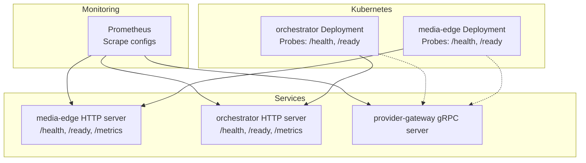
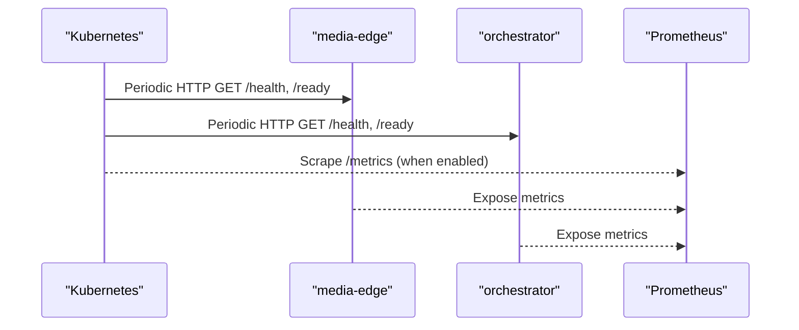
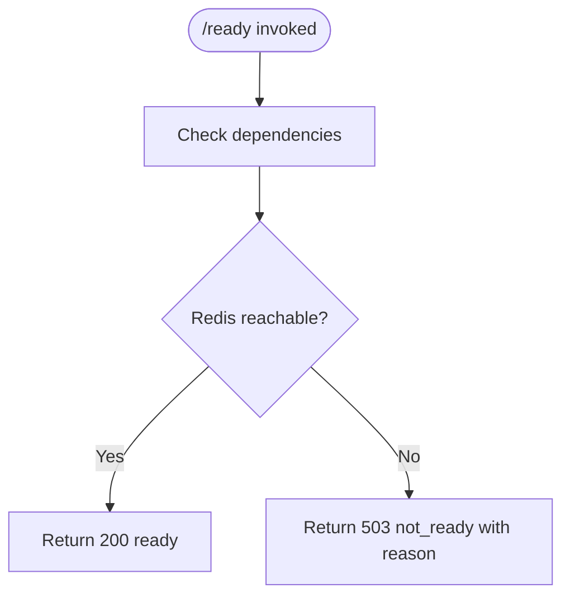
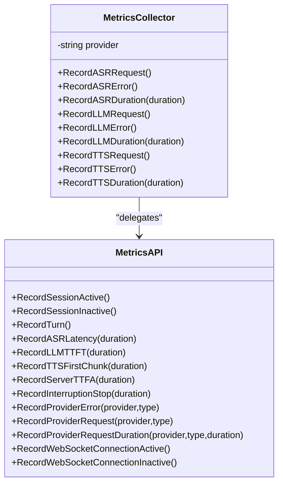
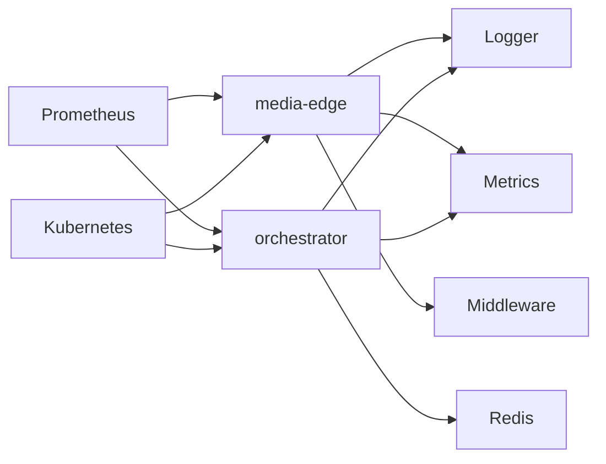

# Health Checks & Monitoring

<cite>
**Referenced Files in This Document**
- [metrics.go](file://go/pkg/observability/metrics.go)
- [logger.go](file://go/pkg/observability/logger.go)
- [tracing.go](file://go/pkg/observability/tracing.go)
- [main.go (media-edge)](file://go/media-edge/cmd/main.go)
- [main.go (orchestrator)](file://go/orchestrator/cmd/main.go)
- [middleware.go](file://go/media-edge/internal/handler/middleware.go)
- [engine.go](file://go/orchestrator/internal/pipeline/engine.go)
- [prometheus.yml](file://infra/prometheus/prometheus.yml)
- [media-edge.yaml](file://infra/k8s/media-edge.yaml)
- [orchestrator.yaml](file://infra/k8s/orchestrator.yaml)
- [deployment.md](file://docs/deployment.md)
- [config.go](file://go/pkg/config/config.go)
- [server.py](file://py/provider_gateway/app/grpc_api/server.py)
</cite>

## Table of Contents
1. [Introduction](#introduction)
2. [Project Structure](#project-structure)
3. [Core Components](#core-components)
4. [Architecture Overview](#architecture-overview)
5. [Detailed Component Analysis](#detailed-component-analysis)
6. [Dependency Analysis](#dependency-analysis)
7. [Performance Considerations](#performance-considerations)
8. [Troubleshooting Guide](#troubleshooting-guide)
9. [Conclusion](#conclusion)
10. [Appendices](#appendices)

## Introduction
This document describes CloudApp’s health checks and monitoring system. It covers:
- Health endpoints and probes for readiness and liveness
- Built-in metrics instrumentation for sessions, turns, latency, and provider performance
- Observability primitives for logging, tracing, and metrics export
- Monitoring infrastructure setup with Prometheus scraping and Kubernetes probes
- Practical guidance for dashboard panels, alerting rules, and incident response
- Operational procedures for maintenance, metric cleanup, and performance tuning

## Project Structure
CloudApp consists of:
- Go services: media-edge (WebSocket gateway) and orchestrator (pipeline coordinator)
- Python provider gateway (gRPC) exposing AI providers
- Observability utilities (logging, metrics, tracing)
- Kubernetes manifests for deployments and probes
- Prometheus configuration for scraping metrics

**Diagram sources**
- [media-edge.yaml:57-74](file://infra/k8s/media-edge.yaml#L57-L74)
- [orchestrator.yaml:59-74](file://infra/k8s/orchestrator.yaml#L59-L74)
- [main.go (media-edge):99-126](file://go/media-edge/cmd/main.go#L99-L126)
- [main.go (orchestrator):125-148](file://go/orchestrator/cmd/main.go#L125-L148)
- [prometheus.yml:19-51](file://infra/prometheus/prometheus.yml#L19-L51)
- [server.py:54-89](file://py/provider_gateway/app/grpc_api/server.py#L54-L89)

**Section sources**
- [media-edge.yaml:1-112](file://infra/k8s/media-edge.yaml#L1-L112)
- [orchestrator.yaml:1-92](file://infra/k8s/orchestrator.yaml#L1-L92)
- [prometheus.yml:1-60](file://infra/prometheus/prometheus.yml#L1-L60)

## Core Components
- Health endpoints
  - media-edge: /health returns success; /ready returns readiness status
  - orchestrator: /health returns healthy; /ready checks Redis connectivity
- Metrics exposure
  - Both services expose /metrics when observability is enabled
  - Metrics include active sessions, turns, latency histograms, provider request counters and durations, WebSocket connections
- Observability utilities
  - Structured logging with leveled output and context enrichment
  - Optional OpenTelemetry tracing and Prometheus metrics exporter
- Middleware
  - media-edge HTTP middleware records request metrics and logs requests/responses

**Section sources**
- [main.go (media-edge):99-126](file://go/media-edge/cmd/main.go#L99-L126)
- [main.go (orchestrator):125-148](file://go/orchestrator/cmd/main.go#L125-L148)
- [metrics.go:10-82](file://go/pkg/observability/metrics.go#L10-L82)
- [middleware.go:78-94](file://go/media-edge/internal/handler/middleware.go#L78-L94)
- [logger.go:25-83](file://go/pkg/observability/logger.go#L25-L83)
- [tracing.go:346-358](file://go/pkg/observability/tracing.go#L346-L358)

## Architecture Overview
The monitoring architecture integrates service endpoints, Kubernetes probes, and Prometheus scraping.

**Diagram sources**
- [media-edge.yaml:57-74](file://infra/k8s/media-edge.yaml#L57-L74)
- [orchestrator.yaml:59-74](file://infra/k8s/orchestrator.yaml#L59-L74)
- [prometheus.yml:19-51](file://infra/prometheus/prometheus.yml#L19-L51)
- [main.go (media-edge):123-126](file://go/media-edge/cmd/main.go#L123-L126)
- [main.go (orchestrator):147-148](file://go/orchestrator/cmd/main.go#L147-L148)

## Detailed Component Analysis

### Health Endpoint Implementation
- media-edge
  - /health returns success
  - /ready returns readiness; dependency checks are marked as TODO and should be extended to include Redis and other dependencies
- orchestrator
  - /health returns healthy
  - /ready pings Redis; on failure returns not_ready with a reason

**Diagram sources**
- [main.go (orchestrator):132-145](file://go/orchestrator/cmd/main.go#L132-L145)
- [main.go (media-edge):106-121](file://go/media-edge/cmd/main.go#L106-L121)

**Section sources**
- [main.go (media-edge):99-121](file://go/media-edge/cmd/main.go#L99-L121)
- [main.go (orchestrator):125-145](file://go/orchestrator/cmd/main.go#L125-L145)

### Readiness Probes in Kubernetes
- media-edge and orchestrator define HTTP readiness probes against /ready with tuned intervals and timeouts
- Annotations enable Prometheus scraping for metrics

**Section sources**
- [media-edge.yaml:24-27](file://infra/k8s/media-edge.yaml#L24-L27)
- [media-edge.yaml:65-74](file://infra/k8s/media-edge.yaml#L65-L74)
- [orchestrator.yaml:24-27](file://infra/k8s/orchestrator.yaml#L24-L27)
- [orchestrator.yaml:67-74](file://infra/k8s/orchestrator.yaml#L67-L74)

### Metrics Instrumentation
- Metrics exposed via /metrics when enabled
- Gauges and counters track:
  - Active sessions and turns
  - Latency histograms for ASR, LLM TTFT, TTS first chunk, server TTFA, interruption stop
  - Provider error and request counters with labels for provider and type
  - Provider request durations
  - Active WebSocket connections
- MetricsCollector provides convenience methods per provider/type

**Diagram sources**
- [metrics.go:149-202](file://go/pkg/observability/metrics.go#L149-L202)
- [metrics.go:84-147](file://go/pkg/observability/metrics.go#L84-L147)

**Section sources**
- [metrics.go:10-214](file://go/pkg/observability/metrics.go#L10-L214)

### HTTP Middleware Metrics (media-edge)
- MetricsMiddleware records provider requests and durations for HTTP traffic
- LoggingMiddleware logs method, path, status, duration, remote address, and user agent
- RecoveryMiddleware recovers from panics and returns 500

**Section sources**
- [middleware.go:78-94](file://go/media-edge/internal/handler/middleware.go#L78-L94)
- [middleware.go:27-52](file://go/media-edge/internal/handler/middleware.go#L27-L52)
- [middleware.go:54-76](file://go/media-edge/internal/handler/middleware.go#L54-L76)

### Provider Gateway Health (gRPC)
- Provider gateway exposes a gRPC health service; clients can use standard health probes
- The server is started asynchronously and supports graceful shutdown

**Section sources**
- [server.py:54-89](file://py/provider_gateway/app/grpc_api/server.py#L54-L89)
- [deployment.md:359-364](file://docs/deployment.md#L359-L364)

### Observability Primitives
- Logger supports JSON/console formats, levels, file output, context enrichment, and stack traces
- Tracer supports OpenTelemetry initialization, spans, and a Prometheus metrics exporter

**Section sources**
- [logger.go:25-168](file://go/pkg/observability/logger.go#L25-L168)
- [tracing.go:346-358](file://go/pkg/observability/tracing.go#L346-L358)

### Orchestrator Pipeline and Latency Tracking
- Engine records timestamps across pipeline stages and emits metrics for server TTFA and interruption stop latency
- Circuit breaker protects provider calls and can be monitored via stats

**Section sources**
- [engine.go:340-347](file://go/orchestrator/internal/pipeline/engine.go#L340-L347)
- [engine.go:425-428](file://go/orchestrator/internal/pipeline/engine.go#L425-L428)
- [circuit_breaker.go:57-90](file://go/orchestrator/internal/pipeline/circuit_breaker.go#L57-L90)

## Dependency Analysis
- media-edge depends on observability utilities for logging, metrics, and middleware
- orchestrator depends on Redis for readiness checks and persistence; exposes metrics and health endpoints
- Prometheus scrapes services based on static_configs and labels
- Kubernetes probes rely on HTTP endpoints for liveness/readiness

**Diagram sources**
- [main.go (media-edge):40-71](file://go/media-edge/cmd/main.go#L40-L71)
- [main.go (orchestrator):73-86](file://go/orchestrator/cmd/main.go#L73-L86)
- [prometheus.yml:19-51](file://infra/prometheus/prometheus.yml#L19-L51)
- [media-edge.yaml:57-74](file://infra/k8s/media-edge.yaml#L57-L74)
- [orchestrator.yaml:59-74](file://infra/k8s/orchestrator.yaml#L59-L74)

**Section sources**
- [main.go (media-edge):40-71](file://go/media-edge/cmd/main.go#L40-L71)
- [main.go (orchestrator):73-86](file://go/orchestrator/cmd/main.go#L73-L86)
- [prometheus.yml:19-51](file://infra/prometheus/prometheus.yml#L19-L51)

## Performance Considerations
- Use exponential histogram buckets for latency metrics to capture tail latencies efficiently
- Keep metrics cardinality manageable by limiting label values (provider, type)
- Enable metrics only when needed to reduce overhead
- Tune Prometheus scrape intervals and timeouts per service load
- Use circuit breakers to protect downstream providers and prevent cascading failures

[No sources needed since this section provides general guidance]

## Troubleshooting Guide
Common issues and remedies:
- Readiness failures
  - Verify Redis connectivity; orchestrator readiness depends on Redis Ping
  - Check service logs for startup errors
- Health endpoint anomalies
  - Confirm HTTP server is listening and middleware chain is applied
- Metrics missing
  - Ensure observability.enable_metrics is set and /metrics is exposed
  - Validate Prometheus scrape configuration and target reachability
- gRPC provider gateway
  - Use standard health probes to verify serving status
  - Inspect server logs for startup/shutdown events

**Section sources**
- [main.go (orchestrator):133-140](file://go/orchestrator/cmd/main.go#L133-L140)
- [main.go (media-edge):123-126](file://go/media-edge/cmd/main.go#L123-L126)
- [prometheus.yml:19-51](file://infra/prometheus/prometheus.yml#L19-L51)
- [deployment.md:359-364](file://docs/deployment.md#L359-L364)

## Conclusion
CloudApp’s monitoring foundation combines simple yet effective health endpoints, robust metrics instrumentation, and observability utilities. Kubernetes probes and Prometheus scraping provide operational visibility, while middleware and tracing enhance diagnostics. Extending readiness checks and alerting rules will further strengthen reliability and incident response.

[No sources needed since this section summarizes without analyzing specific files]

## Appendices

### Health Check Configuration Examples
- media-edge
  - Liveness: curl http://media-edge:8080/health
  - Readiness: curl http://media-edge:8080/ready
- orchestrator
  - Liveness: curl http://orchestrator:8081/health
  - Readiness: curl http://orchestrator:8081/ready
- provider-gateway
  - gRPC health check using standard tooling

**Section sources**
- [deployment.md:331-364](file://docs/deployment.md#L331-L364)

### Monitoring Dashboard Panels (Key Metrics)
- Sessions and throughput
  - cloudapp_sessions_active
  - cloudapp_turns_total
- Latency
  - cloudapp_asr_latency_ms
  - cloudapp_llm_ttft_ms
  - cloudapp_tts_first_chunk_ms
  - cloudapp_server_ttfa_ms
  - cloudapp_interruption_stop_ms
- Provider health
  - cloudapp_provider_errors_total (by provider, type)
  - cloudapp_provider_requests_total (by provider, type)
  - cloudapp_provider_request_duration_ms (by provider, type)
- Connections
  - cloudapp_websocket_connections_active

**Section sources**
- [metrics.go:10-82](file://go/pkg/observability/metrics.go#L10-L82)

### Alerting Strategies and Rules
- Suggested alerts
  - High provider error rates (e.g., increase >20% over baseline)
  - Elevated P95/P99 provider request durations
  - Decline in cloudapp_turns_total over window
  - Rising cloudapp_interruption_stop_ms indicating degraded responsiveness
  - Low cloudapp_sessions_active despite traffic surge
  - Unhealthy readiness probes for sustained periods
- Remediation
  - Scale out affected pods
  - Review circuit breaker states and provider quotas
  - Investigate upstream provider throttling or outages

[No sources needed since this section provides general guidance]

### Operational Procedures
- Maintenance
  - Rotate secrets and re-deploy services
  - Validate Prometheus targets after changes
- Metric cleanup
  - Use retention settings in Prometheus to manage disk usage
  - Archive long-term metrics to external systems if needed
- Performance tuning
  - Adjust scrape intervals and timeouts based on service load
  - Tune bucket sizes for latency histograms to balance precision and cardinality
  - Monitor and adjust Kubernetes resource requests/limits

[No sources needed since this section provides general guidance]