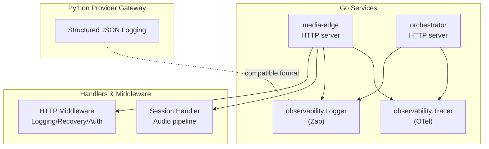
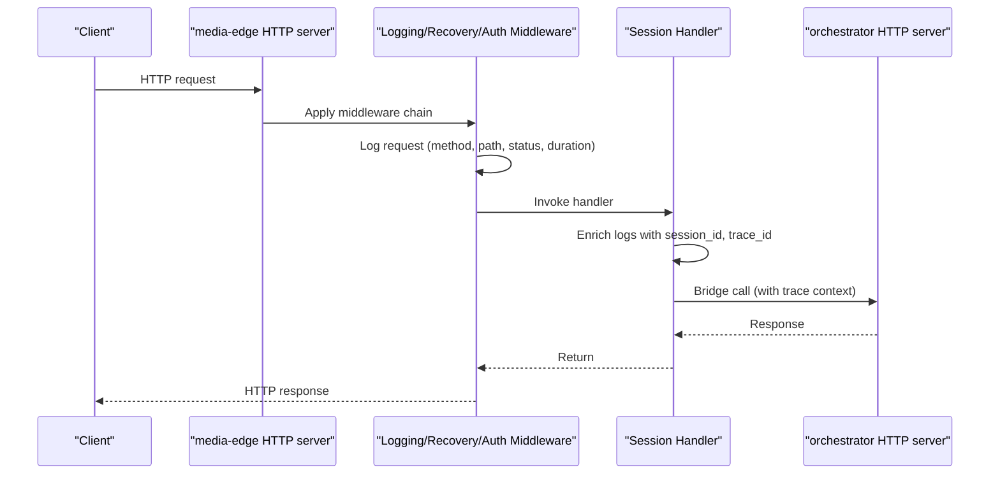
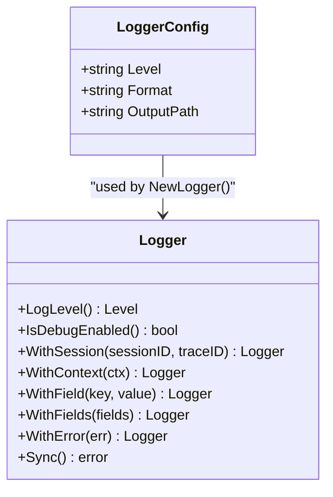
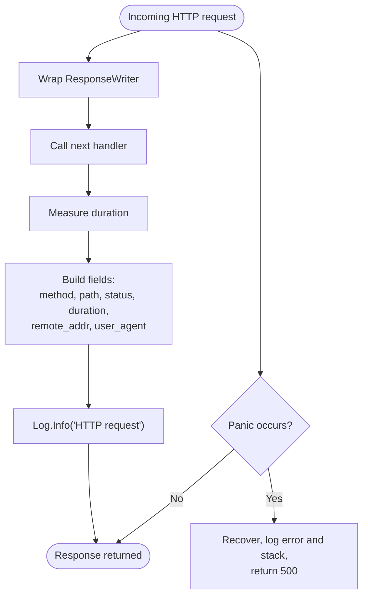
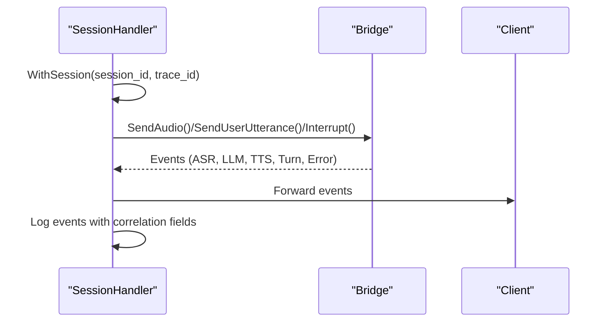
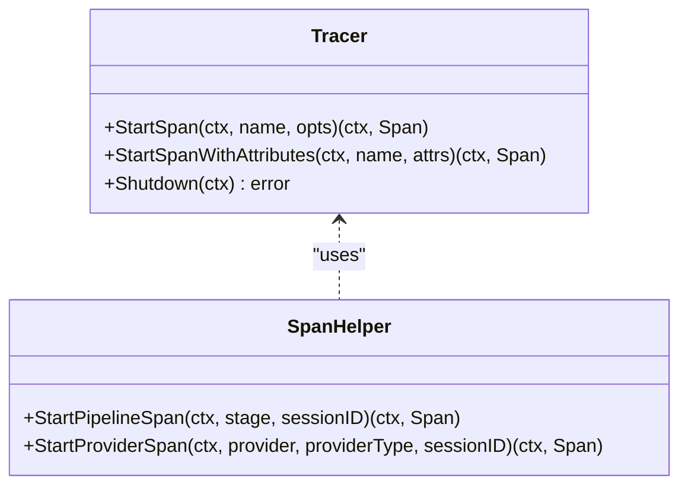
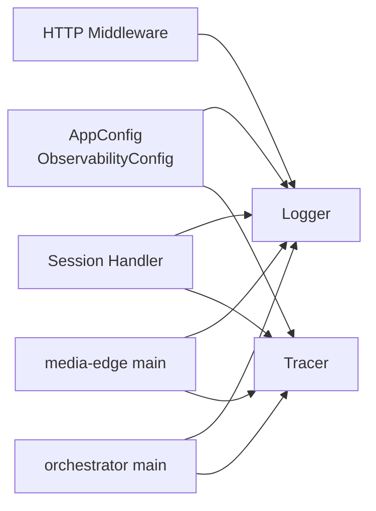

# Logging System

<cite>
**Referenced Files in This Document**
- [logger.go](file://go/pkg/observability/logger.go)
- [tracing.go](file://go/pkg/observability/tracing.go)
- [main.go](file://go/media-edge/cmd/main.go)
- [middleware.go](file://go/media-edge/internal/handler/middleware.go)
- [session_handler.go](file://go/media-edge/internal/handler/session_handler.go)
- [main.go](file://go/orchestrator/cmd/main.go)
- [config.go](file://go/pkg/config/config.go)
- [logging.py](file://py/provider_gateway/app/telemetry/logging.py)
</cite>

## Table of Contents
1. [Introduction](#introduction)
2. [Project Structure](#project-structure)
3. [Core Components](#core-components)
4. [Architecture Overview](#architecture-overview)
5. [Detailed Component Analysis](#detailed-component-analysis)
6. [Dependency Analysis](#dependency-analysis)
7. [Performance Considerations](#performance-considerations)
8. [Troubleshooting Guide](#troubleshooting-guide)
9. [Conclusion](#conclusion)

## Introduction
This document describes CloudApp’s logging system with a focus on structured logging, log levels, filtering, and integration with OpenTelemetry for distributed tracing and correlation. It explains how logs are configured, formatted, and enriched with context, and how trace identifiers propagate across services. It also covers practical topics such as log rotation, aggregation, parsing, and best practices for controlling log volume and protecting sensitive data.

## Project Structure
CloudApp’s logging and observability are implemented in Go and Python:
- Go services (media-edge and orchestrator) use a structured logger built on Uber Zap and integrate OpenTelemetry tracing.
- Middleware and handlers log HTTP requests, panics, and security events.
- Python provider gateway implements structured JSON logging compatible with typical log aggregation pipelines.

**Diagram sources**
- [main.go:30-180](file://go/media-edge/cmd/main.go#L30-L180)
- [main.go:26-193](file://go/orchestrator/cmd/main.go#L26-L193)
- [logger.go:13-168](file://go/pkg/observability/logger.go#L13-L168)
- [tracing.go:27-105](file://go/pkg/observability/tracing.go#L27-L105)
- [middleware.go:27-131](file://go/media-edge/internal/handler/middleware.go#L27-L131)
- [session_handler.go:86-106](file://go/media-edge/internal/handler/session_handler.go#L86-L106)
- [logging.py:10-95](file://py/provider_gateway/app/telemetry/logging.py#L10-L95)

**Section sources**
- [main.go:30-180](file://go/media-edge/cmd/main.go#L30-L180)
- [main.go:26-193](file://go/orchestrator/cmd/main.go#L26-L193)
- [logger.go:13-168](file://go/pkg/observability/logger.go#L13-L168)
- [tracing.go:27-105](file://go/pkg/observability/tracing.go#L27-L105)
- [middleware.go:27-131](file://go/media-edge/internal/handler/middleware.go#L27-L131)
- [session_handler.go:86-106](file://go/media-edge/internal/handler/session_handler.go#L86-L106)
- [logging.py:10-95](file://py/provider_gateway/app/telemetry/logging.py#L10-L95)

## Core Components
- Structured logger (Zap): Provides JSON and console encoders, configurable log levels, caller and stack traces, and helpers to enrich logs with session and context fields.
- Tracer (OpenTelemetry): Creates spans, attaches attributes, and supports pipeline-stage and provider spans for correlation.
- HTTP middleware: Logs requests, recovers from panics, records metrics, and enforces authentication and IP filtering.
- Session handler: Enriches logs with session_id and trace_id for end-to-end visibility.
- Python logging: Structured JSON logging with timestamp, level, logger name, message, hostname, and optional exception details.

Key capabilities:
- Structured log formats: JSON for production, console for development.
- Log levels: debug, info, warn, error.
- Filtering: configurable via log level.
- Correlation: session_id and trace_id propagated across services.
- Trace integration: spans and attributes for pipeline stages and provider calls.

**Section sources**
- [logger.go:18-168](file://go/pkg/observability/logger.go#L18-L168)
- [tracing.go:19-105](file://go/pkg/observability/tracing.go#L19-L105)
- [middleware.go:27-131](file://go/media-edge/internal/handler/middleware.go#L27-L131)
- [session_handler.go:86-106](file://go/media-edge/internal/handler/session_handler.go#L86-L106)
- [logging.py:10-95](file://py/provider_gateway/app/telemetry/logging.py#L10-L95)

## Architecture Overview
The logging architecture integrates service startup, middleware, and handler layers with OpenTelemetry tracing. Configuration is driven by YAML settings that control log level, format, and OTel endpoint.

**Diagram sources**
- [main.go:129-143](file://go/media-edge/cmd/main.go#L129-L143)
- [middleware.go:27-52](file://go/media-edge/internal/handler/middleware.go#L27-L52)
- [session_handler.go:86-106](file://go/media-edge/internal/handler/session_handler.go#L86-L106)
- [main.go:150-164](file://go/orchestrator/cmd/main.go#L150-L164)

**Section sources**
- [main.go:129-143](file://go/media-edge/cmd/main.go#L129-L143)
- [middleware.go:27-52](file://go/media-edge/internal/handler/middleware.go#L27-L52)
- [session_handler.go:86-106](file://go/media-edge/internal/handler/session_handler.go#L86-L106)
- [main.go:150-164](file://go/orchestrator/cmd/main.go#L150-L164)

## Detailed Component Analysis

### Structured Logger (Zap)
- Configuration: log level, format (json/console), output path.
- Encoders: ISO8601 timestamp in JSON; colored level in console.
- Context enrichment: WithSession(session_id, trace_id), WithContext(ctx), WithField(s), WithError(err).
- Lifecycle: creation, sync on shutdown, development/production presets, debug-level inspection.

**Diagram sources**
- [logger.go:13-168](file://go/pkg/observability/logger.go#L13-L168)

**Section sources**
- [logger.go:18-168](file://go/pkg/observability/logger.go#L18-L168)

### HTTP Middleware Logging and Recovery
- LoggingMiddleware: captures method, path, status, duration, remote address, user agent; logs as structured fields.
- RecoveryMiddleware: recovers from panics, logs error and stack, returns 500.
- AuthMiddleware: checks API key, logs unauthorized attempts.
- IPFilterMiddleware: filters by allowed IPs, logs blocked requests.

**Diagram sources**
- [middleware.go:27-94](file://go/media-edge/internal/handler/middleware.go#L27-L94)

**Section sources**
- [middleware.go:27-131](file://go/media-edge/internal/handler/middleware.go#L27-L131)

### Session Handler Logging
- Enrichment: logs include session_id and trace_id for end-to-end correlation.
- Event-driven logging: logs transitions, interruptions, errors, and unknown events with appropriate severity.
- Audio pipeline: logs normalization failures, buffering drops, and transport errors.

**Diagram sources**
- [session_handler.go:86-106](file://go/media-edge/internal/handler/session_handler.go#L86-L106)
- [session_handler.go:316-403](file://go/media-edge/internal/handler/session_handler.go#L316-L403)

**Section sources**
- [session_handler.go:86-106](file://go/media-edge/internal/handler/session_handler.go#L86-L106)
- [session_handler.go:316-403](file://go/media-edge/internal/handler/session_handler.go#L316-L403)

### OpenTelemetry Tracing Integration
- Tracer initialization with service name/version and resource attributes.
- Span creation with attributes for pipeline stages and provider calls.
- Helper methods to start spans with standardized attributes.

**Diagram sources**
- [tracing.go:27-105](file://go/pkg/observability/tracing.go#L27-L105)
- [tracing.go:317-344](file://go/pkg/observability/tracing.go#L317-L344)

**Section sources**
- [tracing.go:27-105](file://go/pkg/observability/tracing.go#L27-L105)
- [tracing.go:317-344](file://go/pkg/observability/tracing.go#L317-L344)

### Python Provider Gateway Logging
- JSONFormatter emits structured logs with timestamp, level, logger name, message, hostname, source location, and optional exception details.
- Compatible with log aggregation systems expecting JSON logs.

**Section sources**
- [logging.py:10-95](file://py/provider_gateway/app/telemetry/logging.py#L10-L95)

## Dependency Analysis
- Logger depends on Zap for encoding, level parsing, and sync.
- Tracer depends on OpenTelemetry SDK and trace APIs.
- Handlers depend on Logger for structured logging and optionally on Tracer for spans.
- Configuration drives logger and tracer behavior.

**Diagram sources**
- [config.go:77-85](file://go/pkg/config/config.go#L77-L85)
- [logger.go:25-59](file://go/pkg/observability/logger.go#L25-L59)
- [tracing.go:34-63](file://go/pkg/observability/tracing.go#L34-L63)
- [main.go:40-71](file://go/media-edge/cmd/main.go#L40-L71)
- [main.go:44-71](file://go/orchestrator/cmd/main.go#L44-L71)

**Section sources**
- [config.go:77-85](file://go/pkg/config/config.go#L77-L85)
- [logger.go:25-59](file://go/pkg/observability/logger.go#L25-L59)
- [tracing.go:34-63](file://go/pkg/observability/tracing.go#L34-L63)
- [main.go:40-71](file://go/media-edge/cmd/main.go#L40-L71)
- [main.go:44-71](file://go/orchestrator/cmd/main.go#L44-L71)

## Performance Considerations
- Prefer JSON logs in production for efficient parsing and ingestion.
- Use appropriate log levels to reduce noise: info for normal operations, warn/error for anomalies.
- Avoid excessive field cardinality in logs to keep indexing efficient.
- Use structured fields consistently to enable fast filtering and aggregation.
- Keep stack traces and exception details scoped to error-level logs to minimize overhead.

[No sources needed since this section provides general guidance]

## Troubleshooting Guide
Common scenarios and how logs help:
- Unauthorized access attempts: AuthMiddleware logs blocked requests with path and remote address.
- Panics: RecoveryMiddleware logs error and stack, returning a safe 500 response.
- Session interruptions: SessionHandler logs interruption events, clearing buffers and resetting state.
- Provider errors: SessionHandler forwards and logs error events with error code and message.
- Pipeline delays: Use trace spans and attributes to correlate stage timings across services.

Practical steps:
- Filter by session_id and trace_id to isolate a user session across services.
- Search for error-level messages and stack traces to locate failures.
- Correlate HTTP request logs with downstream orchestration events using the same correlation fields.
- Verify OTel spans for timing and attributes to identify slow stages.

**Section sources**
- [middleware.go:96-131](file://go/media-edge/internal/handler/middleware.go#L96-L131)
- [middleware.go:54-76](file://go/media-edge/internal/handler/middleware.go#L54-L76)
- [session_handler.go:279-314](file://go/media-edge/internal/handler/session_handler.go#L279-L314)
- [session_handler.go:392-403](file://go/media-edge/internal/handler/session_handler.go#L392-L403)

## Conclusion
CloudApp’s logging system combines structured, production-ready logs with OpenTelemetry tracing to deliver strong observability. The logger supports JSON and console formats, contextual enrichment, and robust middleware logging. Tracing enables correlation across services and pipeline stages. Together, these components support efficient log aggregation, analysis, and troubleshooting while maintaining performance and operational safety.