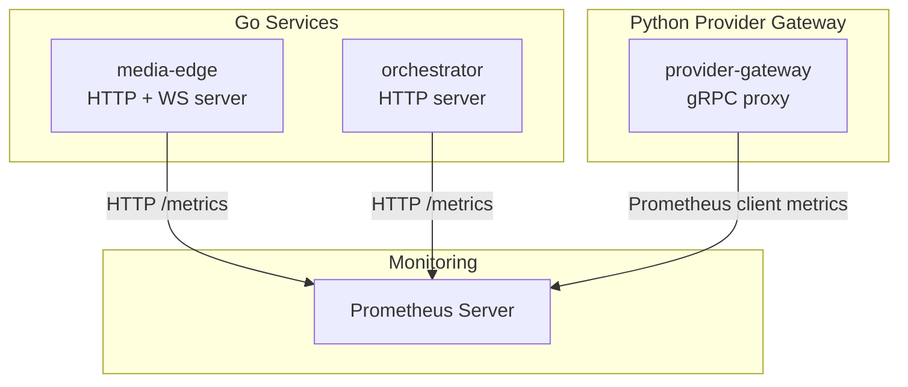
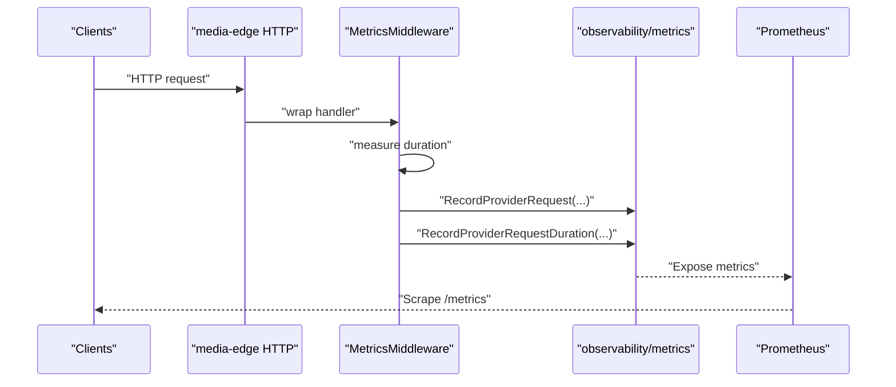
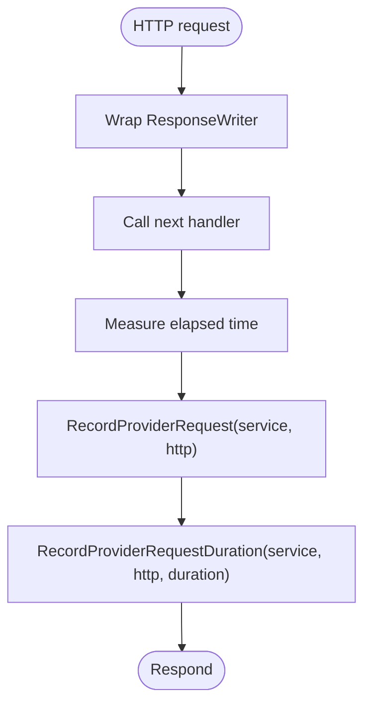
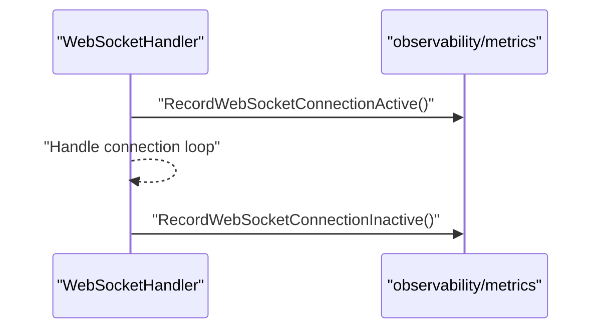
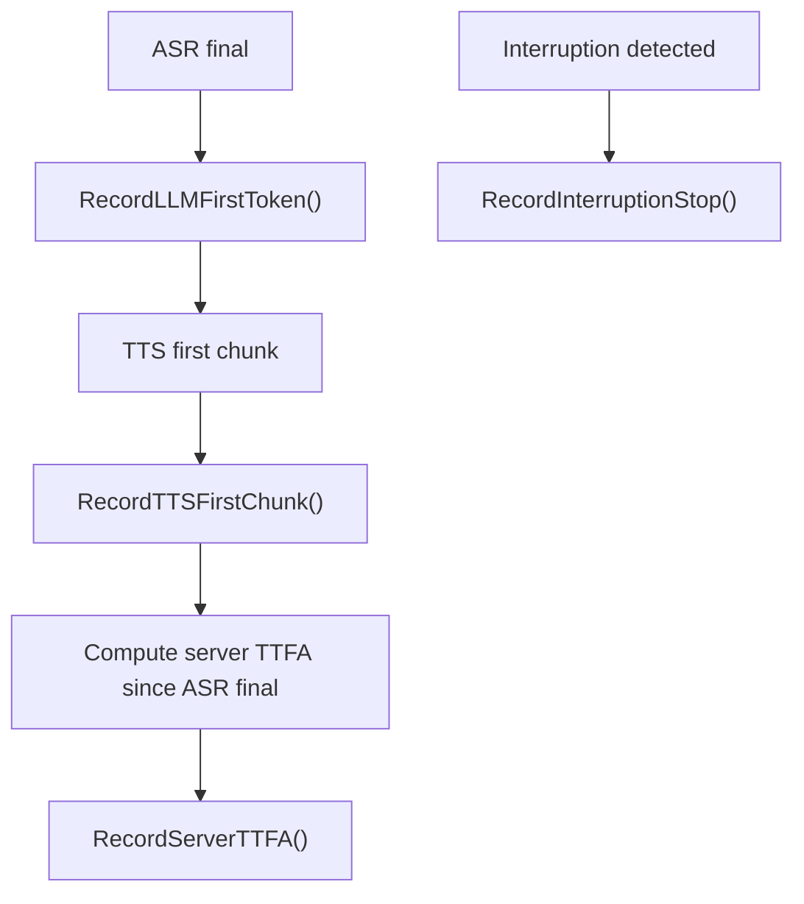
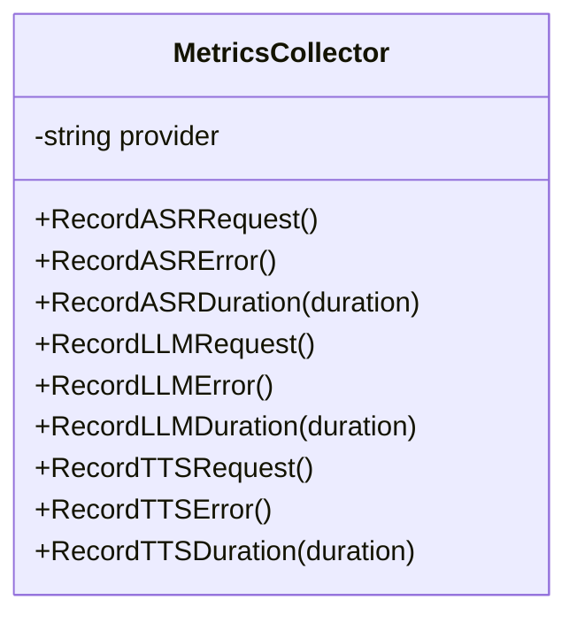
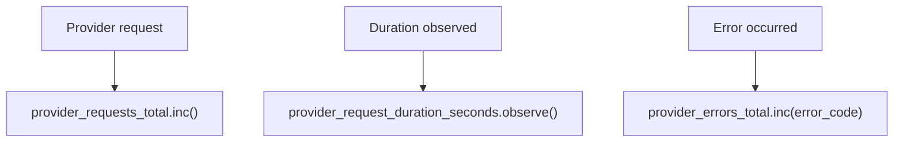
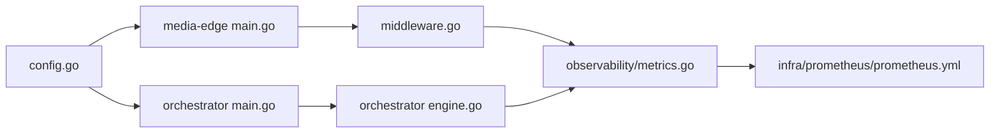

# Metrics Collection

<cite>
**Referenced Files in This Document**
- [metrics.go](file://go/pkg/observability/metrics.go)
- [middleware.go](file://go/media-edge/internal/handler/middleware.go)
- [websocket.go](file://go/media-edge/internal/handler/websocket.go)
- [engine.go](file://go/orchestrator/internal/pipeline/engine.go)
- [main.go (media-edge)](file://go/media-edge/cmd/main.go)
- [main.go (orchestrator)](file://go/orchestrator/cmd/main.go)
- [config.go](file://go/pkg/config/config.go)
- [prometheus.yml](file://infra/prometheus/prometheus.yml)
- [metrics.py (provider-gateway)](file://py/provider_gateway/app/telemetry/metrics.py)
- [tracing.go](file://go/pkg/observability/tracing.go)
- [state.go](file://go/pkg/session/state.go)
- [testing.md](file://docs/testing.md)
</cite>

## Table of Contents
1. [Introduction](#introduction)
2. [Project Structure](#project-structure)
3. [Core Components](#core-components)
4. [Architecture Overview](#architecture-overview)
5. [Detailed Component Analysis](#detailed-component-analysis)
6. [Dependency Analysis](#dependency-analysis)
7. [Performance Considerations](#performance-considerations)
8. [Troubleshooting Guide](#troubleshooting-guide)
9. [Conclusion](#conclusion)
10. [Appendices](#appendices)

## Introduction
This document explains CloudApp’s metrics collection system with a focus on Prometheus integration, custom metric instrumentation, and performance monitoring. It covers how counters, histograms, and gauges are implemented to track service performance, how the Prometheus exporter is configured and exposed, and how to scrape metrics across services. It also documents metric labeling strategies, cardinality management, retention policies, and practical guidance for building alerts and dashboards.

## Project Structure
CloudApp’s metrics stack spans Go services (media-edge and orchestrator), a Python provider gateway, and a Prometheus configuration. Metrics are instrumented at the service boundaries and within pipeline stages, with a dedicated metrics endpoint exposed per service.

**Diagram sources**
- [main.go (media-edge):123-126](file://go/media-edge/cmd/main.go#L123-L126)
- [main.go (orchestrator):147-148](file://go/orchestrator/cmd/main.go#L147-L148)
- [metrics.py (provider-gateway):85-95](file://py/provider_gateway/app/telemetry/metrics.py#L85-L95)
- [prometheus.yml:19-60](file://infra/prometheus/prometheus.yml#L19-L60)

**Section sources**
- [main.go (media-edge):123-126](file://go/media-edge/cmd/main.go#L123-L126)
- [main.go (orchestrator):147-148](file://go/orchestrator/cmd/main.go#L147-L148)
- [prometheus.yml:19-60](file://infra/prometheus/prometheus.yml#L19-L60)

## Core Components
CloudApp instruments the following metric families:

- Gauges
  - cloudapp_sessions_active
  - cloudapp_websocket_connections_active
- Counters
  - cloudapp_turns_total
  - cloudapp_provider_errors_total (labels: provider, type)
  - cloudapp_provider_requests_total (labels: provider, type)
- Histograms
  - cloudapp_asr_latency_ms
  - cloudapp_llm_ttft_ms
  - cloudapp_tts_first_chunk_ms
  - cloudapp_server_ttfa_ms (end-to-end)
  - cloudapp_interruption_stop_ms
  - cloudapp_provider_request_duration_ms (labels: provider, type)

These are registered and exposed via the Prometheus Go client, and the media-edge and orchestrator services expose a standard /metrics endpoint when enabled.

**Section sources**
- [metrics.go:10-82](file://go/pkg/observability/metrics.go#L10-L82)
- [main.go (media-edge):123-126](file://go/media-edge/cmd/main.go#L123-L126)
- [main.go (orchestrator):147-148](file://go/orchestrator/cmd/main.go#L147-L148)

## Architecture Overview
The metrics architecture integrates service-level instrumentation with a central Prometheus server. The media-edge service exposes a metrics endpoint and records HTTP request metrics via middleware. The orchestrator service exposes metrics and integrates with pipeline stages to record latency milestones. The provider gateway exposes its own metrics via the Python Prometheus client.

**Diagram sources**
- [middleware.go:78-94](file://go/media-edge/internal/handler/middleware.go#L78-L94)
- [metrics.go:58-76](file://go/pkg/observability/metrics.go#L58-L76)
- [main.go (media-edge):123-126](file://go/media-edge/cmd/main.go#L123-L126)

**Section sources**
- [middleware.go:78-94](file://go/media-edge/internal/handler/middleware.go#L78-L94)
- [metrics.go:58-76](file://go/pkg/observability/metrics.go#L58-L76)
- [main.go (media-edge):123-126](file://go/media-edge/cmd/main.go#L123-L126)

## Detailed Component Analysis

### Prometheus Exporter and Endpoint Exposure
- Both media-edge and orchestrator conditionally mount the Prometheus HTTP handler at /metrics when metrics are enabled in configuration.
- The media-edge service additionally mounts readiness and health endpoints alongside /metrics.
- The orchestrator service mounts readiness and health endpoints alongside /metrics.

Practical implications:
- Ensure observability.enable_metrics is set appropriately in configuration.
- Confirm scrape jobs in Prometheus target the correct ports and paths.

**Section sources**
- [main.go (media-edge):123-126](file://go/media-edge/cmd/main.go#L123-L126)
- [main.go (orchestrator):147-148](file://go/orchestrator/cmd/main.go#L147-L148)
- [config.go:77-85](file://go/pkg/config/config.go#L77-L85)

### HTTP Request Metrics Instrumentation
- The media-edge MetricsMiddleware measures request duration and records:
  - Provider request count for the service
  - Provider request duration histogram for the service
- These are labeled with a fixed provider label for the service boundary.

**Diagram sources**
- [middleware.go:78-94](file://go/media-edge/internal/handler/middleware.go#L78-L94)
- [metrics.go:58-76](file://go/pkg/observability/metrics.go#L58-L76)

**Section sources**
- [middleware.go:78-94](file://go/media-edge/internal/handler/middleware.go#L78-L94)
- [metrics.go:58-76](file://go/pkg/observability/metrics.go#L58-L76)

### WebSocket Connection Metrics
- On WebSocket connection establishment, the service increments a gauge for active connections.
- On cleanup, it decrements the gauge.

**Diagram sources**
- [websocket.go:122-126](file://go/media-edge/internal/handler/websocket.go#L122-L126)
- [websocket.go:525-527](file://go/media-edge/internal/handler/websocket.go#L525-L527)
- [metrics.go:77-82](file://go/pkg/observability/metrics.go#L77-L82)

**Section sources**
- [websocket.go:122-126](file://go/media-edge/internal/handler/websocket.go#L122-L126)
- [websocket.go:525-527](file://go/media-edge/internal/handler/websocket.go#L525-L527)
- [metrics.go:77-82](file://go/pkg/observability/metrics.go#L77-L82)

### Pipeline Stage Latency Metrics
- The orchestrator pipeline records key timestamps and emits latency metrics:
  - LLM time-to-first-token
  - TTS time-to-first-chunk
  - End-to-end server time-to-first-audio (TTFA)
  - Interruption stop latency
- These are recorded using histogram metrics.

**Diagram sources**
- [engine.go:299-347](file://go/orchestrator/internal/pipeline/engine.go#L299-L347)
- [metrics.go:23-56](file://go/pkg/observability/metrics.go#L23-L56)

**Section sources**
- [engine.go:299-347](file://go/orchestrator/internal/pipeline/engine.go#L299-L347)
- [metrics.go:23-56](file://go/pkg/observability/metrics.go#L23-L56)

### Provider-Level Metrics Collector
- A MetricsCollector helper simplifies emitting provider-specific metrics with consistent labels (provider, type).
- Methods include request counts, error counts, and durations.

**Diagram sources**
- [metrics.go:149-202](file://go/pkg/observability/metrics.go#L149-L202)

**Section sources**
- [metrics.go:149-202](file://go/pkg/observability/metrics.go#L149-L202)

### Python Provider Gateway Metrics
- The provider gateway exposes Prometheus metrics for provider requests, durations, and errors.
- Metrics include labels for provider_name and provider_type, and optionally error_code.

**Diagram sources**
- [metrics.py (provider-gateway):32-83](file://py/provider_gateway/app/telemetry/metrics.py#L32-L83)

**Section sources**
- [metrics.py (provider-gateway):32-83](file://py/provider_gateway/app/telemetry/metrics.py#L32-L83)

### OpenTelemetry Prometheus Exporter (Optional)
- The observability package supports initializing a Prometheus exporter for OpenTelemetry metrics.
- This enables exporting OTel metrics alongside the native Prometheus client metrics.

**Section sources**
- [tracing.go:346-358](file://go/pkg/observability/tracing.go#L346-L358)

## Dependency Analysis
- Service entry points depend on the observability package for metrics registration and exposure.
- Middleware depends on observability for HTTP request metrics.
- Pipeline stages depend on observability for latency metrics.
- Prometheus scrapes services via static configs.

**Diagram sources**
- [config.go:77-85](file://go/pkg/config/config.go#L77-L85)
- [main.go (media-edge):123-126](file://go/media-edge/cmd/main.go#L123-L126)
- [main.go (orchestrator):147-148](file://go/orchestrator/cmd/main.go#L147-L148)
- [middleware.go:78-94](file://go/media-edge/internal/handler/middleware.go#L78-L94)
- [engine.go:299-347](file://go/orchestrator/internal/pipeline/engine.go#L299-L347)
- [metrics.go:10-82](file://go/pkg/observability/metrics.go#L10-L82)
- [prometheus.yml:19-60](file://infra/prometheus/prometheus.yml#L19-L60)

**Section sources**
- [config.go:77-85](file://go/pkg/config/config.go#L77-L85)
- [main.go (media-edge):123-126](file://go/media-edge/cmd/main.go#L123-L126)
- [main.go (orchestrator):147-148](file://go/orchestrator/cmd/main.go#L147-L148)
- [middleware.go:78-94](file://go/media-edge/internal/handler/middleware.go#L78-L94)
- [engine.go:299-347](file://go/orchestrator/internal/pipeline/engine.go#L299-L347)
- [metrics.go:10-82](file://go/pkg/observability/metrics.go#L10-L82)
- [prometheus.yml:19-60](file://infra/prometheus/prometheus.yml#L19-L60)

## Performance Considerations
- Histogram bucket selection: Buckets are exponential and tuned for millisecond latencies. Adjust buckets if your workload exhibits different distributions.
- Cardinality control:
  - Prefer stable, low-cardinality label values (e.g., provider names, types).
  - Avoid injecting user-specific or unbounded values into labels.
- Retention and storage:
  - Configure Prometheus retention and compaction according to your data volume and SLA.
  - Use recording rules for expensive aggregations.
- High-volume environments:
  - Consider metric sampling or aggregations at the source.
  - Use separate scrape intervals for high-frequency metrics.
  - Monitor scrape duration and target availability to avoid staleness.

[No sources needed since this section provides general guidance]

## Troubleshooting Guide
Common issues and resolutions:

- Metrics endpoint not exposed
  - Verify observability.enable_metrics is true in configuration.
  - Confirm the /metrics route is mounted in the service entry point.

- No metrics scraped
  - Check Prometheus scrape_configs for correct job_name, targets, and metrics_path.
  - Validate network connectivity and firewall rules.

- High cardinality warnings
  - Review label values for provider and type; ensure they are bounded.
  - Avoid injecting dynamic values (e.g., session IDs) into labels.

- Latency metrics missing
  - Ensure pipeline stages record timestamps and that observability metrics are invoked.
  - Confirm histograms are present and not filtered by label selectors.

**Section sources**
- [config.go:77-85](file://go/pkg/config/config.go#L77-L85)
- [prometheus.yml:19-60](file://infra/prometheus/prometheus.yml#L19-L60)
- [engine.go:299-347](file://go/orchestrator/internal/pipeline/engine.go#L299-L347)

## Conclusion
CloudApp’s metrics system integrates Prometheus-native metrics with service middleware and pipeline stages to provide end-to-end visibility into voice session performance. By leveraging counters, histograms, and gauges with disciplined labeling and controlled cardinality, teams can build reliable dashboards and alerts. Prometheus configuration is centralized and straightforward, enabling consistent scraping across services.

[No sources needed since this section summarizes without analyzing specific files]

## Appendices

### Metric Naming Conventions
- Prefix: cloudapp_
- Scope: service or stage (e.g., media_edge, orchestrator)
- Component: functional area (e.g., asr, llm, tts, server, interruption)
- Unit: _ms for milliseconds, _total for cumulative counts
- Example families:
  - cloudapp_asr_latency_ms
  - cloudapp_llm_ttft_ms
  - cloudapp_tts_first_chunk_ms
  - cloudapp_server_ttfa_ms
  - cloudapp_interruption_stop_ms
  - cloudapp_provider_errors_total
  - cloudapp_provider_requests_total
  - cloudapp_provider_request_duration_ms
  - cloudapp_sessions_active
  - cloudapp_websocket_connections_active

**Section sources**
- [metrics.go:10-82](file://go/pkg/observability/metrics.go#L10-L82)

### Metric Labels and Aggregation Strategies
- Labels:
  - provider: stable provider identifier
  - type: asr, llm, tts, http
  - error_code: optional for error metrics
- Aggregation strategies:
  - Use sum(rate()) for request rates.
  - Use histogram_quantile(0.95, sum(rate(cloudapp_*_duration_bucket))) for p95 latency.
  - Use increase() for error totals over time windows.

[No sources needed since this section provides general guidance]

### Example PromQL Queries
- Requests per second by type:
  - sum by (type) (rate(cloudapp_provider_requests_total[5m]))
- LLM time-to-first-token p95:
  - histogram_quantile(0.95, sum(rate(cloudapp_llm_ttft_ms_bucket[5m])))
- Error rate by provider and type:
  - sum by (provider, type) (rate(cloudapp_provider_errors_total[5m]))
- Active sessions:
  - cloudapp_sessions_active
- WebSocket connections:
  - cloudapp_websocket_connections_active

[No sources needed since this section provides general guidance]

### Dashboard Visualization Setup
- Panels:
  - Throughput: request rate by type
  - Latency: p50/p95/p99 of TTFT, first chunk, end-to-end TTFA
  - Errors: error rate by provider/type/error_code
  - Capacity: active sessions and connections
- Alerts:
  - High error rate (> threshold)
  - Increased p95 latency (> threshold)
  - Low throughput (< threshold)
  - High connection backlog or queue depth (if applicable)

[No sources needed since this section provides general guidance]

### Performance Targets and Thresholds
- Use documented targets as baselines for alerting and dashboards:
  - WebSocket connection < 100ms
  - ASR first partial < 500ms
  - ASR final transcript < 200ms after speech end
  - LLM time to first token < 500ms
  - TTS time to first chunk < 200ms
  - End-to-end response < 1500ms
  - Interruption latency < 300ms

**Section sources**
- [testing.md:378-389](file://docs/testing.md#L378-L389)