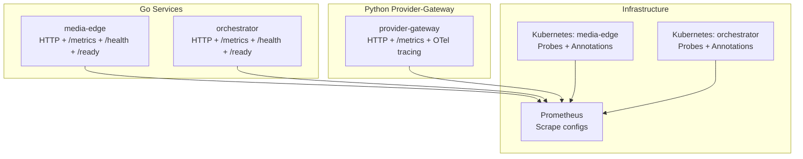
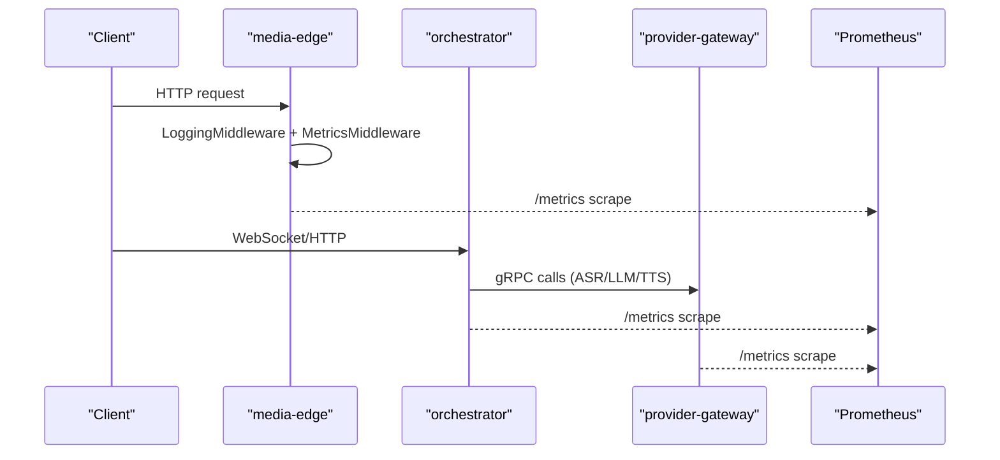
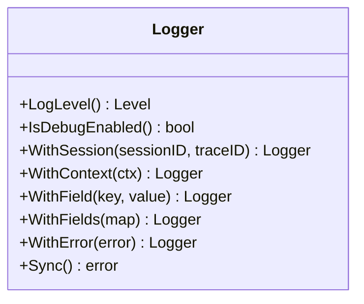
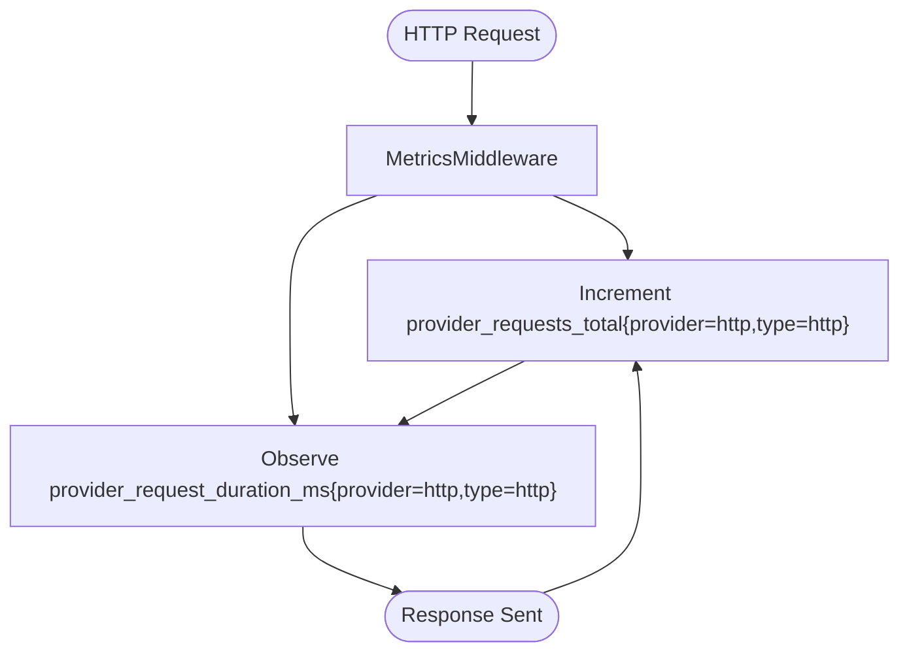
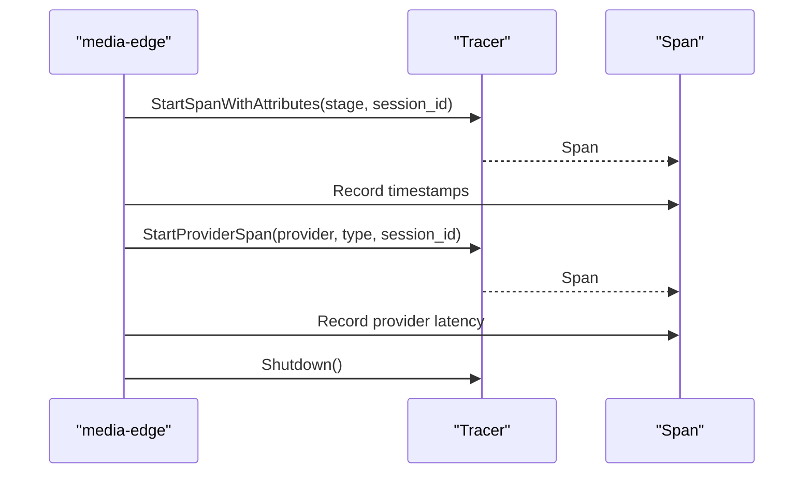
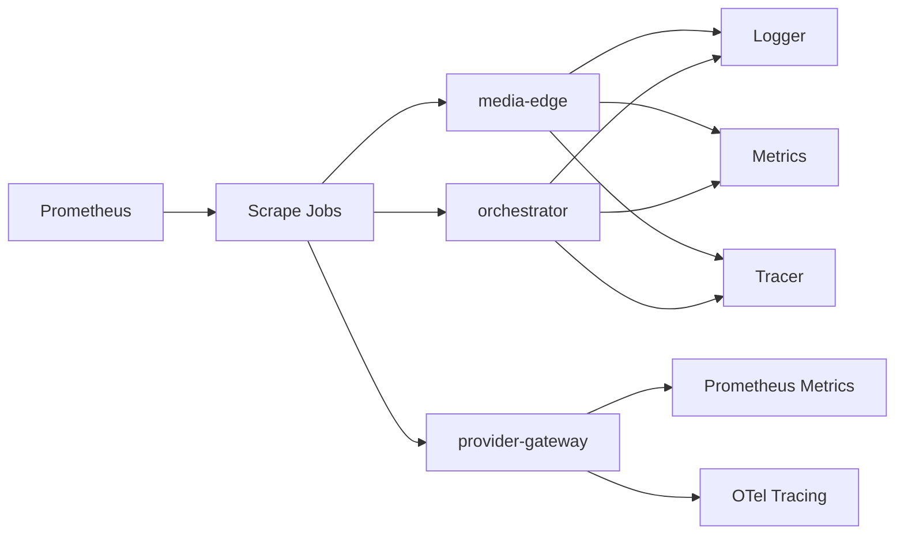

# Observability & Monitoring

<cite>
**Referenced Files in This Document**
- [logger.go](file://go/pkg/observability/logger.go)
- [metrics.go](file://go/pkg/observability/metrics.go)
- [tracing.go](file://go/pkg/observability/tracing.go)
- [config.go](file://go/pkg/config/config.go)
- [main.go (media-edge)](file://go/media-edge/cmd/main.go)
- [main.go (orchestrator)](file://go/orchestrator/cmd/main.go)
- [middleware.go](file://go/media-edge/internal/handler/middleware.go)
- [prometheus.yml](file://infra/prometheus/prometheus.yml)
- [logging.py](file://py/provider_gateway/app/telemetry/logging.py)
- [metrics.py](file://py/provider_gateway/app/telemetry/metrics.py)
- [tracing.py](file://py/provider_gateway/app/telemetry/tracing.py)
- [media-edge.yaml](file://infra/k8s/media-edge.yaml)
- [orchestrator.yaml](file://infra/k8s/orchestrator.yaml)
- [config-local.yaml](file://examples/config-local.yaml)
</cite>

## Table of Contents
1. [Introduction](#introduction)
2. [Project Structure](#project-structure)
3. [Core Components](#core-components)
4. [Architecture Overview](#architecture-overview)
5. [Detailed Component Analysis](#detailed-component-analysis)
6. [Dependency Analysis](#dependency-analysis)
7. [Performance Considerations](#performance-considerations)
8. [Troubleshooting Guide](#troubleshooting-guide)
9. [Conclusion](#conclusion)
10. [Appendices](#appendices)

## Introduction
This document describes CloudApp’s observability and monitoring system with a focus on structured logging, metrics collection, and distributed tracing. It explains how logs are configured and enriched, how Prometheus metrics are instrumented and exposed, how OpenTelemetry tracing integrates across services, and how health/readiness endpoints, dashboards, and alerts can be set up. It also provides practical guidance for interpreting metrics, configuring observability, and troubleshooting using observability data in production.

## Project Structure
CloudApp’s observability spans three layers:
- Go services (media-edge and orchestrator) expose HTTP endpoints, structured logs, Prometheus metrics, and optional OpenTelemetry tracing.
- Python provider-gateway implements its own structured logging, Prometheus metrics, and OpenTelemetry tracing.
- Infrastructure defines Prometheus scraping and Kubernetes probes for health/readiness.

**Diagram sources**
- [main.go (media-edge):100-126](file://go/media-edge/cmd/main.go#L100-L126)
- [main.go (orchestrator):125-148](file://go/orchestrator/cmd/main.go#L125-L148)
- [prometheus.yml:19-60](file://infra/prometheus/prometheus.yml#L19-L60)
- [media-edge.yaml:24-72](file://infra/k8s/media-edge.yaml#L24-L72)
- [orchestrator.yaml:24-74](file://infra/k8s/orchestrator.yaml#L24-L74)

**Section sources**
- [main.go (media-edge):100-126](file://go/media-edge/cmd/main.go#L100-L126)
- [main.go (orchestrator):125-148](file://go/orchestrator/cmd/main.go#L125-L148)
- [prometheus.yml:19-60](file://infra/prometheus/prometheus.yml#L19-L60)
- [media-edge.yaml:24-72](file://infra/k8s/media-edge.yaml#L24-L72)
- [orchestrator.yaml:24-74](file://infra/k8s/orchestrator.yaml#L24-L74)

## Core Components
- Structured logging: Production-grade JSON logs with ISO time and caller stack traces; development console logs with colorized levels. Context enrichment supports session_id, trace_id, and tenant_id.
- Metrics: Prometheus counters and histograms for sessions, turns, latency, interruptions, provider requests/errors/durations, and WebSocket connections.
- Tracing: OpenTelemetry TracerProvider and spans for pipeline stages and provider calls; optional Prometheus metrics exporter for OTel metrics.

**Section sources**
- [logger.go:25-83](file://go/pkg/observability/logger.go#L25-L83)
- [logger.go:85-123](file://go/pkg/observability/logger.go#L85-L123)
- [metrics.go:10-82](file://go/pkg/observability/metrics.go#L10-L82)
- [metrics.go:84-147](file://go/pkg/observability/metrics.go#L84-L147)
- [tracing.go:34-63](file://go/pkg/observability/tracing.go#L34-L63)
- [tracing.go:327-344](file://go/pkg/observability/tracing.go#L327-L344)

## Architecture Overview
The observability architecture combines per-service instrumentation with centralized metrics scraping and optional tracing export.

**Diagram sources**
- [main.go (media-edge):123-136](file://go/media-edge/cmd/main.go#L123-L136)
- [main.go (orchestrator):147-156](file://go/orchestrator/cmd/main.go#L147-L156)
- [prometheus.yml:19-60](file://infra/prometheus/prometheus.yml#L19-L60)
- [middleware.go:78-94](file://go/media-edge/internal/handler/middleware.go#L78-L94)

## Detailed Component Analysis

### Structured Logging
- Configuration: log level, format (json/console), and output path. Defaults are production-safe with ISO timestamps and stack traces on error.
- Context enrichment: attach session_id, trace_id, tenant_id from context; also support arbitrary fields and errors.
- Usage: services construct a logger from configuration and pass it to handlers and middleware; middleware logs requests and captures panics.

**Diagram sources**
- [logger.go:13-168](file://go/pkg/observability/logger.go#L13-L168)

**Section sources**
- [logger.go:25-83](file://go/pkg/observability/logger.go#L25-L83)
- [logger.go:85-123](file://go/pkg/observability/logger.go#L85-L123)
- [main.go (media-edge):40-49](file://go/media-edge/cmd/main.go#L40-L49)
- [middleware.go:27-52](file://go/media-edge/internal/handler/middleware.go#L27-L52)

### Metrics Collection (Prometheus)
- Exposed via /metrics on each service.
- Instrumentation includes:
  - Gauges: active sessions, WebSocket connections
  - Counters: total turns, provider errors, provider requests
  - Histograms: ASR latency, LLM TTFT, TTS first chunk, server TTFA, interruption stop
- Metrics are recorded in middleware for HTTP traffic and throughout pipeline stages.

**Diagram sources**
- [middleware.go:78-94](file://go/media-edge/internal/handler/middleware.go#L78-L94)
- [metrics.go:84-147](file://go/pkg/observability/metrics.go#L84-L147)

**Section sources**
- [main.go (media-edge):123-126](file://go/media-edge/cmd/main.go#L123-L126)
- [main.go (orchestrator):147-148](file://go/orchestrator/cmd/main.go#L147-L148)
- [metrics.go:10-82](file://go/pkg/observability/metrics.go#L10-L82)
- [metrics.go:84-147](file://go/pkg/observability/metrics.go#L84-L147)
- [middleware.go:78-94](file://go/media-edge/internal/handler/middleware.go#L78-L94)

### Distributed Tracing (OpenTelemetry)
- Tracer initialization with service name/version and optional OTLP endpoint.
- Spans:
  - Pipeline spans per stage (VAD, ASR, LLM, TTS, media_edge, orchestrator)
  - Provider spans with provider and provider_type attributes
- Timestamp tracking utilities enable latency calculations across pipeline events.

**Diagram sources**
- [tracing.go:34-63](file://go/pkg/observability/tracing.go#L34-L63)
- [tracing.go:327-344](file://go/pkg/observability/tracing.go#L327-L344)
- [tracing.go:200-307](file://go/pkg/observability/tracing.go#L200-L307)

**Section sources**
- [tracing.go:19-63](file://go/pkg/observability/tracing.go#L19-L63)
- [tracing.go:107-183](file://go/pkg/observability/tracing.go#L107-L183)
- [tracing.go:200-307](file://go/pkg/observability/tracing.go#L200-L307)
- [tracing.go:327-344](file://go/pkg/observability/tracing.go#L327-L344)

### Health and Readiness Endpoints
- Both media-edge and orchestrator expose:
  - /health: basic health status
  - /ready: readiness with dependency checks (e.g., Redis for orchestrator)
- Kubernetes manifests define liveness and readiness probes pointing to these endpoints.

**Section sources**
- [main.go (media-edge):99-121](file://go/media-edge/cmd/main.go#L99-L121)
- [main.go (orchestrator):125-145](file://go/orchestrator/cmd/main.go#L125-L145)
- [media-edge.yaml:57-72](file://infra/k8s/media-edge.yaml#L57-L72)
- [orchestrator.yaml:59-74](file://infra/k8s/orchestrator.yaml#L59-L74)

### Python Provider-Gateway Observability
- Structured logging: JSON formatter with timestamp, level, source location, and extras.
- Metrics: provider_requests_total, provider_request_duration_seconds, provider_errors_total.
- Tracing: OTel TracerProvider with optional OTLP exporter; context manager for spans and helpers to set attributes/events.

**Section sources**
- [logging.py:35-86](file://py/provider_gateway/app/telemetry/logging.py#L35-L86)
- [metrics.py:7-27](file://py/provider_gateway/app/telemetry/metrics.py#L7-L27)
- [metrics.py:32-83](file://py/provider_gateway/app/telemetry/metrics.py#L32-L83)
- [tracing.py:17-51](file://py/provider_gateway/app/telemetry/tracing.py#L17-L51)
- [tracing.py:91-129](file://py/provider_gateway/app/telemetry/tracing.py#L91-L129)

## Dependency Analysis
- Services depend on the observability package for logging, metrics, and tracing.
- Prometheus scrapes services and the provider-gateway via static_configs.
- Kubernetes annotations enable Prometheus discovery.

**Diagram sources**
- [metrics.go:204-213](file://go/pkg/observability/metrics.go#L204-L213)
- [prometheus.yml:19-60](file://infra/prometheus/prometheus.yml#L19-L60)
- [media-edge.yaml:24-27](file://infra/k8s/media-edge.yaml#L24-L27)
- [orchestrator.yaml:24-27](file://infra/k8s/orchestrator.yaml#L24-L27)

**Section sources**
- [metrics.go:204-213](file://go/pkg/observability/metrics.go#L204-L213)
- [prometheus.yml:19-60](file://infra/prometheus/prometheus.yml#L19-L60)
- [media-edge.yaml:24-27](file://infra/k8s/media-edge.yaml#L24-L27)
- [orchestrator.yaml:24-27](file://infra/k8s/orchestrator.yaml#L24-L27)

## Performance Considerations
- Use histograms for latency metrics to capture tail behavior (e.g., ASR latency, LLM TTFT, TTS first chunk).
- Prefer counters for error rates and request volumes to compute SLIs/SLOs.
- Keep trace sampling reasonable in production; enable OTLP exporter only when needed.
- Ensure Prometheus scrape intervals align with workload frequency to avoid over/under-counting.

[No sources needed since this section provides general guidance]

## Troubleshooting Guide
- Logs
  - Verify log level and format in configuration; switch to console during local debugging.
  - Enrich logs with session_id and trace_id to correlate with traces.
- Metrics
  - Confirm /metrics endpoint is reachable and Prometheus scrape targets are healthy.
  - Use histograms to detect regressions in latency; monitor provider error counters.
- Tracing
  - Ensure tracer is enabled and OTLP endpoint is configured when exporting spans.
  - Use pipeline timestamp trackers to compute stage latencies and identify bottlenecks.
- Health/Readiness
  - Investigate failing readiness checks (e.g., Redis connectivity) before scaling traffic.
  - Review Kubernetes probe thresholds and intervals.

**Section sources**
- [config.go:77-85](file://go/pkg/config/config.go#L77-L85)
- [main.go (media-edge):99-121](file://go/media-edge/cmd/main.go#L99-L121)
- [main.go (orchestrator):125-145](file://go/orchestrator/cmd/main.go#L125-L145)
- [tracing.go:200-307](file://go/pkg/observability/tracing.go#L200-L307)

## Conclusion
CloudApp’s observability stack provides a solid foundation for production monitoring: structured logs for operational visibility, comprehensive Prometheus metrics for performance and reliability, and OpenTelemetry tracing for distributed diagnostics. Combined with health/readiness endpoints and Kubernetes probes, operators can build robust dashboards and alerts to maintain service quality.

[No sources needed since this section summarizes without analyzing specific files]

## Appendices

### Observability Configuration Examples
- Go service configuration keys for observability include log level/format, metrics port, OTLP endpoint, and toggles for tracing and metrics.
- Example local configuration demonstrates enabling debug logs and setting metrics port.

**Section sources**
- [config.go:77-85](file://go/pkg/config/config.go#L77-L85)
- [config-local.yaml:31-38](file://examples/config-local.yaml#L31-L38)

### Monitoring Dashboard Setup
- Prometheus scrape jobs for media-edge, orchestrator, and provider-gateway are defined in the Prometheus configuration.
- Kubernetes manifests annotate services for Prometheus discovery and define liveness/readiness probes.

**Section sources**
- [prometheus.yml:19-60](file://infra/prometheus/prometheus.yml#L19-L60)
- [media-edge.yaml:24-27](file://infra/k8s/media-edge.yaml#L24-L27)
- [orchestrator.yaml:24-27](file://infra/k8s/orchestrator.yaml#L24-L27)

### Alerting Strategies
- Suggested alerting rules (conceptual):
  - High error rates: sum(rate(provider_errors_total[5m])) by (provider, type) > threshold
  - Latency SLO breaches: histogram_quantile(0.95, sum by(le, provider, type) (rate(provider_request_duration_seconds_bucket[5m]))) > SLI_target
  - Unhealthy instances: up == 0 for media-edge/orchestrator/provider-gateway
  - Readiness failures: readiness probe failures over rolling window
- These rules should be tuned to your environment and SLOs.

[No sources needed since this section provides general guidance]