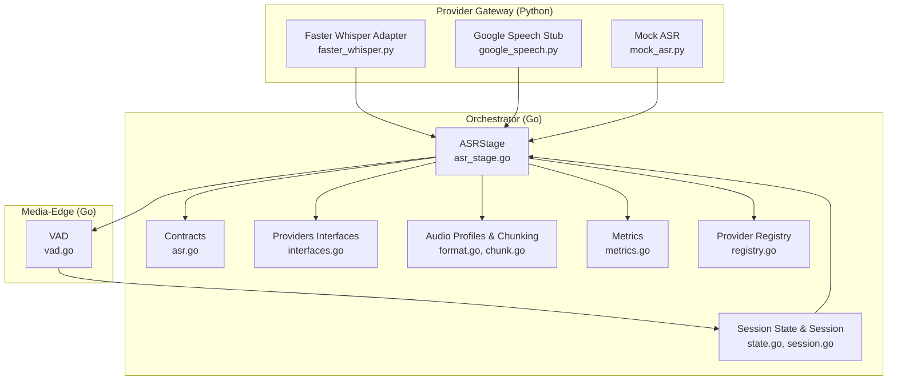
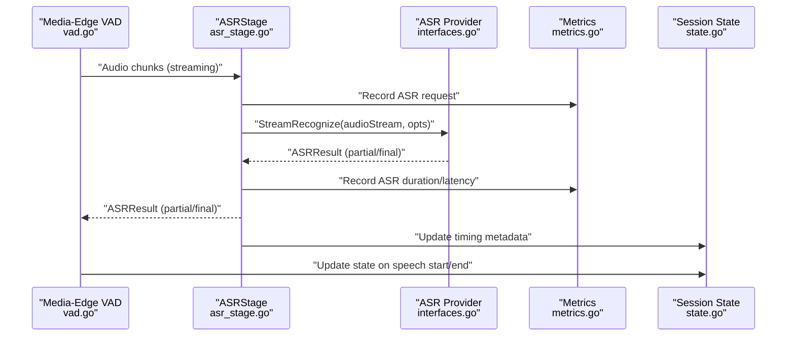
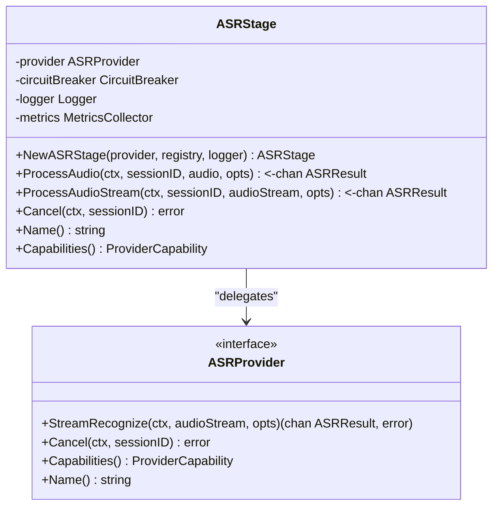
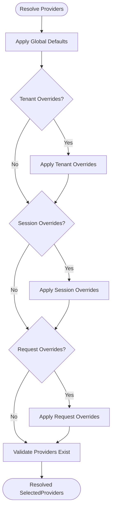
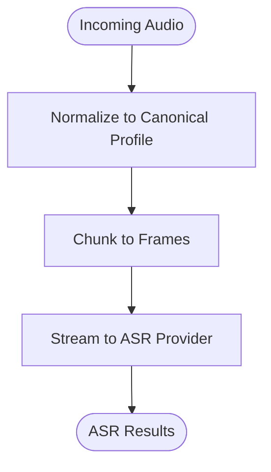
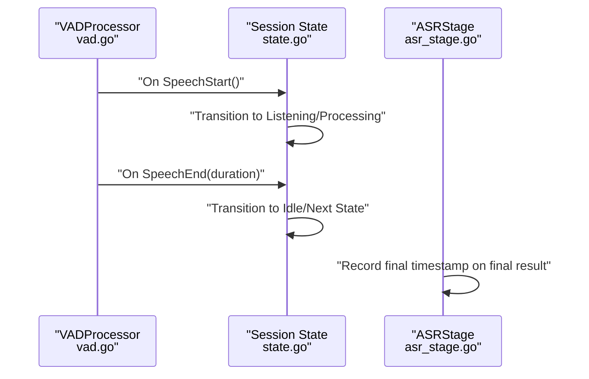
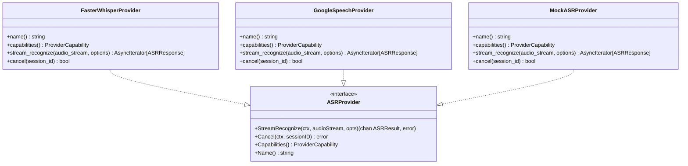
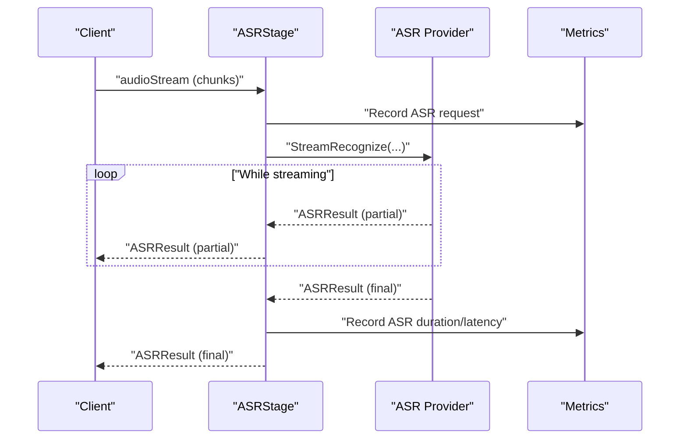
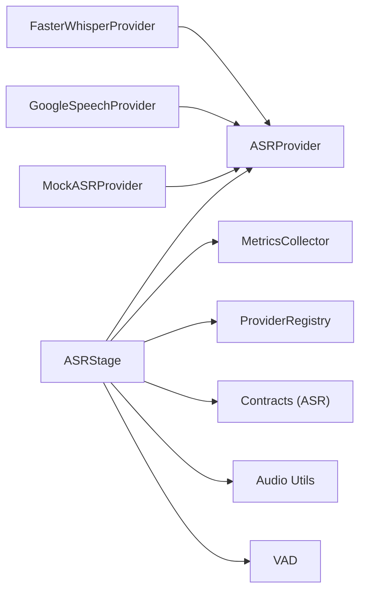

# ASR Stage

<cite>
**Referenced Files in This Document**
- [asr_stage.go](file://go/orchestrator/internal/pipeline/asr_stage.go)
- [interfaces.go](file://go/pkg/providers/interfaces.go)
- [asr.go](file://go/pkg/contracts/asr.go)
- [format.go](file://go/pkg/audio/format.go)
- [chunk.go](file://go/pkg/audio/chunk.go)
- [metrics.go](file://go/pkg/observability/metrics.go)
- [registry.go](file://go/pkg/providers/registry.go)
- [state.go](file://go/pkg/session/state.go)
- [session.go](file://go/pkg/session/session.go)
- [vad.go](file://go/media-edge/internal/vad/vad.go)
- [faster_whisper.py](file://py/provider_gateway/app/providers/asr/faster_whisper.py)
- [google_speech.py](file://py/provider_gateway/app/providers/asr/google_speech.py)
- [mock_asr.py](file://py/provider_gateway/app/providers/asr/mock_asr.py)
- [config-cloud.yaml](file://examples/config-cloud.yaml)
</cite>

## Table of Contents
1. [Introduction](#introduction)
2. [Project Structure](#project-structure)
3. [Core Components](#core-components)
4. [Architecture Overview](#architecture-overview)
5. [Detailed Component Analysis](#detailed-component-analysis)
6. [Dependency Analysis](#dependency-analysis)
7. [Performance Considerations](#performance-considerations)
8. [Troubleshooting Guide](#troubleshooting-guide)
9. [Conclusion](#conclusion)
10. [Appendices](#appendices)

## Introduction
This document explains the Automatic Speech Recognition (ASR) stage in CloudApp’s orchestration pipeline. It covers how the ASR stage converts incoming audio streams into text, including real-time transcription, VAD integration, audio preprocessing, provider selection, and result formatting. It also documents speech start/end detection, partial transcript handling, confidence scoring, provider-specific configurations, fallback mechanisms, error recovery, and downstream integration with LLM processing.

## Project Structure
The ASR stage is implemented in the Go orchestrator and integrates with provider implementations in the Python provider gateway. Supporting libraries handle audio profiles, chunking, metrics, and session state. VAD logic resides in the media-edge service.

**Diagram sources**
- [asr_stage.go:1-313](file://go/orchestrator/internal/pipeline/asr_stage.go#L1-L313)
- [interfaces.go:1-107](file://go/pkg/providers/interfaces.go#L1-L107)
- [asr.go:1-35](file://go/pkg/contracts/asr.go#L1-L35)
- [format.go:1-140](file://go/pkg/audio/format.go#L1-L140)
- [chunk.go:1-230](file://go/pkg/audio/chunk.go#L1-L230)
- [metrics.go:1-214](file://go/pkg/observability/metrics.go#L1-L214)
- [registry.go:1-262](file://go/pkg/providers/registry.go#L1-L262)
- [state.go:1-153](file://go/pkg/session/state.go#L1-L153)
- [session.go:1-249](file://go/pkg/session/session.go#L1-L249)
- [vad.go:1-373](file://go/media-edge/internal/vad/vad.go#L1-L373)
- [faster_whisper.py:1-262](file://py/provider_gateway/app/providers/asr/faster_whisper.py#L1-L262)
- [google_speech.py:1-108](file://py/provider_gateway/app/providers/asr/google_speech.py#L1-L108)
- [mock_asr.py:1-221](file://py/provider_gateway/app/providers/asr/mock_asr.py#L1-L221)

**Section sources**
- [asr_stage.go:1-313](file://go/orchestrator/internal/pipeline/asr_stage.go#L1-L313)
- [interfaces.go:1-107](file://go/pkg/providers/interfaces.go#L1-L107)
- [asr.go:1-35](file://go/pkg/contracts/asr.go#L1-L35)
- [format.go:1-140](file://go/pkg/audio/format.go#L1-L140)
- [chunk.go:1-230](file://go/pkg/audio/chunk.go#L1-L230)
- [metrics.go:1-214](file://go/pkg/observability/metrics.go#L1-L214)
- [registry.go:1-262](file://go/pkg/providers/registry.go#L1-L262)
- [state.go:1-153](file://go/pkg/session/state.go#L1-L153)
- [session.go:1-249](file://go/pkg/session/session.go#L1-L249)
- [vad.go:1-373](file://go/media-edge/internal/vad/vad.go#L1-L373)
- [faster_whisper.py:1-262](file://py/provider_gateway/app/providers/asr/faster_whisper.py#L1-L262)
- [google_speech.py:1-108](file://py/provider_gateway/app/providers/asr/google_speech.py#L1-L108)
- [mock_asr.py:1-221](file://py/provider_gateway/app/providers/asr/mock_asr.py#L1-L221)

## Core Components
- ASRStage: Orchestrates provider invocation, channels, timing, and metrics; exposes ProcessAudio and ProcessAudioStream for batch and streaming inputs; supports cancellation and capability queries.
- Providers: ASRProvider interface defines StreamRecognize, Cancel, Capabilities, and Name; concrete providers include Faster Whisper, Google Speech (stub), and Mock.
- Contracts: Define ASRRequest/ASRResponse, word timestamps, and timing metadata.
- Audio Pipeline: Canonical internal profile (16 kHz, mono, PCM16), chunking utilities, and conversions.
- Observability: Metrics collection and latency recording for ASR.
- Provider Registry: Resolves provider names to instances with tenant/global overrides.
- Session State: Manages session lifecycle and state transitions.
- VAD: Energy-based detectors and processors for speech start/end detection.

**Section sources**
- [asr_stage.go:25-313](file://go/orchestrator/internal/pipeline/asr_stage.go#L25-L313)
- [interfaces.go:21-35](file://go/pkg/providers/interfaces.go#L21-L35)
- [asr.go:3-29](file://go/pkg/contracts/asr.go#L3-L29)
- [format.go:65-121](file://go/pkg/audio/format.go#L65-L121)
- [chunk.go:7-101](file://go/pkg/audio/chunk.go#L7-L101)
- [metrics.go:149-214](file://go/pkg/observability/metrics.go#L149-L214)
- [registry.go:172-251](file://go/pkg/providers/registry.go#L172-L251)
- [state.go:8-76](file://go/pkg/session/state.go#L8-L76)
- [session.go:62-84](file://go/pkg/session/session.go#L62-L84)
- [vad.go:10-44](file://go/media-edge/internal/vad/vad.go#L10-L44)

## Architecture Overview
The ASR stage sits between the media-edge VAD and the downstream LLM stage. It receives either a single audio blob or a continuous audio stream, forwards it to the selected ASR provider, and emits partial and final transcripts. It records timing and latency, handles provider errors, and integrates with the provider registry and session state.

**Diagram sources**
- [vad.go:321-345](file://go/media-edge/internal/vad/vad.go#L321-L345)
- [asr_stage.go:47-162](file://go/orchestrator/internal/pipeline/asr_stage.go#L47-L162)
- [interfaces.go:21-35](file://go/pkg/providers/interfaces.go#L21-L35)
- [metrics.go:99-137](file://go/pkg/observability/metrics.go#L99-L137)
- [state.go:81-118](file://go/pkg/session/state.go#L81-L118)

## Detailed Component Analysis

### ASRStage Implementation
- Responsibilities:
  - Wrap an ASRProvider with circuit breaker and metrics.
  - Accept a single audio blob or a continuous stream.
  - Emit partial transcripts as they arrive; stop on final transcript.
  - Record timing and latency; propagate provider errors.
  - Support cancellation via provider interface.
- Key behaviors:
  - Uses a TimestampTracker to mark start and finalization points.
  - Emits results into a bounded channel; respects context cancellation.
  - Records ASR request counts, durations, and latency on finalization.

**Diagram sources**
- [asr_stage.go:25-313](file://go/orchestrator/internal/pipeline/asr_stage.go#L25-L313)
- [interfaces.go:21-35](file://go/pkg/providers/interfaces.go#L21-L35)

**Section sources**
- [asr_stage.go:25-313](file://go/orchestrator/internal/pipeline/asr_stage.go#L25-L313)

### Provider Selection and Resolution
- ProviderRegistry resolves provider names for a session with priority: request overrides > session overrides > tenant overrides > global defaults.
- Validates that named providers exist before returning selections.
- Used by higher-level orchestration to select ASR provider for a session.

**Diagram sources**
- [registry.go:172-251](file://go/pkg/providers/registry.go#L172-L251)

**Section sources**
- [registry.go:172-251](file://go/pkg/providers/registry.go#L172-L251)

### Audio Preprocessing Pipeline
- Canonical internal profile: 16 kHz, mono, PCM16, 10 ms frames.
- Utilities:
  - AudioProfile and conversions to/from contracts.
  - Chunker and FrameChunker for fixed-size frame emission.
  - Reassembler for out-of-order chunk assembly.
- Typical flow:
  - Normalize incoming audio to canonical profile.
  - Chunk into frames matching provider codec and sample rate.
  - Stream frames to provider.

**Diagram sources**
- [format.go:65-121](file://go/pkg/audio/format.go#L65-L121)
- [chunk.go:7-101](file://go/pkg/audio/chunk.go#L7-L101)

**Section sources**
- [format.go:65-121](file://go/pkg/audio/format.go#L65-L121)
- [chunk.go:7-101](file://go/pkg/audio/chunk.go#L7-L101)

### VAD Integration and Speech Start/End Detection
- VADProcessor wraps a VADDetector and invokes callbacks on speech start/end.
- Speech start/end flags are part of VADResult and can drive session state transitions.
- ASRStage timing is recorded upon final result; latency is computed from start marker.

**Diagram sources**
- [vad.go:305-345](file://go/media-edge/internal/vad/vad.go#L305-L345)
- [state.go:81-118](file://go/pkg/session/state.go#L81-L118)
- [asr_stage.go:140-145](file://go/orchestrator/internal/pipeline/asr_stage.go#L140-L145)

**Section sources**
- [vad.go:305-345](file://go/media-edge/internal/vad/vad.go#L305-L345)
- [state.go:81-118](file://go/pkg/session/state.go#L81-L118)
- [asr_stage.go:140-145](file://go/orchestrator/internal/pipeline/asr_stage.go#L140-L145)

### Provider Implementations and Capabilities
- Faster Whisper Provider:
  - Streaming input/output, word timestamps, interruptible generation.
  - Preferred sample rates and codecs aligned with canonical profile.
  - Provides confidence and language metadata.
- Google Speech Provider:
  - Capability indicates support for multiple sample rates and codecs.
  - Current implementation is a stub raising NotImplemeted with guidance.
- Mock Provider:
  - Deterministic partial transcripts followed by a final transcript.
  - Generates word timestamps and simulates delays.

**Diagram sources**
- [interfaces.go:21-35](file://go/pkg/providers/interfaces.go#L21-L35)
- [faster_whisper.py:15-102](file://py/provider_gateway/app/providers/asr/faster_whisper.py#L15-L102)
- [google_speech.py:15-107](file://py/provider_gateway/app/providers/asr/google_speech.py#L15-L107)
- [mock_asr.py:16-77](file://py/provider_gateway/app/providers/asr/mock_asr.py#L16-L77)

**Section sources**
- [faster_whisper.py:15-102](file://py/provider_gateway/app/providers/asr/faster_whisper.py#L15-L102)
- [google_speech.py:15-107](file://py/provider_gateway/app/providers/asr/google_speech.py#L15-L107)
- [mock_asr.py:16-77](file://py/provider_gateway/app/providers/asr/mock_asr.py#L16-L77)

### Real-Time Transcription and Partial Transcript Handling
- ProcessAudioStream accepts a continuous audio stream and forwards chunks to the provider.
- ASRStage emits partial results as they arrive and stops on final result.
- Provider implementations (e.g., Mock) demonstrate partial-to-final progression.

**Diagram sources**
- [asr_stage.go:164-290](file://go/orchestrator/internal/pipeline/asr_stage.go#L164-L290)
- [interfaces.go:21-35](file://go/pkg/providers/interfaces.go#L21-L35)
- [metrics.go:99-137](file://go/pkg/observability/metrics.go#L99-L137)

**Section sources**
- [asr_stage.go:164-290](file://go/orchestrator/internal/pipeline/asr_stage.go#L164-L290)

### Confidence Scoring and Result Formatting
- ASRResult includes Transcript, IsPartial, IsFinal, Confidence, Language, and optional WordTimestamps.
- Providers populate confidence and language; ASRStage forwards them unchanged.
- Contracts define ASRResponse with word timestamps and timing metadata.

**Section sources**
- [interfaces.go:10-19](file://go/pkg/providers/interfaces.go#L10-L19)
- [asr.go:19-29](file://go/pkg/contracts/asr.go#L19-L29)

### Provider-Specific Configurations and Examples
- Example configuration demonstrates default provider selection and provider-specific settings (e.g., Google Speech credentials, Groq API key).
- Provider factories and capability declarations are defined in provider implementations.

**Section sources**
- [config-cloud.yaml:12-31](file://examples/config-cloud.yaml#L12-L31)
- [faster_whisper.py:23-48](file://py/provider_gateway/app/providers/asr/faster_whisper.py#L23-L48)
- [google_speech.py:23-41](file://py/provider_gateway/app/providers/asr/google_speech.py#L23-L41)
- [mock_asr.py:43-61](file://py/provider_gateway/app/providers/asr/mock_asr.py#L43-L61)

### Fallback Mechanisms and Error Recovery
- Circuit breaker protects provider calls; on open state, ASRStage returns an error and logs accordingly.
- Provider errors are propagated as ASRResult.Error; ASRStage continues emitting errors until completion.
- Cancellation is delegated to the provider; providers maintain cancellation sets.

**Section sources**
- [asr_stage.go:72-92](file://go/orchestrator/internal/pipeline/asr_stage.go#L72-L92)
- [asr_stage.go:120-128](file://go/orchestrator/internal/pipeline/asr_stage.go#L120-L128)
- [faster_whisper.py:241-253](file://py/provider_gateway/app/providers/asr/faster_whisper.py#L241-L253)
- [mock_asr.py:200-212](file://py/provider_gateway/app/providers/asr/mock_asr.py#L200-L212)

## Dependency Analysis
- ASRStage depends on:
  - ASRProvider interface for streaming recognition.
  - MetricsCollector for instrumentation.
  - ProviderRegistry for provider resolution.
  - Contracts for request/response models.
  - Audio utilities for normalization and chunking.
  - VAD for speech start/end signaling.
- Provider implementations depend on:
  - Base provider classes and capability models.
  - Session context and timing metadata.

**Diagram sources**
- [asr_stage.go:25-45](file://go/orchestrator/internal/pipeline/asr_stage.go#L25-L45)
- [interfaces.go:21-35](file://go/pkg/providers/interfaces.go#L21-L35)
- [registry.go:172-251](file://go/pkg/providers/registry.go#L172-L251)
- [asr.go:3-29](file://go/pkg/contracts/asr.go#L3-L29)
- [format.go:65-121](file://go/pkg/audio/format.go#L65-L121)
- [vad.go:305-345](file://go/media-edge/internal/vad/vad.go#L305-L345)
- [faster_whisper.py:15-102](file://py/provider_gateway/app/providers/asr/faster_whisper.py#L15-L102)
- [google_speech.py:15-107](file://py/provider_gateway/app/providers/asr/google_speech.py#L15-L107)
- [mock_asr.py:16-77](file://py/provider_gateway/app/providers/asr/mock_asr.py#L16-L77)

**Section sources**
- [asr_stage.go:25-45](file://go/orchestrator/internal/pipeline/asr_stage.go#L25-L45)
- [registry.go:172-251](file://go/pkg/providers/registry.go#L172-L251)

## Performance Considerations
- Canonical audio profile (16 kHz, mono, PCM16) reduces transcoding overhead and aligns with provider capabilities.
- Chunker and FrameChunker minimize buffering and enable timely streaming.
- Metrics track ASR latency and request durations; use these to tune provider selection and batching.
- Provider capability checks (preferred sample rates/codecs) reduce misconfiguration and retries.

[No sources needed since this section provides general guidance]

## Troubleshooting Guide
- Provider unavailable:
  - Verify provider name exists and is registered; check ResolveForSession logic.
- Circuit breaker open:
  - Inspect provider error metrics and latency histograms; investigate upstream failures.
- No partial results:
  - Confirm provider supports streaming output and that ProcessAudioStream is used for continuous input.
- Incorrect audio format:
  - Ensure audio is normalized to canonical profile before streaming; validate frame sizes.
- VAD not triggering:
  - Adjust VAD thresholds and hangover frames; verify speech start/end callbacks are wired to session state transitions.

**Section sources**
- [registry.go:172-251](file://go/pkg/providers/registry.go#L172-L251)
- [metrics.go:99-137](file://go/pkg/observability/metrics.go#L99-L137)
- [asr_stage.go:164-290](file://go/orchestrator/internal/pipeline/asr_stage.go#L164-L290)
- [format.go:65-121](file://go/pkg/audio/format.go#L65-L121)
- [vad.go:56-66](file://go/media-edge/internal/vad/vad.go#L56-L66)

## Conclusion
The ASR stage provides a robust, observable, and extensible bridge between audio input and downstream LLM processing. It supports real-time streaming, partial transcripts, and strong integration with VAD and session state. Provider flexibility, capability-aware routing, and comprehensive metrics enable reliable operation across diverse environments.

[No sources needed since this section summarizes without analyzing specific files]

## Appendices

### Provider Capability Reference
- Faster Whisper:
  - Streaming input/output, word timestamps, interruptible generation.
  - Preferred sample rates and supported codecs aligned with canonical profile.
- Google Speech:
  - Capability indicates support for multiple sample rates and codecs.
  - Current implementation is a stub; installation guidance is included.
- Mock:
  - Deterministic partial-to-final transcripts with word timestamps.

**Section sources**
- [faster_whisper.py:92-102](file://py/provider_gateway/app/providers/asr/faster_whisper.py#L92-L102)
- [google_speech.py:47-57](file://py/provider_gateway/app/providers/asr/google_speech.py#L47-L57)
- [mock_asr.py:67-77](file://py/provider_gateway/app/providers/asr/mock_asr.py#L67-L77)

### Example Workflows
- Real-time streaming:
  - Media-Edge captures audio frames, detects speech start/end, forwards frames to ASRStage, which streams to provider and emits partial transcripts until final result.
- Batch processing:
  - Single audio blob is chunked and streamed to provider; final transcript is returned with confidence and language metadata.

**Section sources**
- [asr_stage.go:47-162](file://go/orchestrator/internal/pipeline/asr_stage.go#L47-L162)
- [asr_stage.go:164-290](file://go/orchestrator/internal/pipeline/asr_stage.go#L164-L290)
- [chunk.go:7-101](file://go/pkg/audio/chunk.go#L7-L101)