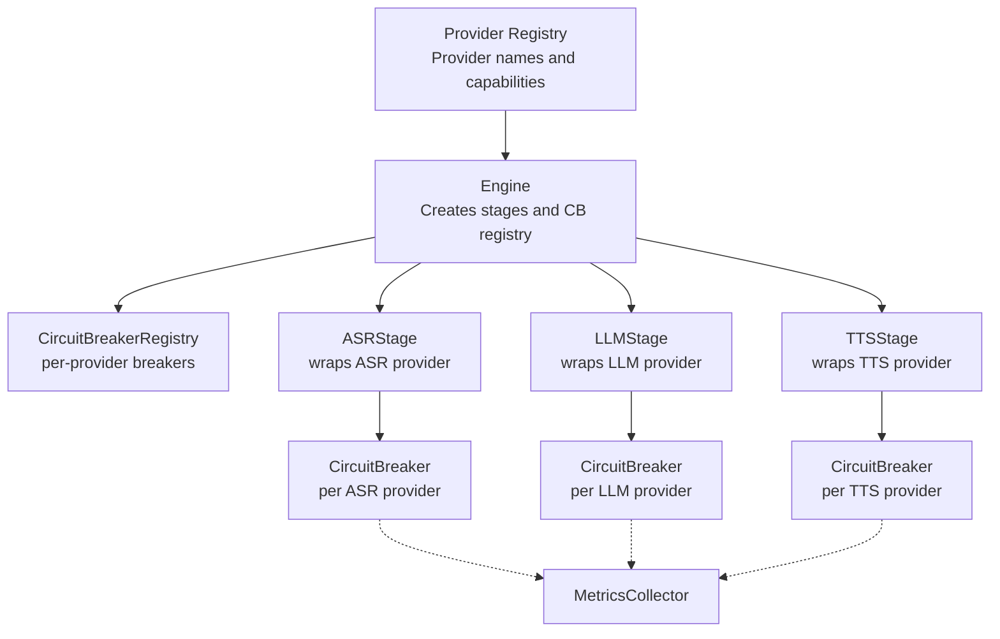
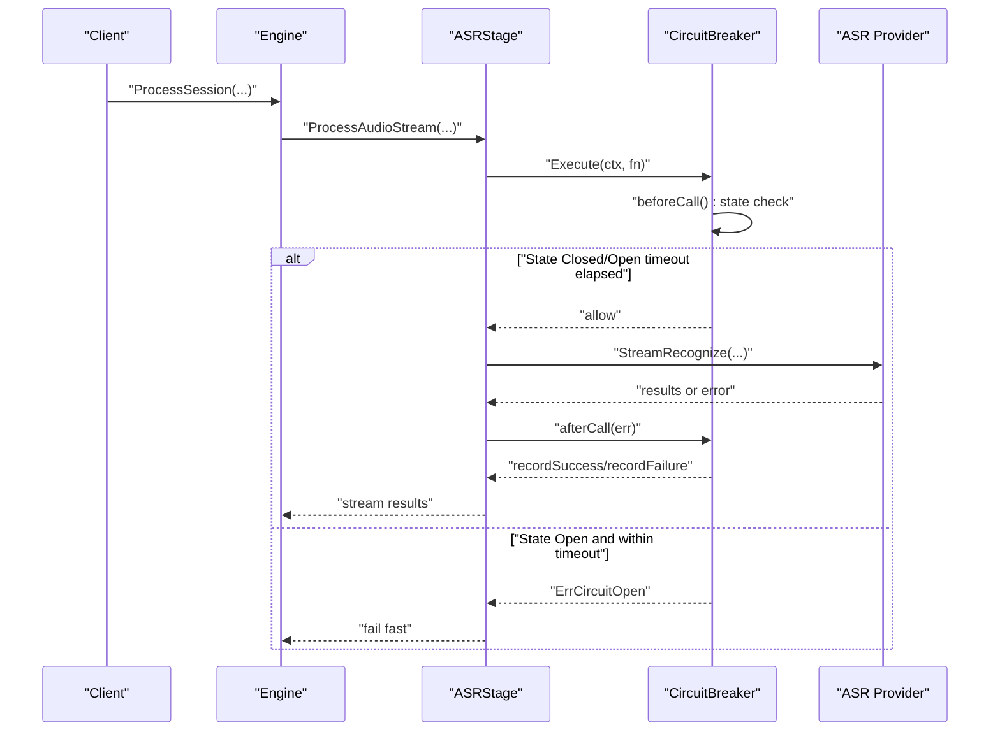
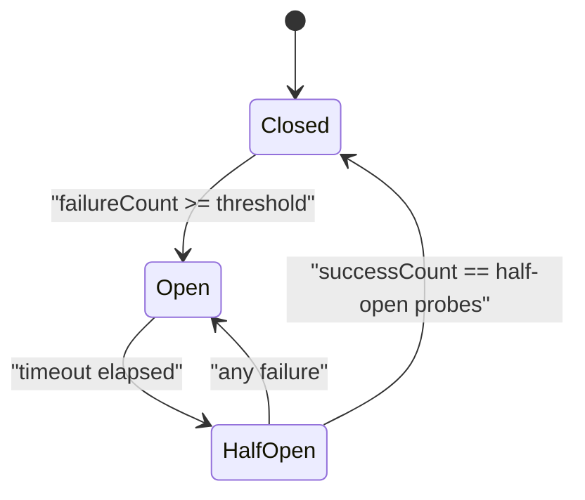
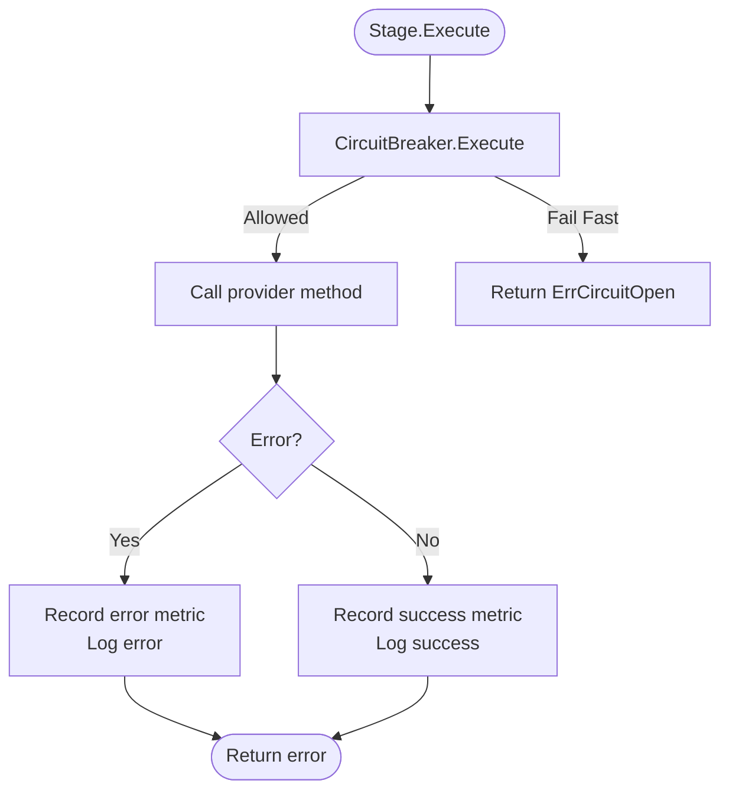
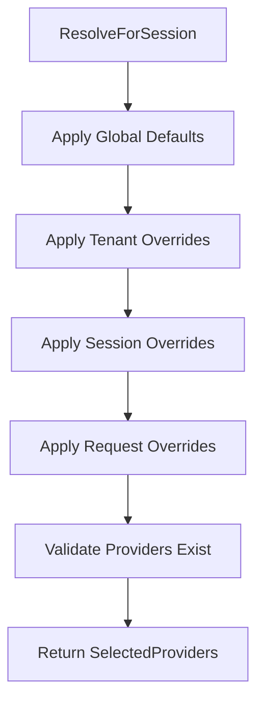
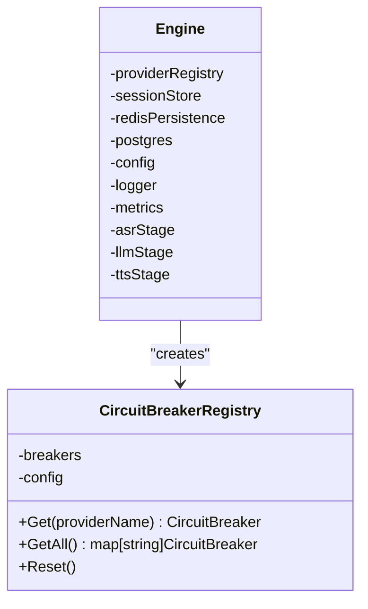
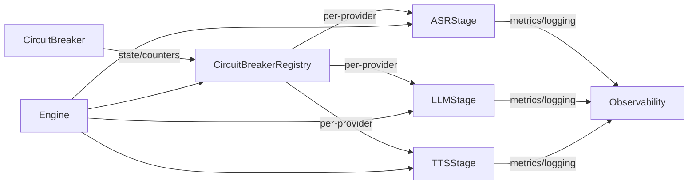

# Circuit Breaker Pattern

<cite>
**Referenced Files in This Document**
- [circuit_breaker.go](file://go/orchestrator/internal/pipeline/circuit_breaker.go)
- [circuit_breaker_test.go](file://go/orchestrator/internal/pipeline/circuit_breaker_test.go)
- [engine.go](file://go/orchestrator/internal/pipeline/engine.go)
- [asr_stage.go](file://go/orchestrator/internal/pipeline/asr_stage.go)
- [llm_stage.go](file://go/orchestrator/internal/pipeline/llm_stage.go)
- [tts_stage.go](file://go/orchestrator/internal/pipeline/tts_stage.go)
- [registry.go](file://go/pkg/providers/registry.go)
- [interfaces.go](file://go/pkg/providers/interfaces.go)
- [options.go](file://go/pkg/providers/options.go)
- [metrics.go](file://go/pkg/observability/metrics.go)
- [logger.go](file://go/pkg/observability/logger.go)
- [session.go](file://go/pkg/session/session.go)
</cite>

## Table of Contents
1. [Introduction](#introduction)
2. [Project Structure](#project-structure)
3. [Core Components](#core-components)
4. [Architecture Overview](#architecture-overview)
5. [Detailed Component Analysis](#detailed-component-analysis)
6. [Dependency Analysis](#dependency-analysis)
7. [Performance Considerations](#performance-considerations)
8. [Troubleshooting Guide](#troubleshooting-guide)
9. [Conclusion](#conclusion)

## Introduction
This document explains the circuit breaker pattern implementation used to improve provider resilience and fault tolerance in CloudApp’s orchestration pipeline. The circuit breaker prevents cascading failures by failing fast when a provider becomes unreliable, allowing the system to recover gracefully. It supports three states—closed, open, and half-open—and integrates with provider stages, metrics, and logging to provide observability and controlled recovery.

## Project Structure
The circuit breaker lives in the orchestrator pipeline and is wired into each stage (ASR, LLM, TTS). A shared registry ensures each provider has its own breaker instance, and the engine composes the stages with a shared configuration.

**Diagram sources**
- [engine.go:83-105](file://go/orchestrator/internal/pipeline/engine.go#L83-L105)
- [circuit_breaker.go:207-234](file://go/orchestrator/internal/pipeline/circuit_breaker.go#L207-L234)
- [asr_stage.go:33-44](file://go/orchestrator/internal/pipeline/asr_stage.go#L33-L44)
- [llm_stage.go:44-55](file://go/orchestrator/internal/pipeline/llm_stage.go#L44-L55)
- [tts_stage.go:27-38](file://go/orchestrator/internal/pipeline/tts_stage.go#L27-L38)
- [registry.go:31-40](file://go/pkg/providers/registry.go#L31-L40)

**Section sources**
- [engine.go:83-105](file://go/orchestrator/internal/pipeline/engine.go#L83-L105)
- [circuit_breaker.go:207-234](file://go/orchestrator/internal/pipeline/circuit_breaker.go#L207-L234)

## Core Components
- CircuitBreaker: Implements state transitions, failure/success accounting, and execution gating.
- CircuitBreakerConfig: Tunable thresholds and timeouts.
- CircuitBreakerRegistry: Per-provider breaker lifecycle and sharing.
- Stage wrappers (ASRStage, LLMStage, TTSStage): Apply Execute around provider calls and record metrics/logging.
- Engine: Composes stages and initializes the registry with shared config.

Key behaviors:
- Closed: Requests pass through; failures increment counters.
- Open: Requests fail fast until timeout elapses; then move to half-open.
- Half-open: Limited probe calls allowed; success transitions back to closed, failure reopens.

**Section sources**
- [circuit_breaker.go:12-178](file://go/orchestrator/internal/pipeline/circuit_breaker.go#L12-L178)
- [circuit_breaker.go:207-256](file://go/orchestrator/internal/pipeline/circuit_breaker.go#L207-L256)
- [asr_stage.go:68-92](file://go/orchestrator/internal/pipeline/asr_stage.go#L68-L92)
- [llm_stage.go:93-118](file://go/orchestrator/internal/pipeline/llm_stage.go#L93-L118)
- [tts_stage.go:63-88](file://go/orchestrator/internal/pipeline/tts_stage.go#L63-L88)
- [engine.go:49-56](file://go/orchestrator/internal/pipeline/engine.go#L49-L56)

## Architecture Overview
The circuit breaker sits inline with each stage’s provider call. On each Execute, the stage checks the breaker and either proceeds or fails fast. Errors are recorded via metrics and logged, while successful calls reset failure counts.

**Diagram sources**
- [asr_stage.go:68-92](file://go/orchestrator/internal/pipeline/asr_stage.go#L68-L92)
- [circuit_breaker.go:82-90](file://go/orchestrator/internal/pipeline/circuit_breaker.go#L82-L90)
- [circuit_breaker.go:92-121](file://go/orchestrator/internal/pipeline/circuit_breaker.go#L92-L121)
- [circuit_breaker.go:123-171](file://go/orchestrator/internal/pipeline/circuit_breaker.go#L123-L171)

**Section sources**
- [asr_stage.go:68-92](file://go/orchestrator/internal/pipeline/asr_stage.go#L68-L92)
- [llm_stage.go:93-118](file://go/orchestrator/internal/pipeline/llm_stage.go#L93-L118)
- [tts_stage.go:63-88](file://go/orchestrator/internal/pipeline/tts_stage.go#L63-L88)
- [circuit_breaker.go:82-171](file://go/orchestrator/internal/pipeline/circuit_breaker.go#L82-L171)

## Detailed Component Analysis

### CircuitBreaker and Registry
- States and transitions:
  - Closed: normal operation; success resets failure count; failure count reaches threshold opens the breaker.
  - Open: fail-fast; after timeout, transitions to half-open and resets counters.
  - Half-open: limited probe calls; success transitions to closed; any failure reopens.
- Concurrency: RWMutex guards state and counters; thread-safe reads/writes.
- Statistics: State, failureCount, successCount exposed for diagnostics.

**Diagram sources**
- [circuit_breaker.go:12-22](file://go/orchestrator/internal/pipeline/circuit_breaker.go#L12-L22)
- [circuit_breaker.go:92-171](file://go/orchestrator/internal/pipeline/circuit_breaker.go#L92-L171)

**Section sources**
- [circuit_breaker.go:57-198](file://go/orchestrator/internal/pipeline/circuit_breaker.go#L57-L198)
- [circuit_breaker.go:207-256](file://go/orchestrator/internal/pipeline/circuit_breaker.go#L207-L256)

### Stage Wrappers and Execution Flow
- ASRStage: Wraps StreamRecognize; tracks timing; emits partial/final results; logs and records metrics on errors.
- LLMStage: Wraps StreamGenerate; tracks dispatch and first-token timing; maintains active generation contexts for cancellation.
- TTSStage: Wraps StreamSynthesize; tracks dispatch and first-chunk timing; supports incremental synthesis.

**Diagram sources**
- [asr_stage.go:68-92](file://go/orchestrator/internal/pipeline/asr_stage.go#L68-L92)
- [llm_stage.go:93-118](file://go/orchestrator/internal/pipeline/llm_stage.go#L93-L118)
- [tts_stage.go:63-88](file://go/orchestrator/internal/pipeline/tts_stage.go#L63-L88)
- [metrics.go:159-202](file://go/pkg/observability/metrics.go#L159-L202)

**Section sources**
- [asr_stage.go:47-162](file://go/orchestrator/internal/pipeline/asr_stage.go#L47-L162)
- [llm_stage.go:58-185](file://go/orchestrator/internal/pipeline/llm_stage.go#L58-L185)
- [tts_stage.go:41-127](file://go/orchestrator/internal/pipeline/tts_stage.go#L41-L127)

### Provider Resolution and Health Monitoring
- ProviderRegistry selects providers per session with precedence: request > session > tenant > global. It validates provider availability and exposes capabilities.
- Health monitoring is implicit through circuit breaker state and metrics; external health endpoints are not implemented in the Go orchestrator.

**Diagram sources**
- [registry.go:172-251](file://go/pkg/providers/registry.go#L172-L251)

**Section sources**
- [registry.go:14-261](file://go/pkg/providers/registry.go#L14-L261)
- [interfaces.go:21-97](file://go/pkg/providers/interfaces.go#L21-L97)
- [options.go:7-187](file://go/pkg/providers/options.go#L7-L187)

### Engine Integration and Configuration
- Engine constructs a CircuitBreakerRegistry from Config.CircuitBreakerConfig and passes it to each stage.
- DefaultConfig sets conservative defaults suitable for production.

**Diagram sources**
- [engine.go:17-106](file://go/orchestrator/internal/pipeline/engine.go#L17-L106)
- [circuit_breaker.go:207-256](file://go/orchestrator/internal/pipeline/circuit_breaker.go#L207-L256)

**Section sources**
- [engine.go:41-106](file://go/orchestrator/internal/pipeline/engine.go#L41-L106)

## Dependency Analysis
- Coupling:
  - Stages depend on CircuitBreakerRegistry for per-provider breakers.
  - CircuitBreakerRegistry depends on CircuitBreakerConfig.
  - Stages depend on observability metrics and logging.
- Cohesion:
  - Circuit breaker encapsulates state and thresholds; stages focus on orchestration and metrics.
- External dependencies:
  - Prometheus metrics are exposed via observability package.
  - Provider interfaces define capabilities and names used by registry and stages.

**Diagram sources**
- [circuit_breaker.go:207-256](file://go/orchestrator/internal/pipeline/circuit_breaker.go#L207-L256)
- [asr_stage.go:33-44](file://go/orchestrator/internal/pipeline/asr_stage.go#L33-L44)
- [llm_stage.go:44-55](file://go/orchestrator/internal/pipeline/llm_stage.go#L44-L55)
- [tts_stage.go:27-38](file://go/orchestrator/internal/pipeline/tts_stage.go#L27-L38)
- [metrics.go:149-213](file://go/pkg/observability/metrics.go#L149-L213)

**Section sources**
- [circuit_breaker.go:207-256](file://go/orchestrator/internal/pipeline/circuit_breaker.go#L207-L256)
- [asr_stage.go:33-44](file://go/orchestrator/internal/pipeline/asr_stage.go#L33-L44)
- [llm_stage.go:44-55](file://go/orchestrator/internal/pipeline/llm_stage.go#L44-L55)
- [tts_stage.go:27-38](file://go/orchestrator/internal/pipeline/tts_stage.go#L27-L38)
- [metrics.go:149-213](file://go/pkg/observability/metrics.go#L149-L213)

## Performance Considerations
- Latency visibility:
  - ASR/LLM/TTS stages record timing and durations; metrics capture provider latencies and first-token/first-chunk timings.
- Throughput:
  - Circuit breaker reduces retries under failure, lowering tail latency and resource contention.
- Backoff-like behavior:
  - Open state with timeout avoids thundering herds; half-open probes allow measured recovery.
- Observability:
  - Metrics and logs help tune thresholds and detect provider degradation early.

[No sources needed since this section provides general guidance]

## Troubleshooting Guide
Common scenarios and indicators:
- Provider outages:
  - Symptom: ErrCircuitOpen returned by stages; metrics show increased provider errors; logs indicate provider failures.
  - Action: Inspect breaker state via Stats; verify provider health; adjust thresholds if needed.
- Recovery delays:
  - Symptom: Extended open state; slow transition to half-open.
  - Action: Lower Timeout or FailureThreshold; monitor half-open probe success rate.
- Cascading failures:
  - Symptom: Rapid spikes in provider errors.
  - Action: Confirm circuit breaker is engaged; reduce load or switch providers; verify fallback strategy.

Operational tips:
- Use Stats to observe failureCount and successCount trends.
- Monitor provider error and duration histograms for regressions.
- Validate provider resolution and capabilities via registry APIs.

**Section sources**
- [circuit_breaker.go:180-189](file://go/orchestrator/internal/pipeline/circuit_breaker.go#L180-L189)
- [metrics.go:124-137](file://go/pkg/observability/metrics.go#L124-L137)
- [registry.go:172-251](file://go/pkg/providers/registry.go#L172-L251)

## Conclusion
The circuit breaker pattern in CloudApp’s pipeline provides robust resilience against provider failures. By failing fast, probing recovery, and exposing rich metrics, it protects downstream components, improves user experience, and enables operational insights. Combined with provider resolution and session orchestration, it forms a reliable foundation for end-to-end voice sessions.