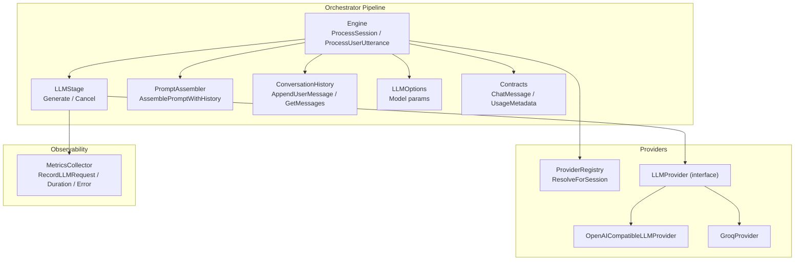
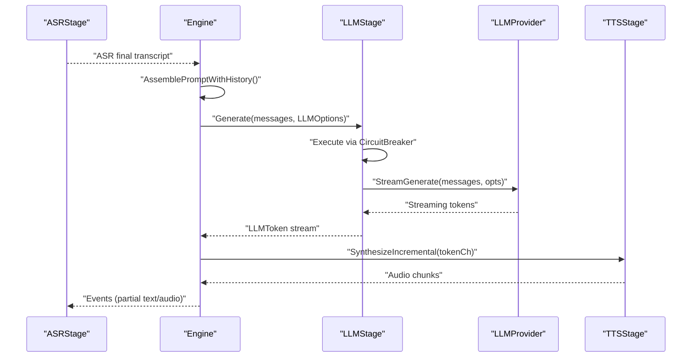
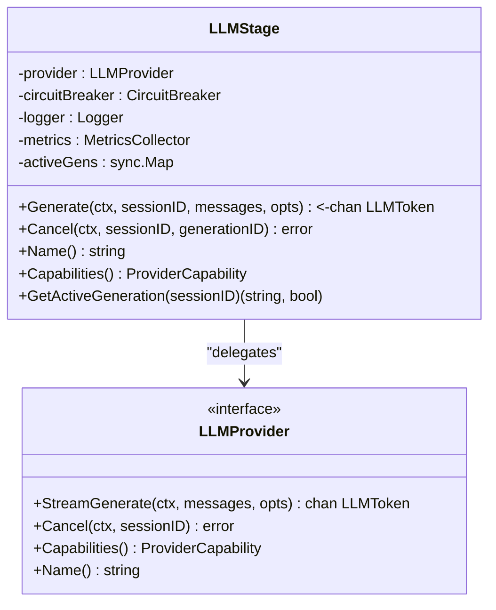
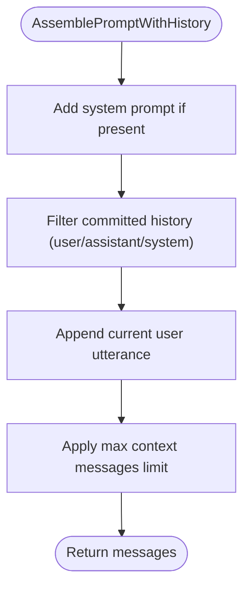
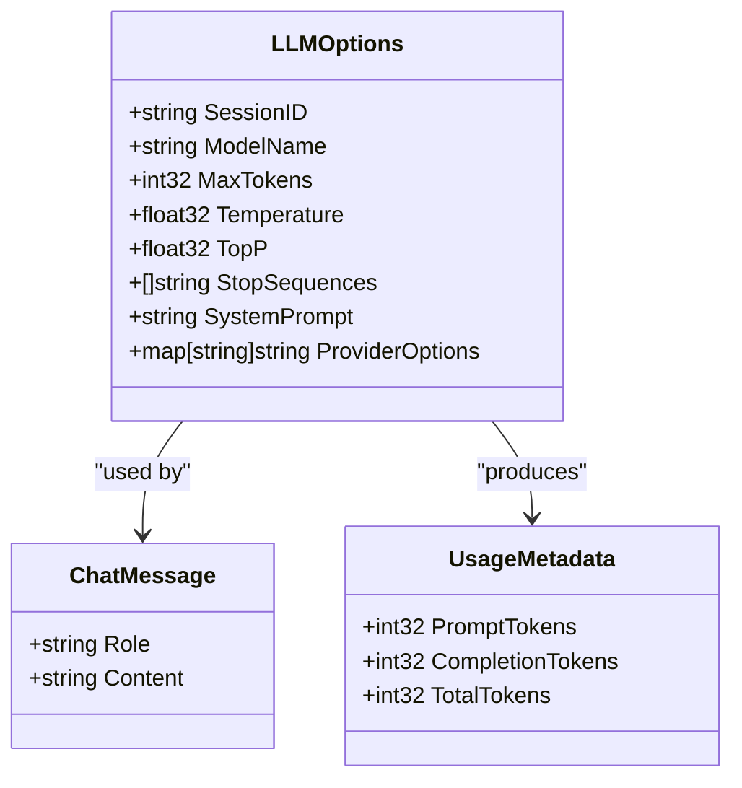
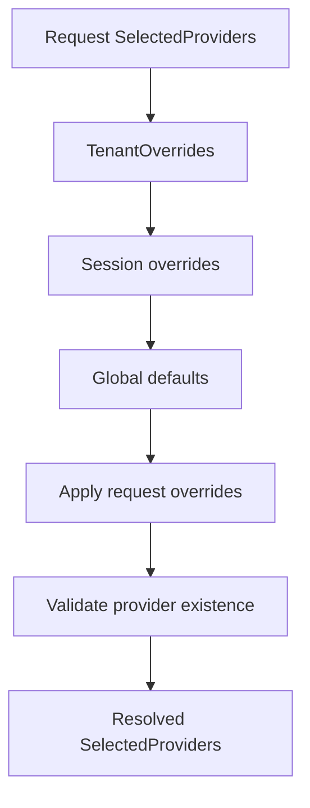
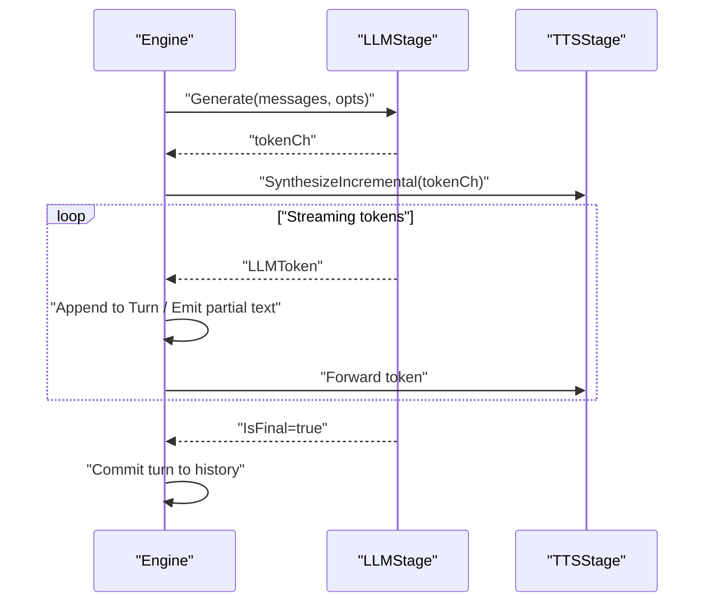
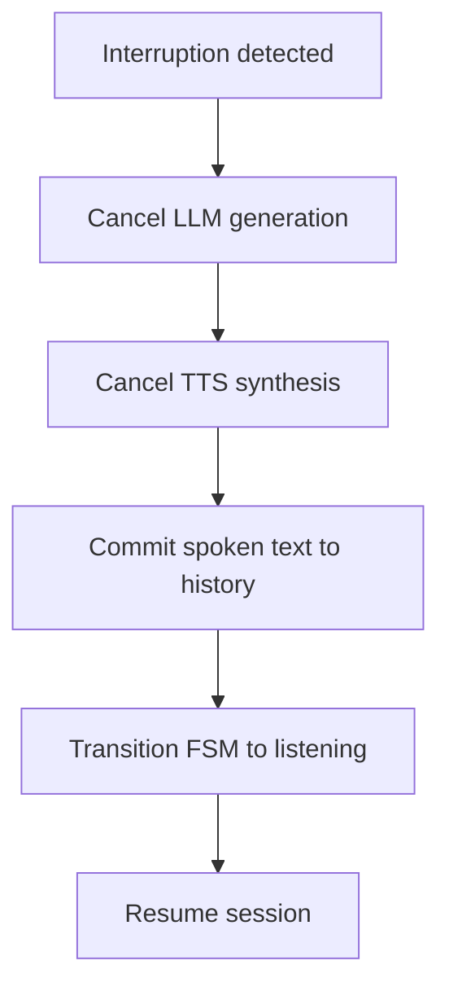
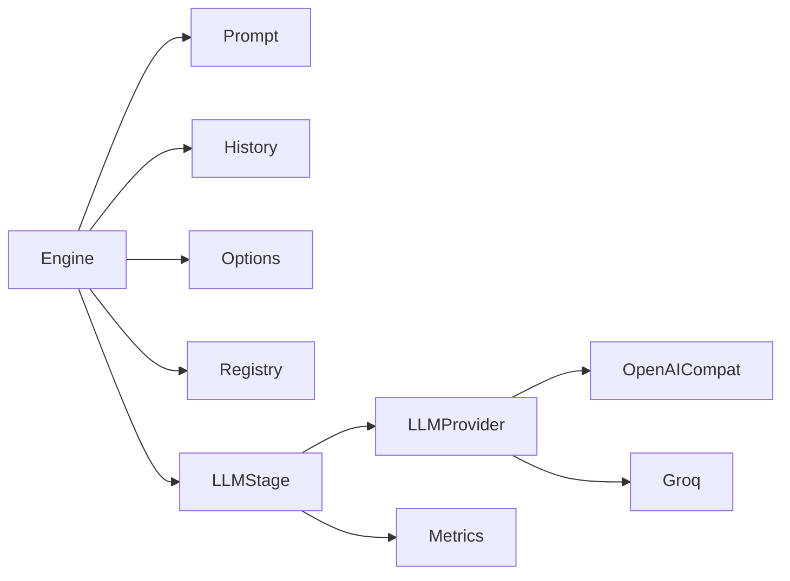

# LLM Stage

<cite>
**Referenced Files in This Document**
- [llm_stage.go](file://go/orchestrator/internal/pipeline/llm_stage.go)
- [prompt.go](file://go/orchestrator/internal/pipeline/prompt.go)
- [engine.go](file://go/orchestrator/internal/pipeline/engine.go)
- [interfaces.go](file://go/pkg/providers/interfaces.go)
- [options.go](file://go/pkg/providers/options.go)
- [llm.go](file://go/pkg/contracts/llm.go)
- [history.go](file://go/pkg/session/history.go)
- [session.go](file://go/pkg/session/session.go)
- [registry.go](file://go/pkg/providers/registry.go)
- [metrics.go](file://go/pkg/observability/metrics.go)
- [config.go](file://go/pkg/config/config.go)
- [config-cloud.yaml](file://examples/config-cloud.yaml)
- [config-local.yaml](file://examples/config-local.yaml)
- [openai_compatible.py](file://py/provider_gateway/app/providers/llm/openai_compatible.py)
- [groq.py](file://py/provider_gateway/app/providers/llm/groq.py)
</cite>

## Table of Contents
1. [Introduction](#introduction)
2. [Project Structure](#project-structure)
3. [Core Components](#core-components)
4. [Architecture Overview](#architecture-overview)
5. [Detailed Component Analysis](#detailed-component-analysis)
6. [Dependency Analysis](#dependency-analysis)
7. [Performance Considerations](#performance-considerations)
8. [Troubleshooting Guide](#troubleshooting-guide)
9. [Conclusion](#conclusion)
10. [Appendices](#appendices)

## Introduction
This document describes the Large Language Model (LLM) stage implementation responsible for natural language understanding and response generation in the voice conversational pipeline. It explains how the stage processes ASR transcripts, manages conversation context, streams tokens to the TTS stage, and integrates with session state and provider selection. It also documents prompt engineering, context management, model parameter configuration, provider selection criteria, and fallback mechanisms.

## Project Structure
The LLM stage lives in the orchestrator pipeline and interacts with provider interfaces, session state, and observability. The provider gateway implements concrete LLM providers that conform to the provider interface.

**Diagram sources**
- [engine.go:108-375](file://go/orchestrator/internal/pipeline/engine.go#L108-L375)
- [llm_stage.go:34-240](file://go/orchestrator/internal/pipeline/llm_stage.go#L34-L240)
- [prompt.go:23-104](file://go/orchestrator/internal/pipeline/prompt.go#L23-L104)
- [history.go:11-233](file://go/pkg/session/history.go#L11-L233)
- [options.go:56-122](file://go/pkg/providers/options.go#L56-L122)
- [interfaces.go:46-60](file://go/pkg/providers/interfaces.go#L46-L60)
- [registry.go:172-251](file://go/pkg/providers/registry.go#L172-L251)
- [metrics.go:149-202](file://go/pkg/observability/metrics.go#L149-L202)

**Section sources**
- [engine.go:108-375](file://go/orchestrator/internal/pipeline/engine.go#L108-L375)
- [llm_stage.go:34-240](file://go/orchestrator/internal/pipeline/llm_stage.go#L34-L240)
- [prompt.go:23-104](file://go/orchestrator/internal/pipeline/prompt.go#L23-L104)
- [history.go:11-233](file://go/pkg/session/history.go#L11-L233)
- [options.go:56-122](file://go/pkg/providers/options.go#L56-L122)
- [interfaces.go:46-60](file://go/pkg/providers/interfaces.go#L46-L60)
- [registry.go:172-251](file://go/pkg/providers/registry.go#L172-L251)
- [metrics.go:149-202](file://go/pkg/observability/metrics.go#L149-L202)

## Core Components
- LLMStage: Wraps an LLM provider with circuit breaker protection, metrics, and cancellation support. Streams tokens back to the caller and coordinates with the TTS stage.
- PromptAssembler: Builds conversation context from session/system prompts and history, respecting a configurable context window.
- Engine: Orchestrates the end-to-end flow from ASR final transcript to LLM generation and TTS synthesis, emitting events and managing timestamps.
- Provider interfaces and options: Define the LLM contract, streaming semantics, and configuration knobs (model, temperature, max tokens, stop sequences).
- Session and history: Persist and manage conversation context, ensuring only spoken text is committed.
- Provider registry: Resolves provider selection per session with tenant and request overrides.

**Section sources**
- [llm_stage.go:34-240](file://go/orchestrator/internal/pipeline/llm_stage.go#L34-L240)
- [prompt.go:8-21](file://go/orchestrator/internal/pipeline/prompt.go#L8-L21)
- [engine.go:17-106](file://go/orchestrator/internal/pipeline/engine.go#L17-L106)
- [interfaces.go:46-60](file://go/pkg/providers/interfaces.go#L46-L60)
- [options.go:56-122](file://go/pkg/providers/options.go#L56-L122)
- [history.go:11-233](file://go/pkg/session/history.go#L11-L233)
- [registry.go:172-251](file://go/pkg/providers/registry.go#L172-L251)

## Architecture Overview
The LLM stage participates in a three-stage pipeline: ASR → LLM → TTS. The Engine coordinates:
- On ASR final transcript, assemble a prompt with system prompt and recent history.
- Configure LLM options from session model settings.
- Start LLM generation and stream tokens to the TTS stage for incremental audio synthesis.
- Track timing and emit events for partial text and audio segments.

**Diagram sources**
- [engine.go:210-375](file://go/orchestrator/internal/pipeline/engine.go#L210-L375)
- [llm_stage.go:58-185](file://go/orchestrator/internal/pipeline/llm_stage.go#L58-L185)
- [interfaces.go:46-60](file://go/pkg/providers/interfaces.go#L46-L60)

## Detailed Component Analysis

### LLMStage: Streaming Generation and Cancellation
- Responsibilities:
  - Wrap provider with circuit breaker and metrics.
  - Generate and stream tokens with timing and usage metadata.
  - Track active generations for per-session cancellation.
  - Convert provider tokens to stage tokens and propagate errors.
- Key behaviors:
  - Generates a unique generation ID per call.
  - Records dispatch and first-token timestamps.
  - Emits finish reason and usage on completion.
  - Cancels both locally and at the provider level.

**Diagram sources**
- [llm_stage.go:34-240](file://go/orchestrator/internal/pipeline/llm_stage.go#L34-L240)
- [interfaces.go:46-60](file://go/pkg/providers/interfaces.go#L46-L60)

**Section sources**
- [llm_stage.go:58-185](file://go/orchestrator/internal/pipeline/llm_stage.go#L58-L185)
- [llm_stage.go:187-211](file://go/orchestrator/internal/pipeline/llm_stage.go#L187-L211)
- [llm_stage.go:223-239](file://go/orchestrator/internal/pipeline/llm_stage.go#L223-L239)

### Prompt Engineering and Context Management
- PromptAssembler builds a message list from:
  - System prompt (if present).
  - Committed conversation history (user/assistant/system).
  - Current user utterance.
  - Applies context window limits while preserving system messages.
- Token counting helpers estimate token usage and trim to a hard token limit when needed.

**Diagram sources**
- [prompt.go:62-104](file://go/orchestrator/internal/pipeline/prompt.go#L62-L104)
- [prompt.go:106-142](file://go/orchestrator/internal/pipeline/prompt.go#L106-L142)

**Section sources**
- [prompt.go:23-104](file://go/orchestrator/internal/pipeline/prompt.go#L23-L104)
- [prompt.go:106-203](file://go/orchestrator/internal/pipeline/prompt.go#L106-L203)

### Model Parameter Configuration and Response Formatting
- LLMOptions define:
  - ModelName, MaxTokens, Temperature, TopP, StopSequences, SystemPrompt.
  - Provider-specific options merged into requests.
- Engine populates LLMOptions from session ModelOptions (model, temperature, max tokens).
- Contracts define ChatMessage and UsageMetadata for token accounting.

**Diagram sources**
- [options.go:56-122](file://go/pkg/providers/options.go#L56-L122)
- [llm.go:3-35](file://go/pkg/contracts/llm.go#L3-L35)

**Section sources**
- [options.go:56-122](file://go/pkg/providers/options.go#L56-L122)
- [engine.go:246-256](file://go/orchestrator/internal/pipeline/engine.go#L246-L256)
- [llm.go:3-35](file://go/pkg/contracts/llm.go#L3-L35)

### Provider Selection Criteria and Model Switching
- ProviderRegistry.ResolveForSession applies priority:
  - Tenant overrides
  - Session overrides
  - Request overrides
  - Global defaults
- Validates provider availability before returning selection.
- Examples show default provider names and per-provider configs.

**Diagram sources**
- [registry.go:172-251](file://go/pkg/providers/registry.go#L172-L251)

**Section sources**
- [registry.go:172-251](file://go/pkg/providers/registry.go#L172-L251)
- [config.go:46-61](file://go/pkg/config/config.go#L46-L61)
- [config-cloud.yaml:12-31](file://examples/config-cloud.yaml#L12-L31)
- [config-local.yaml:12-29](file://examples/config-local.yaml#L12-L29)

### Response Streaming and TTS Coordination
- Engine starts TTS synthesis with an incremental token channel.
- LLM token stream is forwarded to TTS; first token triggers FSM transitions and timing.
- Accumulated text is appended to the active turn and emitted as partial text events.
- On completion, the turn is committed to history.

**Diagram sources**
- [engine.go:253-375](file://go/orchestrator/internal/pipeline/engine.go#L253-L375)

**Section sources**
- [engine.go:253-375](file://go/orchestrator/internal/pipeline/engine.go#L253-L375)

### Interruption Handling and Fallback Mechanisms
- Engine.HandleInterruption:
  - Cancels active LLM generation and TTS synthesis.
  - Commits only spoken text to history.
  - Updates timestamps and FSM state.
- Circuit breaker protects providers from overload; failures are surfaced with ErrCircuitOpen.
- Provider implementations (OpenAI-compatible, Groq) expose interruptible generation and cancellation.

**Diagram sources**
- [engine.go:377-436](file://go/orchestrator/internal/pipeline/engine.go#L377-L436)
- [llm_stage.go:187-211](file://go/orchestrator/internal/pipeline/llm_stage.go#L187-L211)
- [openai_compatible.py:261-273](file://py/provider_gateway/app/providers/llm/openai_compatible.py#L261-L273)
- [groq.py:16-62](file://py/provider_gateway/app/providers/llm/groq.py#L16-L62)

**Section sources**
- [engine.go:377-436](file://go/orchestrator/internal/pipeline/engine.go#L377-L436)
- [llm_stage.go:111-118](file://go/orchestrator/internal/pipeline/llm_stage.go#L111-L118)
- [openai_compatible.py:261-273](file://py/provider_gateway/app/providers/llm/openai_compatible.py#L261-L273)
- [groq.py:16-62](file://py/provider_gateway/app/providers/llm/groq.py#L16-L62)

## Dependency Analysis
- LLMStage depends on:
  - LLMProvider interface for streaming generation.
  - Circuit breaker registry for resilience.
  - Metrics collector for latency and error tracking.
- Engine composes:
  - PromptAssembler for context building.
  - ConversationHistory for persisted context.
  - ProviderRegistry for provider resolution.
  - Session model for model options and voice profile.
- Provider implementations:
  - OpenAICompatibleLLMProvider supports local vLLM and remote Groq via SSE streaming.
  - GroqProvider extends OpenAI-compatible with provider-specific defaults and error mapping.

**Diagram sources**
- [engine.go:17-106](file://go/orchestrator/internal/pipeline/engine.go#L17-L106)
- [llm_stage.go:34-56](file://go/orchestrator/internal/pipeline/llm_stage.go#L34-L56)
- [interfaces.go:46-60](file://go/pkg/providers/interfaces.go#L46-L60)
- [openai_compatible.py:18-85](file://py/provider_gateway/app/providers/llm/openai_compatible.py#L18-L85)
- [groq.py:16-62](file://py/provider_gateway/app/providers/llm/groq.py#L16-L62)

**Section sources**
- [engine.go:17-106](file://go/orchestrator/internal/pipeline/engine.go#L17-L106)
- [llm_stage.go:34-56](file://go/orchestrator/internal/pipeline/llm_stage.go#L34-L56)
- [interfaces.go:46-60](file://go/pkg/providers/interfaces.go#L46-L60)
- [openai_compatible.py:18-85](file://py/provider_gateway/app/providers/llm/openai_compatible.py#L18-L85)
- [groq.py:16-62](file://py/provider_gateway/app/providers/llm/groq.py#L16-L62)

## Performance Considerations
- Streaming minimizes latency:
  - LLM TTFT tracked via metrics; Engine emits first-token events to start TTS early.
  - Incremental TTS synthesis reduces perceived latency.
- Context window management:
  - PromptAssembler enforces max context messages and trims oldest entries while preserving system messages.
  - Token counting helpers assist in estimating limits.
- Provider-level safeguards:
  - Circuit breaker prevents cascading failures.
  - Metrics record durations and errors per provider.

[No sources needed since this section provides general guidance]

## Troubleshooting Guide
Common issues and diagnostics:
- LLM generation fails:
  - Check circuit breaker state and provider availability.
  - Inspect LLM error propagation and metrics.
- No audio playback:
  - Verify TTS stage receives tokens from LLM.
  - Confirm first-token event emission and FSM transitions.
- Interrupted synthesis does not stop:
  - Ensure LLM cancellation is invoked with the active generation ID.
  - Confirm provider supports cancellation and returns acknowledgment.

**Section sources**
- [llm_stage.go:111-118](file://go/orchestrator/internal/pipeline/llm_stage.go#L111-L118)
- [engine.go:377-436](file://go/orchestrator/internal/pipeline/engine.go#L377-L436)
- [metrics.go:104-137](file://go/pkg/observability/metrics.go#L104-L137)

## Conclusion
The LLM stage is a resilient, streaming-first component that transforms ASR transcripts into coherent, contextual responses while coordinating with TTS for low-latency audio delivery. It leverages structured prompt engineering, strict context management, configurable model parameters, and robust provider selection to deliver reliable conversational experiences.

[No sources needed since this section summarizes without analyzing specific files]

## Appendices

### Example Conversation Flow Scenarios
- Scenario A: Standard turn
  - ASR emits final transcript → Engine assembles prompt → LLM streams tokens → TTS streams audio → Engine commits turn.
- Scenario B: Interruption mid-response
  - Engine cancels LLM/TTS → commits spoken text → resumes listening.

**Section sources**
- [engine.go:210-375](file://go/orchestrator/internal/pipeline/engine.go#L210-L375)
- [engine.go:377-436](file://go/orchestrator/internal/pipeline/engine.go#L377-L436)

### Provider Implementation Notes
- OpenAI-compatible provider:
  - Supports streaming via SSE, merges provider options, and exposes cancellation.
- Groq provider:
  - Extends OpenAI-compatible with provider-specific defaults and error mapping.

**Section sources**
- [openai_compatible.py:87-239](file://py/provider_gateway/app/providers/llm/openai_compatible.py#L87-L239)
- [groq.py:64-116](file://py/provider_gateway/app/providers/llm/groq.py#L64-L116)