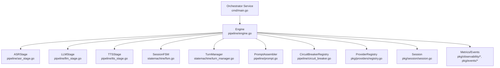
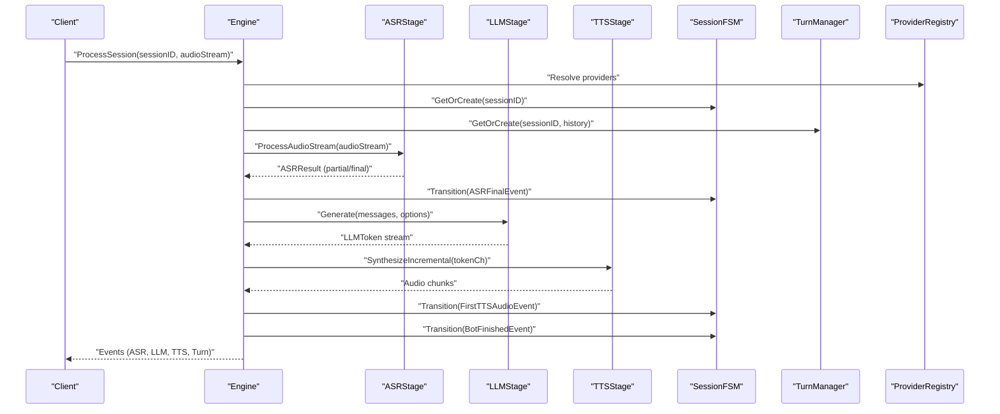
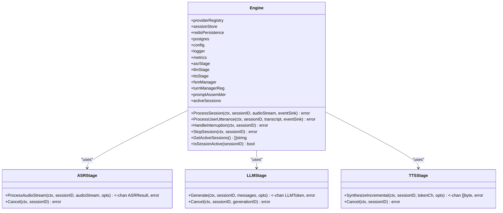
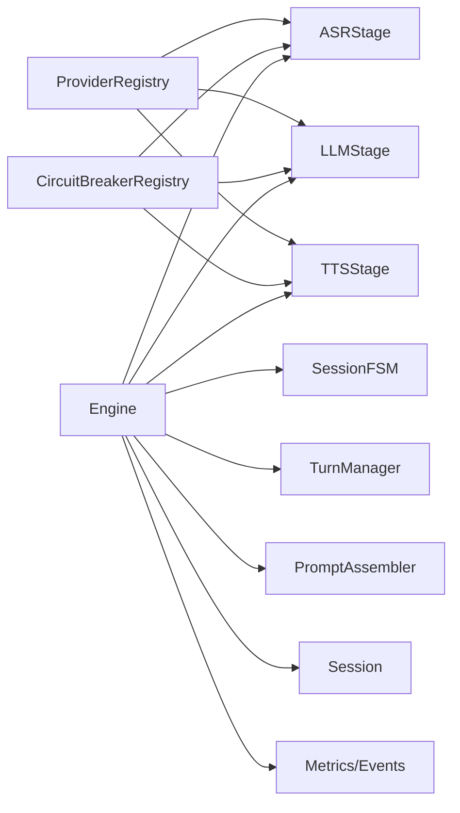

# Pipeline Engine

<cite>
**Referenced Files in This Document**
- [engine.go](file://go/orchestrator/internal/pipeline/engine.go)
- [asr_stage.go](file://go/orchestrator/internal/pipeline/asr_stage.go)
- [llm_stage.go](file://go/orchestrator/internal/pipeline/llm_stage.go)
- [tts_stage.go](file://go/orchestrator/internal/pipeline/tts_stage.go)
- [circuit_breaker.go](file://go/orchestrator/internal/pipeline/circuit_breaker.go)
- [prompt.go](file://go/orchestrator/internal/pipeline/prompt.go)
- [fsm.go](file://go/orchestrator/internal/statemachine/fsm.go)
- [turn_manager.go](file://go/orchestrator/internal/statemachine/turn_manager.go)
- [registry.go](file://go/pkg/providers/registry.go)
- [session.go](file://go/pkg/session/session.go)
- [state.go](file://go/pkg/session/state.go)
- [metrics.go](file://go/pkg/observability/metrics.go)
- [event.go](file://go/pkg/events/event.go)
- [main.go](file://go/orchestrator/cmd/main.go)
</cite>

## Table of Contents
1. [Introduction](#introduction)
2. [Project Structure](#project-structure)
3. [Core Components](#core-components)
4. [Architecture Overview](#architecture-overview)
5. [Detailed Component Analysis](#detailed-component-analysis)
6. [Dependency Analysis](#dependency-analysis)
7. [Performance Considerations](#performance-considerations)
8. [Troubleshooting Guide](#troubleshooting-guide)
9. [Conclusion](#conclusion)

## Introduction
This document describes the pipeline engine that coordinates all AI processing stages in CloudApp. The engine orchestrates the end-to-end voice conversation flow: Automatic Speech Recognition (ASR), Large Language Model (LLM), and Text-to-Speech (TTS). It manages session lifecycle, state transitions, real-time audio processing, provider selection, circuit breaking, and observability. The engine integrates tightly with the state machine, session management, and provider registry systems to deliver robust, scalable, and observable AI conversations.

## Project Structure
The pipeline engine resides in the orchestrator service and is composed of:
- Engine: Central coordinator for ASR->LLM->TTS pipeline
- Stage implementations: ASRStage, LLMStage, TTSStage
- Circuit breaker: Per-provider resilience
- Prompt assembler: Conversation-aware prompt construction
- State machine and turn manager: Session state and turn-level tracking
- Provider registry: Provider discovery and selection
- Session management: Conversation state and metadata
- Observability: Metrics, logging, tracing

**Diagram sources**
- [engine.go:17-106](file://go/orchestrator/internal/pipeline/engine.go#L17-L106)
- [asr_stage.go:25-45](file://go/orchestrator/internal/pipeline/asr_stage.go#L25-L45)
- [llm_stage.go:33-56](file://go/orchestrator/internal/pipeline/llm_stage.go#L33-L56)
- [tts_stage.go:16-39](file://go/orchestrator/internal/pipeline/tts_stage.go#L16-L39)
- [fsm.go:44-92](file://go/orchestrator/internal/statemachine/fsm.go#L44-L92)
- [turn_manager.go:11-25](file://go/orchestrator/internal/statemachine/turn_manager.go#L11-L25)
- [prompt.go:8-21](file://go/orchestrator/internal/pipeline/prompt.go#L8-L21)
- [circuit_breaker.go:207-234](file://go/orchestrator/internal/pipeline/circuit_breaker.go#L207-L234)
- [registry.go:14-40](file://go/pkg/providers/registry.go#L14-L40)
- [session.go:62-84](file://go/pkg/session/session.go#L62-L84)
- [metrics.go:10-82](file://go/pkg/observability/metrics.go#L10-L82)
- [event.go:11-35](file://go/pkg/events/event.go#L11-L35)

**Section sources**
- [engine.go:17-106](file://go/orchestrator/internal/pipeline/engine.go#L17-L106)
- [main.go:26-121](file://go/orchestrator/cmd/main.go#L26-L121)

## Core Components
- Engine: Creates and wires stages, manages session contexts, orchestrates pipeline execution, and coordinates interruptions and cleanup.
- ASRStage: Streams audio to ASR provider with circuit breaker protection, emits partial and final transcripts, and supports cancellation.
- LLMStage: Streams tokens from LLM provider, tracks generation IDs for cancellation, and records timing metrics.
- TTSStage: Synthesizes audio from text, supports incremental synthesis with sentence segmentation, and records timing metrics.
- CircuitBreakerRegistry: Manages per-provider circuit breakers with failure thresholds, timeouts, and half-open testing.
- PromptAssembler: Builds conversation-aware prompts respecting system prompt and context window limits.
- SessionFSM and TurnManager: Enforce valid state transitions and manage assistant turns, including interruption handling and commit semantics.
- ProviderRegistry: Registers and resolves providers for a session with tenant-level overrides.
- Session: Holds session metadata, runtime state, and configuration for providers, audio, and model options.
- Observability: Metrics collectors, histograms, and event emission for real-time feedback.

**Section sources**
- [engine.go:17-106](file://go/orchestrator/internal/pipeline/engine.go#L17-L106)
- [asr_stage.go:25-45](file://go/orchestrator/internal/pipeline/asr_stage.go#L25-L45)
- [llm_stage.go:33-56](file://go/orchestrator/internal/pipeline/llm_stage.go#L33-L56)
- [tts_stage.go:16-39](file://go/orchestrator/internal/pipeline/tts_stage.go#L16-L39)
- [circuit_breaker.go:207-234](file://go/orchestrator/internal/pipeline/circuit_breaker.go#L207-L234)
- [prompt.go:8-21](file://go/orchestrator/internal/pipeline/prompt.go#L8-L21)
- [fsm.go:44-92](file://go/orchestrator/internal/statemachine/fsm.go#L44-L92)
- [turn_manager.go:11-25](file://go/orchestrator/internal/statemachine/turn_manager.go#L11-L25)
- [registry.go:14-40](file://go/pkg/providers/registry.go#L14-L40)
- [session.go:62-84](file://go/pkg/session/session.go#L62-L84)
- [metrics.go:10-82](file://go/pkg/observability/metrics.go#L10-L82)
- [event.go:11-35](file://go/pkg/events/event.go#L11-L35)

## Architecture Overview
The engine initializes providers via the registry, constructs stages with circuit breakers, and manages session contexts with an associated state machine and turn manager. Real-time audio streams are fed to ASR, which emits transcripts that trigger LLM generation. Tokens are streamed to TTS for incremental audio synthesis. Interruptions cancel active generations and syntheses while preserving only spoken text in history.

**Diagram sources**
- [engine.go:108-208](file://go/orchestrator/internal/pipeline/engine.go#L108-L208)
- [asr_stage.go:164-290](file://go/orchestrator/internal/pipeline/asr_stage.go#L164-L290)
- [llm_stage.go:58-185](file://go/orchestrator/internal/pipeline/llm_stage.go#L58-L185)
- [tts_stage.go:129-236](file://go/orchestrator/internal/pipeline/tts_stage.go#L129-L236)
- [fsm.go:101-161](file://go/orchestrator/internal/statemachine/fsm.go#L101-L161)
- [turn_manager.go:27-131](file://go/orchestrator/internal/statemachine/turn_manager.go#L27-L131)
- [registry.go:172-251](file://go/pkg/providers/registry.go#L172-L251)

## Detailed Component Analysis

### Engine
The Engine is the central coordinator. It:
- Initializes stages with providers from the registry and circuit breaker registry
- Manages session contexts with FSM, turn manager, history, and timestamp tracking
- Runs the main loop to process ASR results and drive LLM/TTS execution
- Handles interruptions by cancelling active generations and syntheses
- Provides session lifecycle controls (stop, cleanup, active sessions)

Key responsibilities:
- Initialization: [NewEngine:70-106](file://go/orchestrator/internal/pipeline/engine.go#L70-L106)
- Session processing: [ProcessSession:108-208](file://go/orchestrator/internal/pipeline/engine.go#L108-L208)
- Utterance processing: [ProcessUserUtterance:210-375](file://go/orchestrator/internal/pipeline/engine.go#L210-L375)
- Interruption handling: [HandleInterruption:377-436](file://go/orchestrator/internal/pipeline/engine.go#L377-L436)
- Session termination: [StopSession:438-470](file://go/orchestrator/internal/pipeline/engine.go#L438-L470)
- Active session management: [GetActiveSessions:495-509](file://go/orchestrator/internal/pipeline/engine.go#L495-L509), [IsSessionActive:505-509](file://go/orchestrator/internal/pipeline/engine.go#L505-L509)

**Diagram sources**
- [engine.go:17-106](file://go/orchestrator/internal/pipeline/engine.go#L17-L106)
- [asr_stage.go:164-290](file://go/orchestrator/internal/pipeline/asr_stage.go#L164-L290)
- [llm_stage.go:58-185](file://go/orchestrator/internal/pipeline/llm_stage.go#L58-L185)
- [tts_stage.go:129-236](file://go/orchestrator/internal/pipeline/tts_stage.go#L129-L236)

**Section sources**
- [engine.go:70-106](file://go/orchestrator/internal/pipeline/engine.go#L70-L106)
- [engine.go:108-208](file://go/orchestrator/internal/pipeline/engine.go#L108-L208)
- [engine.go:210-375](file://go/orchestrator/internal/pipeline/engine.go#L210-L375)
- [engine.go:377-436](file://go/orchestrator/internal/pipeline/engine.go#L377-L436)
- [engine.go:438-470](file://go/orchestrator/internal/pipeline/engine.go#L438-L470)
- [engine.go:495-509](file://go/orchestrator/internal/pipeline/engine.go#L495-L509)

### ASRStage
ASRStage wraps an ASR provider with circuit breaker protection and metrics. It supports:
- Single-shot audio processing: [ProcessAudio:47-162](file://go/orchestrator/internal/pipeline/asr_stage.go#L47-L162)
- Streaming audio processing: [ProcessAudioStream:164-290](file://go/orchestrator/internal/pipeline/asr_stage.go#L164-L290)
- Cancellation: [Cancel:292-302](file://go/orchestrator/internal/pipeline/asr_stage.go#L292-L302)

Behavior:
- Executes provider calls through a circuit breaker
- Emits partial and final transcripts with timing metadata
- Records ASR latency and error metrics

**Section sources**
- [asr_stage.go:25-45](file://go/orchestrator/internal/pipeline/asr_stage.go#L25-L45)
- [asr_stage.go:47-162](file://go/orchestrator/internal/pipeline/asr_stage.go#L47-L162)
- [asr_stage.go:164-290](file://go/orchestrator/internal/pipeline/asr_stage.go#L164-L290)
- [asr_stage.go:292-302](file://go/orchestrator/internal/pipeline/asr_stage.go#L292-L302)

### LLMStage
LLMStage streams tokens from the LLM provider and:
- Generates unique generation IDs for cancellation tracking: [generateID:16-21](file://go/orchestrator/internal/pipeline/llm_stage.go#L16-L21)
- Streams tokens with first-token timing: [Generate:58-185](file://go/orchestrator/internal/pipeline/llm_stage.go#L58-L185)
- Cancels active generations: [Cancel:187-211](file://go/orchestrator/internal/pipeline/llm_stage.go#L187-L211)

Concurrency:
- Uses a wait group to coordinate token and audio processing goroutines during multi-stage execution

**Section sources**
- [llm_stage.go:16-21](file://go/orchestrator/internal/pipeline/llm_stage.go#L16-L21)
- [llm_stage.go:58-185](file://go/orchestrator/internal/pipeline/llm_stage.go#L58-L185)
- [llm_stage.go:187-211](file://go/orchestrator/internal/pipeline/llm_stage.go#L187-L211)

### TTSStage
TTSStage synthesizes audio from text and supports incremental synthesis:
- Full synthesis: [Synthesize:41-127](file://go/orchestrator/internal/pipeline/tts_stage.go#L41-L127)
- Incremental synthesis: [SynthesizeIncremental:129-236](file://go/orchestrator/internal/pipeline/tts_stage.go#L129-L236)
- Sentence segmentation: [isSpeakableSegment:270-286](file://go/orchestrator/internal/pipeline/tts_stage.go#L270-L286), [extractSpeakableSegment:288-312](file://go/orchestrator/internal/pipeline/tts_stage.go#L288-L312)
- Cancellation: [Cancel:238-258](file://go/orchestrator/internal/pipeline/tts_stage.go#L238-L258)

Incremental synthesis enables overlapping LLM generation and TTS synthesis, reducing end-to-end latency.

**Section sources**
- [tts_stage.go:41-127](file://go/orchestrator/internal/pipeline/tts_stage.go#L41-L127)
- [tts_stage.go:129-236](file://go/orchestrator/internal/pipeline/tts_stage.go#L129-L236)
- [tts_stage.go:238-258](file://go/orchestrator/internal/pipeline/tts_stage.go#L238-L258)
- [tts_stage.go:270-312](file://go/orchestrator/internal/pipeline/tts_stage.go#L270-L312)

### Circuit Breaker
Circuit breaker protects providers from cascading failures:
- States: Closed, Open, Half-Open
- Thresholds: Failure threshold, timeout, half-open max calls
- Registry: One breaker per provider name

Operations:
- [Execute:80-90](file://go/orchestrator/internal/pipeline/circuit_breaker.go#L80-L90)
- [beforeCall:92-121](file://go/orchestrator/internal/pipeline/circuit_breaker.go#L92-L121)
- [afterCall:123-133](file://go/orchestrator/internal/pipeline/circuit_breaker.go#L123-L133)
- [Get:222-234](file://go/orchestrator/internal/pipeline/circuit_breaker.go#L222-L234)

**Section sources**
- [circuit_breaker.go:12-78](file://go/orchestrator/internal/pipeline/circuit_breaker.go#L12-L78)
- [circuit_breaker.go#L80-L133:80-133](file://go/orchestrator/internal/pipeline/circuit_breaker.go#L80-L133)
- [circuit_breaker.go#L207-L234:207-234](file://go/orchestrator/internal/pipeline/circuit_breaker.go#L207-L234)

### PromptAssembler
Assembles conversation-aware prompts:
- [AssemblePromptWithHistory:62-104](file://go/orchestrator/internal/pipeline/prompt.go#L62-L104)
- Applies context window limits: [applyContextLimit:106-142](file://go/orchestrator/internal/pipeline/prompt.go#L106-L142)
- Token counting helpers: [CountTokens:144-149](file://go/orchestrator/internal/pipeline/prompt.go#L144-L149), [CountTotalTokens:151-160](file://go/orchestrator/internal/pipeline/prompt.go#L151-L160)

**Section sources**
- [prompt.go:8-21](file://go/orchestrator/internal/pipeline/prompt.go#L8-L21)
- [prompt.go#L62-L104:62-104](file://go/orchestrator/internal/pipeline/prompt.go#L62-L104)
- [prompt.go#L106-L142:106-142](file://go/orchestrator/internal/pipeline/prompt.go#L106-L142)
- [prompt.go#L144-L160:144-160](file://go/orchestrator/internal/pipeline/prompt.go#L144-L160)

### State Machine and Turn Management
SessionFSM enforces valid state transitions:
- Events: [SpeechStartEvent:16-31](file://go/orchestrator/internal/statemachine/fsm.go#L16-L31), [SpeechEndEvent:16-31](file://go/orchestrator/internal/statemachine/fsm.go#L16-L31), [ASRFinalEvent:16-31](file://go/orchestrator/internal/statemachine/fsm.go#L16-L31), [FirstTTSAudioEvent:16-31](file://go/orchestrator/internal/statemachine/fsm.go#L16-L31), [InterruptionEvent:16-31](file://go/orchestrator/internal/statemachine/fsm.go#L16-L31), [BotFinishedEvent:16-31](file://go/orchestrator/internal/statemachine/fsm.go#L16-L31), [SessionStopEvent:16-31](file://go/orchestrator/internal/statemachine/fsm.go#L16-L31)
- Transitions: [Transition:101-161](file://go/orchestrator/internal/statemachine/fsm.go#L101-L161)
- Valid transitions matrix: [validTransitions:37-62](file://go/orchestrator/internal/statemachine/fsm.go#L37-L62)

TurnManager tracks assistant turns:
- [StartTurn:27-34](file://go/orchestrator/internal/statemachine/turn_manager.go#L27-L34), [AppendGenerated:36-44](file://go/orchestrator/internal/statemachine/turn_manager.go#L36-L44)
- [MarkSpoken:56-74](file://go/orchestrator/internal/statemachine/turn_manager.go#L56-L74), [HandleInterruption:86-103](file://go/orchestrator/internal/statemachine/turn_manager.go#L86-L103)
- [CommitTurn:105-131](file://go/orchestrator/internal/statemachine/turn_manager.go#L105-L131)

**Section sources**
- [fsm.go#L16-L31:16-31](file://go/orchestrator/internal/statemachine/fsm.go#L16-L31)
- [fsm.go#L101-L161:101-161](file://go/orchestrator/internal/statemachine/fsm.go#L101-L161)
- [fsm.go#L37-L62:37-62](file://go/orchestrator/internal/statemachine/fsm.go#L37-L62)
- [turn_manager.go#L27-L131:27-131](file://go/orchestrator/internal/statemachine/turn_manager.go#L27-L131)

### Provider Registry and Session Management
ProviderRegistry:
- Registers and resolves providers: [RegisterASR:42-47](file://go/pkg/providers/registry.go#L42-L47), [RegisterLLM:49-54](file://go/pkg/providers/registry.go#L49-L54), [RegisterTTS:56-61](file://go/pkg/providers/registry.go#L56-L61)
- Resolution priority: request → session → tenant → global: [ResolveForSession:172-251](file://go/pkg/providers/registry.go#L172-L251)

Session:
- Holds configuration and runtime state: [Session:62-84](file://go/pkg/session/session.go#L62-L84)
- State transitions validation: [IsValidTransition:64-76](file://go/pkg/session/state.go#L64-L76)

**Section sources**
- [registry.go#L42-L61:42-61](file://go/pkg/providers/registry.go#L42-L61)
- [registry.go#L172-L251:172-251](file://go/pkg/providers/registry.go#L172-L251)
- [session.go#L62-L84:62-84](file://go/pkg/session/session.go#L62-L84)
- [state.go#L64-L76:64-76](file://go/pkg/session/state.go#L64-L76)

### Observability and Events
Metrics:
- Provider request counters and durations: [RecordProviderRequest:129-132](file://go/pkg/observability/metrics.go#L129-L132), [RecordProviderRequestDuration:134-137](file://go/pkg/observability/metrics.go#L134-L137)
- Latency histograms: [RecordASRLatency:99-102](file://go/pkg/observability/metrics.go#L99-L102), [RecordLLMTTFT:104-107](file://go/pkg/observability/metrics.go#L104-L107), [RecordTTSFirstChunk:109-112](file://go/pkg/observability/metrics.go#L109-L112), [RecordServerTTFA:114-117](file://go/pkg/observability/metrics.go#L114-L117), [RecordInterruptionStop:119-122](file://go/pkg/observability/metrics.go#L119-L122)

Events:
- Server-side event types: [EventType constants:23-35](file://go/pkg/events/event.go#L23-L35)
- Event emission in engine: [ProcessSession:182-199](file://go/orchestrator/internal/pipeline/engine.go#L182-L199), [ProcessUserUtterance](file://go/orchestrator/internal/pipeline/engine.go#L308-L314, 349-L355)

**Section sources**
- [metrics.go#L10-L82:10-82](file://go/pkg/observability/metrics.go#L10-L82)
- [metrics.go#L129-L137:129-137](file://go/pkg/observability/metrics.go#L129-L137)
- [metrics.go#L99-L122:99-122](file://go/pkg/observability/metrics.go#L99-L122)
- [event.go#L23-L35:23-35](file://go/pkg/events/event.go#L23-L35)
- [engine.go#L182-L199:182-199](file://go/orchestrator/internal/pipeline/engine.go#L182-L199)
- [engine.go#L308-L314:308-314](file://go/orchestrator/internal/pipeline/engine.go#L308-L314)
- [engine.go#L349-L355:349-355](file://go/orchestrator/internal/pipeline/engine.go#L349-L355)

## Dependency Analysis
The engine composes multiple subsystems with clear boundaries:
- Provider layer: ASR/LLM/TTS providers via gRPC clients
- Stage layer: Protected execution with circuit breakers and metrics
- Control layer: Engine orchestrating stages and managing session state
- Persistence layer: Session store and Redis persistence
- Observability layer: Metrics and event emission

**Diagram sources**
- [engine.go:70-106](file://go/orchestrator/internal/pipeline/engine.go#L70-L106)
- [asr_stage.go:25-45](file://go/orchestrator/internal/pipeline/asr_stage.go#L25-L45)
- [llm_stage.go:33-56](file://go/orchestrator/internal/pipeline/llm_stage.go#L33-L56)
- [tts_stage.go:16-39](file://go/orchestrator/internal/pipeline/tts_stage.go#L16-L39)
- [circuit_breaker.go#L207-L234:207-234](file://go/orchestrator/internal/pipeline/circuit_breaker.go#L207-L234)
- [fsm.go#L44-92:44-92](file://go/orchestrator/internal/statemachine/fsm.go#L44-L92)
- [turn_manager.go#L11-25:11-25](file://go/orchestrator/internal/statemachine/turn_manager.go#L11-L25)
- [prompt.go#L8-L21:8-21](file://go/orchestrator/internal/pipeline/prompt.go#L8-L21)
- [registry.go#L14-L40:14-40](file://go/pkg/providers/registry.go#L14-L40)
- [session.go#L62-84:62-84](file://go/pkg/session/session.go#L62-L84)
- [metrics.go#L10-L82:10-82](file://go/pkg/observability/metrics.go#L10-L82)
- [event.go#L11-35:11-35](file://go/pkg/events/event.go#L11-L35)

**Section sources**
- [engine.go:70-106](file://go/orchestrator/internal/pipeline/engine.go#L70-L106)
- [registry.go#L14-L40:14-40](file://go/pkg/providers/registry.go#L14-L40)

## Performance Considerations
- Overlapping execution: LLM token streaming and TTS synthesis run concurrently to minimize end-to-end latency.
- Incremental TTS: Segments text at sentence boundaries to reduce perceived latency.
- Circuit breaking: Prevents cascading failures and enables graceful degradation when providers fail.
- Metrics-driven tuning: Use latency histograms and request counters to identify bottlenecks and optimize provider configurations.
- Context window management: PromptAssembler truncates history to respect model limits and reduce latency.

[No sources needed since this section provides general guidance]

## Troubleshooting Guide
Common issues and recovery strategies:
- Provider failures: Circuit breaker opens; monitor provider error counters and request durations. Recovery occurs after timeout or successful half-open calls.
- Interruption handling: Engine cancels LLM generation and TTS synthesis, commits only spoken text, and transitions FSM to listening.
- Session cleanup: StopSession cancels contexts, removes FSM and turn manager entries, and deletes session from Redis.
- Diagnostics: Inspect logs for stage-specific errors and timestamps recorded by the engine and stages.

**Section sources**
- [circuit_breaker.go#L80-L133:80-133](file://go/orchestrator/internal/pipeline/circuit_breaker.go#L80-L133)
- [engine.go#L377-436:377-436](file://go/orchestrator/internal/pipeline/engine.go#L377-L436)
- [engine.go#L438-470:438-470](file://go/orchestrator/internal/pipeline/engine.go#L438-L470)
- [metrics.go#L124-L137:124-137](file://go/pkg/observability/metrics.go#L124-L137)

## Conclusion
The pipeline engine provides a robust, observable, and resilient orchestration layer for end-to-end voice AI conversations. By coordinating ASR, LLM, and TTS with circuit breaking, incremental synthesis, and strict state management, it delivers low-latency, interruption-safe experiences. Integration with provider registries, session stores, and observability systems ensures scalability and operability in production environments.