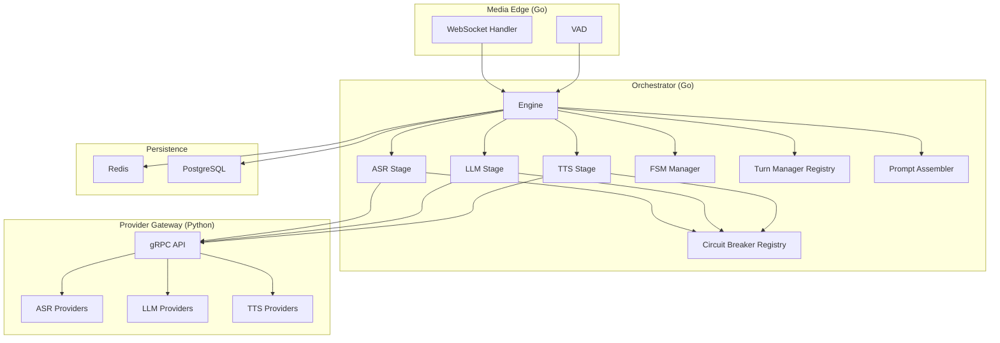
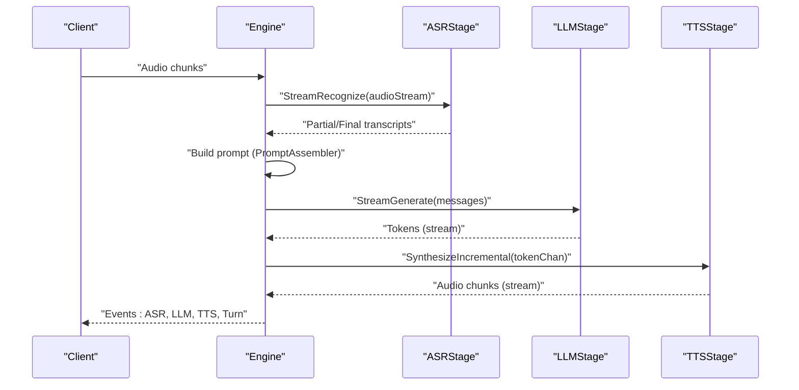
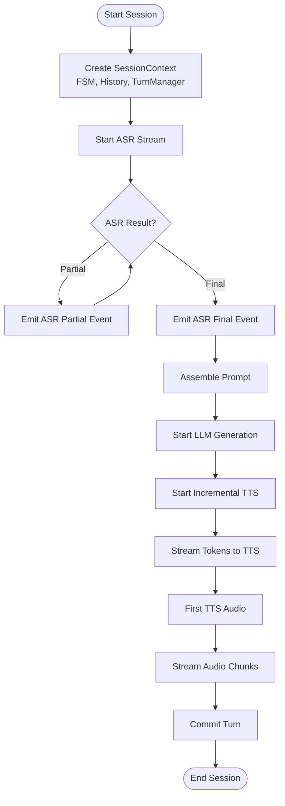
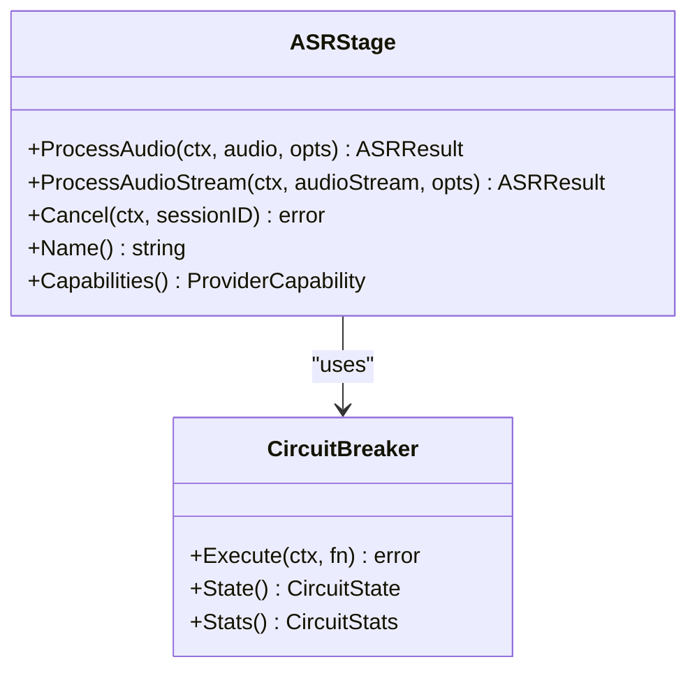
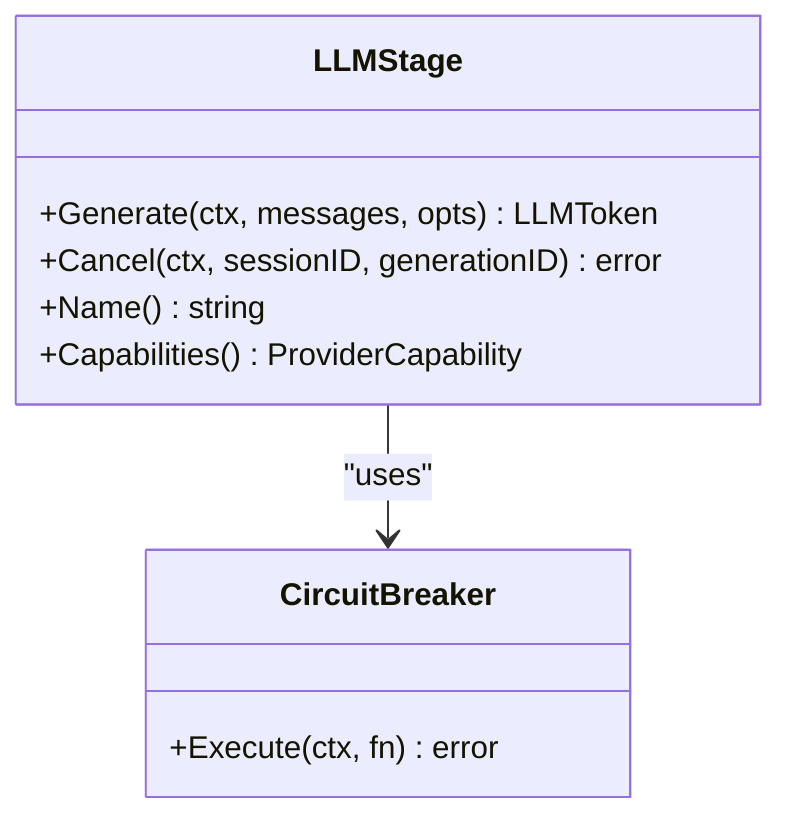
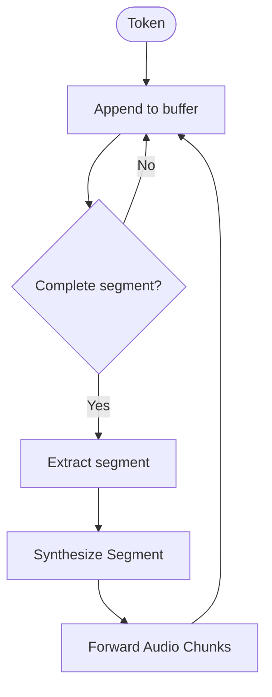
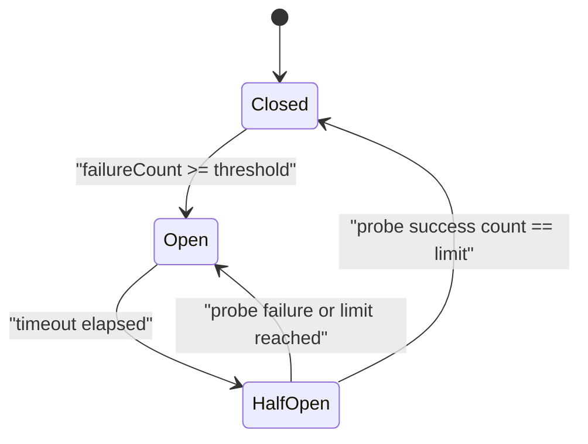
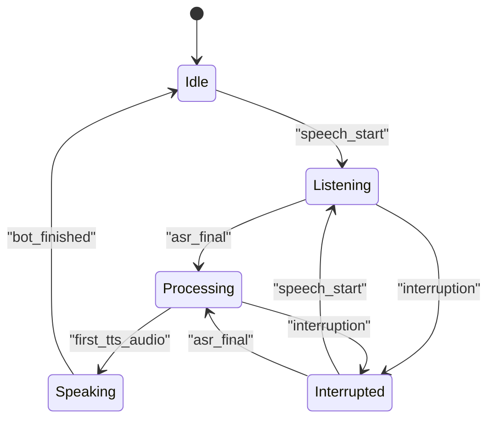
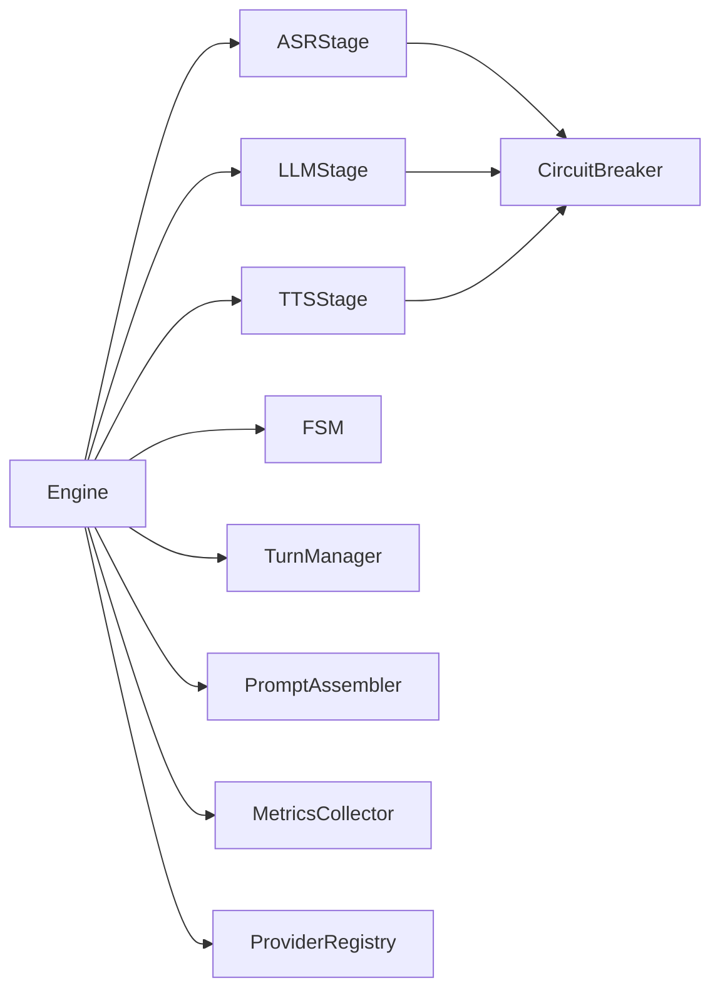

# Pipeline Processing

<cite>
**Referenced Files in This Document**
- [engine.go](file://go/orchestrator/internal/pipeline/engine.go)
- [asr_stage.go](file://go/orchestrator/internal/pipeline/asr_stage.go)
- [llm_stage.go](file://go/orchestrator/internal/pipeline/llm_stage.go)
- [tts_stage.go](file://go/orchestrator/internal/pipeline/tts_stage.go)
- [circuit_breaker.go](file://go/orchestrator/internal/pipeline/circuit_breaker.go)
- [prompt.go](file://go/orchestrator/internal/pipeline/prompt.go)
- [fsm.go](file://go/orchestrator/internal/statemachine/fsm.go)
- [turn_manager.go](file://go/orchestrator/internal/statemachine/turn_manager.go)
- [config.go](file://go/pkg/config/config.go)
- [interfaces.go](file://go/pkg/providers/interfaces.go)
- [metrics.go](file://go/pkg/observability/metrics.go)
- [event.go](file://go/pkg/events/event.go)
- [session.go](file://go/pkg/session/session.go)
- [registry.go](file://go/pkg/providers/registry.go)
- [engine_test.go](file://go/orchestrator/internal/pipeline/engine_test.go)
- [config-cloud.yaml](file://examples/config-cloud.yaml)
- [README.md](file://README.md)
</cite>

## Table of Contents
1. [Introduction](#introduction)
2. [Project Structure](#project-structure)
3. [Core Components](#core-components)
4. [Architecture Overview](#architecture-overview)
5. [Detailed Component Analysis](#detailed-component-analysis)
6. [Dependency Analysis](#dependency-analysis)
7. [Performance Considerations](#performance-considerations)
8. [Troubleshooting Guide](#troubleshooting-guide)
9. [Conclusion](#conclusion)
10. [Appendices](#appendices)

## Introduction
This document explains CloudApp’s AI processing pipeline that coordinates ASR, LLM, and TTS stages in real time. It covers the streaming pipeline engine, stage coordination, interruption handling, state management, error propagation, and production monitoring. The goal is to help operators configure, deploy, and troubleshoot the system effectively while understanding the end-to-end flow from audio input to synthesized speech output.

## Project Structure
CloudApp is organized into:
- Orchestrator service (Go) hosting the pipeline engine, state machine, and persistence integrations
- Provider gateway (Python) exposing ASR, LLM, and TTS backends via gRPC
- Media-Edge (Go) handling WebSocket transport and VAD
- Shared packages for configuration, contracts, events, observability, providers, and session management
- Examples and infrastructure for local and cloud deployments

**Diagram sources**
- [README.md:5-35](file://README.md#L5-L35)
- [engine.go:17-106](file://go/orchestrator/internal/pipeline/engine.go#L17-L106)
- [asr_stage.go:25-45](file://go/orchestrator/internal/pipeline/asr_stage.go#L25-L45)
- [llm_stage.go:33-56](file://go/orchestrator/internal/pipeline/llm_stage.go#L33-L56)
- [tts_stage.go:16-39](file://go/orchestrator/internal/pipeline/tts_stage.go#L16-L39)
- [circuit_breaker.go:207-234](file://go/orchestrator/internal/pipeline/circuit_breaker.go#L207-L234)
- [fsm.go:44-92](file://go/orchestrator/internal/statemachine/fsm.go#L44-L92)
- [turn_manager.go:223-248](file://go/orchestrator/internal/statemachine/turn_manager.go#L223-L248)
- [prompt.go:8-21](file://go/orchestrator/internal/pipeline/prompt.go#L8-L21)

**Section sources**
- [README.md:47-102](file://README.md#L47-L102)

## Core Components
- Engine: Central coordinator managing ASR->LLM->TTS pipeline, session lifecycle, interruptions, and event emission.
- Stages: ASRStage, LLMStage, TTSStage wrap providers with circuit breaker protection, metrics, and cancellation support.
- Circuit Breaker: Per-provider resilience with configurable thresholds and state transitions.
- State Machine: SessionFSM enforces valid state transitions and emits turn events.
- Turn Management: TurnManager tracks assistant turns, playout positions, and interruption semantics.
- Prompt Assembly: Builds LLM prompts respecting context windows and excluding unspoken content.
- Configuration: YAML-driven configuration for servers, providers, audio profiles, observability, and security.
- Events: WebSocket event types for client-server communication and internal telemetry.

**Section sources**
- [engine.go:17-106](file://go/orchestrator/internal/pipeline/engine.go#L17-L106)
- [asr_stage.go:25-45](file://go/orchestrator/internal/pipeline/asr_stage.go#L25-L45)
- [llm_stage.go:33-56](file://go/orchestrator/internal/pipeline/llm_stage.go#L33-L56)
- [tts_stage.go:16-39](file://go/orchestrator/internal/pipeline/tts_stage.go#L16-L39)
- [circuit_breaker.go:57-75](file://go/orchestrator/internal/pipeline/circuit_breaker.go#L57-L75)
- [fsm.go:44-92](file://go/orchestrator/internal/statemachine/fsm.go#L44-L92)
- [turn_manager.go:11-25](file://go/orchestrator/internal/statemachine/turn_manager.go#L11-L25)
- [prompt.go:8-21](file://go/orchestrator/internal/pipeline/prompt.go#L8-L21)
- [config.go:9-18](file://go/pkg/config/config.go#L9-L18)
- [event.go:11-35](file://go/pkg/events/event.go#L11-L35)

## Architecture Overview
The pipeline runs continuously for each session:
- Audio chunks arrive via WebSocket and are forwarded to ASR.
- ASR emits partial transcripts immediately and final transcripts when ready.
- On final transcript, the Engine builds a prompt and starts LLM generation.
- LLM tokens are streamed; the Engine forwards tokens to TTS incrementally.
- TTS synthesizes audio in segments and streams audio chunks back.
- Interruption detection cancels in-flight LLM/TTS and commits only spoken text.

**Diagram sources**
- [engine.go:108-208](file://go/orchestrator/internal/pipeline/engine.go#L108-L208)
- [asr_stage.go:164-290](file://go/orchestrator/internal/pipeline/asr_stage.go#L164-L290)
- [llm_stage.go:58-185](file://go/orchestrator/internal/pipeline/llm_stage.go#L58-L185)
- [tts_stage.go:129-236](file://go/orchestrator/internal/pipeline/tts_stage.go#L129-L236)

## Detailed Component Analysis

### Engine: Streaming Pipeline Coordinator
Responsibilities:
- Manages session lifecycle, state transitions, and interruptions.
- Streams audio to ASR, processes final transcripts, and orchestrates LLM and TTS.
- Coordinates concurrent LLM token processing and TTS audio streaming.
- Emits structured events for partial transcripts, LLM tokens, and TTS audio chunks.
- Tracks timestamps for latency metrics and end-to-end timings.

Key behaviors:
- ProcessSession: Creates session context, FSM, history, and turn manager; starts ASR; loops over ASR results; emits events; triggers ProcessUserUtterance on final.
- ProcessUserUtterance: Builds prompt, starts LLM, starts incremental TTS, streams tokens to TTS, and commits turn on completion.
- HandleInterruption: Cancels LLM/TTS, computes playout position, commits only spoken text, and transitions FSM.
- StopSession: Cleans up contexts, FSM, turn manager, and Redis.

**Diagram sources**
- [engine.go:108-375](file://go/orchestrator/internal/pipeline/engine.go#L108-L375)

**Section sources**
- [engine.go:108-470](file://go/orchestrator/internal/pipeline/engine.go#L108-L470)

### ASR Stage: Speech Recognition
Responsibilities:
- Wraps an ASR provider with circuit breaker protection and metrics.
- Streams audio chunks to provider and emits partial and final transcripts.
- Supports cancellation via context.

Implementation highlights:
- ProcessAudio vs ProcessAudioStream: single-shot vs continuous streaming.
- Circuit breaker Execute protects provider calls; errors recorded via metrics.
- Timing tracking for latency measurements.

**Diagram sources**
- [asr_stage.go:25-45](file://go/orchestrator/internal/pipeline/asr_stage.go#L25-L45)
- [circuit_breaker.go:57-90](file://go/orchestrator/internal/pipeline/circuit_breaker.go#L57-L90)

**Section sources**
- [asr_stage.go:47-290](file://go/orchestrator/internal/pipeline/asr_stage.go#L47-L290)

### LLM Stage: Language Model Generation
Responsibilities:
- Streams tokens from LLM provider with circuit breaker protection.
- Tracks generation IDs for cancellation.
- Emits first-token latency metrics.

Implementation highlights:
- Generate: starts cancellable generation, streams tokens, records TTFT on first token.
- Cancel: cancels local context and notifies provider.
- Active generations tracked in a map keyed by generation ID.

**Diagram sources**
- [llm_stage.go:33-56](file://go/orchestrator/internal/pipeline/llm_stage.go#L33-L56)
- [circuit_breaker.go:57-90](file://go/orchestrator/internal/pipeline/circuit_breaker.go#L57-L90)

**Section sources**
- [llm_stage.go:58-240](file://go/orchestrator/internal/pipeline/llm_stage.go#L58-L240)

### TTS Stage: Speech Synthesis
Responsibilities:
- Streams audio chunks from TTS provider with circuit breaker protection.
- Implements incremental synthesis by batching tokens into speakable segments.
- Supports cancellation via context.

Implementation highlights:
- Synthesize: streams audio chunks and records first-chunk latency.
- SynthesizeIncremental: buffers tokens, detects sentence/phrase boundaries, synthesizes segments, forwards audio.
- isSpeakableSegment and extractSpeakableSegment define segmentation heuristics.

**Diagram sources**
- [tts_stage.go:129-236](file://go/orchestrator/internal/pipeline/tts_stage.go#L129-L236)
- [tts_stage.go:270-312](file://go/orchestrator/internal/pipeline/tts_stage.go#L270-L312)

**Section sources**
- [tts_stage.go:41-313](file://go/orchestrator/internal/pipeline/tts_stage.go#L41-L313)

### Circuit Breaker Pattern
Purpose:
- Protect downstream providers from cascading failures during transient outages.
- Dynamically open/close based on failure counts and timeouts.

States and transitions:
- Closed: normal operation; failures increment failureCount.
- Open: reject calls for timeout duration; ErrCircuitOpen returned.
- Half-Open: allow limited probe calls; success closes, failure reopens.

**Diagram sources**
- [circuit_breaker.go:12-36](file://go/orchestrator/internal/pipeline/circuit_breaker.go#L12-L36)
- [circuit_breaker.go:92-171](file://go/orchestrator/internal/pipeline/circuit_breaker.go#L92-L171)

**Section sources**
- [circuit_breaker.go:38-257](file://go/orchestrator/internal/pipeline/circuit_breaker.go#L38-L257)

### Prompt Assembly
Responsibilities:
- Construct LLM prompts from system prompt, conversation history, and current user utterance.
- Enforce context window limits and exclude unspoken assistant text.

Key behaviors:
- AssemblePromptWithHistory: filters out unspoken assistant messages and truncates to max context.
- applyContextLimit: preserves system messages and keeps most recent non-system messages.

**Section sources**
- [prompt.go:23-142](file://go/orchestrator/internal/pipeline/prompt.go#L23-L142)

### State Machine and Turn Management
SessionFSM:
- Defines valid states and transitions (Idle, Listening, Processing, Speaking, Interrupted).
- Emits turn events on state changes and maintains current state.

TurnManager:
- Tracks assistant turns, generated/queued/spoken text, and playout position.
- Handles interruptions by marking interrupted bytes and committing only spoken text.

**Diagram sources**
- [fsm.go:44-92](file://go/orchestrator/internal/statemachine/fsm.go#L44-L92)
- [fsm.go:163-200](file://go/orchestrator/internal/statemachine/fsm.go#L163-L200)

**Section sources**
- [fsm.go:44-365](file://go/orchestrator/internal/statemachine/fsm.go#L44-L365)
- [turn_manager.go:11-276](file://go/orchestrator/internal/statemachine/turn_manager.go#L11-L276)

### Configuration and Provider Resolution
Configuration:
- AppConfig loads server, Redis, Postgres, providers, audio, observability, and security settings.
- Validates and provides defaults for safe operation.

Provider Resolution:
- ProviderRegistry resolves ASR/LLM/TTS/VAD providers per session with priority: request > session > tenant > global.
- Supports dynamic switching of providers mid-session.

**Section sources**
- [config.go:9-276](file://go/pkg/config/config.go#L9-L276)
- [registry.go:166-262](file://go/pkg/providers/registry.go#L166-L262)

### Events and Monitoring
Events:
- WebSocket event types cover session lifecycle, ASR/LMM/TTS streaming, turn transitions, interruptions, and errors.

Metrics:
- Prometheus metrics track sessions, turns, latency histograms, provider errors/requests/durations, and WebSocket connections.

**Section sources**
- [event.go:11-35](file://go/pkg/events/event.go#L11-L35)
- [metrics.go:10-214](file://go/pkg/observability/metrics.go#L10-L214)

## Dependency Analysis
- Engine depends on ProviderRegistry, session stores, persistence, observability, and state machine utilities.
- Stages depend on providers, circuit breakers, and metrics collectors.
- TurnManager and FSM manage runtime state per session.
- Configuration drives provider selection and system behavior.

**Diagram sources**
- [engine.go:17-106](file://go/orchestrator/internal/pipeline/engine.go#L17-L106)
- [asr_stage.go:25-45](file://go/orchestrator/internal/pipeline/asr_stage.go#L25-L45)
- [llm_stage.go:33-56](file://go/orchestrator/internal/pipeline/llm_stage.go#L33-L56)
- [tts_stage.go:16-39](file://go/orchestrator/internal/pipeline/tts_stage.go#L16-L39)
- [circuit_breaker.go:207-234](file://go/orchestrator/internal/pipeline/circuit_breaker.go#L207-L234)

**Section sources**
- [engine.go:17-106](file://go/orchestrator/internal/pipeline/engine.go#L17-L106)

## Performance Considerations
- Overlapping generation and synthesis: LLM token streaming feeds TTS incrementally to minimize latency.
- Incremental TTS segmentation: Speakable boundaries reduce buffering and improve responsiveness.
- Circuit breaker thresholds: Tune failure thresholds and timeouts to balance resilience and throughput.
- Metrics-driven tuning: Monitor provider latencies and error rates to adjust timeouts and retry policies.
- Audio profiles: Choose appropriate sample rate/channels for your transport to reduce resampling overhead.

[No sources needed since this section provides general guidance]

## Troubleshooting Guide
Common scenarios and remedies:
- ASR stalls or fails: Check circuit breaker state and provider connectivity; verify audio format and chunk sizes.
- LLM slow or stuck: Inspect first-token latency metrics; confirm model options and context window limits.
- TTS gaps or delays: Review first-audio-chunk metrics and segmentation logic; ensure token channel is fed continuously.
- Interruption not working: Confirm VAD and interruption events; verify TurnManager playout position and commit behavior.
- Session cleanup: Use StopSession to cancel contexts and remove FSM/turn manager entries.

Operational checks:
- Validate configuration (server, providers, audio profiles).
- Inspect Prometheus metrics for provider errors and durations.
- Review event logs for malformed WebSocket messages or missing events.

**Section sources**
- [engine.go:377-470](file://go/orchestrator/internal/pipeline/engine.go#L377-L470)
- [metrics.go:109-137](file://go/pkg/observability/metrics.go#L109-L137)
- [engine_test.go:394-454](file://go/orchestrator/internal/pipeline/engine_test.go#L394-L454)

## Conclusion
CloudApp’s pipeline engine delivers robust, real-time ASR->LLM->TTS processing with strong interruption handling, resilient provider integration via circuit breakers, and comprehensive observability. By leveraging the state machine, turn management, and incremental synthesis, the system achieves low-latency, high-quality voice interactions suitable for production deployments.

[No sources needed since this section summarizes without analyzing specific files]

## Appendices

### Pipeline Execution Flows
- End-to-end session: Audio input → ASR partials → ASR final → Prompt assembly → LLM tokens → Incremental TTS → Audio chunks → Turn commit.
- Interruption flow: Detect interruption → Cancel LLM/TTS → Compute playout position → Commit only spoken text → Resume listening.

**Section sources**
- [engine.go:108-375](file://go/orchestrator/internal/pipeline/engine.go#L108-L375)
- [engine_test.go:323-454](file://go/orchestrator/internal/pipeline/engine_test.go#L323-L454)

### Stage Dependencies and Options
- ASR: StreamRecognize(audioStream, ASROptions) → ASRResult.
- LLM: StreamGenerate(messages, LLMOptions) → LLMToken.
- TTS: StreamSynthesize(text, TTSOptions) → audio chunks.

**Section sources**
- [interfaces.go:21-76](file://go/pkg/providers/interfaces.go#L21-L76)

### Configuration Reference
- Server, Redis, Postgres, Providers, Audio, Observability, Security settings.
- Example cloud configuration demonstrates provider selection and credentials.

**Section sources**
- [config.go:9-276](file://go/pkg/config/config.go#L9-L276)
- [config-cloud.yaml:1-39](file://examples/config-cloud.yaml#L1-L39)