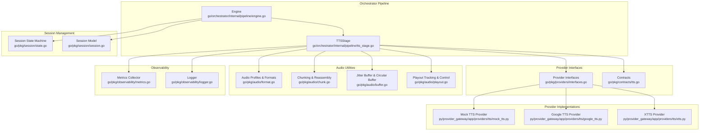
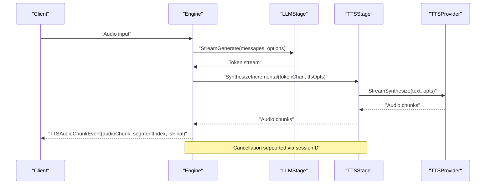
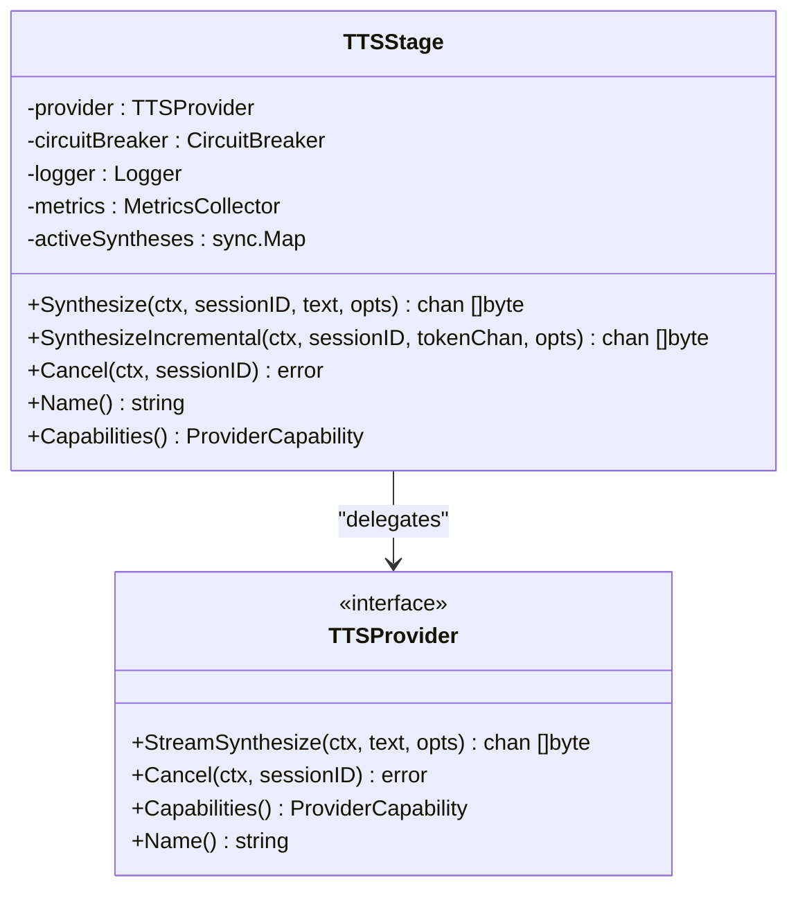
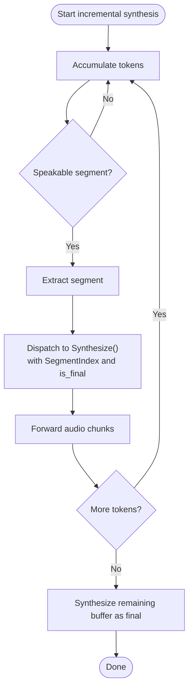
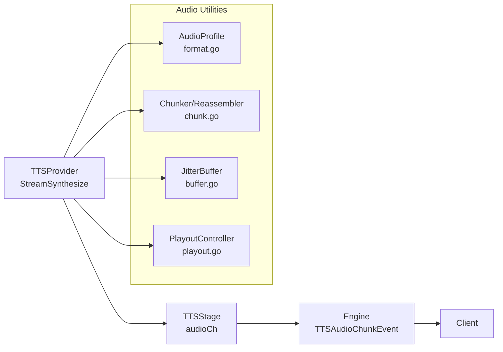
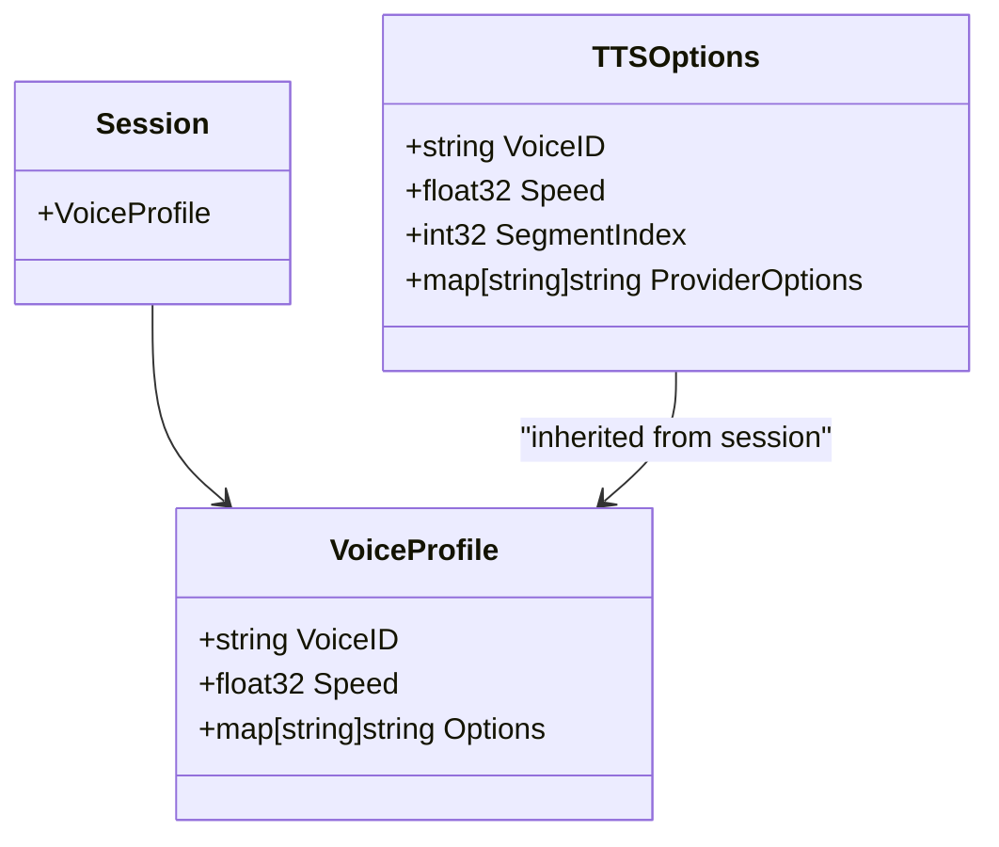
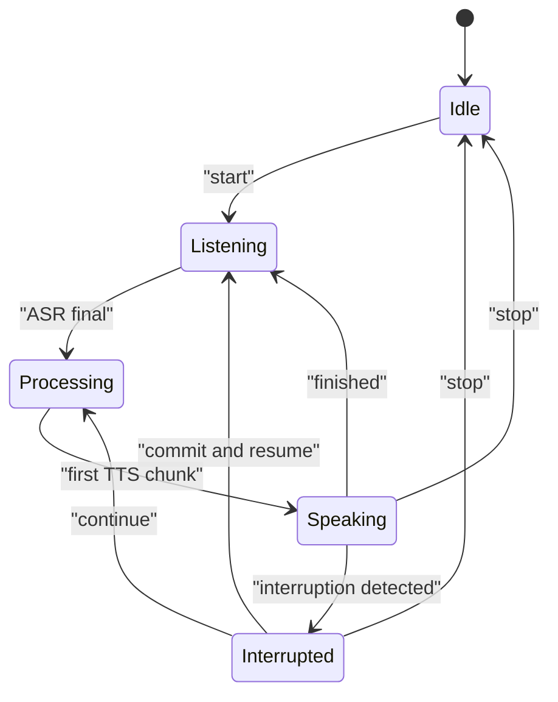
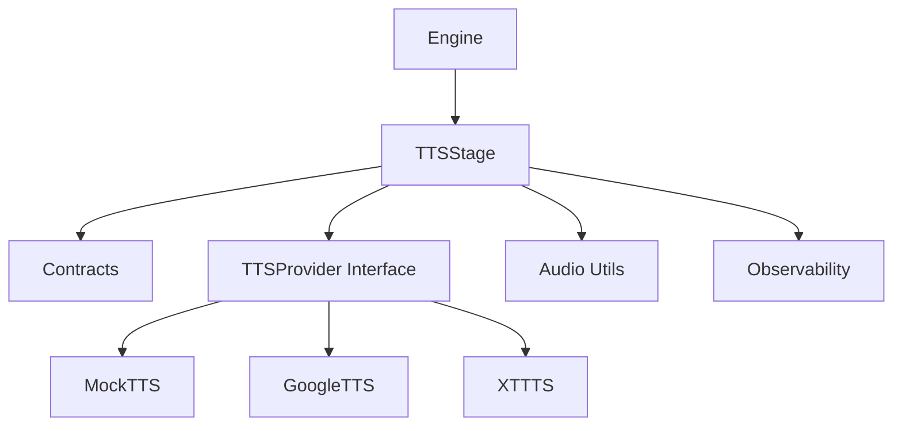

# TTS Stage

<cite>
**Referenced Files in This Document**
- [tts_stage.go](file://go/orchestrator/internal/pipeline/tts_stage.go)
- [interfaces.go](file://go/pkg/providers/interfaces.go)
- [tts.go](file://go/pkg/contracts/tts.go)
- [format.go](file://go/pkg/audio/format.go)
- [chunk.go](file://go/pkg/audio/chunk.go)
- [buffer.go](file://go/pkg/audio/buffer.go)
- [playout.go](file://go/pkg/audio/playout.go)
- [metrics.go](file://go/pkg/observability/metrics.go)
- [logger.go](file://go/pkg/observability/logger.go)
- [engine.go](file://go/orchestrator/internal/pipeline/engine.go)
- [state.go](file://go/pkg/session/state.go)
- [session.go](file://go/pkg/session/session.go)
- [mock_tts.py](file://py/provider_gateway/app/providers/tts/mock_tts.py)
- [google_tts.py](file://py/provider_gateway/app/providers/tts/google_tts.py)
- [xtts.py](file://py/provider_gateway/app/providers/tts/xtts.py)
- [seed-voices.yaml](file://examples/seed-voices.yaml)
</cite>

## Table of Contents
1. [Introduction](#introduction)
2. [Project Structure](#project-structure)
3. [Core Components](#core-components)
4. [Architecture Overview](#architecture-overview)
5. [Detailed Component Analysis](#detailed-component-analysis)
6. [Dependency Analysis](#dependency-analysis)
7. [Performance Considerations](#performance-considerations)
8. [Troubleshooting Guide](#troubleshooting-guide)
9. [Conclusion](#conclusion)
10. [Appendices](#appendices)

## Introduction
This document explains the Text-to-Speech (TTS) stage that synthesizes audio from Large Language Model (LLM) responses. It covers the synthesis pipeline, incremental synthesis for overlapping LLM and TTS, voice selection and provider options, audio format handling, buffering and streaming delivery, and integration with observability and session state. It also documents provider-specific configurations and customization options, along with performance tuning strategies.

## Project Structure
The TTS stage is implemented in the orchestrator pipeline and integrates with provider interfaces, audio processing utilities, and observability/metrics. The engine coordinates the end-to-end flow from audio input to LLM generation to TTS synthesis and audio delivery.

**Diagram sources**
- [engine.go:17-106](file://go/orchestrator/internal/pipeline/engine.go#L17-L106)
- [tts_stage.go:16-39](file://go/orchestrator/internal/pipeline/tts_stage.go#L16-L39)
- [interfaces.go:62-76](file://go/pkg/providers/interfaces.go#L62-L76)
- [tts.go:3-21](file://go/pkg/contracts/tts.go#L3-L21)
- [format.go:11-140](file://go/pkg/audio/format.go#L11-L140)
- [chunk.go:7-230](file://go/pkg/audio/chunk.go#L7-L230)
- [buffer.go:16-334](file://go/pkg/audio/buffer.go#L16-L334)
- [playout.go:9-383](file://go/pkg/audio/playout.go#L9-L383)
- [metrics.go:10-214](file://go/pkg/observability/metrics.go#L10-L214)
- [logger.go:13-168](file://go/pkg/observability/logger.go#L13-L168)
- [state.go:8-153](file://go/pkg/session/state.go#L8-L153)
- [session.go:61-249](file://go/pkg/session/session.go#L61-L249)
- [mock_tts.py:17-206](file://py/provider_gateway/app/providers/tts/mock_tts.py#L17-L206)
- [google_tts.py:14-107](file://py/provider_gateway/app/providers/tts/google_tts.py#L14-L107)
- [xtts.py:14-106](file://py/provider_gateway/app/providers/tts/xtts.py#L14-L106)

**Section sources**
- [engine.go:17-106](file://go/orchestrator/internal/pipeline/engine.go#L17-L106)
- [tts_stage.go:16-39](file://go/orchestrator/internal/pipeline/tts_stage.go#L16-L39)
- [interfaces.go:62-76](file://go/pkg/providers/interfaces.go#L62-L76)
- [tts.go:3-21](file://go/pkg/contracts/tts.go#L3-L21)
- [format.go:11-140](file://go/pkg/audio/format.go#L11-L140)
- [chunk.go:7-230](file://go/pkg/audio/chunk.go#L7-L230)
- [buffer.go:16-334](file://go/pkg/audio/buffer.go#L16-L334)
- [playout.go:9-383](file://go/pkg/audio/playout.go#L9-L383)
- [metrics.go:10-214](file://go/pkg/observability/metrics.go#L10-L214)
- [logger.go:13-168](file://go/pkg/observability/logger.go#L13-L168)
- [state.go:8-153](file://go/pkg/session/state.go#L8-L153)
- [session.go:61-249](file://go/pkg/session/session.go#L61-L249)
- [mock_tts.py:17-206](file://py/provider_gateway/app/providers/tts/mock_tts.py#L17-L206)
- [google_tts.py:14-107](file://py/provider_gateway/app/providers/tts/google_tts.py#L14-L107)
- [xtts.py:14-106](file://py/provider_gateway/app/providers/tts/xtts.py#L14-L106)

## Core Components
- TTSStage: Wraps a TTS provider with circuit breaker, metrics, and cancellation support. Provides synchronous synthesis and incremental synthesis with segment-aware dispatch.
- Provider Interface: Defines StreamSynthesize and Cancel for TTS providers.
- Contracts: Define TTSRequest/TTSResponse, including audio format, segment index, and timing metadata.
- Audio Utilities: Profiles, chunking, jitter buffering, and playout tracking for robust streaming.
- Observability: Metrics for TTS latency and durations, plus structured logging.
- Session Integration: Engine coordinates LLM token streaming and TTS synthesis, managing session state and interruptions.

**Section sources**
- [tts_stage.go:16-313](file://go/orchestrator/internal/pipeline/tts_stage.go#L16-L313)
- [interfaces.go:62-76](file://go/pkg/providers/interfaces.go#L62-L76)
- [tts.go:3-21](file://go/pkg/contracts/tts.go#L3-L21)
- [metrics.go:37-202](file://go/pkg/observability/metrics.go#L37-L202)
- [logger.go:13-168](file://go/pkg/observability/logger.go#L13-L168)
- [engine.go:210-375](file://go/orchestrator/internal/pipeline/engine.go#L210-L375)

## Architecture Overview
The TTS stage sits between LLM generation and audio delivery. The engine starts incremental synthesis, forwards LLM tokens to TTS, and streams audio chunks to the client via events. The stage records timing, applies circuit breaker protection, and supports cancellation.

**Diagram sources**
- [engine.go:210-375](file://go/orchestrator/internal/pipeline/engine.go#L210-L375)
- [tts_stage.go:129-236](file://go/orchestrator/internal/pipeline/tts_stage.go#L129-L236)
- [interfaces.go:62-76](file://go/pkg/providers/interfaces.go#L62-L76)

**Section sources**
- [engine.go:210-375](file://go/orchestrator/internal/pipeline/engine.go#L210-L375)
- [tts_stage.go:129-236](file://go/orchestrator/internal/pipeline/tts_stage.go#L129-L236)
- [interfaces.go:62-76](file://go/pkg/providers/interfaces.go#L62-L76)

## Detailed Component Analysis

### TTSStage Implementation
- Responsibilities:
  - Wrap a TTSProvider with circuit breaker and metrics.
  - Provide Synthesize(text, opts) returning a streaming audio channel.
  - Provide SynthesizeIncremental(tokenChan, opts) batching tokens into speakable segments and dispatching them to TTS.
  - Track active syntheses for cancellation and propagate provider cancellation.
- Key behaviors:
  - Uses a buffered channel for audio chunks with backpressure awareness.
  - Records timestamps for dispatch and first chunk delivery.
  - Applies circuit breaker protection around provider calls.
  - Supports segment indexing and finalization hints via provider options.

**Diagram sources**
- [tts_stage.go:16-39](file://go/orchestrator/internal/pipeline/tts_stage.go#L16-L39)
- [interfaces.go:62-76](file://go/pkg/providers/interfaces.go#L62-L76)

**Section sources**
- [tts_stage.go:16-313](file://go/orchestrator/internal/pipeline/tts_stage.go#L16-L313)
- [interfaces.go:62-76](file://go/pkg/providers/interfaces.go#L62-L76)

### Incremental Synthesis Pipeline
- Token accumulation: Tokens are appended to an internal buffer.
- Speakable segmentation: Segments are extracted at sentence or phrase boundaries, or when a minimum length threshold is met.
- Segment dispatch: Each segment is synthesized with a SegmentIndex and optional is_final hint.
- Streaming: Audio chunks from each segment are forwarded to the caller’s channel, preserving order and enabling overlap with LLM generation.

**Diagram sources**
- [tts_stage.go:129-236](file://go/orchestrator/internal/pipeline/tts_stage.go#L129-L236)
- [tts_stage.go:270-312](file://go/orchestrator/internal/pipeline/tts_stage.go#L270-L312)

**Section sources**
- [tts_stage.go:129-236](file://go/orchestrator/internal/pipeline/tts_stage.go#L129-L236)
- [tts_stage.go:270-312](file://go/orchestrator/internal/pipeline/tts_stage.go#L270-L312)

### Audio Generation, Format Conversion, and Streaming Delivery
- Audio profiles: Canonical and standard profiles define sample rates, channels, encodings, and frame sizes.
- Chunking and reassembly: Utilities split audio into frames and reassemble out-of-order chunks.
- Jitter buffering: Thread-safe queue with backpressure and notifications for smooth playout.
- Playout tracking: Tracks position, remaining time, and completion callbacks for client delivery.
- Streaming: Provider returns audio chunks; stage forwards them to the engine and client.

**Diagram sources**
- [tts_stage.go:41-127](file://go/orchestrator/internal/pipeline/tts_stage.go#L41-L127)
- [format.go:11-140](file://go/pkg/audio/format.go#L11-L140)
- [chunk.go:7-230](file://go/pkg/audio/chunk.go#L7-L230)
- [buffer.go:16-334](file://go/pkg/audio/buffer.go#L16-L334)
- [playout.go:299-383](file://go/pkg/audio/playout.go#L299-L383)

**Section sources**
- [format.go:11-140](file://go/pkg/audio/format.go#L11-L140)
- [chunk.go:7-230](file://go/pkg/audio/chunk.go#L7-L230)
- [buffer.go:16-334](file://go/pkg/audio/buffer.go#L16-L334)
- [playout.go:299-383](file://go/pkg/audio/playout.go#L299-L383)
- [tts_stage.go:41-127](file://go/orchestrator/internal/pipeline/tts_stage.go#L41-L127)

### Voice Selection Logic and Provider Options
- Voice selection: The engine passes VoiceID and speed from session voice profile to TTS options.
- Provider options: Segment-level is_final hints are passed via provider options to signal synthesis boundaries.
- Provider capabilities: Providers declare supported codecs, sample rates, and interruptibility.

**Diagram sources**
- [session.go:42-48](file://go/pkg/session/session.go#L42-L48)
- [engine.go:270-276](file://go/orchestrator/internal/pipeline/engine.go#L270-L276)
- [tts_stage.go:161-171](file://go/orchestrator/internal/pipeline/tts_stage.go#L161-L171)

**Section sources**
- [session.go:42-48](file://go/pkg/session/session.go#L42-L48)
- [engine.go:270-276](file://go/orchestrator/internal/pipeline/engine.go#L270-L276)
- [tts_stage.go:161-171](file://go/orchestrator/internal/pipeline/tts_stage.go#L161-L171)

### Provider-Specific Configurations and Customization
- Mock TTS: Produces PCM16 sine-wave audio with configurable chunk delay and frequency; supports cancellation.
- Google TTS: Declares preferred sample rates and supported codecs; stub implementation raises credential errors.
- XTTS: Declares preferred sample rates and supported codecs; stub implementation raises server requirement errors.
- Voice catalog: Example YAML demonstrates provider-specific voice identifiers and languages.

**Section sources**
- [mock_tts.py:17-206](file://py/provider_gateway/app/providers/tts/mock_tts.py#L17-L206)
- [google_tts.py:14-107](file://py/provider_gateway/app/providers/tts/google_tts.py#L14-L107)
- [xtts.py:14-106](file://py/provider_gateway/app/providers/tts/xtts.py#L14-L106)
- [seed-voices.yaml:1-29](file://examples/seed-voices.yaml#L1-L29)

### Integration with Session State and Interruptions
- Session state machine: Manages transitions across idle, listening, processing, speaking, and interrupted states.
- Interruption handling: Engine cancels LLM and TTS, records timestamps, and commits only spoken text to history.
- Turn management: Coordinates generation IDs and positions for accurate interruption handling.

**Diagram sources**
- [state.go:11-76](file://go/pkg/session/state.go#L11-L76)
- [engine.go:377-436](file://go/orchestrator/internal/pipeline/engine.go#L377-L436)

**Section sources**
- [state.go:11-76](file://go/pkg/session/state.go#L11-L76)
- [engine.go:377-436](file://go/orchestrator/internal/pipeline/engine.go#L377-L436)

## Dependency Analysis
- TTSStage depends on:
  - Provider interface for StreamSynthesize and Cancel.
  - Contracts for TTSRequest/TTSResponse and audio format.
  - Audio utilities for profiles, chunking, buffering, and playout.
  - Observability for metrics and logging.
  - Engine for incremental synthesis coordination and session context.
- Providers implement TTSProvider and declare capabilities; engine selects providers and passes options.

**Diagram sources**
- [tts_stage.go:16-39](file://go/orchestrator/internal/pipeline/tts_stage.go#L16-L39)
- [interfaces.go:62-76](file://go/pkg/providers/interfaces.go#L62-L76)
- [tts.go:3-21](file://go/pkg/contracts/tts.go#L3-L21)
- [engine.go:70-106](file://go/orchestrator/internal/pipeline/engine.go#L70-L106)
- [mock_tts.py:17-206](file://py/provider_gateway/app/providers/tts/mock_tts.py#L17-L206)
- [google_tts.py:14-107](file://py/provider_gateway/app/providers/tts/google_tts.py#L14-L107)
- [xtts.py:14-106](file://py/provider_gateway/app/providers/tts/xtts.py#L14-L106)

**Section sources**
- [tts_stage.go:16-39](file://go/orchestrator/internal/pipeline/tts_stage.go#L16-L39)
- [interfaces.go:62-76](file://go/pkg/providers/interfaces.go#L62-L76)
- [tts.go:3-21](file://go/pkg/contracts/tts.go#L3-L21)
- [engine.go:70-106](file://go/orchestrator/internal/pipeline/engine.go#L70-L106)

## Performance Considerations
- Latency metrics:
  - TTS time-to-first-chunk histogram for SLA monitoring.
  - End-to-end server TTFA for user-perceived latency.
- Throughput and backpressure:
  - Buffered channels and jitter buffers prevent overflow and underflow.
  - Frame-based chunking ensures consistent audio frame sizes.
- Provider selection:
  - Choose providers with preferred sample rates matching client needs.
  - Enable streaming output and interruptible generation for responsiveness.
- Tuning tips:
  - Adjust segment thresholds to balance latency vs. naturalness.
  - Tune jitter buffer size to match network variability.
  - Use appropriate audio profiles (telephony vs. WebRTC) for target devices.

[No sources needed since this section provides general guidance]

## Troubleshooting Guide
- Circuit breaker open:
  - Symptom: TTS synthesis fails immediately.
  - Action: Inspect provider health and retry policy; review error logs.
- Provider errors:
  - Use metrics counters for provider errors by type and provider.
  - Check provider-specific stubs for missing credentials or server setup.
- Cancellation:
  - Verify sessionID-based cancellation is invoked on interruption or stop.
  - Ensure activeSyntheses map is cleaned up after completion or cancellation.
- Audio artifacts:
  - Validate audio profile and codec compatibility.
  - Confirm chunk sizes align with frame sizes to avoid clicks or gaps.

**Section sources**
- [tts_stage.go:81-88](file://go/orchestrator/internal/pipeline/tts_stage.go#L81-L88)
- [metrics.go:58-82](file://go/pkg/observability/metrics.go#L58-L82)
- [google_tts.py:76-80](file://py/provider_gateway/app/providers/tts/google_tts.py#L76-L80)
- [xtts.py:75-79](file://py/provider_gateway/app/providers/tts/xtts.py#L75-L79)
- [tts_stage.go:238-258](file://go/orchestrator/internal/pipeline/tts_stage.go#L238-L258)

## Conclusion
The TTS stage provides a robust, observable, and cancellable bridge between LLM generation and audio delivery. Its incremental synthesis pipeline enables overlapping computation, while audio utilities ensure reliable streaming. Provider interfaces and session state integration deliver flexible voice selection and interruption handling. With proper configuration and tuning, the stage achieves low-latency, high-quality audio synthesis across diverse providers and client environments.

[No sources needed since this section summarizes without analyzing specific files]

## Appendices

### Example Workflows
- End-to-end synthesis:
  - Engine starts LLM generation and TTS incremental synthesis.
  - Tokens are forwarded to TTS; audio chunks are emitted as events.
  - Interruption cancels both LLM and TTS; only spoken text is committed.
- Provider selection:
  - Select voices from seed-voices catalog and pass VoiceID and speed to TTS options.

**Section sources**
- [engine.go:210-375](file://go/orchestrator/internal/pipeline/engine.go#L210-L375)
- [seed-voices.yaml:1-29](file://examples/seed-voices.yaml#L1-L29)

### Audio Format Requirements
- Supported encodings and sample rates are declared by providers.
- Canonical and standard profiles define frame sizes and bytes-per-sample for efficient chunking and playout.

**Section sources**
- [format.go:11-140](file://go/pkg/audio/format.go#L11-L140)
- [google_tts.py:46-56](file://py/provider_gateway/app/providers/tts/google_tts.py#L46-L56)
- [xtts.py:45-55](file://py/provider_gateway/app/providers/tts/xtts.py#L45-L55)

### Streaming Optimization Strategies
- Use jitter buffers to absorb network jitter and maintain steady playout.
- Segment synthesis at sentence boundaries to reduce perceived latency.
- Record and expose timing metrics for continuous optimization.

**Section sources**
- [buffer.go:16-334](file://go/pkg/audio/buffer.go#L16-L334)
- [tts_stage.go:129-236](file://go/orchestrator/internal/pipeline/tts_stage.go#L129-L236)
- [metrics.go:37-50](file://go/pkg/observability/metrics.go#L37-L50)