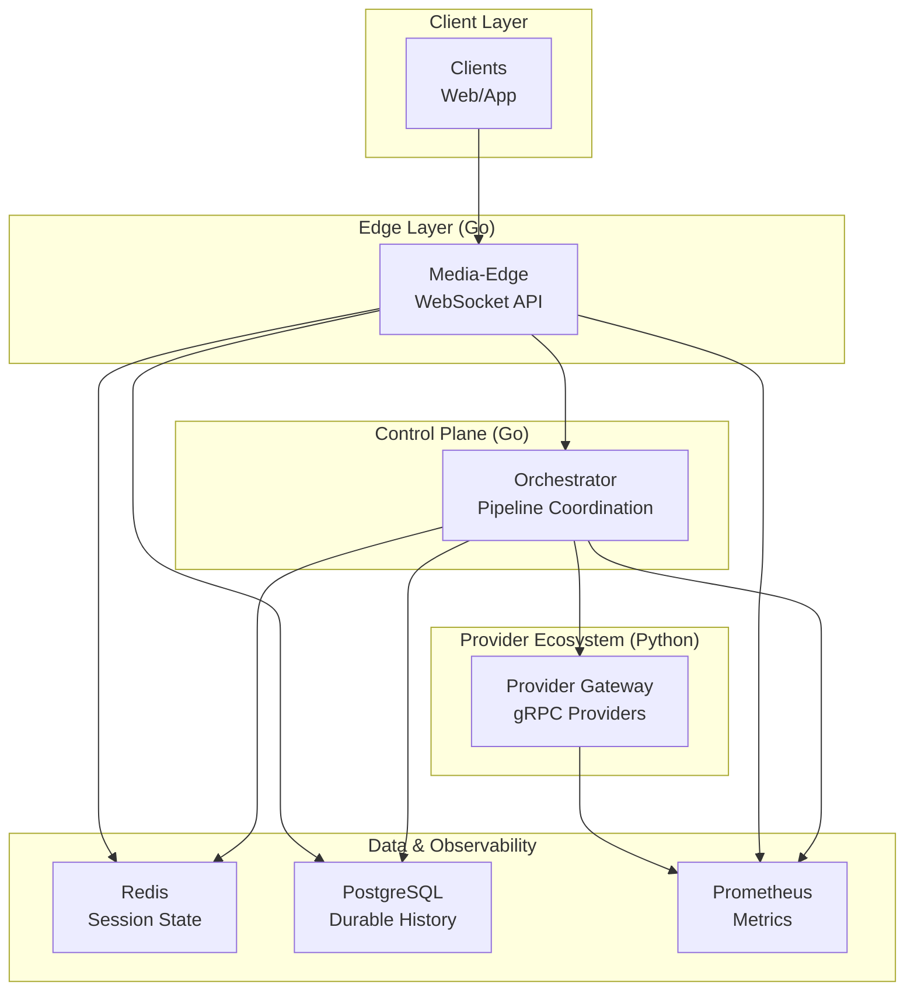
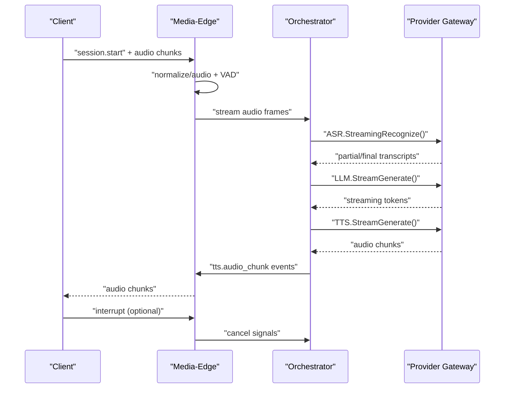
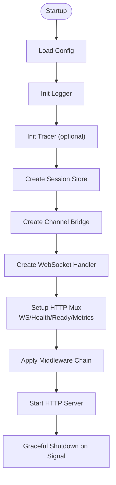
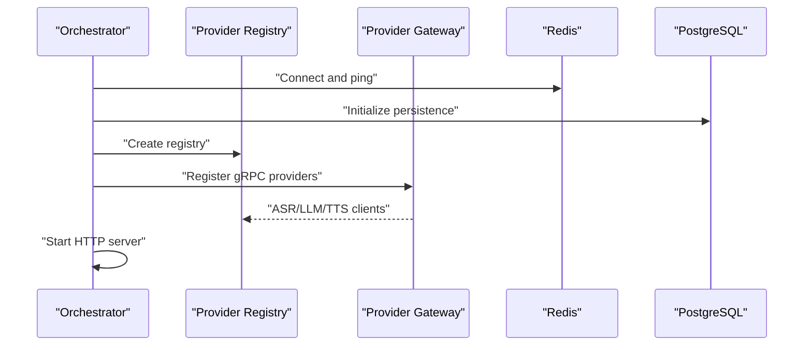
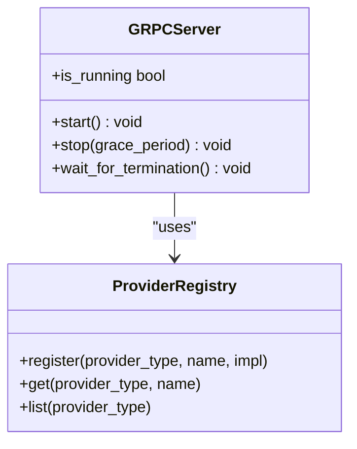
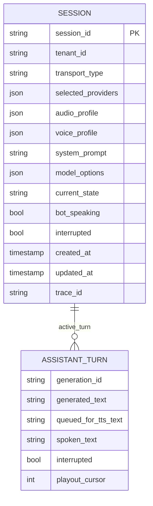
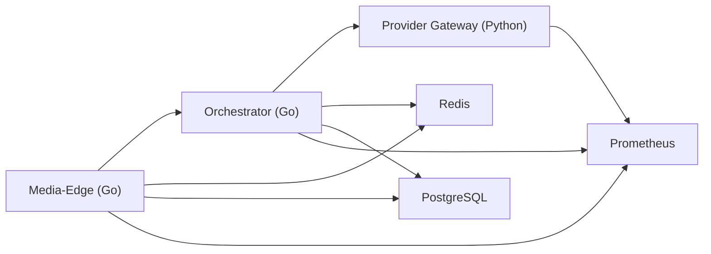
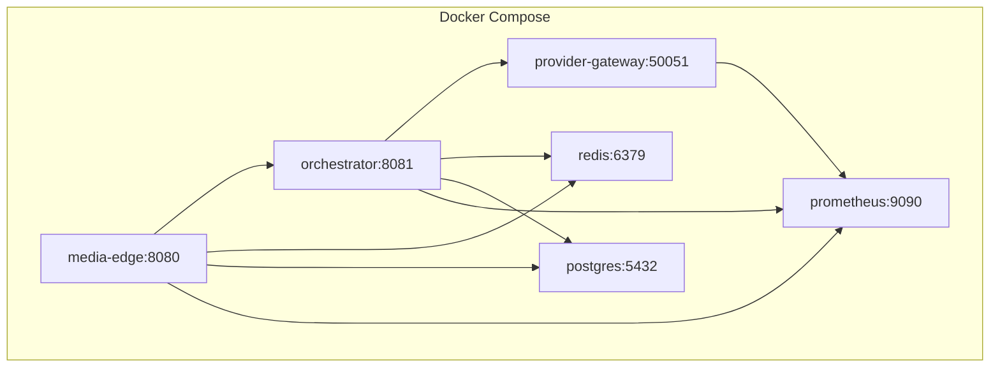

# Architecture Overview

<cite>
**Referenced Files in This Document**
- [README.md](file://README.md)
- [requirements.md](file://requirements.md)
- [go/go.mod](file://go/go.mod)
- [py/provider_gateway/pyproject.toml](file://py/provider_gateway/pyproject.toml)
- [infra/compose/docker-compose.yml](file://infra/compose/docker-compose.yml)
- [go/media-edge/cmd/main.go](file://go/media-edge/cmd/main.go)
- [go/orchestrator/cmd/main.go](file://go/orchestrator/cmd/main.go)
- [py/provider_gateway/main.py](file://py/provider_gateway/main.py)
- [py/provider_gateway/app/grpc_api/server.py](file://py/provider_gateway/app/grpc_api/server.py)
- [proto/asr.proto](file://proto/asr.proto)
- [proto/llm.proto](file://proto/llm.proto)
- [go/pkg/session/session.go](file://go/pkg/session/session.go)
- [go/pkg/providers/registry.go](file://go/pkg/providers/registry.go)
- [infra/k8s/media-edge.yaml](file://infra/k8s/media-edge.yaml)
- [infra/k8s/orchestrator.yaml](file://infra/k8s/orchestrator.yaml)
</cite>

## Table of Contents
1. [Introduction](#introduction)
2. [Project Structure](#project-structure)
3. [Core Components](#core-components)
4. [Architecture Overview](#architecture-overview)
5. [Detailed Component Analysis](#detailed-component-analysis)
6. [Dependency Analysis](#dependency-analysis)
7. [Performance Considerations](#performance-considerations)
8. [Troubleshooting Guide](#troubleshooting-guide)
9. [Conclusion](#conclusion)
10. [Appendices](#appendices)

## Introduction
This document describes the CloudApp system architecture centered on a three-tier microservices design:
- Media-Edge (Go/WS): WebSocket entry point for real-time audio streaming and client interaction.
- Orchestrator (Go): Pipeline coordinator managing session state, turn-taking, and provider orchestration.
- Provider Gateway (Python): Pluggable gRPC service hosting ASR, LLM, and TTS providers.

The system emphasizes low-latency real-time voice processing, pluggable providers, observability, and horizontal scalability. It integrates WebSocket APIs, gRPC contracts, and a provider ecosystem while maintaining strict separation of concerns between services.

## Project Structure
CloudApp is organized as a monorepo with clear boundaries:
- go/: Go services (Media-Edge, Orchestrator) and shared packages (audio, config, contracts, events, observability, providers, session).
- py/provider_gateway/: Python provider gateway exposing gRPC services for ASR, LLM, TTS, and VAD.
- proto/: Protocol Buffer contracts defining gRPC interfaces.
- infra/: Docker Compose and Kubernetes manifests for local and cluster deployments.
- examples/: Configuration templates for mock, local vLLM, and cloud provider modes.
- docs/: Architectural and operational documentation.

**Diagram sources**
- [README.md:5-35](file://README.md#L5-L35)
- [requirements.md:55-110](file://requirements.md#L55-L110)
- [infra/compose/docker-compose.yml:6-164](file://infra/compose/docker-compose.yml#L6-L164)

**Section sources**
- [README.md:47-102](file://README.md#L47-L102)
- [requirements.md:210-251](file://requirements.md#L210-L251)

## Core Components
- Media-Edge (Go)
  - Responsibilities: WebSocket API for clients, audio normalization, VAD, interruption detection, streaming to Orchestrator, and returning synthesized audio.
  - Integration: Exposes health/readiness/metrics endpoints; uses middleware for security, CORS, logging, and metrics.
  - Scalability: Stateless service; relies on Redis for session state and Postgres for durable history.

- Orchestrator (Go)
  - Responsibilities: Session state machine, turn management, pipeline orchestration (ASR→LLM→TTS), provider registry, persistence, and event emission.
  - Integration: Connects to Redis and Postgres; registers gRPC providers from Provider Gateway; exposes health/readiness/metrics.

- Provider Gateway (Python)
  - Responsibilities: Hosts pluggable ASR/LLM/TTS/VAD providers; exposes gRPC services; dynamic provider configuration; telemetry.
  - Integration: gRPC server with streaming RPCs; integrates with Python provider implementations; metrics via Prometheus.

- Shared Contracts and Types
  - Protocol Buffers define ASR, LLM, and TTS streaming contracts, session context, and timing metadata.
  - Go packages provide shared types, audio processing, session state, and provider registry.

**Section sources**
- [requirements.md:60-98](file://requirements.md#L60-L98)
- [requirements.md:111-137](file://requirements.md#L111-L137)
- [requirements.md:140-181](file://requirements.md#L140-L181)
- [proto/asr.proto:9-53](file://proto/asr.proto#L9-L53)
- [proto/llm.proto:9-59](file://proto/llm.proto#L9-L59)
- [go/pkg/session/session.go:61-84](file://go/pkg/session/session.go#L61-L84)
- [go/pkg/providers/registry.go:14-40](file://go/pkg/providers/registry.go#L14-L40)

## Architecture Overview
The system follows a real-time voice conversation pipeline:
- Clients connect to Media-Edge via WebSocket, sending audio chunks and receiving audio chunks plus control events.
- Media-Edge normalizes audio, applies VAD, detects interruptions, and streams audio to Orchestrator.
- Orchestrator coordinates the pipeline: ASR recognizes speech, LLM generates text, TTS synthesizes audio, and events are emitted back to Media-Edge.
- Media-Edge streams synthesized audio back to clients and tracks playout progress to support interruption.
- Provider Gateway hosts provider implementations and exposes gRPC services consumed by Orchestrator.

**Diagram sources**
- [README.md:7-35](file://README.md#L7-L35)
- [proto/asr.proto:10-18](file://proto/asr.proto#L10-L18)
- [proto/llm.proto:10-18](file://proto/llm.proto#L10-L18)
- [go/media-edge/cmd/main.go:94-127](file://go/media-edge/cmd/main.go#L94-L127)
- [go/orchestrator/cmd/main.go:122-149](file://go/orchestrator/cmd/main.go#L122-L149)

## Detailed Component Analysis

### Media-Edge (Go/WS)
- Entry point initializes logger, tracer, session store, WebSocket handler, and HTTP server with middleware chain.
- Exposes endpoints: WebSocket path, health, readiness, and metrics.
- Uses a channel bridge pattern to integrate with Orchestrator in MVP; Redis session store planned for production.
- Middleware stack includes recovery, logging, metrics, security headers, CORS, and optional auth.

**Diagram sources**
- [go/media-edge/cmd/main.go:30-180](file://go/media-edge/cmd/main.go#L30-L180)

**Section sources**
- [go/media-edge/cmd/main.go:94-180](file://go/media-edge/cmd/main.go#L94-L180)

### Orchestrator (Go)
- Initializes Redis and Postgres persistence, provider registry, and HTTP server.
- Registers gRPC providers pointing to Provider Gateway; sets defaults for ASR/LLM/TTS.
- Provides health and readiness endpoints; exposes metrics via Prometheus.

**Diagram sources**
- [go/orchestrator/cmd/main.go:73-193](file://go/orchestrator/cmd/main.go#L73-L193)

**Section sources**
- [go/orchestrator/cmd/main.go:73-193](file://go/orchestrator/cmd/main.go#L73-L193)

### Provider Gateway (Python)
- gRPC server exposes ASR, LLM, TTS, and Provider services; integrates with a provider registry.
- Supports async gRPC aio server with configurable worker threads and message size limits.
- Provides capability queries and cancellation RPCs aligned with protobuf contracts.

**Diagram sources**
- [py/provider_gateway/app/grpc_api/server.py:25-134](file://py/provider_gateway/app/grpc_api/server.py#L25-L134)
- [py/provider_gateway/main.py:1-13](file://py/provider_gateway/main.py#L1-L13)

**Section sources**
- [py/provider_gateway/app/grpc_api/server.py:54-134](file://py/provider_gateway/app/grpc_api/server.py#L54-L134)
- [py/provider_gateway/main.py:1-13](file://py/provider_gateway/main.py#L1-L13)

### Provider Contracts and Data Models
- ASRService and LLMService define streaming RPCs, cancellation, and capability queries.
- SessionContext and timing metadata propagate across services for observability and tracing.
- Shared types enable consistent provider behavior and metadata reporting.

**Diagram sources**
- [go/pkg/session/session.go:61-84](file://go/pkg/session/session.go#L61-L84)
- [go/pkg/session/session.go:140-157](file://go/pkg/session/session.go#L140-L157)

**Section sources**
- [proto/asr.proto:9-53](file://proto/asr.proto#L9-L53)
- [proto/llm.proto:9-59](file://proto/llm.proto#L9-L59)
- [go/pkg/session/session.go:61-84](file://go/pkg/session/session.go#L61-L84)

## Dependency Analysis
- Technology stack and compatibility:
  - Go 1.22+ for Media-Edge and Orchestrator.
  - Python 3.10+ for Provider Gateway (Python 3.11+ recommended).
  - gRPC and Protocol Buffers for inter-service communication.
  - Redis for session state and caching; PostgreSQL for durable history.
  - Prometheus for metrics; OpenTelemetry for tracing.

- Inter-service dependencies:
  - Media-Edge depends on Orchestrator for pipeline coordination.
  - Orchestrator depends on Provider Gateway for ASR/LLM/TTS.
  - All services export Prometheus metrics and support health/readiness probes.

**Diagram sources**
- [go/go.mod:3](file://go/go.mod#L3)
- [py/provider_gateway/pyproject.toml:10](file://py/provider_gateway/pyproject.toml#L10)
- [infra/compose/docker-compose.yml:69-91](file://infra/compose/docker-compose.yml#L69-L91)

**Section sources**
- [go/go.mod:3-17](file://go/go.mod#L3-L17)
- [py/provider_gateway/pyproject.toml:10](file://py/provider_gateway/pyproject.toml#L10)
- [requirements.md:34-44](file://requirements.md#L34-L44)

## Performance Considerations
- Real-time voice processing constraints:
  - Canonical internal format: PCM16 mono 16 kHz for ASR/VAD.
  - Support for telephony (8/16 kHz) and WebRTC (48 kHz) profiles with resampling abstraction.
  - Interruption/barge-in requires precise playout tracking to avoid committing unspoken text.

- Latency-critical paths:
  - WebSocket audio streaming and event emission must minimize buffering and backpressure.
  - gRPC streaming RPCs should be configured with appropriate message size limits and timeouts.
  - Provider selection and capability discovery should be cached or pre-warmed.

- Scalability:
  - Stateless Media-Edge with horizontal replicas behind a load balancer.
  - Orchestrator stateless with Redis-backed session store and Postgres for history.
  - Provider Gateway can scale independently; consider GPU workers for compute-heavy providers.

[No sources needed since this section provides general guidance]

## Troubleshooting Guide
- Health and readiness:
  - Media-Edge and Orchestrator expose /health and /ready endpoints; verify connectivity and dependency health.
  - Provider Gateway health checks use a simple socket probe.

- Observability:
  - Enable OpenTelemetry tracing and Prometheus metrics; monitor key latency metrics (ASR/LLM/TTS timings).
  - Inspect logs for middleware errors, provider timeouts, and session state transitions.

- Common issues:
  - Provider gateway unreachable: confirm gRPC address and network connectivity.
  - Session state inconsistencies: validate Redis connectivity and TTL settings.
  - Audio quality problems: verify audio profile conversions and resampling.

**Section sources**
- [go/media-edge/cmd/main.go:99-121](file://go/media-edge/cmd/main.go#L99-L121)
- [go/orchestrator/cmd/main.go:125-145](file://go/orchestrator/cmd/main.go#L125-L145)
- [infra/compose/docker-compose.yml:29-34](file://infra/compose/docker-compose.yml#L29-L34)
- [infra/compose/docker-compose.yml:62-67](file://infra/compose/docker-compose.yml#L62-L67)
- [infra/compose/docker-compose.yml:86-91](file://infra/compose/docker-compose.yml#L86-L91)

## Conclusion
CloudApp’s three-tier microservices architecture separates real-time media handling (Media-Edge), orchestration (Orchestrator), and provider hosting (Provider Gateway). The design leverages WebSocket APIs, gRPC contracts, and pluggable providers to achieve low-latency, scalable, and extensible real-time voice processing. With Redis and PostgreSQL for state and durability, and comprehensive observability, the system is production-ready for experimentation and growth.

[No sources needed since this section summarizes without analyzing specific files]

## Appendices

### Deployment Topology and Infrastructure
- Docker Compose: Full-stack local deployment with Media-Edge, Orchestrator, Provider Gateway, Redis, PostgreSQL, and Prometheus.
- Kubernetes: Stub manifests for Media-Edge and Orchestrator deployments with probes and metrics scraping; update image references and resource limits before production.

**Diagram sources**
- [infra/compose/docker-compose.yml:6-164](file://infra/compose/docker-compose.yml#L6-L164)

**Section sources**
- [infra/compose/docker-compose.yml:6-164](file://infra/compose/docker-compose.yml#L6-L164)
- [infra/k8s/media-edge.yaml:14-74](file://infra/k8s/media-edge.yaml#L14-L74)
- [infra/k8s/orchestrator.yaml:14-74](file://infra/k8s/orchestrator.yaml#L14-L74)

### Cross-Cutting Concerns
- Security: Middleware stack includes security headers, CORS, and optional auth; configure allowed origins and tokens.
- Monitoring: Prometheus metrics endpoints; OpenTelemetry tracing enabled in services.
- Disaster Recovery: PostgreSQL for durable history; Redis for hot state; ensure backups and replication policies.

**Section sources**
- [go/media-edge/cmd/main.go:128-136](file://go/media-edge/cmd/main.go#L128-L136)
- [requirements.md:397-432](file://requirements.md#L397-L432)

### Provider Registry and Resolution
- ProviderRegistry supports global defaults, tenant overrides, session-level, and request-level provider selection.
- Validates provider availability and ensures consistent resolution across services.

**Section sources**
- [go/pkg/providers/registry.go:166-261](file://go/pkg/providers/registry.go#L166-L261)