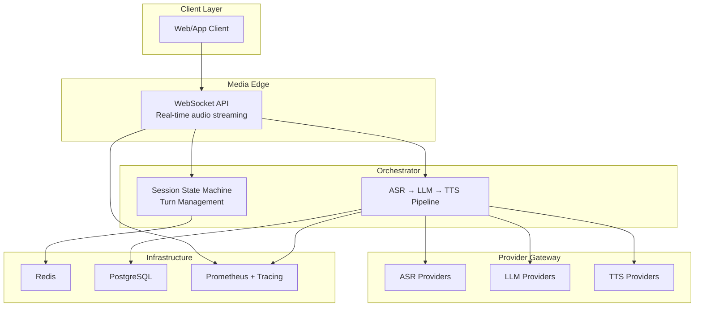
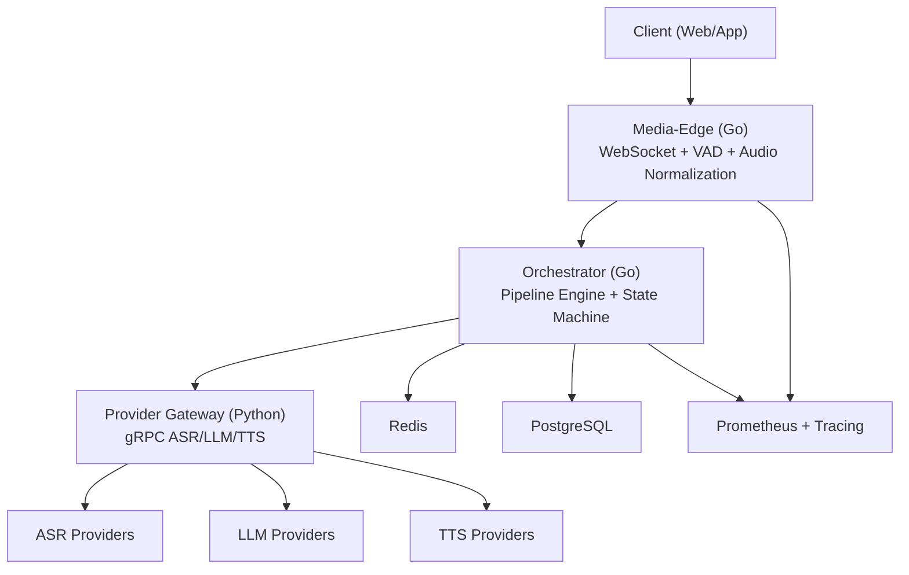
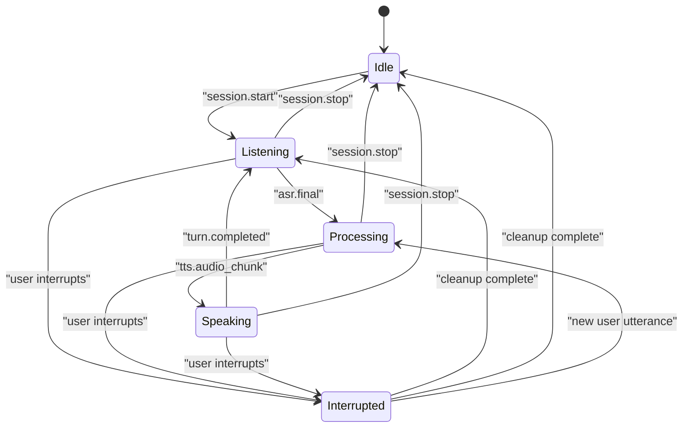
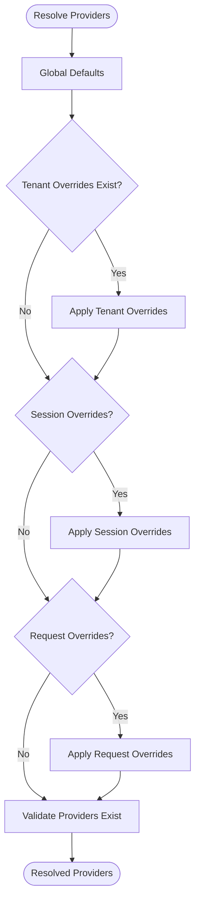
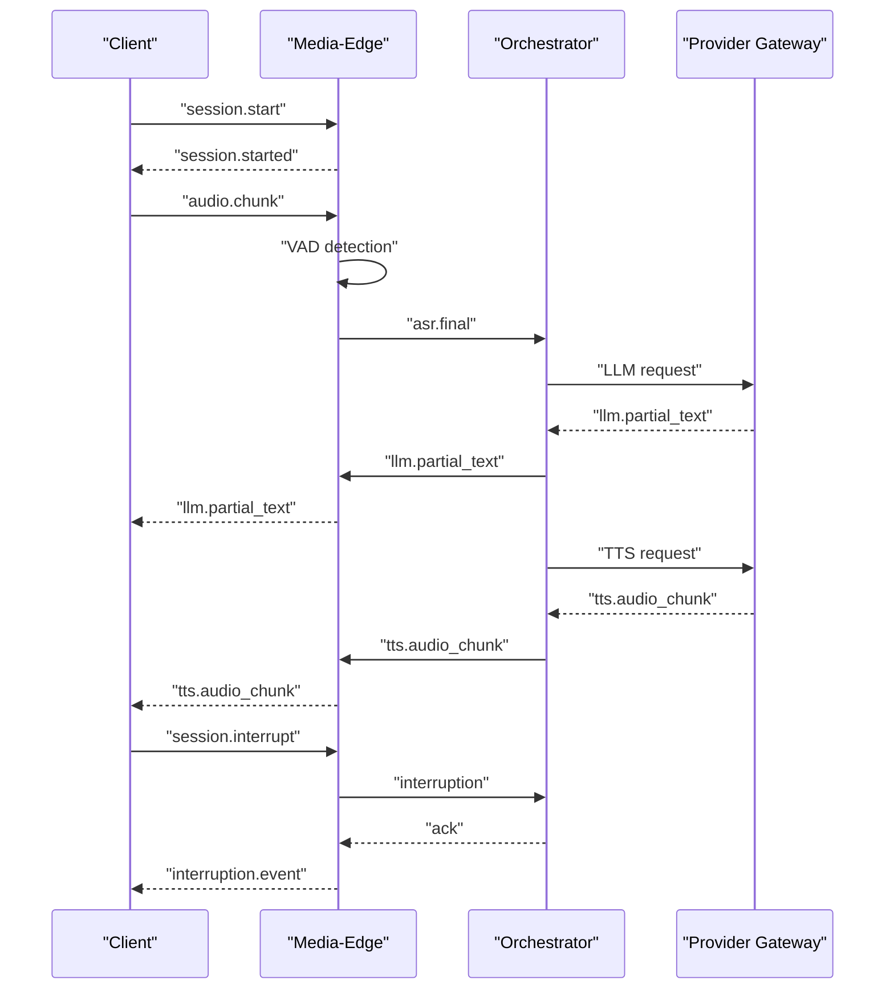
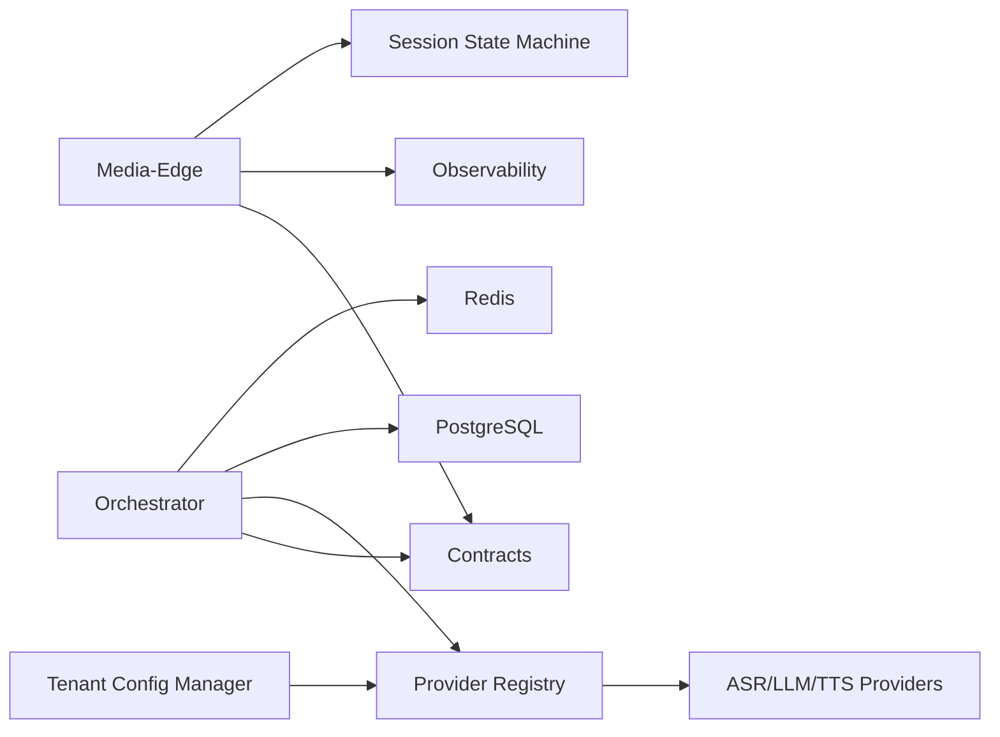

# Introduction and Purpose

<cite>
**Referenced Files in This Document**
- [README.md](file://README.md)
- [requirements.md](file://requirements.md)
- [go/media-edge/cmd/main.go](file://go/media-edge/cmd/main.go)
- [go/orchestrator/cmd/main.go](file://go/orchestrator/cmd/main.go)
- [go/pkg/session/state.go](file://go/pkg/session/state.go)
- [go/pkg/session/session.go](file://go/pkg/session/session.go)
- [go/pkg/session/history.go](file://go/pkg/session/history.go)
- [go/pkg/config/tenant.go](file://go/pkg/config/tenant.go)
- [go/pkg/providers/registry.go](file://go/pkg/providers/registry.go)
- [docs/session-interruption.md](file://docs/session-interruption.md)
- [docs/websocket-api.md](file://docs/websocket-api.md)
- [go/pkg/contracts/common.go](file://go/pkg/contracts/common.go)
- [examples/config-cloud.yaml](file://examples/config-cloud.yaml)
</cite>

## Table of Contents
1. [Introduction](#introduction)
2. [Project Structure](#project-structure)
3. [Core Components](#core-components)
4. [Architecture Overview](#architecture-overview)
5. [Detailed Component Analysis](#detailed-component-analysis)
6. [Dependency Analysis](#dependency-analysis)
7. [Performance Considerations](#performance-considerations)
8. [Troubleshooting Guide](#troubleshooting-guide)
9. [Conclusion](#conclusion)
10. [Appendices](#appendices)

## Introduction
CloudApp is a production-grade, real-time voice conversation platform designed to deliver natural, low-latency voice interactions with AI. It enables seamless, human-like conversations over WebSocket, with robust support for barge-in (interruption), precise session state management, and multi-tenant provider configuration. The platform’s architecture separates concerns across a media-edge service (handling real-time audio and WebSocket control), an orchestrator (managing the ASR → LLM → TTS pipeline and session state), and a provider gateway (exposing pluggable AI providers via gRPC). Enterprise-grade observability ensures visibility into performance and reliability.

Why CloudApp exists:
- To solve the real-world challenge of building natural, interruption-safe voice experiences at scale.
- To provide a session state machine that enforces correct turn-taking and interruption semantics.
- To offer multi-tenant configuration so teams can isolate provider choices, security policies, and audio profiles per tenant.
- To support barge-in and interruption handling that discards unspoken assistant text, preserving accurate conversation history.
- To enable practical use cases such as customer service bots, virtual assistants, and interactive voice applications.

Target use cases:
- Customer service bots that must support interruptions and maintain accurate transcripts.
- Virtual assistants and NPCs requiring responsive, low-latency voice replies.
- Interactive voice applications across web and telephony transports.

## Project Structure
CloudApp is organized as a monorepo with clear separation of responsibilities:
- go/media-edge: WebSocket gateway for real-time audio streaming and control.
- go/orchestrator: Pipeline orchestration and session state management.
- go/pkg: Shared libraries for audio processing, configuration, contracts, events, observability, providers, and session management.
- py/provider_gateway: Python-based provider gateway exposing ASR, LLM, and TTS providers via gRPC.
- proto: Protocol buffer definitions for cross-language contracts.
- infra: Docker Compose and Kubernetes manifests, migrations, and monitoring.
- docs: Comprehensive documentation for architecture, provider integration, API, and operational topics.
- examples: Example configurations for local and cloud provider setups.

**Diagram sources**
- [README.md: Architecture Overview:7-35](file://README.md#L7-L35)
- [go/media-edge/cmd/main.go: HTTP server and WebSocket handler:94-151](file://go/media-edge/cmd/main.go#L94-L151)
- [go/orchestrator/cmd/main.go: Orchestrator initialization:108-120](file://go/orchestrator/cmd/main.go#L108-L120)

**Section sources**
- [README.md: Repository Structure:47-102](file://README.md#L47-L102)

## Core Components
- Real-time WebSocket API: Bidirectional audio streaming with JSON control messages for session lifecycle, VAD events, ASR results, LLM streaming, and TTS audio chunks.
- Barge-in / Interruption Support: Detects user speech during assistant playback, cancels active LLM and TTS, truncates assistant turns to spoken text, and commits only spoken text to history.
- Pluggable Provider Architecture: Swappable ASR, LLM, and TTS providers via gRPC; provider capabilities and selection are managed centrally.
- Session State Machine: Enforces valid state transitions across Idle → Listening → Processing → Speaking → Interrupted and back, ensuring predictable conversation flow.
- Multi-tenant: Per-tenant provider overrides, audio profiles, and security settings enable isolated environments and experimentation.
- Observability: Structured logging, Prometheus metrics, and OpenTelemetry tracing for latency, throughput, and error tracking.

**Section sources**
- [README.md: Key Features:37-46](file://README.md#L37-L46)
- [docs/websocket-api.md: Client → Server and Server → Client messages:24-442](file://docs/websocket-api.md#L24-L442)
- [docs/session-interruption.md: Interruption flow and state transitions:147-233](file://docs/session-interruption.md#L147-L233)
- [go/pkg/session/state.go: Session state machine:8-76](file://go/pkg/session/state.go#L8-L76)
- [go/pkg/config/tenant.go: Tenant overrides:9-44](file://go/pkg/config/tenant.go#L9-L44)
- [go/pkg/providers/registry.go: Provider resolution:166-251](file://go/pkg/providers/registry.go#L166-L251)

## Architecture Overview
CloudApp’s architecture centers on a media-edge WebSocket service that handles real-time audio and control messages, an orchestrator that manages the ASR → LLM → TTS pipeline and session state, and a provider gateway that exposes pluggable AI providers via gRPC. Redis persists hot session state, while PostgreSQL stores durable transcripts and history. Observability is integrated across services.

**Diagram sources**
- [README.md: Architecture Overview:7-35](file://README.md#L7-L35)
- [go/media-edge/cmd/main.go: Media-edge entry point:30-180](file://go/media-edge/cmd/main.go#L30-L180)
- [go/orchestrator/cmd/main.go: Orchestrator entry point:26-193](file://go/orchestrator/cmd/main.go#L26-L193)
- [go/pkg/providers/registry.go: Provider registry:31-40](file://go/pkg/providers/registry.go#L31-L40)

## Detailed Component Analysis

### Session State Machine and Turn Management
CloudApp models conversation turns and states to ensure correct turn-taking and interruption semantics. The session state machine defines valid transitions and guards against invalid state changes. Assistant turns track three text states: generated text, queued for TTS, and spoken text. Only spoken text is committed to history, preventing the AI from “remembering” unspoken content.

**Diagram sources**
- [go/pkg/session/state.go: State definitions and transitions:8-76](file://go/pkg/session/state.go#L8-L76)
- [docs/session-interruption.md: Turn model and interruption flow:105-146](file://docs/session-interruption.md#L105-L146)

**Section sources**
- [go/pkg/session/state.go: StateMachine and transitions:81-153](file://go/pkg/session/state.go#L81-L153)
- [go/pkg/session/session.go: Session fields and runtime state:62-84](file://go/pkg/session/session.go#L62-L84)
- [go/pkg/session/history.go: History commitment rules:12-16](file://go/pkg/session/history.go#L12-L16)

### Multi-Tenant Provider Resolution
CloudApp supports multi-tenant environments by allowing per-tenant provider overrides, audio profiles, and model options. Provider resolution follows a strict priority: request-level overrides, session-level overrides, tenant-level overrides, and finally global defaults. This enables teams to isolate provider choices and experiment safely.

**Diagram sources**
- [go/pkg/providers/registry.go: Provider resolution:172-251](file://go/pkg/providers/registry.go#L172-L251)
- [go/pkg/config/tenant.go: Tenant overrides:9-44](file://go/pkg/config/tenant.go#L9-L44)

**Section sources**
- [go/pkg/providers/registry.go: ResolveForSession:172-251](file://go/pkg/providers/registry.go#L172-L251)
- [go/pkg/config/tenant.go: TenantConfigManager:46-131](file://go/pkg/config/tenant.go#L46-L131)

### WebSocket API and Real-Time Interaction
The WebSocket API defines the contract for real-time voice interactions. Clients send audio chunks and control messages, while servers respond with VAD events, ASR results, LLM streaming tokens, and TTS audio chunks. The API supports session lifecycle control, mid-conversation updates, and manual interruption.

**Diagram sources**
- [docs/websocket-api.md: Message types and flows:24-442](file://docs/websocket-api.md#L24-L442)
- [go/media-edge/cmd/main.go: WebSocket handler setup:84-91](file://go/media-edge/cmd/main.go#L84-L91)
- [go/orchestrator/cmd/main.go: Orchestrator engine creation:108-120](file://go/orchestrator/cmd/main.go#L108-L120)

**Section sources**
- [docs/websocket-api.md: Client → Server and Server → Client messages:24-442](file://docs/websocket-api.md#L24-L442)
- [go/pkg/contracts/common.go: Provider capability and error types:130-139](file://go/pkg/contracts/common.go#L130-L139)

### Practical Scenarios and Competitive Advantages
Common scenarios where CloudApp excels:
- Customer service bots: Support barge-in to quickly redirect the conversation, discard unspoken AI text, and maintain accurate transcripts.
- Virtual assistants: Provide responsive, low-latency replies with interruption handling and multi-tenant isolation for different brands or departments.
- Interactive voice apps: Seamlessly integrate across web and telephony transports with consistent session state and provider flexibility.

Competitive advantages:
- Barge-in and interruption handling with precise playout tracking and text-to-audio mapping.
- Multi-tenant provider configuration enabling isolated environments and A/B experiments.
- Pluggable provider architecture with capability discovery and idempotent cancellation.
- Real-time WebSocket API with structured events for VAD, ASR, LLM, and TTS.
- Enterprise-grade observability with metrics and tracing.

**Section sources**
- [docs/session-interruption.md: Interruption flow and playout tracking:147-284](file://docs/session-interruption.md#L147-L284)
- [go/pkg/session/history.go: Only spoken text committed:12-16](file://go/pkg/session/history.go#L12-L16)
- [examples/config-cloud.yaml: Multi-tenant provider configuration:12-31](file://examples/config-cloud.yaml#L12-L31)

## Dependency Analysis
CloudApp’s dependencies reflect a clean separation of concerns:
- Media-Edge depends on session state, audio normalization, and observability.
- Orchestrator depends on Redis and PostgreSQL for persistence, provider registry for provider selection, and pipeline stages for orchestration.
- Provider Registry encapsulates provider resolution and capability validation.
- Tenant Config Manager centralizes per-tenant overrides.

**Diagram sources**
- [go/media-edge/cmd/main.go: Dependencies and middleware:17-91](file://go/media-edge/cmd/main.go#L17-L91)
- [go/orchestrator/cmd/main.go: Redis and persistence:73-99](file://go/orchestrator/cmd/main.go#L73-L99)
- [go/pkg/providers/registry.go: Provider resolution:172-251](file://go/pkg/providers/registry.go#L172-L251)
- [go/pkg/config/tenant.go: Tenant overrides:46-131](file://go/pkg/config/tenant.go#L46-L131)

**Section sources**
- [go/media-edge/cmd/main.go: Service initialization:30-180](file://go/media-edge/cmd/main.go#L30-L180)
- [go/orchestrator/cmd/main.go: Orchestrator initialization:26-193](file://go/orchestrator/cmd/main.go#L26-L193)

## Performance Considerations
- Latency targets: VAD speech detection under 100 ms, playout stop under 50 ms, LLM cancellation under 100 ms, TTS cancellation under 50 ms, total interruption latency under 300 ms.
- Optimization strategies: Tune VAD sensitivity, clear output buffers immediately on interruption, use async cancellation, and maintain accurate playout position.
- Throughput: Horizontal scaling via stateless media-edge with Redis-backed session storage; provider gateway can be scaled independently.

[No sources needed since this section provides general guidance]

## Troubleshooting Guide
Common issues and resolutions:
- Interruption not working: Verify VAD detects speech during bot speech, confirm interruptions are enabled in configuration, and ensure providers support cancellation.
- Partial text committed incorrectly: Check playout cursor accuracy, review text-to-duration estimation, and ensure output buffers are cleared promptly.
- Audio continues after interruption: Confirm output buffer clearing, check for race conditions, and verify client-side audio queue clearing.

**Section sources**
- [docs/session-interruption.md: Common issues and diagnostics:436-458](file://docs/session-interruption.md#L436-L458)

## Conclusion
CloudApp delivers a production-grade, real-time voice conversation platform with barge-in support, robust session state management, and multi-tenant provider configuration. Its pluggable architecture, enterprise observability, and WebSocket-first API make it ideal for customer service bots, virtual assistants, and interactive voice applications. By enforcing interruption semantics and committing only spoken text to history, CloudApp ensures natural, accurate, and reliable voice experiences at scale.

[No sources needed since this section summarizes without analyzing specific files]

## Appendices
- Example configurations demonstrate multi-tenant provider setups for cloud providers and local experimentation.
- Provider capability types and error codes define the contract between orchestrator and provider gateway.

**Section sources**
- [examples/config-cloud.yaml: Cloud provider configuration:12-39](file://examples/config-cloud.yaml#L12-L39)
- [go/pkg/contracts/common.go: Provider capability and error types:130-139](file://go/pkg/contracts/common.go#L130-L139)