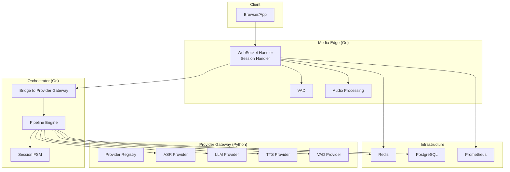
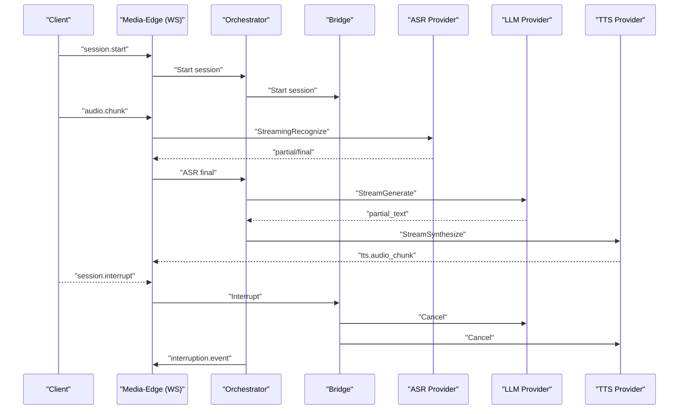
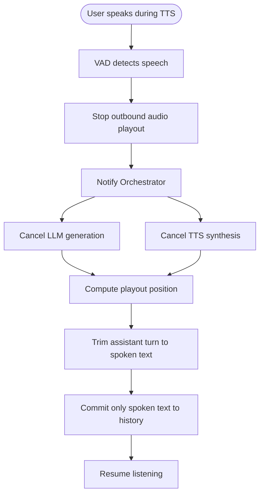
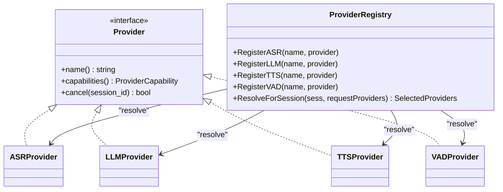
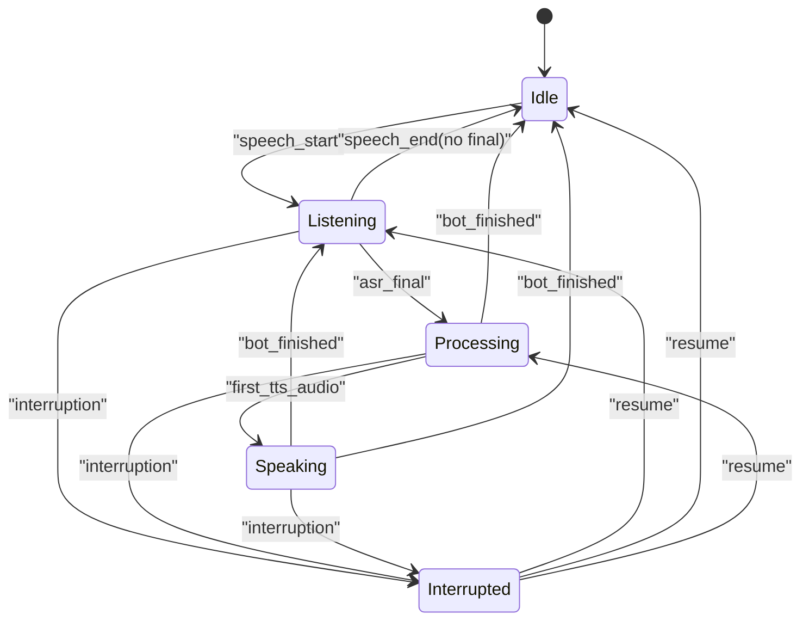
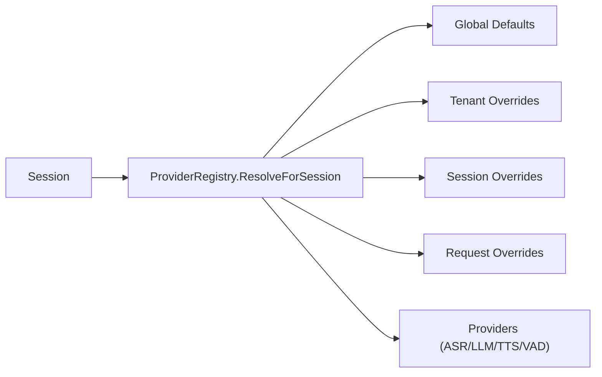

# Key Features and Benefits

<cite>
**Referenced Files in This Document**
- [README.md](file://README.md)
- [docs/websocket-api.md](file://docs/websocket-api.md)
- [docs/session-interruption.md](file://docs/session-interruption.md)
- [docs/provider-architecture.md](file://docs/provider-architecture.md)
- [go/media-edge/internal/handler/websocket.go](file://go/media-edge/internal/handler/websocket.go)
- [go/orchestrator/internal/statemachine/fsm.go](file://go/orchestrator/internal/statemachine/fsm.go)
- [go/pkg/session/state.go](file://go/pkg/session/state.go)
- [go/pkg/config/tenant.go](file://go/pkg/config/tenant.go)
- [go/pkg/observability/logger.go](file://go/pkg/observability/logger.go)
- [go/pkg/observability/metrics.go](file://go/pkg/observability/metrics.go)
- [go/pkg/observability/tracing.go](file://go/pkg/observability/tracing.go)
- [go/pkg/providers/registry.go](file://go/pkg/providers/registry.go)
- [go/pkg/session/redis_store.go](file://go/pkg/session/redis_store.go)
- [go/pkg/session/postgres_store.go](file://go/pkg/session/postgres_store.go)
- [infra/k8s/media-edge.yaml](file://infra/k8s/media-edge.yaml)
- [infra/k8s/orchestrator.yaml](file://infra/k8s/orchestrator.yaml)
</cite>

## Table of Contents
1. [Introduction](#introduction)
2. [Project Structure](#project-structure)
3. [Core Components](#core-components)
4. [Architecture Overview](#architecture-overview)
5. [Detailed Component Analysis](#detailed-component-analysis)
6. [Dependency Analysis](#dependency-analysis)
7. [Performance Considerations](#performance-considerations)
8. [Troubleshooting Guide](#troubleshooting-guide)
9. [Conclusion](#conclusion)

## Introduction
CloudApp delivers a production-grade, real-time voice conversation platform with a focus on low-latency, natural interactions. Its key differentiators include:
- Real-time WebSocket API with bidirectional audio streaming and JSON control messages
- Barge-in/interruption support that cleanly truncates AI responses and discards unspoken text
- Pluggable provider architecture enabling seamless swapping of ASR, LLM, and TTS providers
- A robust session state machine managing lifecycle states and turn transitions
- Multi-tenant capabilities with per-tenant provider configuration and session isolation
- Enterprise-grade observability with structured logging, Prometheus metrics, and OpenTelemetry tracing
- Horizontal scaling via stateless media-edge services and Redis-backed session stores

These features combine to deliver responsive, reliable, and extensible voice experiences suitable for enterprise deployments.

## Project Structure
CloudApp is organized into:
- Go services: media-edge (WebSocket gateway), orchestrator (pipeline coordination), pkg (shared libraries)
- Python provider gateway: pluggable ASR/LLM/TTS/VAD implementations
- Protobuf contracts: gRPC service definitions
- Infrastructure: Dockerfiles, Kubernetes manifests, and Prometheus configuration
- Docs and examples: API reference, provider architecture, and configuration examples

**Diagram sources**
- [go/media-edge/internal/handler/websocket.go:22-92](file://go/media-edge/internal/handler/websocket.go#L22-L92)
- [go/orchestrator/internal/statemachine/fsm.go:44-92](file://go/orchestrator/internal/statemachine/fsm.go#L44-L92)
- [go/pkg/providers/registry.go:15-40](file://go/pkg/providers/registry.go#L15-L40)
- [go/pkg/session/redis_store.go:12-36](file://go/pkg/session/redis_store.go#L12-L36)
- [go/pkg/session/postgres_store.go:10-23](file://go/pkg/session/postgres_store.go#L10-L23)

**Section sources**
- [README.md:47-102](file://README.md#L47-L102)

## Core Components
- Real-time WebSocket API: Bidirectional audio streaming and JSON control messages for session lifecycle and interruptions
- Barge-in/interruption: VAD-driven interruption, playout tracking, and truncation of unspoken text
- Pluggable provider architecture: Python-based providers with gRPC, capability negotiation, and multi-level provider selection
- Session state machine: Strict state transitions and turn lifecycle management
- Multi-tenant configuration: Per-tenant provider overrides and session isolation
- Observability: Structured logging, Prometheus metrics, and OpenTelemetry tracing
- Horizontal scaling: Stateless media-edge services and Redis-backed session stores

**Section sources**
- [README.md:37-46](file://README.md#L37-L46)
- [docs/websocket-api.md:1-622](file://docs/websocket-api.md#L1-L622)
- [docs/session-interruption.md:1-458](file://docs/session-interruption.md#L1-L458)
- [docs/provider-architecture.md:1-320](file://docs/provider-architecture.md#L1-L320)
- [go/pkg/session/state.go:8-80](file://go/pkg/session/state.go#L8-L80)
- [go/pkg/config/tenant.go:9-45](file://go/pkg/config/tenant.go#L9-L45)
- [go/pkg/observability/logger.go:13-59](file://go/pkg/observability/logger.go#L13-L59)
- [go/pkg/observability/metrics.go:10-82](file://go/pkg/observability/metrics.go#L10-L82)
- [go/pkg/observability/tracing.go:19-63](file://go/pkg/observability/tracing.go#L19-L63)
- [go/pkg/session/redis_store.go:12-36](file://go/pkg/session/redis_store.go#L12-L36)

## Architecture Overview
CloudApp’s runtime architecture centers on a WebSocket media-edge service that streams audio and control messages to a Go orchestrator. The orchestrator coordinates a pipeline of ASR, LLM, and TTS stages, communicating with provider implementations via gRPC. Providers are registered in a Python gateway and resolved per session with multi-level precedence (request, session, tenant, global). Session state is managed by a finite state machine, and session data is stored in Redis for horizontal scaling.

**Diagram sources**
- [docs/websocket-api.md:24-197](file://docs/websocket-api.md#L24-L197)
- [docs/websocket-api.md:376-445](file://docs/websocket-api.md#L376-L445)
- [docs/session-interruption.md:147-185](file://docs/session-interruption.md#L147-L185)
- [go/media-edge/internal/handler/websocket.go:260-374](file://go/media-edge/internal/handler/websocket.go#L260-L374)
- [go/pkg/providers/registry.go:172-251](file://go/pkg/providers/registry.go#L172-L251)

## Detailed Component Analysis

### Real-time WebSocket API with Low-latency Bidirectional Audio Streaming
- WebSocket endpoint accepts JSON control messages and base64-encoded PCM16 audio chunks
- Supports session lifecycle: start, update, interrupt, stop
- Emits structured events: VAD events, ASR partial/final, LLM partial text, TTS audio chunks, turn events, interruption events, and session ended
- Media-Edge enforces allowed origins, optional auth, and validates message sizes and types

Practical impact:
- Enables natural, low-latency voice interactions with precise control over audio and prompts
- Reduces round-trips by combining audio and control in a single WebSocket stream

Performance characteristics:
- Audio chunk size: 10–100 ms recommended for responsiveness
- WebSocket ping/pong keepalive and read/write timeouts ensure robust connectivity

**Section sources**
- [docs/websocket-api.md:7-23](file://docs/websocket-api.md#L7-L23)
- [docs/websocket-api.md:24-197](file://docs/websocket-api.md#L24-L197)
- [docs/websocket-api.md:198-442](file://docs/websocket-api.md#L198-L442)
- [go/media-edge/internal/handler/websocket.go:94-131](file://go/media-edge/internal/handler/websocket.go#L94-L131)
- [go/media-edge/internal/handler/websocket.go:220-258](file://go/media-edge/internal/handler/websocket.go#L220-L258)

### Barge-in / Interruption Support
- VAD detects user speech during assistant playback; Media-Edge stops outbound audio playout and notifies Orchestrator
- Orchestrator cancels active LLM and TTS operations and computes interruption position
- Only the spoken portion is committed to conversation history; unspoken text is discarded
- Interruption events inform clients of reasons, spoken/unspoken text, and playout position

Practical impact:
- Natural conversation flow with minimal perceived latency
- Prevents AI “remembering” things it never actually said, preserving coherence

Performance characteristics:
- Target interruption latencies include VAD detection, audio stop, LLM/TTS cancellation, and total interruption completion

**Diagram sources**
- [docs/session-interruption.md:147-185](file://docs/session-interruption.md#L147-L185)
- [docs/session-interruption.md:235-284](file://docs/session-interruption.md#L235-L284)

**Section sources**
- [docs/session-interruption.md:1-458](file://docs/session-interruption.md#L1-L458)
- [go/orchestrator/internal/statemachine/fsm.go:16-31](file://go/orchestrator/internal/statemachine/fsm.go#L16-L31)

### Pluggable Provider Architecture
- Providers implemented in Python and exposed via gRPC to the Go orchestrator
- Capability negotiation ensures audio format compatibility and cancellation support
- Provider selection hierarchy: request-level overrides, session-level, tenant-level, and global defaults
- Registry supports lazy instantiation and capability queries

Practical impact:
- Rapidly adopt new providers without changing core orchestration logic
- Swap providers per tenant or per session for A/B testing and compliance

**Diagram sources**
- [docs/provider-architecture.md:55-136](file://docs/provider-architecture.md#L55-L136)
- [go/pkg/providers/registry.go:14-40](file://go/pkg/providers/registry.go#L14-L40)
- [go/pkg/providers/registry.go:172-251](file://go/pkg/providers/registry.go#L172-L251)

**Section sources**
- [docs/provider-architecture.md:1-320](file://docs/provider-architecture.md#L1-L320)
- [go/pkg/providers/registry.go:1-262](file://go/pkg/providers/registry.go#L1-L262)

### Session State Machine and Turn Lifecycle
- States: Idle, Listening, Processing, Speaking, Interrupted
- Valid transitions enforced by the state machine; turn events emitted on state changes
- Turn model tracks generated, queued for TTS, spoken text, and playout cursor

Practical impact:
- Predictable conversation flow with explicit turn boundaries
- Clear lifecycle visibility for monitoring and debugging

**Diagram sources**
- [go/orchestrator/internal/statemachine/fsm.go:56-92](file://go/orchestrator/internal/statemachine/fsm.go#L56-L92)
- [go/pkg/session/state.go:8-80](file://go/pkg/session/state.go#L8-L80)

**Section sources**
- [go/orchestrator/internal/statemachine/fsm.go:1-365](file://go/orchestrator/internal/statemachine/fsm.go#L1-L365)
- [go/pkg/session/state.go:1-153](file://go/pkg/session/state.go#L1-L153)

### Multi-tenant Capabilities and Session Isolation
- Per-tenant provider overrides and configuration (audio, model, security)
- Tenant configuration manager supports in-memory loader and placeholders for database-backed loaders
- Sessions carry tenant identifiers and are isolated in shared stores

Practical impact:
- Independent provider selection and configuration per customer
- Strong isolation guarantees for session data and routing

**Section sources**
- [go/pkg/config/tenant.go:9-45](file://go/pkg/config/tenant.go#L9-L45)
- [go/pkg/config/tenant.go:46-131](file://go/pkg/config/tenant.go#L46-L131)
- [go/media-edge/internal/handler/websocket.go:260-374](file://go/media-edge/internal/handler/websocket.go#L260-L374)

### Enterprise-grade Observability
- Structured logging with JSON/console formats, context-aware fields, and caller info
- Prometheus metrics for sessions, turns, latency histograms, provider errors, and WebSocket connections
- OpenTelemetry tracing with pipeline stage spans and timestamp tracking across stages

Practical impact:
- Comprehensive operational visibility with actionable metrics and traces
- End-to-end latency insights from VAD to first audio

**Section sources**
- [go/pkg/observability/logger.go:13-59](file://go/pkg/observability/logger.go#L13-L59)
- [go/pkg/observability/metrics.go:10-82](file://go/pkg/observability/metrics.go#L10-L82)
- [go/pkg/observability/tracing.go:19-63](file://go/pkg/observability/tracing.go#L19-L63)
- [go/pkg/observability/tracing.go:185-307](file://go/pkg/observability/tracing.go#L185-L307)

### Horizontal Scaling with Stateless Media-edge and Redis-backed Stores
- Stateless media-edge services scale horizontally behind load balancers
- Redis-backed session store persists session state and active turns
- Kubernetes manifests define probes and resource limits for predictable scaling

Practical impact:
- Elastic scaling without sticky sessions
- Reliable session continuity across restarts and reschedules

**Section sources**
- [go/pkg/session/redis_store.go:12-36](file://go/pkg/session/redis_store.go#L12-L36)
- [infra/k8s/media-edge.yaml:14-74](file://infra/k8s/media-edge.yaml#L14-L74)
- [infra/k8s/orchestrator.yaml:14-74](file://infra/k8s/orchestrator.yaml#L14-L74)

## Dependency Analysis
Provider selection and resolution form a central dependency chain:
- Session configuration supplies provider names
- ProviderRegistry resolves names to concrete providers using multi-level precedence
- Capability checks validate audio format compatibility and cancellation support
- Orchestrator invokes providers via gRPC clients

**Diagram sources**
- [go/pkg/providers/registry.go:172-251](file://go/pkg/providers/registry.go#L172-L251)

**Section sources**
- [go/pkg/providers/registry.go:1-262](file://go/pkg/providers/registry.go#L1-L262)

## Performance Considerations
- Latency targets for interruption and pipeline stages are documented to guide provider selection and tuning
- Recommendations include VAD sensitivity tuning, immediate buffer clearing, asynchronous cancellation, and accurate playout cursor tracking
- Metrics expose latency distributions for ASR, LLM TTFT, TTS first chunk, and server TTFA, enabling targeted optimization

[No sources needed since this section provides general guidance]

## Troubleshooting Guide
Common issues and resolutions:
- Interruption not working: verify VAD detection during bot speech, interruption enablement, and provider cancellation support
- Partial text committed incorrectly: validate playout cursor accuracy and text-to-duration estimation
- Audio continues after interruption: ensure output buffer clearing and absence of client-side queues

Operational checks:
- Health and readiness endpoints for media-edge and orchestrator
- Prometheus metrics scraping and alerting on provider errors and connection counts
- Structured logs with session and trace IDs for correlation

**Section sources**
- [docs/session-interruption.md:436-458](file://docs/session-interruption.md#L436-L458)
- [docs/websocket-api.md:444-490](file://docs/websocket-api.md#L444-L490)
- [go/pkg/observability/metrics.go:77-82](file://go/pkg/observability/metrics.go#L77-L82)
- [go/pkg/observability/logger.go:85-109](file://go/pkg/observability/logger.go#L85-L109)

## Conclusion
CloudApp’s combination of a real-time WebSocket API, robust interruption handling, pluggable provider architecture, strict session state management, multi-tenant configuration, and enterprise observability yields a highly responsive, reliable, and extensible voice platform. The stateless media-edge design and Redis-backed stores enable straightforward horizontal scaling, while comprehensive metrics and tracing provide deep operational insight.