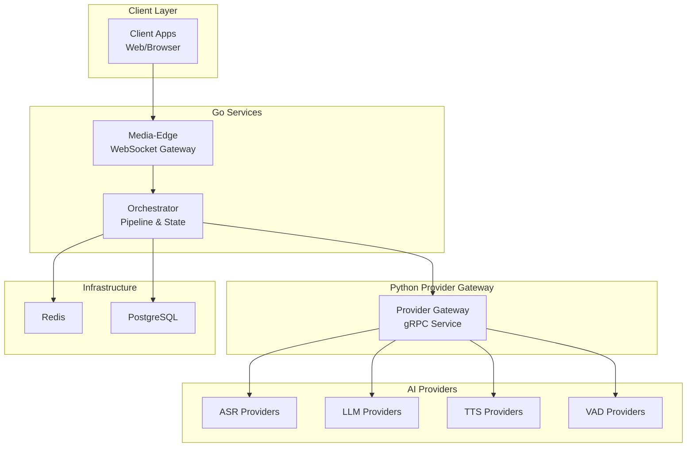
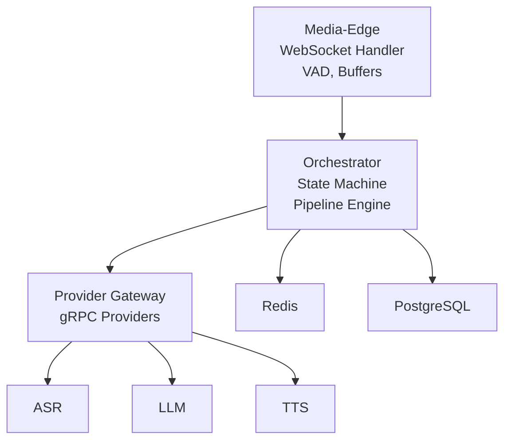
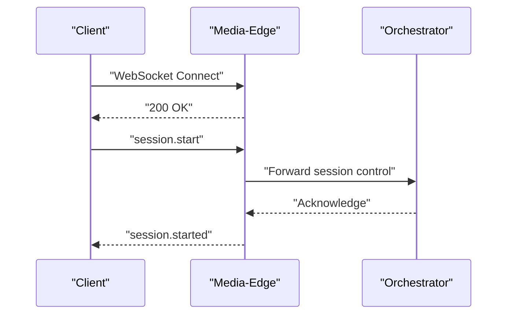
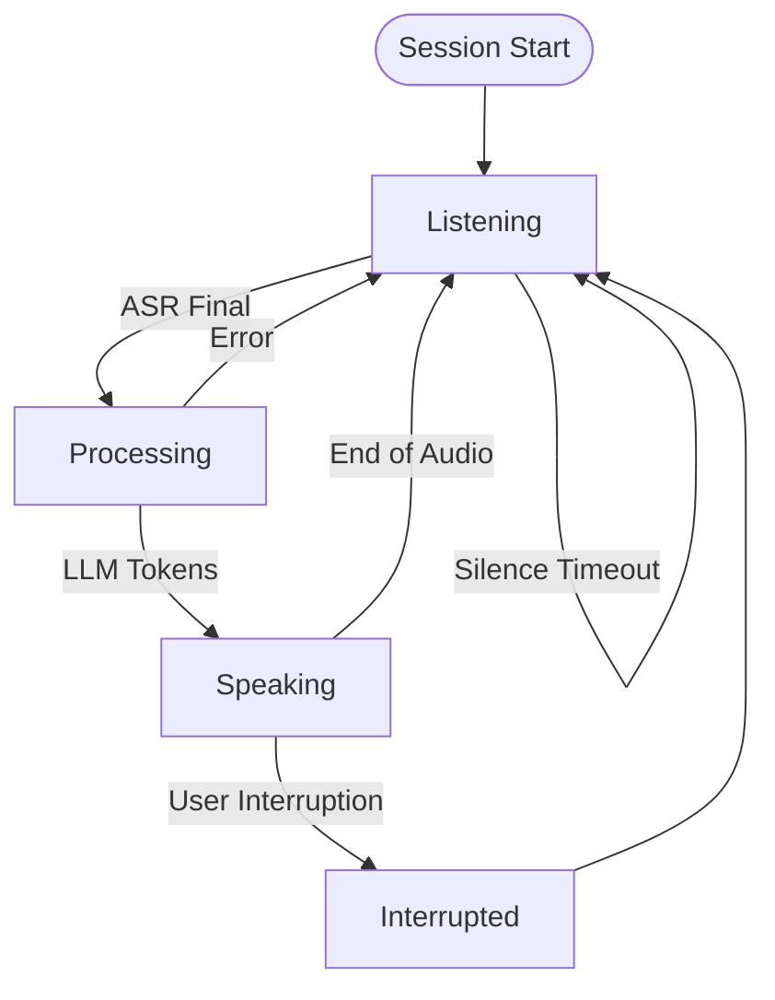
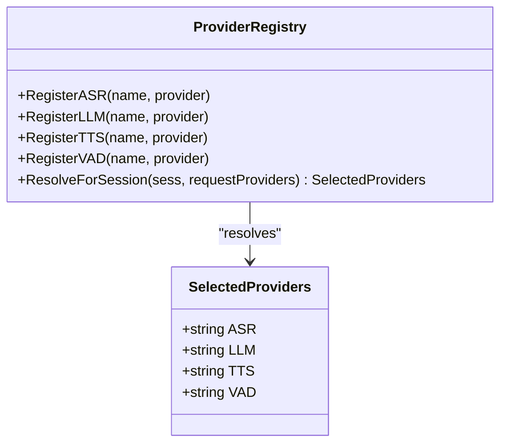
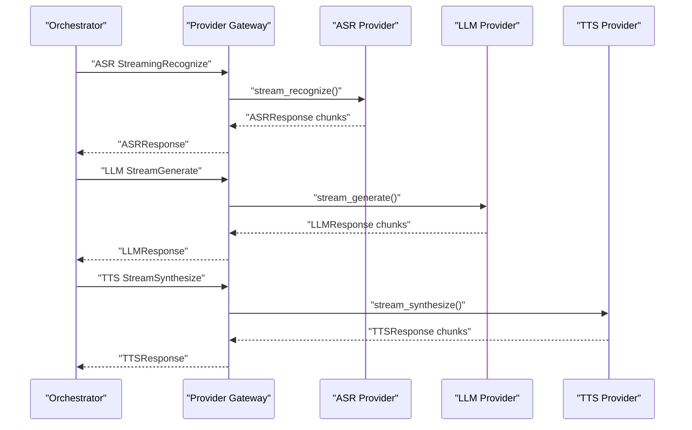
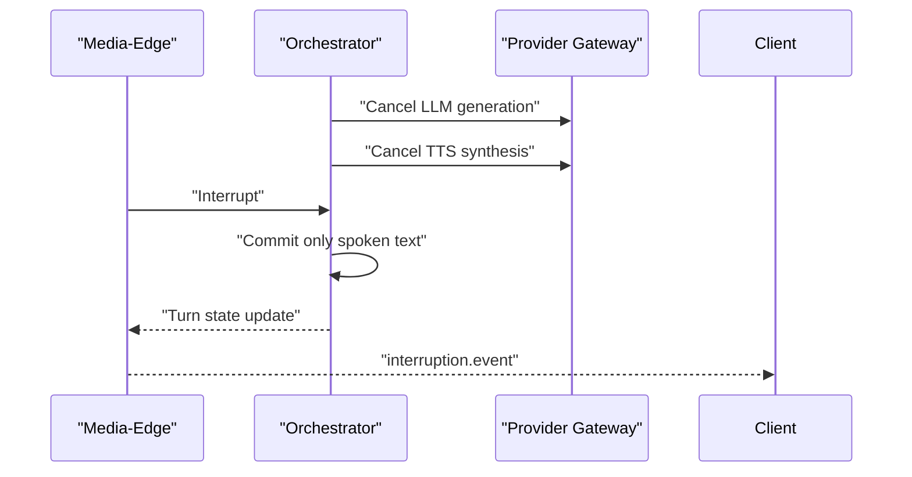
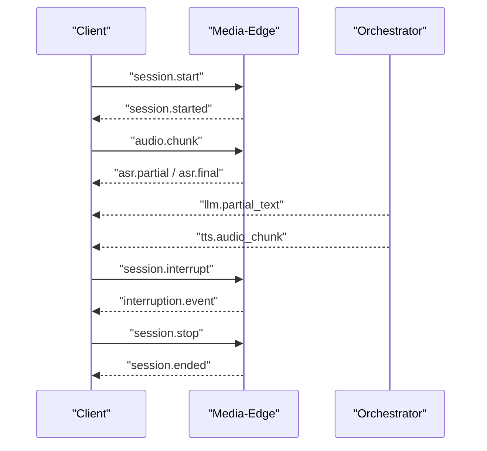
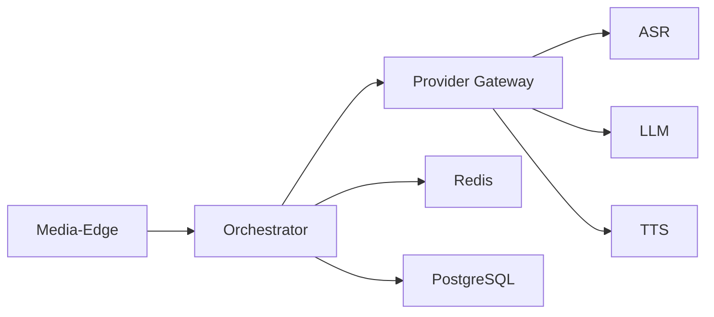

# Project Overview

<cite>
**Referenced Files in This Document**
- [README.md](file://README.md)
- [main.go](file://go/media-edge/cmd/main.go)
- [main.go](file://go/orchestrator/cmd/main.go)
- [state.go](file://go/pkg/session/state.go)
- [websocket-api.md](file://docs/websocket-api.md)
- [session-interruption.md](file://docs/session-interruption.md)
- [registry.go](file://go/pkg/providers/registry.go)
- [common.go](file://go/pkg/contracts/common.go)
- [server.py](file://py/provider_gateway/app/grpc_api/server.py)
- [config-mock.yaml](file://examples/config-mock.yaml)
- [Dockerfile.media-edge](file://infra/docker/Dockerfile.media-edge)
- [config.go](file://go/pkg/config/config.go)
- [provider-architecture.md](file://docs/provider-architecture.md)
</cite>

## Table of Contents
1. [Introduction](#introduction)
2. [Project Structure](#project-structure)
3. [Core Components](#core-components)
4. [Architecture Overview](#architecture-overview)
5. [Detailed Component Analysis](#detailed-component-analysis)
6. [Dependency Analysis](#dependency-analysis)
7. [Performance Considerations](#performance-considerations)
8. [Troubleshooting Guide](#troubleshooting-guide)
9. [Conclusion](#conclusion)

## Introduction
CloudApp is a production-grade, real-time voice conversation platform designed for low-latency, natural voice interactions powered by AI. It delivers a complete voice AI pipeline over a WebSocket API, with support for interruption (barge-in), pluggable AI providers, multi-tenant configuration, and enterprise-grade observability. The platform is implemented using Go for the media-edge and orchestrator services, and Python for the provider gateway, enabling fast iteration on AI providers while maintaining robust orchestration and streaming.

Key value propositions:
- Low-latency voice interactions with real-time WebSocket streaming
- Interruption support allowing users to cut off AI mid-response
- Pluggable provider system for ASR, LLM, and TTS with a unified gRPC interface
- Multi-tenant provider selection and session isolation
- Enterprise observability with structured logging, metrics, and tracing

## Project Structure
CloudApp is organized into three primary Go microservices and a Python provider gateway, plus supporting infrastructure and documentation:
- Media-Edge (Go): WebSocket gateway and session orchestration
- Orchestrator (Go): Pipeline orchestration and session state management
- Provider Gateway (Python): gRPC service exposing ASR, LLM, TTS, and VAD providers
- Shared packages: audio processing, configuration, contracts, observability, providers, and session management
- Protobuf definitions and Python gRPC stubs
- Infrastructure: Dockerfiles, Kubernetes manifests, and Docker Compose for deployment
- Examples: YAML configurations and scripts for quickstart and testing

**Diagram sources**
- [README.md: Architecture Overview:5-35](file://README.md#L5-L35)
- [main.go:94-126](file://go/media-edge/cmd/main.go#L94-L126)
- [main.go:122-148](file://go/orchestrator/cmd/main.go#L122-L148)
- [server.py:54-89](file://py/provider_gateway/app/grpc_api/server.py#L54-L89)

**Section sources**
- [README.md: Repository Structure:47-102](file://README.md#L47-L102)

## Core Components
- Media-Edge (Go): Provides WebSocket endpoints, handles client sessions, and bridges to the orchestrator. It initializes logging, metrics, health/readiness endpoints, and middleware chains. It also manages session stores and integrates with the orchestrator bridge.
- Orchestrator (Go): Owns the session state machine, coordinates the ASR→LLM→TTS pipeline, and persists session state in Redis and PostgreSQL. It registers gRPC providers and exposes health/readiness/metrics endpoints.
- Provider Gateway (Python): Implements gRPC services for ASR, LLM, TTS, and Provider management. It hosts provider implementations and exposes capability queries and cancellation support.
- Shared Packages: Define contracts, configuration, observability, provider registry, and session state machine used across services.

Practical examples:
- Start a session via WebSocket with audio and provider selection
- Stream audio chunks and receive partial/transcribed results
- Receive TTS audio chunks and play them back
- Interrupt the AI mid-response and observe interruption events

**Section sources**
- [main.go:30-180](file://go/media-edge/cmd/main.go#L30-L180)
- [main.go:26-193](file://go/orchestrator/cmd/main.go#L26-L193)
- [websocket-api.md: Example Session Flow:502-540](file://docs/websocket-api.md#L502-L540)

## Architecture Overview
CloudApp employs a three-tier microservices architecture:
- Media-Edge: Stateless WebSocket gateway handling client connections, buffering audio, and VAD events. It forwards session control and audio to the orchestrator.
- Orchestrator: Stateful pipeline orchestrator managing the session state machine and coordinating provider stages (ASR→LLM→TTS). It persists session state and history.
- Provider Gateway: Stateless Python service exposing gRPC APIs for ASR, LLM, TTS, and provider management. Providers are swappable and can be scaled independently.

**Diagram sources**
- [README.md: Architecture Overview:5-35](file://README.md#L5-L35)
- [provider-architecture.md: Provider Architecture Flow:16-31](file://docs/provider-architecture.md#L16-L31)
- [main.go:88-98](file://go/orchestrator/cmd/main.go#L88-L98)

## Detailed Component Analysis

### Media-Edge Service
Responsibilities:
- WebSocket endpoint setup and middleware chain (recovery, logging, metrics, CORS, security)
- Session store abstraction and health/readiness endpoints
- Bridge to orchestrator for session control and interruption
- Audio transport and VAD integration

Operational highlights:
- Health and readiness probes for containerized deployments
- Prometheus metrics endpoint
- Graceful shutdown handling signals

**Diagram sources**
- [main.go:94-126](file://go/media-edge/cmd/main.go#L94-L126)
- [websocket-api.md: Client → Server Messages:24-61](file://docs/websocket-api.md#L24-L61)

**Section sources**
- [main.go:30-180](file://go/media-edge/cmd/main.go#L30-L180)
- [Dockerfile.media-edge: HEALTHCHECK:56-58](file://infra/docker/Dockerfile.media-edge#L56-L58)

### Orchestrator Service
Responsibilities:
- Session state machine and turn management
- Pipeline orchestration for ASR→LLM→TTS
- Provider registry and gRPC client configuration
- Persistence via Redis and PostgreSQL

**Diagram sources**
- [state.go:37-62](file://go/pkg/session/state.go#L37-L62)
- [session-interruption.md: Session State Machine:27-63](file://docs/session-interruption.md#L27-L63)

**Section sources**
- [main.go:26-193](file://go/orchestrator/cmd/main.go#L26-L193)
- [state.go:81-153](file://go/pkg/session/state.go#L81-L153)

### Provider Registry and Multi-Tenant Provider Resolution
The provider registry supports:
- Global defaults, tenant overrides, session overrides, and request-level selections
- Capability-based provider selection and validation
- Pluggable provider architecture with gRPC clients

**Diagram sources**
- [registry.go:14-261](file://go/pkg/providers/registry.go#L14-L261)
- [config.go:34-61](file://go/pkg/config/config.go#L34-L61)

**Section sources**
- [registry.go:172-261](file://go/pkg/providers/registry.go#L172-L261)
- [config-mock.yaml: providers.defaults:14-17](file://examples/config-mock.yaml#L14-L17)

### Provider Gateway (Python)
The provider gateway exposes gRPC services for ASR, LLM, TTS, and provider management. It supports:
- Streaming recognition, generation, and synthesis
- Capability queries and cancellation
- Signal-driven graceful shutdown

**Diagram sources**
- [provider-architecture.md: gRPC Communication:177-220](file://docs/provider-architecture.md#L177-L220)
- [server.py:54-89](file://py/provider_gateway/app/grpc_api/server.py#L54-L89)

**Section sources**
- [server.py:25-134](file://py/provider_gateway/app/grpc_api/server.py#L25-L134)
- [provider-architecture.md: Provider Architecture:1-320](file://docs/provider-architecture.md#L1-L320)

### Session Interruption (Barge-in)
CloudApp supports interruption when the user speaks while the AI is responding. The system tracks playout position and only commits spoken text to conversation history.

**Diagram sources**
- [session-interruption.md: Interruption Flow:147-185](file://docs/session-interruption.md#L147-L185)
- [websocket-api.md: Interruption Event:376-400](file://docs/websocket-api.md#L376-L400)

**Section sources**
- [session-interruption.md: Interruption Flow:147-233](file://docs/session-interruption.md#L147-L233)
- [websocket-api.md: Client → Server Messages:148-175](file://docs/websocket-api.md#L148-L175)

### WebSocket API Workflow
The WebSocket API defines the real-time contract between clients and the platform, including session lifecycle, audio streaming, and event notifications.

**Diagram sources**
- [websocket-api.md: Example Session Flow:502-540](file://docs/websocket-api.md#L502-L540)

**Section sources**
- [websocket-api.md: WebSocket API Reference:1-622](file://docs/websocket-api.md#L1-L622)

## Dependency Analysis
High-level dependencies:
- Media-Edge depends on the orchestrator bridge and session store abstractions
- Orchestrator depends on Redis and PostgreSQL for persistence and on the provider registry for AI backends
- Provider Gateway depends on provider implementations and exposes gRPC services
- Shared contracts and configuration are used across services

**Diagram sources**
- [README.md: Architecture Overview:5-35](file://README.md#L5-L35)
- [main.go:88-98](file://go/orchestrator/cmd/main.go#L88-L98)

**Section sources**
- [common.go:82-94](file://go/pkg/contracts/common.go#L82-L94)
- [config.go:9-18](file://go/pkg/config/config.go#L9-L18)

## Performance Considerations
- Latency targets for interruption-sensitive operations are documented to ensure responsive barge-in behavior
- Provider capability queries and format validation prevent misconfiguration and reduce retries
- Streaming gRPC calls minimize round-trips and improve throughput
- Container health checks and readiness probes support safe scaling and rolling updates

[No sources needed since this section provides general guidance]

## Troubleshooting Guide
Common operational checks:
- Verify Media-Edge health and readiness endpoints
- Confirm Redis connectivity from the orchestrator
- Validate provider gateway availability and logs
- Inspect Prometheus metrics and traces for anomalies

**Section sources**
- [main.go:99-121](file://go/media-edge/cmd/main.go#L99-L121)
- [main.go:125-145](file://go/orchestrator/cmd/main.go#L125-L145)
- [provider-architecture.md: Error Normalization:221-252](file://docs/provider-architecture.md#L221-L252)

## Conclusion
CloudApp delivers a production-ready, real-time voice AI platform with a clean separation of concerns across three Go microservices and a Python provider gateway. Its pluggable provider architecture, robust session state machine, and enterprise observability make it suitable for building scalable, multi-tenant voice applications with low-latency, interruption-enabled interactions.