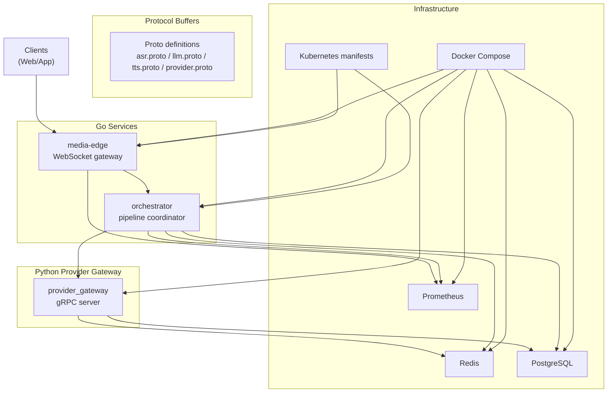
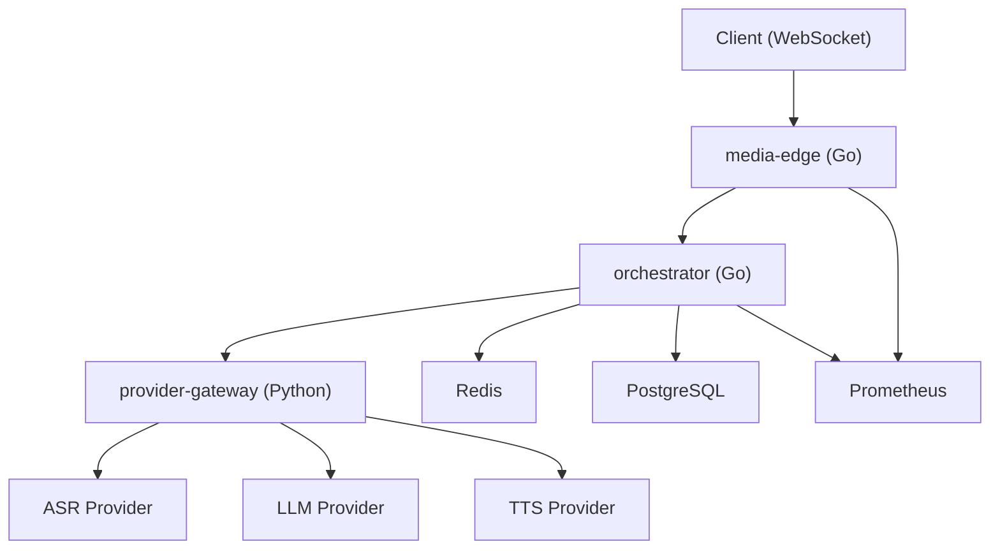
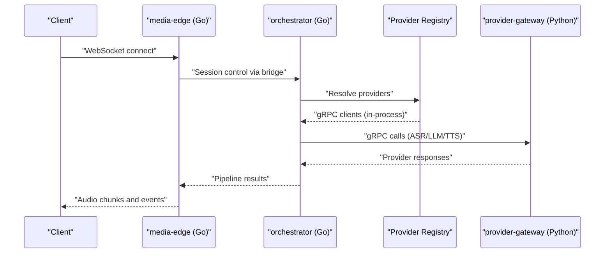
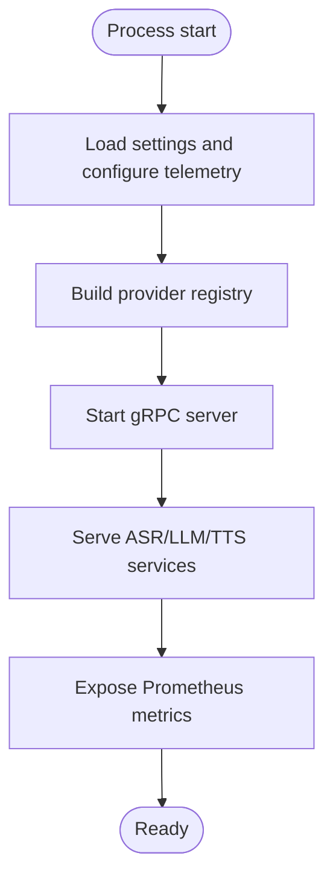
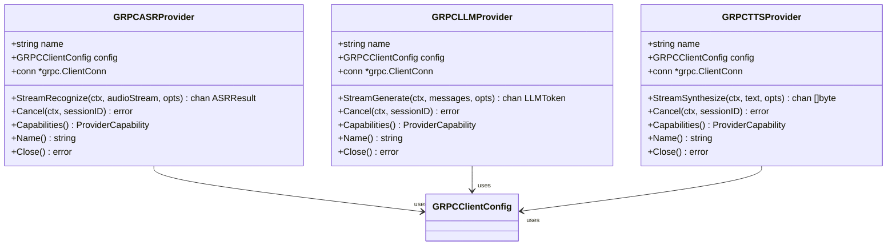
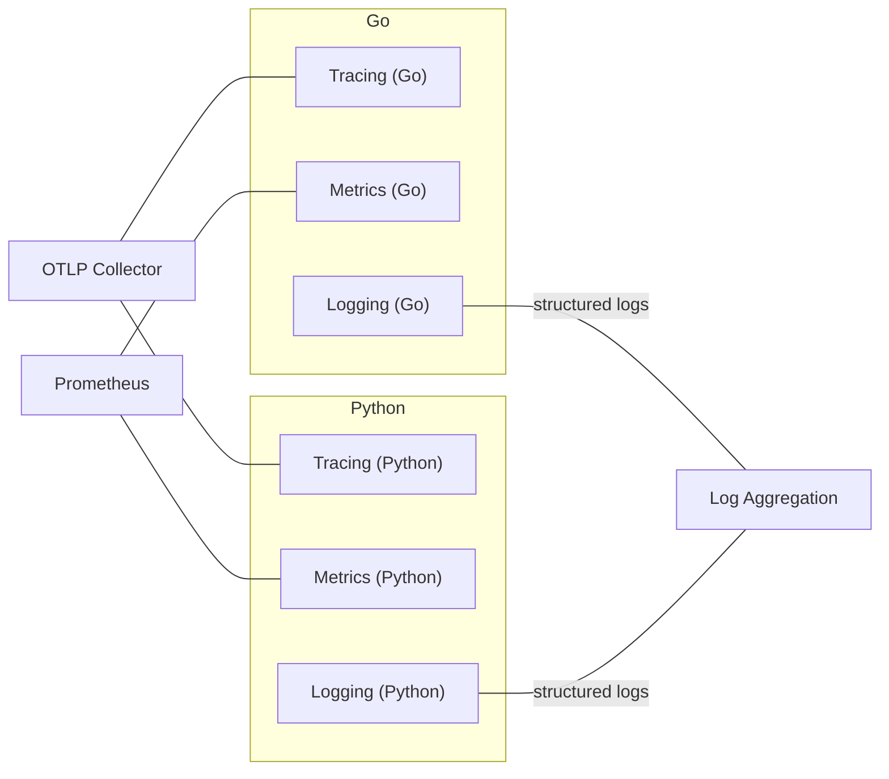
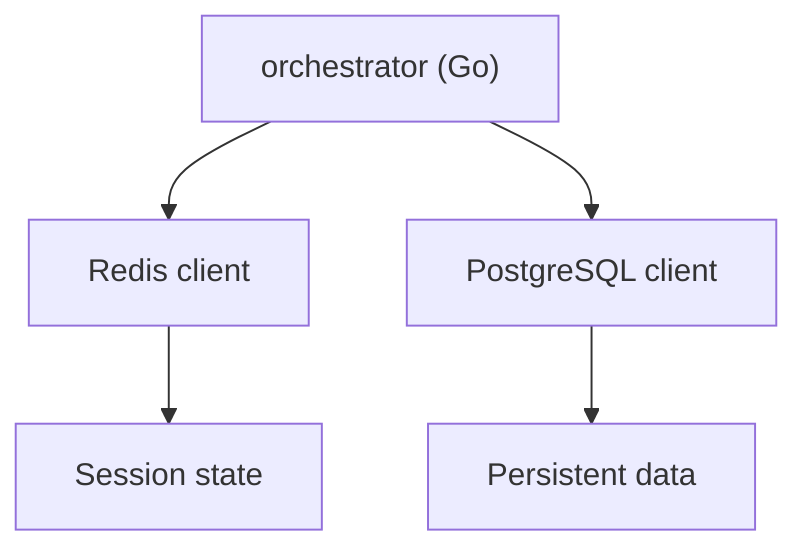
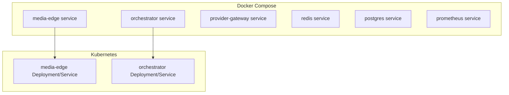
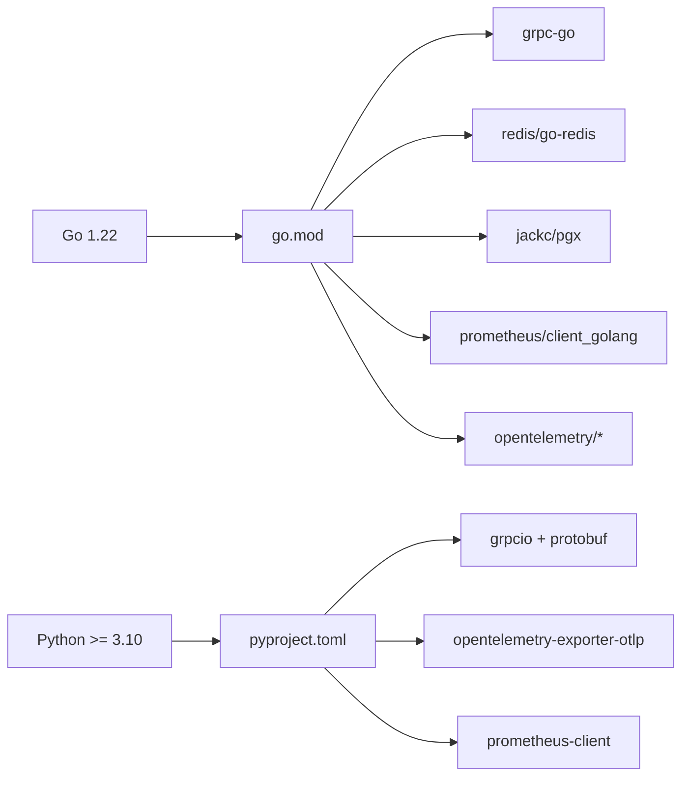

# Technology Stack

<cite>
**Referenced Files in This Document**
- [README.md](file://README.md)
- [go/go.mod](file://go/go.mod)
- [py/provider_gateway/pyproject.toml](file://py/provider_gateway/pyproject.toml)
- [proto/buf.yaml](file://proto/buf.yaml)
- [infra/compose/docker-compose.yml](file://infra/compose/docker-compose.yml)
- [infra/k8s/orchestrator.yaml](file://infra/k8s/orchestrator.yaml)
- [infra/k8s/media-edge.yaml](file://infra/k8s/media-edge.yaml)
- [scripts/run-local.sh](file://scripts/run-local.sh)
- [go/media-edge/cmd/main.go](file://go/media-edge/cmd/main.go)
- [go/orchestrator/cmd/main.go](file://go/orchestrator/cmd/main.go)
- [go/pkg/observability/tracing.go](file://go/pkg/observability/tracing.go)
- [go/pkg/observability/metrics.go](file://go/pkg/observability/metrics.go)
- [py/provider_gateway/app/telemetry/tracing.py](file://py/provider_gateway/app/telemetry/tracing.py)
- [py/provider_gateway/app/telemetry/metrics.py](file://py/provider_gateway/app/telemetry/metrics.py)
- [go/pkg/providers/grpc_client.go](file://go/pkg/providers/grpc_client.go)
- [py/provider_gateway/main.py](file://py/provider_gateway/main.py)
</cite>

## Table of Contents
1. [Introduction](#introduction)
2. [Project Structure](#project-structure)
3. [Core Components](#core-components)
4. [Architecture Overview](#architecture-overview)
5. [Detailed Component Analysis](#detailed-component-analysis)
6. [Dependency Analysis](#dependency-analysis)
7. [Performance Considerations](#performance-considerations)
8. [Troubleshooting Guide](#troubleshooting-guide)
9. [Conclusion](#conclusion)
10. [Appendices](#appendices)

## Introduction
This document describes the CloudApp technology stack, focusing on programming languages, frameworks, libraries, and operational tooling. The platform uses a dual-language approach:
- Go for high-performance services (media-edge WebSocket gateway and orchestrator)
- Python for provider implementations and the provider gateway

Communication between services is handled by gRPC with Protocol Buffers for cross-language compatibility, while WebSocket provides real-time client interaction. Observability is implemented with OpenTelemetry for distributed tracing, Prometheus for metrics, and structured logging. Containerization is achieved with Docker, and orchestration is supported via Kubernetes manifests. This document also covers dependency management, version requirements, compatibility matrices, rationale, performance considerations, and development workflows.

## Project Structure
CloudApp is organized into:
- go/: Go services (media-edge, orchestrator) and shared packages
- py/provider_gateway/: Python provider gateway exposing ASR/LLM/TTS via gRPC
- proto/: Protocol Buffer definitions and linting/breaking-change policies
- infra/: Docker Compose and Kubernetes manifests, migrations, and Prometheus config
- examples/: Configuration examples for different provider modes
- scripts/: Local development runner and test utilities

**Diagram sources**
- [README.md:5-35](file://README.md#L5-L35)
- [infra/compose/docker-compose.yml:6-164](file://infra/compose/docker-compose.yml#L6-L164)
- [infra/k8s/orchestrator.yaml:1-92](file://infra/k8s/orchestrator.yaml#L1-L92)
- [infra/k8s/media-edge.yaml:1-112](file://infra/k8s/media-edge.yaml#L1-L112)

**Section sources**
- [README.md:47-102](file://README.md#L47-L102)

## Core Components
- Programming languages and runtime
  - Go 1.22+ for media-edge and orchestrator
  - Python 3.10+ for provider gateway
- Communication
  - gRPC with Protocol Buffers for service contracts
  - WebSocket for client interaction
- Storage
  - Redis for session caching and state
  - PostgreSQL for persistent data
- Observability
  - OpenTelemetry (Go: SDK; Python: OTLP exporter)
  - Prometheus metrics endpoints
  - Structured logging (Go: Zap; Python: stdlib/logging via telemetry module)
- Containerization and orchestration
  - Docker images and Docker Compose for local dev
  - Kubernetes manifests for orchestration

**Section sources**
- [README.md:108-111](file://README.md#L108-L111)
- [go/go.mod:3](file://go/go.mod#L3)
- [py/provider_gateway/pyproject.toml:10](file://py/provider_gateway/pyproject.toml#L10)
- [infra/compose/docker-compose.yml:69-92](file://infra/compose/docker-compose.yml#L69-L92)

## Architecture Overview
CloudApp’s runtime architecture comprises:
- Clients connect via WebSocket to the media-edge service
- The orchestrator coordinates the ASR → LLM → TTS pipeline
- Providers are implemented in Python and exposed via gRPC to the orchestrator
- Redis persists session state; PostgreSQL stores transcripts/history
- Observability is integrated across services with OpenTelemetry traces and Prometheus metrics

**Diagram sources**
- [README.md:7-35](file://README.md#L7-L35)
- [go/media-edge/cmd/main.go:96-127](file://go/media-edge/cmd/main.go#L96-L127)
- [go/orchestrator/cmd/main.go:122-149](file://go/orchestrator/cmd/main.go#L122-L149)
- [py/provider_gateway/main.py:1-13](file://py/provider_gateway/main.py#L1-L13)

## Detailed Component Analysis

### Go Services: media-edge and orchestrator
- Responsibilities
  - media-edge: WebSocket endpoint, session management, health/readiness/metrics endpoints, middleware chain
  - orchestrator: pipeline orchestration, provider registry, Redis/PostgreSQL persistence, health/readiness/metrics endpoints
- Observability
  - OpenTelemetry tracing initialization and span helpers
  - Prometheus metrics exported via /metrics
  - Structured logging via Zap
- Communication
  - gRPC clients to provider-gateway (in-process stubs for MVP)
  - Redis connectivity and session store usage
  - PostgreSQL persistence stubs

**Diagram sources**
- [go/media-edge/cmd/main.go:96-127](file://go/media-edge/cmd/main.go#L96-L127)
- [go/orchestrator/cmd/main.go:122-149](file://go/orchestrator/cmd/main.go#L122-L149)
- [go/pkg/providers/grpc_client.go:14-33](file://go/pkg/providers/grpc_client.go#L14-L33)

**Section sources**
- [go/media-edge/cmd/main.go:30-180](file://go/media-edge/cmd/main.go#L30-L180)
- [go/orchestrator/cmd/main.go:26-193](file://go/orchestrator/cmd/main.go#L26-L193)
- [go/pkg/providers/grpc_client.go:35-288](file://go/pkg/providers/grpc_client.go#L35-L288)

### Python Provider Gateway
- Responsibilities
  - Exposes ASR/LLM/TTS gRPC services
  - Implements provider registry and capability negotiation
  - Telemetry: OpenTelemetry tracing (OTLP exporter) and Prometheus metrics server
- Entry point
  - Async main entry via app.__main__.main()

**Diagram sources**
- [py/provider_gateway/main.py:1-13](file://py/provider_gateway/main.py#L1-L13)
- [py/provider_gateway/app/telemetry/tracing.py:17-51](file://py/provider_gateway/app/telemetry/tracing.py#L17-L51)
- [py/provider_gateway/app/telemetry/metrics.py:85-96](file://py/provider_gateway/app/telemetry/metrics.py#L85-L96)

**Section sources**
- [py/provider_gateway/main.py:1-13](file://py/provider_gateway/main.py#L1-L13)
- [py/provider_gateway/app/telemetry/tracing.py:17-152](file://py/provider_gateway/app/telemetry/tracing.py#L17-L152)
- [py/provider_gateway/app/telemetry/metrics.py:1-107](file://py/provider_gateway/app/telemetry/metrics.py#L1-L107)

### Protocol Buffers and gRPC
- Definitions
  - asr.proto, llm.proto, tts.proto, provider.proto, common.proto
- Tooling
  - buf.yaml defines linting and breaking-change detection policies
- Usage
  - Go orchestrator connects to provider-gateway via gRPC clients (in-process stubs for MVP)
  - Python provider-gateway implements gRPC servicers for ASR/LLM/TTS

**Diagram sources**
- [go/pkg/providers/grpc_client.go:14-288](file://go/pkg/providers/grpc_client.go#L14-L288)

**Section sources**
- [proto/buf.yaml:1-11](file://proto/buf.yaml#L1-L11)
- [go/pkg/providers/grpc_client.go:14-33](file://go/pkg/providers/grpc_client.go#L14-L33)

### Observability Stack
- OpenTelemetry
  - Go: TracerProvider initialized with resource attributes; spans per pipeline stage/provider
  - Python: OTLP exporter configured; context manager for spans
- Prometheus
  - Go: Built-in metrics for sessions, turns, latency histograms, provider stats
  - Python: Prometheus client counters/histograms and HTTP metrics server
- Logging
  - Go: Zap logger configured via observability package
  - Python: Logging via telemetry module

**Diagram sources**
- [go/pkg/observability/tracing.go:35-105](file://go/pkg/observability/tracing.go#L35-L105)
- [go/pkg/observability/metrics.go:10-82](file://go/pkg/observability/metrics.go#L10-L82)
- [py/provider_gateway/app/telemetry/tracing.py:17-51](file://py/provider_gateway/app/telemetry/tracing.py#L17-L51)
- [py/provider_gateway/app/telemetry/metrics.py:85-96](file://py/provider_gateway/app/telemetry/metrics.py#L85-L96)

**Section sources**
- [go/pkg/observability/tracing.go:35-359](file://go/pkg/observability/tracing.go#L35-L359)
- [go/pkg/observability/metrics.go:1-214](file://go/pkg/observability/metrics.go#L1-L214)
- [py/provider_gateway/app/telemetry/tracing.py:17-152](file://py/provider_gateway/app/telemetry/tracing.py#L17-L152)
- [py/provider_gateway/app/telemetry/metrics.py:1-107](file://py/provider_gateway/app/telemetry/metrics.py#L1-L107)

### Database Stack
- Redis
  - Used for session caching and state in orchestrator
  - Configured in Docker Compose with memory limits and eviction policy
- PostgreSQL
  - Used for persistent storage (transcripts, history)
  - Migrations included; orchestrated via Docker Compose

**Diagram sources**
- [go/orchestrator/cmd/main.go:73-99](file://go/orchestrator/cmd/main.go#L73-L99)
- [infra/compose/docker-compose.yml:93-132](file://infra/compose/docker-compose.yml#L93-L132)

**Section sources**
- [go/orchestrator/cmd/main.go:73-99](file://go/orchestrator/cmd/main.go#L73-L99)
- [infra/compose/docker-compose.yml:93-132](file://infra/compose/docker-compose.yml#L93-L132)

### Containerization and Orchestration
- Docker
  - Multi-stage builds for media-edge, orchestrator, and provider-gateway
  - Docker Compose defines services, environment, healthchecks, and volumes
- Kubernetes
  - Manifests for media-edge and orchestrator deployments, services, probes, and resource requests/limits
  - Prometheus scraping annotations included

**Diagram sources**
- [infra/compose/docker-compose.yml:6-164](file://infra/compose/docker-compose.yml#L6-L164)
- [infra/k8s/media-edge.yaml:1-112](file://infra/k8s/media-edge.yaml#L1-L112)
- [infra/k8s/orchestrator.yaml:1-92](file://infra/k8s/orchestrator.yaml#L1-L92)

**Section sources**
- [infra/compose/docker-compose.yml:6-164](file://infra/compose/docker-compose.yml#L6-L164)
- [infra/k8s/media-edge.yaml:1-112](file://infra/k8s/media-edge.yaml#L1-L112)
- [infra/k8s/orchestrator.yaml:1-92](file://infra/k8s/orchestrator.yaml#L1-L92)

## Dependency Analysis
- Go modules
  - grpc, redis, postgresql drivers, Prometheus client, OpenTelemetry SDK, YAML parsing
- Python dependencies
  - grpcio, protobuf, pydantic, prometheus-client, opentelemetry-* (SDK and OTLP), httpx, numpy
- Version alignment
  - Go 1.22
  - Python >= 3.10
  - gRPC and Protobuf aligned across languages via proto definitions

**Diagram sources**
- [go/go.mod:5-17](file://go/go.mod#L5-L17)
- [py/provider_gateway/pyproject.toml:23-36](file://py/provider_gateway/pyproject.toml#L23-L36)

**Section sources**
- [go/go.mod:3-43](file://go/go.mod#L3-L43)
- [py/provider_gateway/pyproject.toml:10,23-36](file://py/provider_gateway/pyproject.toml#L10,L23-L36)

## Performance Considerations
- Language selection
  - Go chosen for high-throughput, low-latency services (media-edge, orchestrator) with excellent concurrency and networking
  - Python selected for provider implementations to leverage mature ML/AI ecosystems
- gRPC and Protocol Buffers
  - Efficient binary serialization, strong typing, and cross-language compatibility reduce overhead and improve throughput
- Observability
  - Structured logs and Prometheus metrics enable proactive performance monitoring and tuning
- Storage
  - Redis optimized for session caching with memory limits and eviction policies
  - PostgreSQL for durable persistence with migrations
- Concurrency and streaming
  - Go channels and goroutines used for streaming ASR/LLM/TTS; WebSocket for real-time audio
- Containerization
  - Resource requests/limits and health checks ensure predictable performance and fast recovery

[No sources needed since this section provides general guidance]

## Troubleshooting Guide
- Local development
  - Use the run-local.sh script to start services with mock, vLLM, or cloud configurations
  - Health endpoints (/health and /ready) indicate service status
- Logs and metrics
  - Enable observability in configuration; check Prometheus metrics and log aggregation
- Provider connectivity
  - Verify provider-gateway address and gRPC reachability; confirm provider availability
- Database connectivity
  - Confirm Redis and PostgreSQL health; check DSN and credentials
- Debugging tools
  - Use the WebSocket client example to validate client-server communication
  - Inspect spans and metrics to identify bottlenecks

**Section sources**
- [scripts/run-local.sh:1-95](file://scripts/run-local.sh#L1-L95)
- [go/media-edge/cmd/main.go:99-121](file://go/media-edge/cmd/main.go#L99-L121)
- [go/orchestrator/cmd/main.go:125-145](file://go/orchestrator/cmd/main.go#L125-L145)
- [README.md:130-141](file://README.md#L130-L141)

## Conclusion
CloudApp’s technology stack balances performance and flexibility: Go powers real-time, high-throughput services, while Python enables rapid provider innovation. gRPC and Protocol Buffers ensure robust inter-service communication, and WebSocket delivers responsive client experiences. Redis and PostgreSQL provide complementary persistence layers, and OpenTelemetry/Prometheus deliver comprehensive observability. Docker and Kubernetes simplify deployment and scaling.

[No sources needed since this section summarizes without analyzing specific files]

## Appendices

### Compatibility Matrix
- Go 1.22 → grpc-go, redis/go-redis, jackc/pgx, prometheus/client_golang, opentelemetry/*
- Python 3.10+ → grpcio, protobuf, pydantic, prometheus-client, opentelemetry-*

**Section sources**
- [go/go.mod:3](file://go/go.mod#L3)
- [py/provider_gateway/pyproject.toml:10,23-36](file://py/provider_gateway/pyproject.toml#L10,L23-L36)

### Environment Setup and Development Workflows
- Prerequisites
  - Docker and Docker Compose
  - Go 1.22+, Python 3.10+
- Local run
  - Use run-local.sh with optional flags for configuration profiles
  - Access services at documented ports (media-edge WS, orchestrator HTTP, provider-gateway gRPC, Redis, Prometheus)
- Provider development
  - Implement providers under py/provider_gateway/app/providers/ and expose via gRPC servicers
  - Use telemetry modules for tracing and metrics
- Testing
  - Run Go tests in go/ and Python tests in py/provider_gateway/

**Section sources**
- [README.md:108-111](file://README.md#L108-L111)
- [scripts/run-local.sh:1-95](file://scripts/run-local.sh#L1-L95)
- [README.md:196-214](file://README.md#L196-L214)