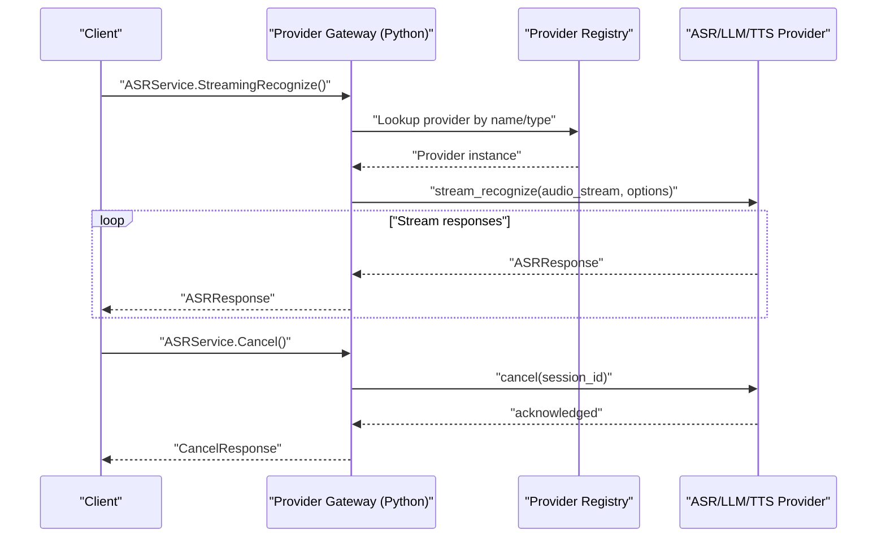
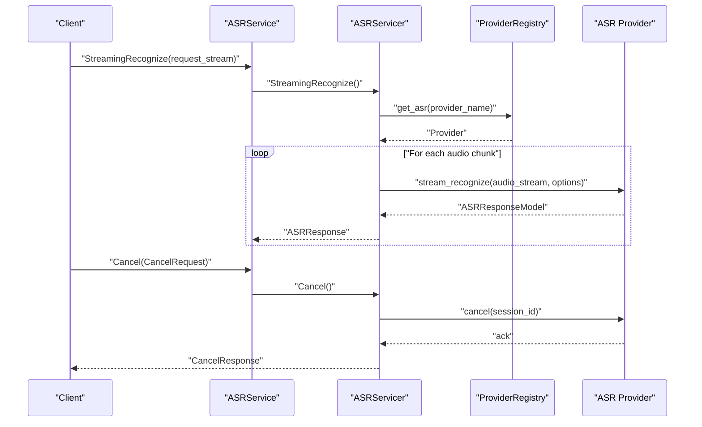
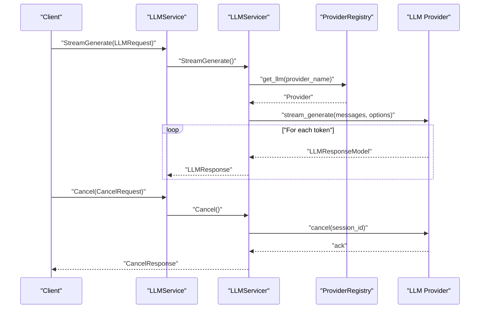
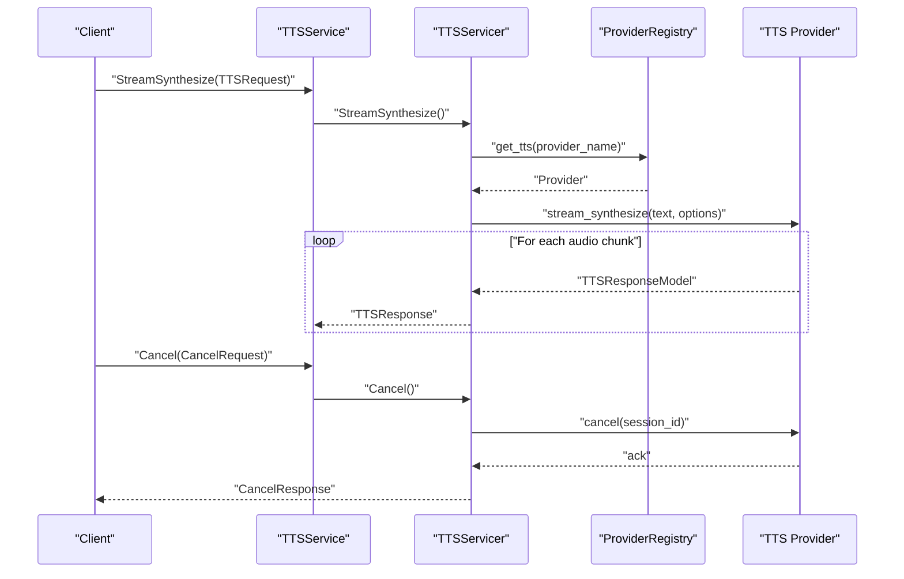
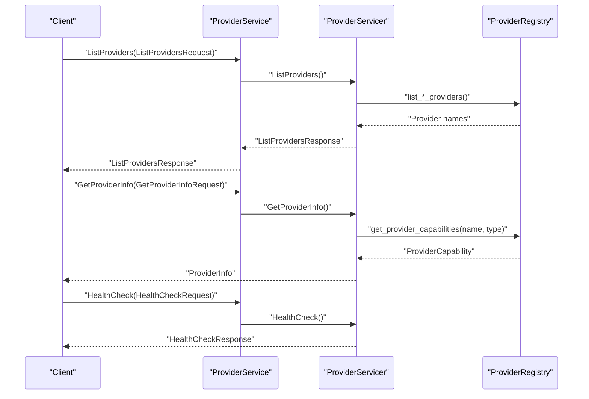
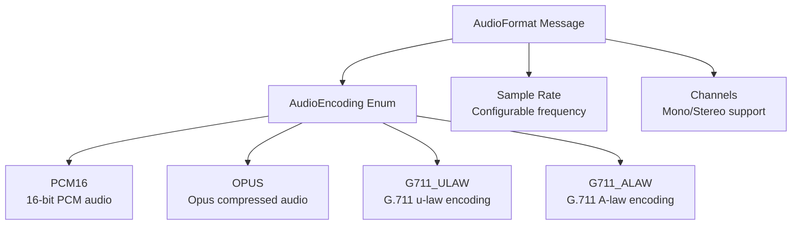
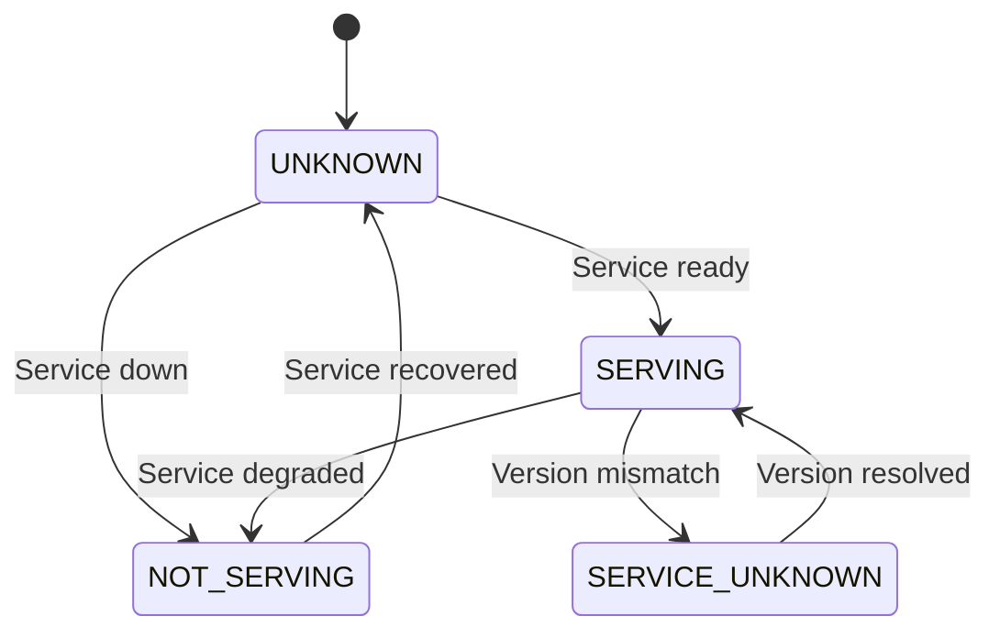
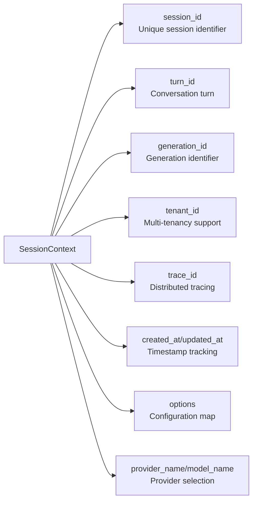
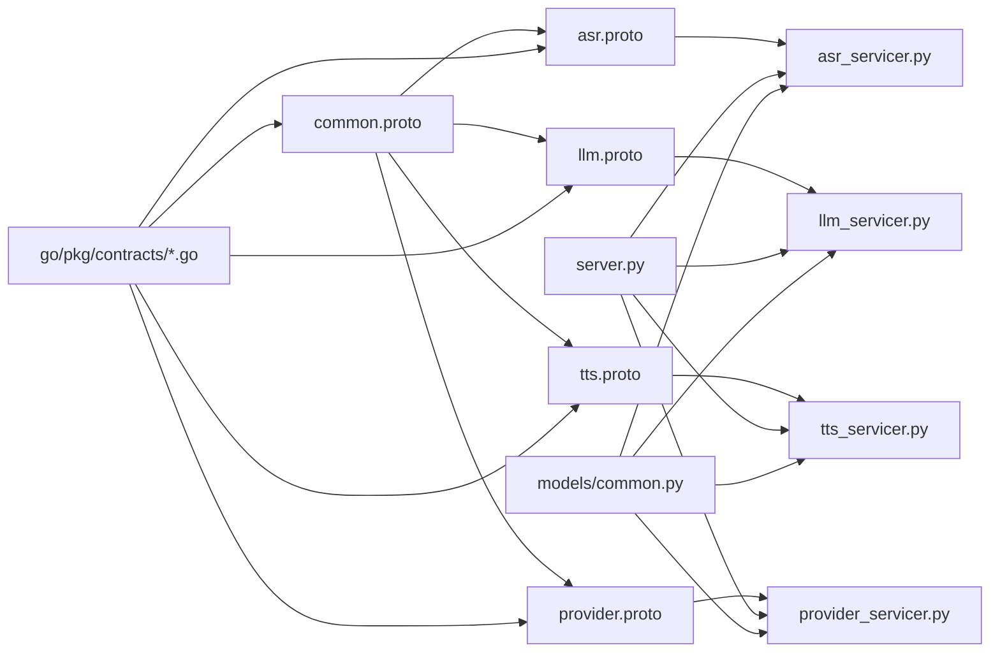

# Protocol Buffers & Contracts

<cite>
**Referenced Files in This Document**
- [asr.proto](file://proto/asr.proto)
- [llm.proto](file://proto/llm.proto)
- [tts.proto](file://proto/tts.proto)
- [provider.proto](file://proto/provider.proto)
- [common.proto](file://proto/common.proto)
- [Makefile](file://proto/Makefile)
- [buf.gen.yaml](file://proto/buf.gen.yaml)
- [buf.yaml](file://proto/buf.yaml)
- [generate-proto.sh](file://scripts/generate-proto.sh)
- [asr.go](file://go/pkg/contracts/asr.go)
- [llm.go](file://go/pkg/contracts/llm.go)
- [tts.go](file://go/pkg/contracts/tts.go)
- [provider.go](file://go/pkg/contracts/provider.go)
- [common.go](file://go/pkg/contracts/common.go)
- [asr_servicer.py](file://py/provider_gateway/app/grpc_api/asr_servicer.py)
- [llm_servicer.py](file://py/provider_gateway/app/grpc_api/llm_servicer.py)
- [tts_servicer.py](file://py/provider_gateway/app/grpc_api/tts_servicer.py)
- [provider_servicer.py](file://py/provider_gateway/app/grpc_api/provider_servicer.py)
- [server.py](file://py/provider_gateway/app/grpc_api/server.py)
- [common.py](file://py/provider_gateway/app/models/common.py)
- [asr.py](file://py/provider_gateway/app/models/asr.py)
- [llm.py](file://py/provider_gateway/app/models/llm.py)
- [tts.py](file://py/provider_gateway/app/models/tts.py)
</cite>

## Update Summary
**Changes Made**
- Enhanced comprehensive type definitions for audio encoding enums, provider error codes, session contexts, audio formats, and health check mechanisms
- Added detailed ProviderErrorCode enumeration with standardized error categories
- Expanded AudioEncoding enum with comprehensive codec support
- Integrated Pydantic models in Python provider gateway for enhanced validation
- Updated common types with improved error handling and timing metadata
- Enhanced health check mechanisms with serving status enumeration

## Table of Contents
1. [Introduction](#introduction)
2. [Project Structure](#project-structure)
3. [Core Components](#core-components)
4. [Architecture Overview](#architecture-overview)
5. [Detailed Component Analysis](#detailed-component-analysis)
6. [Enhanced Contract Definitions](#enhanced-contract-definitions)
7. [Dependency Analysis](#dependency-analysis)
8. [Performance Considerations](#performance-considerations)
9. [Troubleshooting Guide](#troubleshooting-guide)
10. [Conclusion](#conclusion)
11. [Appendices](#appendices)

## Introduction
This document explains CloudApp's Protocol Buffers system that defines gRPC service contracts for Automatic Speech Recognition (ASR), Large Language Model (LLM), Text-to-Speech (TTS), and Provider Management. It covers message protocols, service interfaces, cross-language compatibility guarantees, code generation, service stubs, client–server communication patterns, API versioning and backward compatibility, and practical examples for compilation, implementation, and client integration. It also documents common types, error handling conventions, and performance optimization techniques for gRPC communication.

**Updated** Enhanced with comprehensive type definitions mirroring protobuf messages, including audio encoding enums, provider error codes, session contexts, audio formats, and health check mechanisms across both Go and Python implementations.

## Project Structure
The protobuf definitions live under the proto directory and define the canonical contracts. Generated clients/servers for Go and Python are integrated into the Go runtime and Python provider gateway respectively. Internal Go mirror types exist alongside the proto definitions for early development and compatibility. The Python provider gateway now includes Pydantic models for enhanced validation and type safety.

```mermaid
graph TB
subgraph "Protobuf Definitions"
A["common.proto"]
B["asr.proto"]
C["llm.proto"]
D["tts.proto"]
E["provider.proto"]
end
subgraph "Go Runtime"
G1["go/pkg/contracts/common.go"]
G2["go/pkg/contracts/asr.go"]
G3["go/pkg/contracts/llm.go"]
G4["go/pkg/contracts/tts.go"]
G5["go/pkg/contracts/provider.go"]
end
subgraph "Python Provider Gateway"
P1["py/provider_gateway/app/grpc_api/server.py"]
P2["py/provider_gateway/app/grpc_api/asr_servicer.py"]
P3["py/provider_gateway/app/grpc_api/llm_servicer.py"]
P4["py/provider_gateway/app/grpc_api/tts_servicer.py"]
P5["py/provider_gateway/app/grpc_api/provider_servicer.py"]
P6["py/provider_gateway/app/models/common.py"]
P7["py/provider_gateway/app/models/asr.py"]
P8["py/provider_gateway/app/models/llm.py"]
P9["py/provider_gateway/app/models/tts.py"]
end
A --> B
A --> C
A --> D
A --> E
B --> G2
C --> G3
D --> G4
E --> G5
A --> G1
B --> P2
C --> P3
D --> P4
E --> P5
P1 --> P2
P1 --> P3
P1 --> P4
P1 --> P5
P6 --> P2
P6 --> P3
P6 --> P4
P6 --> P5
P7 --> P2
P8 --> P3
P9 --> P4
```

**Diagram sources**
- [common.proto:1-110](file://proto/common.proto#L1-L110)
- [asr.proto:1-53](file://proto/asr.proto#L1-L53)
- [llm.proto:1-59](file://proto/llm.proto#L1-L59)
- [tts.proto:1-45](file://proto/tts.proto#L1-L45)
- [provider.proto:1-63](file://proto/provider.proto#L1-L63)
- [common.go:1-168](file://go/pkg/contracts/common.go#L1-L168)
- [asr.go:1-35](file://go/pkg/contracts/asr.go#L1-L35)
- [llm.go:1-36](file://go/pkg/contracts/llm.go#L1-L36)
- [tts.go:1-22](file://go/pkg/contracts/tts.go#L1-L22)
- [provider.go:1-79](file://go/pkg/contracts/provider.go#L1-L79)
- [server.py:1-171](file://py/provider_gateway/app/grpc_api/server.py#L1-L171)
- [asr_servicer.py:1-239](file://py/provider_gateway/app/grpc_api/asr_servicer.py#L1-L239)
- [llm_servicer.py:1-218](file://py/provider_gateway/app/grpc_api/llm_servicer.py#L1-L218)
- [tts_servicer.py:1-228](file://py/provider_gateway/app/grpc_api/tts_servicer.py#L1-L228)
- [provider_servicer.py:1-190](file://py/provider_gateway/app/grpc_api/provider_servicer.py#L1-L190)
- [common.py:1-69](file://py/provider_gateway/app/models/common.py#L1-L69)
- [asr.py:1-65](file://py/provider_gateway/app/models/asr.py#L1-L65)
- [llm.py:1-78](file://py/provider_gateway/app/models/llm.py#L1-L78)
- [tts.py:1-56](file://py/provider_gateway/app/models/tts.py#L1-L56)

**Section sources**
- [asr.proto:1-53](file://proto/asr.proto#L1-L53)
- [llm.proto:1-59](file://proto/llm.proto#L1-L59)
- [tts.proto:1-45](file://proto/tts.proto#L1-L45)
- [provider.proto:1-63](file://proto/provider.proto#L1-L63)
- [common.proto:1-110](file://proto/common.proto#L1-L110)

## Core Components
This section summarizes the four primary services and shared contracts with enhanced type definitions.

- ASRService
  - Bidirectional streaming for audio input and transcript output
  - Cancel ongoing recognition
  - Capability discovery
- LLMService
  - Server streaming for prompt input and token output
  - Cancel ongoing generation
  - Capability discovery
- TTSService
  - Server streaming for text input and audio output
  - Cancel ongoing synthesis
  - Capability discovery
- ProviderService
  - List providers by type
  - Get provider info
  - Health check

**Enhanced** Shared contracts now include comprehensive type definitions:
- SessionContext: enhanced with tenant_id, trace_id, timestamps, and provider/model identification
- AudioFormat: includes sample_rate, channels, and AudioEncoding enum
- ProviderError: standardized error codes with ProviderErrorCode enum
- ProviderCapability: expanded streaming support flags and codec preferences
- TimingMetadata: precise operation duration tracking
- AudioEncoding: comprehensive codec support (PCM16, OPUS, G711_ULAW, G711_ALAW)
- ProviderErrorCode: standardized error categories (INTERNAL, INVALID_REQUEST, RATE_LIMITED, etc.)
- ServingStatus: health check status enumeration

**Section sources**
- [asr.proto:9-19](file://proto/asr.proto#L9-L19)
- [llm.proto:9-19](file://proto/llm.proto#L9-L19)
- [tts.proto:9-19](file://proto/tts.proto#L9-L19)
- [provider.proto:26-36](file://proto/provider.proto#L26-L36)
- [common.proto:33-109](file://proto/common.proto#L33-L109)

## Architecture Overview
The system uses protobuf-defined contracts to enable cross-language gRPC communication. The Python provider gateway exposes gRPC services backed by provider implementations via a registry. Enhanced Pydantic models provide validation and type safety. Go mirrors the protobuf messages for internal use until proto generation is fully enabled. The Makefile and Buf configuration orchestrate code generation for multiple languages.

**Diagram sources**
- [asr.proto:10-18](file://proto/asr.proto#L10-L18)
- [asr_servicer.py:42-122](file://py/provider_gateway/app/grpc_api/asr_servicer.py#L42-L122)
- [provider_servicer.py:1-190](file://py/provider_gateway/app/grpc_api/provider_servicer.py#L1-L190)

**Section sources**
- [server.py:54-89](file://py/provider_gateway/app/grpc_api/server.py#L54-L89)
- [asr_servicer.py:42-122](file://py/provider_gateway/app/grpc_api/asr_servicer.py#L42-L122)
- [provider_servicer.py:43-73](file://py/provider_gateway/app/grpc_api/provider_servicer.py#L43-L73)

## Detailed Component Analysis

### ASR Service
- Service definition: bidirectional streaming RPC for audio input and transcript output, plus Cancel and GetCapabilities.
- Messages:
  - ASRRequest: includes SessionContext, audio_chunk, AudioFormat, language_hint, is_final.
  - ASRResponse: transcript, partial/final flags, confidence, language, word timestamps, timing metadata.
  - CapabilityRequest: provider_name.
- Implementation pattern:
  - Python servicer streams audio chunks, converts to internal models, and yields ASRResponse messages.
  - Maintains active sessions for cancellation.
- Cross-language compatibility:
  - Protobuf ensures wire compatibility; Python gRPC stubs map to native Python types.
  - Enhanced Pydantic models provide validation and type safety.

**Diagram sources**
- [asr.proto:10-18](file://proto/asr.proto#L10-L18)
- [asr_servicer.py:42-122](file://py/provider_gateway/app/grpc_api/asr_servicer.py#L42-L122)
- [asr_servicer.py:174-205](file://py/provider_gateway/app/grpc_api/asr_servicer.py#L174-L205)

**Section sources**
- [asr.proto:26-52](file://proto/asr.proto#L26-L52)
- [asr.go:3-29](file://go/pkg/contracts/asr.go#L3-L29)
- [asr_servicer.py:42-122](file://py/provider_gateway/app/grpc_api/asr_servicer.py#L42-L122)

### LLM Service
- Service definition: server streaming RPC for prompt input and token output, plus Cancel and GetCapabilities.
- Messages:
  - LLMRequest: SessionContext, repeated ChatMessage, generation parameters, provider_options.
  - LLMResponse: token, is_final, finish_reason, UsageMetadata, TimingMetadata.
  - ChatMessage and UsageMetadata defined in proto.
- Implementation pattern:
  - Converts ChatMessage to internal model, streams tokens, and yields LLMResponse.
  - Tracks active sessions for cancellation.

**Diagram sources**
- [llm.proto:10-18](file://proto/llm.proto#L10-L18)
- [llm_servicer.py:38-101](file://py/provider_gateway/app/grpc_api/llm_servicer.py#L38-L101)
- [llm_servicer.py:153-184](file://py/provider_gateway/app/grpc_api/llm_servicer.py#L153-L184)

**Section sources**
- [llm.proto:39-58](file://proto/llm.proto#L39-L58)
- [llm.go:16-35](file://go/pkg/contracts/llm.go#L16-L35)
- [llm_servicer.py:38-101](file://py/provider_gateway/app/grpc_api/llm_servicer.py#L38-L101)

### TTS Service
- Service definition: server streaming RPC for text input and audio output, plus Cancel and GetCapabilities.
- Messages:
  - TTSRequest: SessionContext, text, voice_id, AudioFormat, segment_index, provider_options.
  - TTSResponse: audio_chunk, AudioFormat, segment_index, is_final, TimingMetadata.
- Implementation pattern:
  - Converts text to synthesized audio, streams audio chunks, and yields TTSResponse.
  - Handles audio format conversion and timing metadata.

**Diagram sources**
- [tts.proto:10-18](file://proto/tts.proto#L10-L18)
- [tts_servicer.py:41-100](file://py/provider_gateway/app/grpc_api/tts_servicer.py#L41-L100)
- [tts_servicer.py:163-194](file://py/provider_gateway/app/grpc_api/tts_servicer.py#L163-L194)

**Section sources**
- [tts.proto:26-44](file://proto/tts.proto#L26-L44)
- [tts.go:3-21](file://go/pkg/contracts/tts.go#L3-L21)
- [tts_servicer.py:41-100](file://py/provider_gateway/app/grpc_api/tts_servicer.py#L41-L100)

### Provider Management Service
- Service definition: ListProviders, GetProviderInfo, HealthCheck.
- Messages:
  - ProviderInfo: name, type, version, capabilities, status, metadata.
  - ListProvidersRequest/Response: filter by ProviderType.
  - HealthCheckRequest/Response: ServingStatus with version.
- Implementation pattern:
  - Lists providers by type, converts internal ProviderCapability to proto, and returns HealthCheckResponse.

**Diagram sources**
- [provider.proto:26-36](file://proto/provider.proto#L26-L36)
- [provider_servicer.py:43-186](file://py/provider_gateway/app/grpc_api/provider_servicer.py#L43-L186)

**Section sources**
- [provider.proto:38-62](file://proto/provider.proto#L38-L62)
- [provider.go:54-78](file://go/pkg/contracts/provider.go#L54-L78)
- [provider_servicer.py:43-186](file://py/provider_gateway/app/grpc_api/provider_servicer.py#L43-L186)

### Common Types and Error Handling
- SessionContext: identifies session, turn, generation, tenant, trace, timestamps, options, provider/model.
- AudioFormat: sample_rate, channels, AudioEncoding.
- ProviderError: code, message, provider_name, retriable flag, details.
- ProviderCapability: streaming flags, word timestamps, voices, interruptible generation, preferred sample rates, supported codecs.
- TimingMetadata: start_time, end_time, duration_ms.
- Enums: AudioEncoding, ProviderErrorCode, ProviderType, ProviderStatus, ServingStatus.

**Enhanced** Error handling conventions with comprehensive error code coverage:
- AudioEncoding: PCM16, OPUS, G711_ULAW, G711_ALAW with string representations
- ProviderErrorCode: INTERNAL, INVALID_REQUEST, RATE_LIMITED, QUOTA_EXCEEDED, TIMEOUT, SERVICE_UNAVAILABLE, AUTHENTICATION, AUTHORIZATION, UNSUPPORTED_FORMAT, CANCELED
- ServingStatus: UNKNOWN, SERVING, NOT_SERVING, SERVICE_UNKNOWN for health monitoring

**Section sources**
- [common.proto:33-109](file://proto/common.proto#L33-L109)
- [common.go:83-168](file://go/pkg/contracts/common.go#L83-L168)
- [asr_servicer.py:114-118](file://py/provider_gateway/app/grpc_api/asr_servicer.py#L114-L118)
- [llm_servicer.py:97-101](file://py/provider_gateway/app/grpc_api/llm_servicer.py#L97-L101)
- [tts_servicer.py:101-105](file://py/provider_gateway/app/grpc_api/tts_servicer.py#L101-L105)

## Enhanced Contract Definitions

### Audio Encoding System
The system now includes comprehensive audio encoding support with standardized codecs:

**Diagram sources**
- [common.proto:10-16](file://proto/common.proto#L10-L16)
- [common.go:10-35](file://go/pkg/contracts/common.go#L10-L35)
- [common.py:10-17](file://py/provider_gateway/app/models/common.py#L10-L17)

### Provider Error Code System
Standardized error handling with comprehensive error categories:

| Error Code | Description | Retriable |
|------------|-------------|-----------|
| INTERNAL | Internal server error | Yes |
| INVALID_REQUEST | Malformed request parameters | No |
| RATE_LIMITED | Exceeded rate limits | Yes |
| QUOTA_EXCEEDED | Daily/monthly quota exceeded | No |
| TIMEOUT | Operation timed out | Yes |
| SERVICE_UNAVAILABLE | Provider temporarily unavailable | Yes |
| AUTHENTICATION | Invalid authentication credentials | No |
| AUTHORIZATION | Insufficient permissions | No |
| UNSUPPORTED_FORMAT | Unsupported audio/video format | No |
| CANCELED | Operation was canceled | No |

**Section sources**
- [common.proto:18-31](file://proto/common.proto#L18-L31)
- [common.go:37-80](file://go/pkg/contracts/common.go#L37-L80)
- [common.py](file://py/provider_gateway/app/models/common.py)

### Health Check Mechanism
Comprehensive service health monitoring:

**Diagram sources**
- [common.proto:91-102](file://proto/common.proto#L91-L102)
- [common.go:140-160](file://go/pkg/contracts/common.go#L140-L160)

**Section sources**
- [common.proto:86-102](file://proto/common.proto#L86-L102)
- [common.go:140-160](file://go/pkg/contracts/common.go#L140-L160)

### Session Context Management
Enhanced session tracking across all services:

**Diagram sources**
- [common.proto:33-45](file://proto/common.proto#L33-L45)
- [common.go:82-94](file://go/pkg/contracts/common.go#L82-L94)

**Section sources**
- [common.proto:33-45](file://proto/common.proto#L33-L45)
- [common.go:82-94](file://go/pkg/contracts/common.go#L82-L94)

## Dependency Analysis
The protobuf definitions depend on common.proto for shared types. The Python gRPC server registers all four service servicers and binds insecurely to a port. Enhanced Pydantic models provide validation and type safety. Go internal mirror types align with proto messages for compatibility during proto generation transitions.

**Diagram sources**
- [common.proto:1-110](file://proto/common.proto#L1-L110)
- [asr.proto:1-53](file://proto/asr.proto#L1-L53)
- [llm.proto:1-59](file://proto/llm.proto#L1-L59)
- [tts.proto:1-45](file://proto/tts.proto#L1-L45)
- [provider.proto:1-63](file://proto/provider.proto#L1-L63)
- [server.py:66-81](file://py/provider_gateway/app/grpc_api/server.py#L66-L81)
- [asr_servicer.py:1-239](file://py/provider_gateway/app/grpc_api/asr_servicer.py#L1-L239)
- [llm_servicer.py:1-218](file://py/provider_gateway/app/grpc_api/llm_servicer.py#L1-L218)
- [tts_servicer.py:1-228](file://py/provider_gateway/app/grpc_api/tts_servicer.py#L1-L228)
- [provider_servicer.py:1-190](file://py/provider_gateway/app/grpc_api/provider_servicer.py#L1-L190)
- [common.go:1-168](file://go/pkg/contracts/common.go#L1-L168)
- [asr.go:1-35](file://go/pkg/contracts/asr.go#L1-L35)
- [llm.go:1-36](file://go/pkg/contracts/llm.go#L1-L36)
- [tts.go:1-22](file://go/pkg/contracts/tts.go#L1-L22)
- [provider.go:1-79](file://go/pkg/contracts/provider.go#L1-L79)
- [common.py:1-69](file://py/provider_gateway/app/models/common.py#L1-L69)

**Section sources**
- [server.py:66-81](file://py/provider_gateway/app/grpc_api/server.py#L66-L81)
- [common.go:83-168](file://go/pkg/contracts/common.go#L83-L168)

## Performance Considerations
- Message size limits: gRPC server options configure 50 MB max send/receive message length.
- Streaming: Prefer streaming RPCs (server or bidirectional) to reduce latency and memory overhead.
- Audio formats: Choose appropriate AudioEncoding and sample rates per ProviderCapability.
- Cancellation: Use Cancel RPC to promptly release resources for long-running operations.
- Telemetry: Record spans and errors to identify hotspots and retry patterns.
- **Enhanced** Type validation: Pydantic models in Python provide runtime validation reducing error propagation.

**Section sources**
- [server.py:57-63](file://py/provider_gateway/app/grpc_api/server.py#L57-L63)

## Troubleshooting Guide
- Provider not found: Ensure provider_name matches registry entries; default to mock provider if unspecified.
- Streaming errors: Inspect normalized ProviderError and log context; verify audio format and language hints.
- Cancellation failures: Confirm session_id exists in active sessions and provider.cancel() returns acknowledged.
- Health checks: Verify ServingStatus SERVING and correct version in HealthCheckResponse.
- **Enhanced** Type validation errors: Check Pydantic model validation failures in Python implementations.
- **Enhanced** Audio encoding issues: Verify AudioEncoding compatibility with provider capabilities.

**Section sources**
- [asr_servicer.py:69-75](file://py/provider_gateway/app/grpc_api/asr_servicer.py#L69-L75)
- [llm_servicer.py:63-69](file://py/provider_gateway/app/grpc_api/llm_servicer.py#L63-L69)
- [tts_servicer.py:66-72](file://py/provider_gateway/app/grpc_api/tts_servicer.py#L66-L72)
- [provider_servicer.py:170-186](file://py/provider_gateway/app/grpc_api/provider_servicer.py#L170-L186)

## Conclusion
CloudApp's protobuf contracts define robust, cross-language gRPC interfaces for ASR, LLM, TTS, and provider management. The enhanced contract definitions provide comprehensive type safety with standardized audio encoding enums, provider error codes, session contexts, audio formats, and health check mechanisms. The Python provider gateway implements these contracts with streaming semantics, cancellation, health checks, and Pydantic validation. Shared common types and error conventions ensure consistent behavior across services. With Buf and Makefile tooling, the system supports reproducible code generation and evolves safely through versioning and backward compatibility practices.

## Appendices

### API Versioning and Backward Compatibility
- Versioning: ProviderService exposes version in HealthCheckResponse and ProviderInfo.
- Backward compatibility: Keep field numbers stable, avoid removing required fields, and introduce new optional fields to preserve wire compatibility.
- Evolution: Use buf lint and breaking change detection to manage proto updates.

**Section sources**
- [provider.proto:86-102](file://proto/provider.proto#L86-L102)
- [provider_servicer.py:170-186](file://py/provider_gateway/app/grpc_api/provider_servicer.py#L170-L186)

### Code Generation and Tooling
- Makefile orchestrates proto generation targets.
- Buf configuration defines linting and generation plugins.
- Shell script triggers generation for all languages.

**Section sources**
- [Makefile:1-200](file://proto/Makefile#L1-L200)
- [buf.yaml:1-200](file://proto/buf.yaml#L1-L200)
- [buf.gen.yaml:1-200](file://proto/buf.gen.yaml#L1-L200)
- [generate-proto.sh:1-200](file://scripts/generate-proto.sh#L1-L200)

### Client Integration Patterns
- Use generated gRPC stubs to call ASRService.StreamingRecognize, LLMService.StreamGenerate, TTSService.StreamSynthesize.
- Send SessionContext with session_id and provider_name to route requests.
- Handle server-streaming responses and propagate Cancel RPC on interruption.
- Poll ProviderService.ListProviders and GetProviderInfo to discover capabilities.
- **Enhanced** Leverage Pydantic models for client-side validation and type safety.

**Section sources**
- [asr.proto:10-18](file://proto/asr.proto#L10-L18)
- [llm.proto:10-18](file://proto/llm.proto#L10-L18)
- [tts.proto:10-18](file://proto/tts.proto#L10-L18)
- [provider.proto:26-36](file://proto/provider.proto#L26-L36)

### Enhanced Type Safety Features
- **Go Implementation**: Comprehensive enum types with String() methods for human-readable representations
- **Python Implementation**: Pydantic models with runtime validation and type checking
- **Cross-language Consistency**: Mirrored type definitions ensure consistent behavior across implementations
- **Error Handling**: Standardized ProviderErrorCode enumeration improves error categorization and handling

**Section sources**
- [common.go:10-80](file://go/pkg/contracts/common.go#L10-L80)
- [common.py:10-69](file://py/provider_gateway/app/models/common.py#L10-L69)
- [asr.go:1-35](file://go/pkg/contracts/asr.go#L1-L35)
- [llm.go:1-36](file://go/pkg/contracts/llm.go#L1-L36)
- [tts.go:1-22](file://go/pkg/contracts/tts.go#L1-L22)