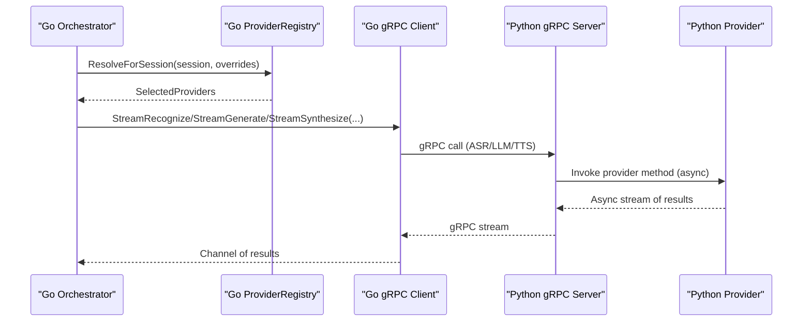
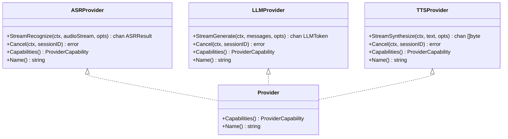
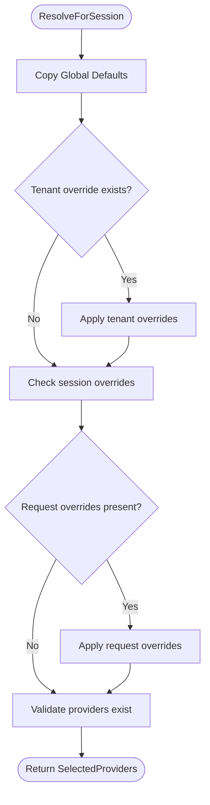
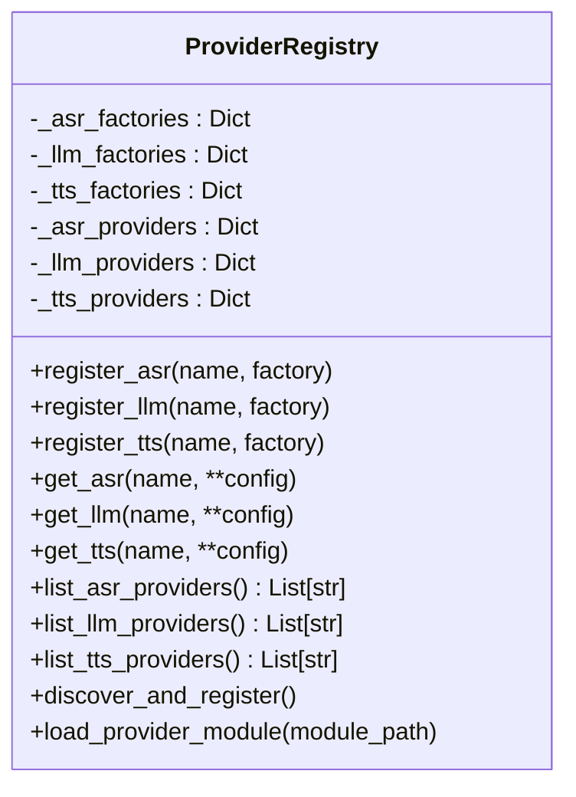
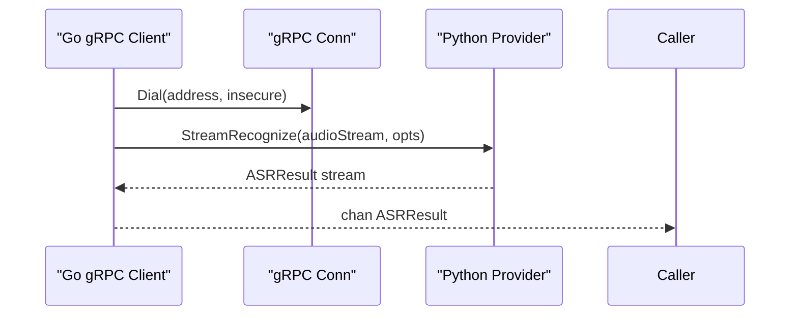
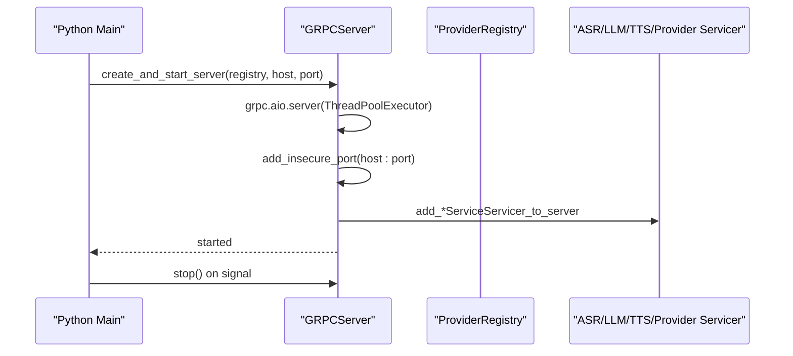
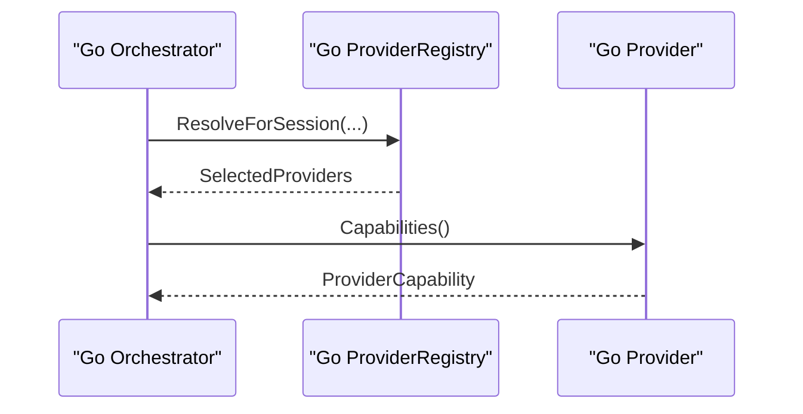
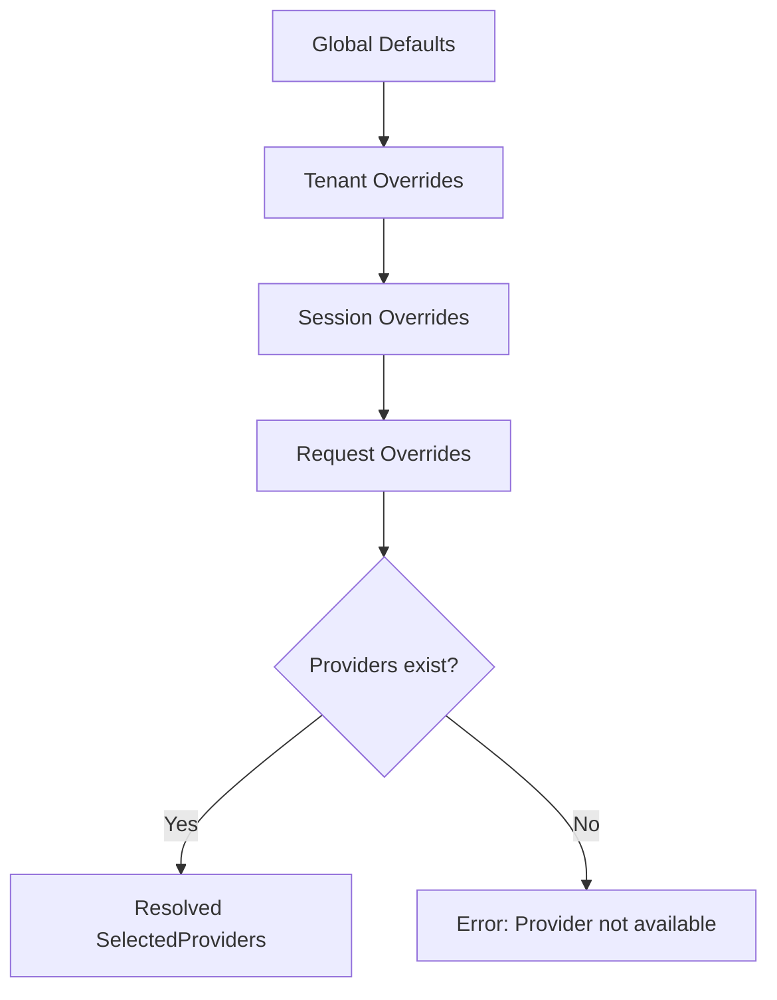

# Provider System

<cite>
**Referenced Files in This Document**
- [interfaces.go](file://go/pkg/providers/interfaces.go)
- [registry.go](file://go/pkg/providers/registry.go)
- [grpc_client.go](file://go/pkg/providers/grpc_client.go)
- [provider.go](file://go/pkg/contracts/provider.go)
- [provider.proto](file://proto/provider.proto)
- [base_provider.py](file://py/provider_gateway/app/core/base_provider.py)
- [capability.py](file://py/provider_gateway/app/core/capability.py)
- [registry.py](file://py/provider_gateway/app/core/registry.py)
- [faster_whisper.py](file://py/provider_gateway/app/providers/asr/faster_whisper.py)
- [google_speech.py](file://py/provider_gateway/app/providers/asr/google_speech.py)
- [mock_asr.py](file://py/provider_gateway/app/providers/asr/mock_asr.py)
- [groq.py](file://py/provider_gateway/app/providers/llm/groq.py)
- [openai_compatible.py](file://py/provider_gateway/app/providers/llm/openai_compatible.py)
- [google_tts.py](file://py/provider_gateway/app/providers/tts/google_tts.py)
- [xtts.py](file://py/provider_gateway/app/providers/tts/xtts.py)
- [server.py](file://py/provider_gateway/app/grpc_api/server.py)
</cite>

## Table of Contents
1. [Introduction](#introduction)
2. [Project Structure](#project-structure)
3. [Core Components](#core-components)
4. [Architecture Overview](#architecture-overview)
5. [Detailed Component Analysis](#detailed-component-analysis)
6. [Dependency Analysis](#dependency-analysis)
7. [Performance Considerations](#performance-considerations)
8. [Troubleshooting Guide](#troubleshooting-guide)
9. [Conclusion](#conclusion)
10. [Appendices](#appendices)

## Introduction
This document explains CloudApp’s pluggable provider system that enables flexible selection and orchestration of ASR, LLM, and TTS services. It covers the provider interface design, capability discovery, dynamic provider registration, the gRPC client implementation, and cross-language communication between the Go orchestrator and Python provider-gateway. It also documents how to add new providers, specify provider capabilities, select providers at runtime, manage provider lifecycles, handle errors, optimize performance, and use the mock provider system for testing and development.

## Project Structure
The provider system spans two languages:
- Go orchestrator and pipeline components define provider interfaces, a registry, and a gRPC client stub.
- Python provider-gateway implements provider adapters, capability models, a registry, and a gRPC server.

```mermaid
graph TB
subgraph "Go Orchestrator"
GInterfaces["go/pkg/providers/interfaces.go"]
GRegistry["go/pkg/providers/registry.go"]
GGrpcClient["go/pkg/providers/grpc_client.go"]
GContracts["go/pkg/contracts/provider.go"]
end
subgraph "Python Provider-Gateway"
PBase["py/provider_gateway/app/core/base_provider.py"]
PCap["py/provider_gateway/app/core/capability.py"]
PReg["py/provider_gateway/app/core/registry.py"]
PASR1["py/provider_gateway/app/providers/asr/faster_whisper.py"]
PASR2["py/provider_gateway/app/providers/asr/google_speech.py"]
PASR3["py/provider_gateway/app/providers/asr/mock_asr.py"]
PLLM1["py/provider_gateway/app/providers/llm/groq.py"]
PLLM2["py/provider_gateway/app/providers/llm/openai_compatible.py"]
PTTS1["py/provider_gateway/app/providers/tts/google_tts.py"]
PTTS2["py/provider_gateway/app/providers/tts/xtts.py"]
PGrpc["py/provider_gateway/app/grpc_api/server.py"]
end
GGrpcClient --> PGrpc
GRegistry --> GGrpcClient
PReg --> PGrpc
PASR1 --> PReg
PASR2 --> PReg
PASR3 --> PReg
PLLM1 --> PReg
PLLM2 --> PReg
PTTS1 --> PReg
PTTS2 --> PReg
```

**Diagram sources**
- [interfaces.go:1-107](file://go/pkg/providers/interfaces.go#L1-L107)
- [registry.go:1-262](file://go/pkg/providers/registry.go#L1-L262)
- [grpc_client.go:1-288](file://go/pkg/providers/grpc_client.go#L1-L288)
- [provider.go:1-79](file://go/pkg/contracts/provider.go#L1-L79)
- [base_provider.py:1-177](file://py/provider_gateway/app/core/base_provider.py#L1-L177)
- [capability.py:1-61](file://py/provider_gateway/app/core/capability.py#L1-L61)
- [registry.py:1-287](file://py/provider_gateway/app/core/registry.py#L1-L287)
- [faster_whisper.py:1-262](file://py/provider_gateway/app/providers/asr/faster_whisper.py#L1-L262)
- [google_speech.py:1-108](file://py/provider_gateway/app/providers/asr/google_speech.py#L1-L108)
- [mock_asr.py:1-221](file://py/provider_gateway/app/providers/asr/mock_asr.py#L1-L221)
- [groq.py:1-124](file://py/provider_gateway/app/providers/llm/groq.py#L1-L124)
- [openai_compatible.py:1-288](file://py/provider_gateway/app/providers/llm/openai_compatible.py#L1-L288)
- [google_tts.py:1-107](file://py/provider_gateway/app/providers/tts/google_tts.py#L1-L107)
- [xtts.py:1-106](file://py/provider_gateway/app/providers/tts/xtts.py#L1-L106)
- [server.py:1-171](file://py/provider_gateway/app/grpc_api/server.py#L1-L171)

**Section sources**
- [interfaces.go:1-107](file://go/pkg/providers/interfaces.go#L1-L107)
- [registry.go:1-262](file://go/pkg/providers/registry.go#L1-L262)
- [grpc_client.go:1-288](file://go/pkg/providers/grpc_client.go#L1-L288)
- [provider.go:1-79](file://go/pkg/contracts/provider.go#L1-L79)
- [base_provider.py:1-177](file://py/provider_gateway/app/core/base_provider.py#L1-L177)
- [capability.py:1-61](file://py/provider_gateway/app/core/capability.py#L1-L61)
- [registry.py:1-287](file://py/provider_gateway/app/core/registry.py#L1-L287)
- [server.py:1-171](file://py/provider_gateway/app/grpc_api/server.py#L1-L171)

## Core Components
- Provider interfaces (Go): Defines ASRProvider, LLMProvider, TTSProvider, VADProvider, and common Provider interface with streaming methods, cancellation, capabilities, and name.
- Capability model (Go): ProviderCapability encapsulates streaming support, word timestamps, voices, interruptibility, sample rates, and codecs.
- Provider registry (Go): Thread-safe registry with registration and resolution by session, tenant, and request overrides.
- gRPC client (Go): Client stubs for ASR, LLM, and TTS providers using gRPC, with connection management and capability reporting.
- Provider interfaces (Python): BaseProvider and specialized BaseASRProvider/BaseLLMProvider/BaseTTSProvider define async streaming APIs, cancellation, capabilities, and name.
- Capability model (Python): ProviderCapability mirrors the Go model with conversion helpers.
- Provider registry (Python): Dynamic registration and caching of provider instances, discovery of built-in providers, and module loading.
- gRPC server (Python): gRPC aio server exposing ASR, LLM, TTS, and Provider services.

**Section sources**
- [interfaces.go:10-107](file://go/pkg/providers/interfaces.go#L10-L107)
- [provider.go:54-79](file://go/pkg/contracts/provider.go#L54-L79)
- [registry.go:14-262](file://go/pkg/providers/registry.go#L14-L262)
- [grpc_client.go:14-288](file://go/pkg/providers/grpc_client.go#L14-L288)
- [base_provider.py:12-177](file://py/provider_gateway/app/core/base_provider.py#L12-L177)
- [capability.py:7-61](file://py/provider_gateway/app/core/capability.py#L7-L61)
- [registry.py:19-287](file://py/provider_gateway/app/core/registry.py#L19-L287)
- [server.py:25-171](file://py/provider_gateway/app/grpc_api/server.py#L25-L171)

## Architecture Overview
The system separates concerns across layers:
- Orchestration (Go): Defines provider contracts, maintains a registry, resolves providers per session, and invokes streaming operations via gRPC clients.
- Provider Gateway (Python): Implements provider adapters, capability models, and a gRPC server that translates RPC calls into provider operations.
- Cross-language communication: Protobuf-defined contracts and gRPC services enable the Go orchestrator to call Python providers.

**Diagram sources**
- [registry.go:172-251](file://go/pkg/providers/registry.go#L172-L251)
- [grpc_client.go:62-125](file://go/pkg/providers/grpc_client.go#L62-L125)
- [server.py:66-81](file://py/provider_gateway/app/grpc_api/server.py#L66-L81)
- [faster_whisper.py:104-218](file://py/provider_gateway/app/providers/asr/faster_whisper.py#L104-L218)
- [openai_compatible.py:87-238](file://py/provider_gateway/app/providers/llm/openai_compatible.py#L87-L238)

## Detailed Component Analysis

### Provider Interfaces and Capability Model
- Go interfaces define streaming operations, cancellation, capabilities(), and name().
- Capability model includes streaming input/output, word timestamps, voices, interruptibility, preferred sample rates, and supported codecs.
- Python base classes mirror the Go interfaces with async methods and capability declarations.

**Diagram sources**
- [interfaces.go:21-76](file://go/pkg/providers/interfaces.go#L21-L76)

**Section sources**
- [interfaces.go:10-107](file://go/pkg/providers/interfaces.go#L10-L107)
- [provider.go:54-79](file://go/pkg/contracts/provider.go#L54-L79)
- [base_provider.py:12-177](file://py/provider_gateway/app/core/base_provider.py#L12-L177)
- [capability.py:7-61](file://py/provider_gateway/app/core/capability.py#L7-L61)

### Provider Registry Pattern (Go)
- Thread-safe maps for ASR, LLM, TTS, VAD providers and factories.
- Registration methods for each provider type.
- Resolution prioritizes request overrides, session overrides, tenant overrides, and global defaults.
- Validation ensures selected providers exist before returning.

**Diagram sources**
- [registry.go:172-251](file://go/pkg/providers/registry.go#L172-L251)

**Section sources**
- [registry.go:14-262](file://go/pkg/providers/registry.go#L14-L262)

### Provider Registry Pattern (Python)
- Maintains separate factory registries for ASR, LLM, TTS.
- Caches provider instances keyed by name and configuration hash.
- Discovers built-in providers by importing provider modules and calling register_providers.
- Supports dynamic module loading and error handling.

**Diagram sources**
- [registry.py:19-287](file://py/provider_gateway/app/core/registry.py#L19-L287)

**Section sources**
- [registry.py:19-287](file://py/provider_gateway/app/core/registry.py#L19-L287)

### gRPC Client Implementation (Go)
- Configurable address, timeout, and retries.
- Dial with insecure credentials; connection stored for reuse.
- StreamRecognize, StreamGenerate, StreamSynthesize return channels.
- Capabilities report streaming support, preferred sample rates, and codecs.
- Methods marked TODO for actual gRPC invocation; stub behavior demonstrates expected flow.

**Diagram sources**
- [grpc_client.go:35-125](file://go/pkg/providers/grpc_client.go#L35-L125)

**Section sources**
- [grpc_client.go:14-288](file://go/pkg/providers/grpc_client.go#L14-L288)

### gRPC Server Implementation (Python)
- Creates an asyncio gRPC aio server with configurable host/port and worker threads.
- Adds ASR, LLM, TTS, and Provider services.
- Handles graceful shutdown via signals.

**Diagram sources**
- [server.py:25-171](file://py/provider_gateway/app/grpc_api/server.py#L25-L171)

**Section sources**
- [server.py:25-171](file://py/provider_gateway/app/grpc_api/server.py#L25-L171)

### Capability Discovery Mechanisms
- Provider capability reporting via Provider.Capabilities() in both Go and Python.
- Provider info listing and health checks exposed via ProviderService RPCs (Go proto).
- Python registry exposes get_provider_capabilities(name, type) to query capabilities dynamically.

**Diagram sources**
- [provider.go:54-79](file://go/pkg/contracts/provider.go#L54-L79)
- [interfaces.go:30-35](file://go/pkg/providers/interfaces.go#L30-L35)
- [capability.py:7-61](file://py/provider_gateway/app/core/capability.py#L7-L61)
- [registry.py:182-204](file://py/provider_gateway/app/core/registry.py#L182-L204)

**Section sources**
- [provider.proto:26-63](file://proto/provider.proto#L26-L63)
- [provider.go:54-79](file://go/pkg/contracts/provider.go#L54-L79)
- [capability.py:7-61](file://py/provider_gateway/app/core/capability.py#L7-L61)
- [registry.py:182-204](file://py/provider_gateway/app/core/registry.py#L182-L204)

### Runtime Provider Selection
- Priority order: request overrides > session overrides > tenant overrides > global defaults.
- Validation ensures the resolved provider names exist before use.

**Diagram sources**
- [registry.go:172-251](file://go/pkg/providers/registry.go#L172-L251)

**Section sources**
- [registry.go:172-251](file://go/pkg/providers/registry.go#L172-L251)

### Adding New Providers

#### Adding a Python ASR Provider
- Implement BaseASRProvider with stream_recognize and cancel.
- Implement capabilities() returning ProviderCapability.
- Export create_*_provider factory function.
- Register provider via register_providers(registry) in provider module.

Example reference paths:
- [faster_whisper.py:15-262](file://py/provider_gateway/app/providers/asr/faster_whisper.py#L15-L262)
- [mock_asr.py:16-221](file://py/provider_gateway/app/providers/asr/mock_asr.py#L16-L221)
- [google_speech.py:15-108](file://py/provider_gateway/app/providers/asr/google_speech.py#L15-L108)

#### Adding a Python LLM Provider
- Extend BaseLLMProvider with stream_generate and cancel.
- Implement capabilities() and name().
- Example reference: [openai_compatible.py:18-288](file://py/provider_gateway/app/providers/llm/openai_compatible.py#L18-L288), [groq.py:16-124](file://py/provider_gateway/app/providers/llm/groq.py#L16-L124)

#### Adding a Python TTS Provider
- Extend BaseTTSProvider with stream_synthesize and cancel.
- Implement capabilities() and name().
- Example reference: [google_tts.py:14-107](file://py/provider_gateway/app/providers/tts/google_tts.py#L14-L107), [xtts.py:14-106](file://py/provider_gateway/app/providers/tts/xtts.py#L14-L106)

#### Registering Providers in Python
- Call registry.register_asr/register_llm/register_tts with name and factory.
- Alternatively, rely on automatic discovery by implementing register_providers in provider modules.

Reference:
- [registry.py:40-84](file://py/provider_gateway/app/core/registry.py#L40-L84)
- [registry.py:206-241](file://py/provider_gateway/app/core/registry.py#L206-L241)

#### Adding a Go Provider (gRPC Client)
- Implement ASRProvider, LLMProvider, or TTSProvider interface.
- Use GRPCClientConfig to configure address, timeout, retries.
- Connect via grpc.Dial and implement streaming methods.
- Reference: [grpc_client.go:35-288](file://go/pkg/providers/grpc_client.go#L35-L288)

### Provider Capability Specification
- Go: ProviderCapability fields include streaming support, word timestamps, voices, interruptibility, preferred sample rates, and supported codecs.
- Python: ProviderCapability mirrors the Go model with conversion helpers to/from proto.

References:
- [provider.go:54-79](file://go/pkg/contracts/provider.go#L54-L79)
- [capability.py:7-61](file://py/provider_gateway/app/core/capability.py#L7-L61)

### Cross-Language Communication
- Protobuf service definitions define ProviderService and message types.
- Go orchestrator uses gRPC client stubs to call Python provider-gateway.
- Python provider-gateway implements gRPC servicers and routes calls to provider instances.

References:
- [provider.proto:26-63](file://proto/provider.proto#L26-L63)
- [grpc_client.go:35-288](file://go/pkg/providers/grpc_client.go#L35-L288)
- [server.py:66-81](file://py/provider_gateway/app/grpc_api/server.py#L66-L81)

### Provider Lifecycle Management
- Go gRPC client manages connection lifecycle (dial on creation, close on cleanup).
- Python provider-gateway server manages graceful shutdown on signals.
- Python provider registry caches instances keyed by configuration to avoid recreation.

References:
- [grpc_client.go:119-125](file://go/pkg/providers/grpc_client.go#L119-L125)
- [server.py:104-118](file://py/provider_gateway/app/grpc_api/server.py#L104-L118)
- [registry.py:96-109](file://py/provider_gateway/app/core/registry.py#L96-L109)

### Error Handling
- Python providers raise ProviderError with standardized error codes and retry hints.
- Examples include SERVICE_UNAVAILABLE, RATE_LIMITED, QUOTA_EXCEEDED, AUTHENTICATION, TIMEOUT, INTERNAL.
- Go gRPC client stubs return errors for unimplemented methods and connection failures.

References:
- [faster_whisper.py:68-76](file://py/provider_gateway/app/providers/asr/faster_whisper.py#L68-L76)
- [groq.py:88-116](file://py/provider_gateway/app/providers/llm/groq.py#L88-L116)
- [openai_compatible.py:240-259](file://py/provider_gateway/app/providers/llm/openai_compatible.py#L240-L259)
- [grpc_client.go:98-101](file://go/pkg/providers/grpc_client.go#L98-L101)

### Performance Optimization
- Use streaming input/output to minimize latency.
- Prefer provider capabilities aligned with audio characteristics (sample rates, codecs).
- Cache provider instances in Python registry to reduce initialization overhead.
- Tune gRPC message sizes and timeouts in client configuration.

References:
- [capability.py:22-28](file://py/provider_gateway/app/core/capability.py#L22-L28)
- [grpc_client.go:14-33](file://go/pkg/providers/grpc_client.go#L14-L33)
- [registry.py:96-109](file://py/provider_gateway/app/core/registry.py#L96-L109)

### Mock Provider System
- MockASRProvider generates deterministic partial transcripts and final transcripts with word timestamps.
- Useful for testing and development without external dependencies.
- References: [mock_asr.py:16-221](file://py/provider_gateway/app/providers/asr/mock_asr.py#L16-L221)

## Dependency Analysis
The Go orchestrator depends on provider interfaces and registry to resolve and invoke providers. The Python provider-gateway depends on the provider registry and implements gRPC services. Cross-language communication is mediated by protobuf-generated gRPC stubs.

**Diagram sources**
- [interfaces.go:21-76](file://go/pkg/providers/interfaces.go#L21-L76)
- [registry.go:14-262](file://go/pkg/providers/registry.go#L14-L262)
- [grpc_client.go:35-288](file://go/pkg/providers/grpc_client.go#L35-L288)
- [server.py:66-81](file://py/provider_gateway/app/grpc_api/server.py#L66-L81)
- [registry.py:19-287](file://py/provider_gateway/app/core/registry.py#L19-L287)

**Section sources**
- [interfaces.go:21-76](file://go/pkg/providers/interfaces.go#L21-L76)
- [registry.go:14-262](file://go/pkg/providers/registry.go#L14-L262)
- [grpc_client.go:35-288](file://go/pkg/providers/grpc_client.go#L35-L288)
- [server.py:66-81](file://py/provider_gateway/app/grpc_api/server.py#L66-L81)
- [registry.py:19-287](file://py/provider_gateway/app/core/registry.py#L19-L287)

## Performance Considerations
- Streaming-first design reduces end-to-end latency.
- Align audio sample rates and codecs with provider capabilities to avoid resampling and transcoding overhead.
- Use provider caching and connection pooling to minimize startup costs.
- Monitor provider health and degrade gracefully when unavailable.

## Troubleshooting Guide
- Provider not found: Verify registration and that provider names match selection logic.
- Capability mismatch: Ensure audio format matches provider capabilities (sample rates, codecs).
- gRPC connectivity: Confirm server address, port, and network accessibility; check insecure credentials usage.
- Python provider errors: Inspect ProviderError codes and messages for authentication, rate limits, quotas, or timeouts.

**Section sources**
- [registry.go:234-250](file://go/pkg/providers/registry.go#L234-L250)
- [grpc_client.go:22-33](file://go/pkg/providers/grpc_client.go#L22-L33)
- [openai_compatible.py:240-259](file://py/provider_gateway/app/providers/llm/openai_compatible.py#L240-L259)
- [groq.py:88-116](file://py/provider_gateway/app/providers/llm/groq.py#L88-L116)

## Conclusion
CloudApp’s provider system cleanly separates provider contracts, capability modeling, and dynamic registration across Go and Python. The gRPC bridge enables flexible, cross-language provider invocation, while robust error handling and capability discovery support reliable runtime selection. The mock provider system accelerates development and testing without external dependencies.

## Appendices

### Example Provider Implementations and Integration Patterns
- ASR
  - Whisper: [faster_whisper.py:15-262](file://py/provider_gateway/app/providers/asr/faster_whisper.py#L15-L262)
  - Google Speech: [google_speech.py:15-108](file://py/provider_gateway/app/providers/asr/google_speech.py#L15-L108)
  - Mock: [mock_asr.py:16-221](file://py/provider_gateway/app/providers/asr/mock_asr.py#L16-L221)
- LLM
  - Groq: [groq.py:16-124](file://py/provider_gateway/app/providers/llm/groq.py#L16-L124)
  - OpenAI-compatible (vLLM/Groq): [openai_compatible.py:18-288](file://py/provider_gateway/app/providers/llm/openai_compatible.py#L18-L288)
- TTS
  - Google TTS: [google_tts.py:14-107](file://py/provider_gateway/app/providers/tts/google_tts.py#L14-L107)
  - XTTS: [xtts.py:14-106](file://py/provider_gateway/app/providers/tts/xtts.py#L14-L106)

**Section sources**
- [faster_whisper.py:15-262](file://py/provider_gateway/app/providers/asr/faster_whisper.py#L15-L262)
- [google_speech.py:15-108](file://py/provider_gateway/app/providers/asr/google_speech.py#L15-L108)
- [mock_asr.py:16-221](file://py/provider_gateway/app/providers/asr/mock_asr.py#L16-L221)
- [groq.py:16-124](file://py/provider_gateway/app/providers/llm/groq.py#L16-L124)
- [openai_compatible.py:18-288](file://py/provider_gateway/app/providers/llm/openai_compatible.py#L18-L288)
- [google_tts.py:14-107](file://py/provider_gateway/app/providers/tts/google_tts.py#L14-L107)
- [xtts.py:14-106](file://py/provider_gateway/app/providers/tts/xtts.py#L14-L106)