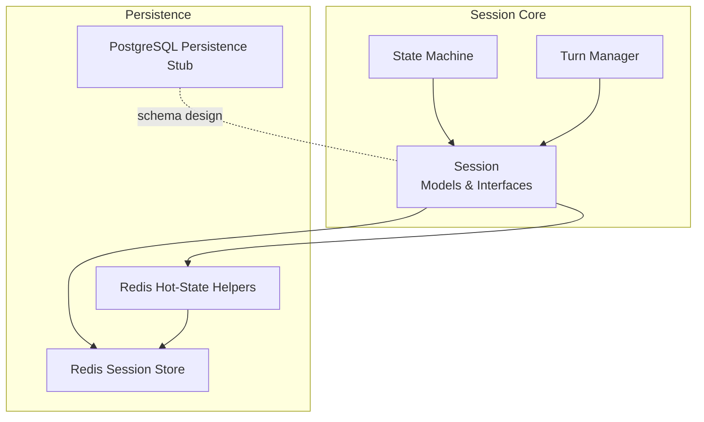
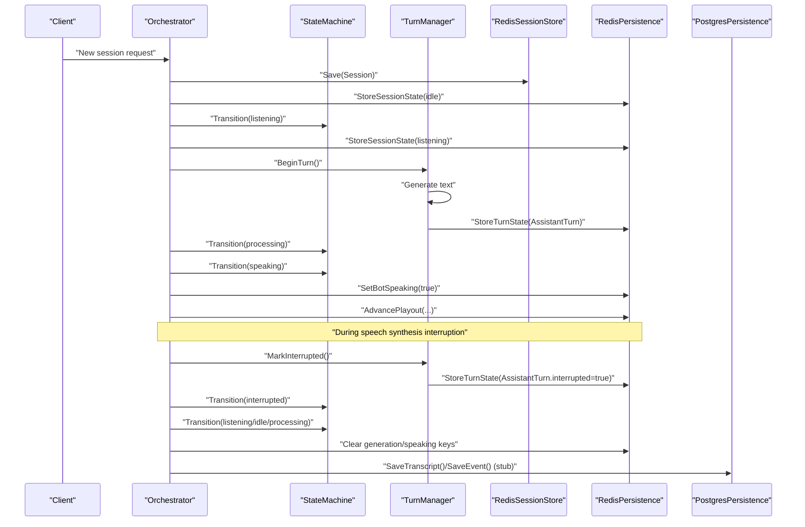
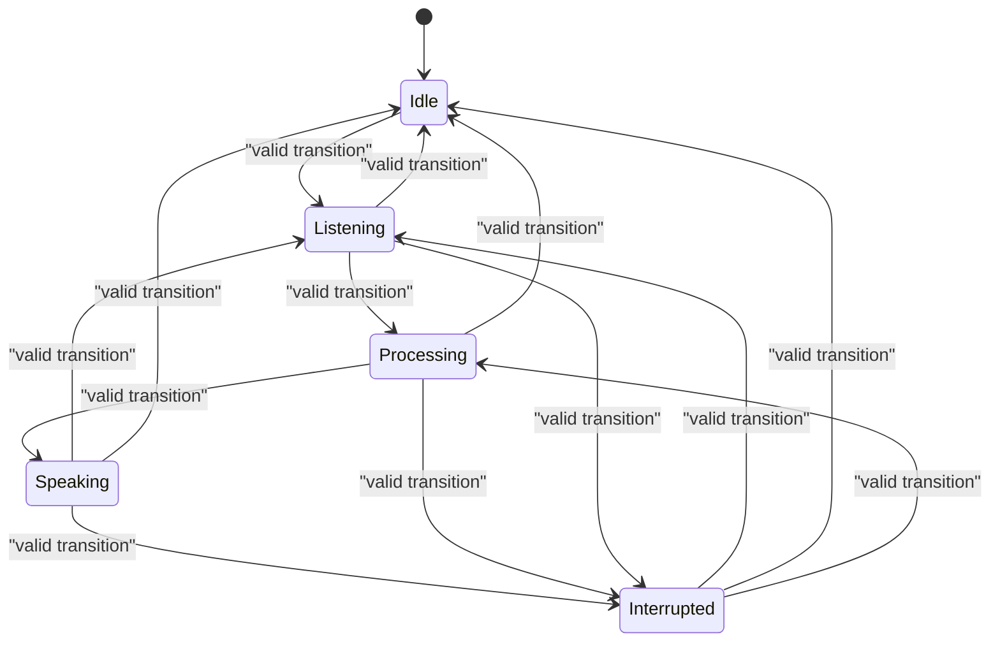
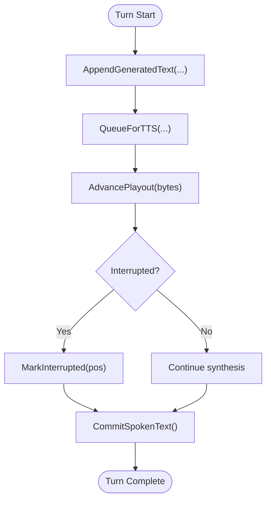
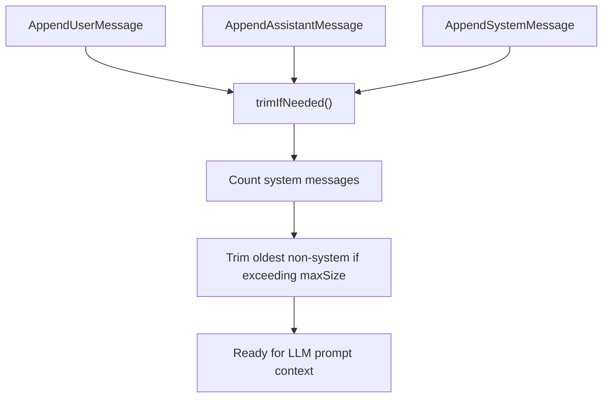
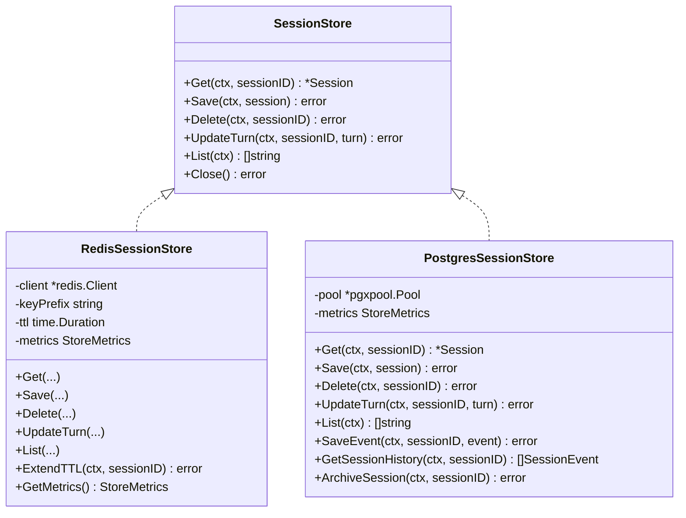
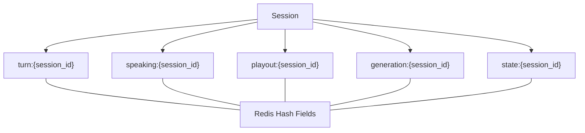
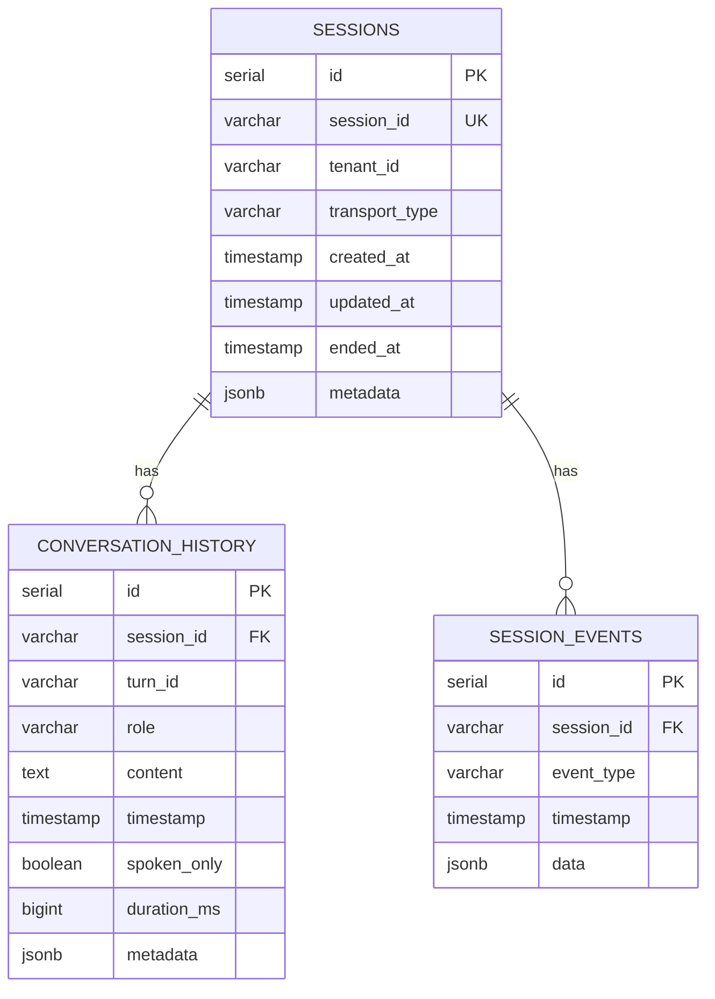
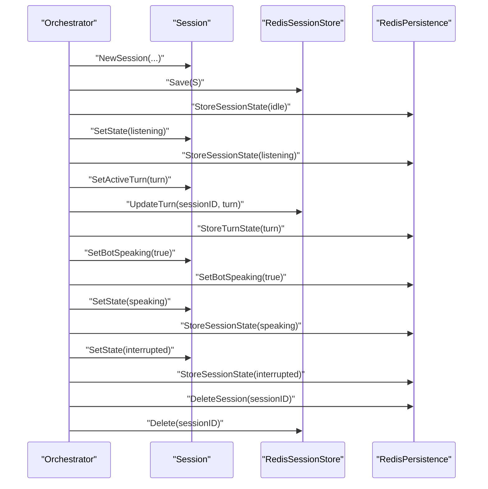
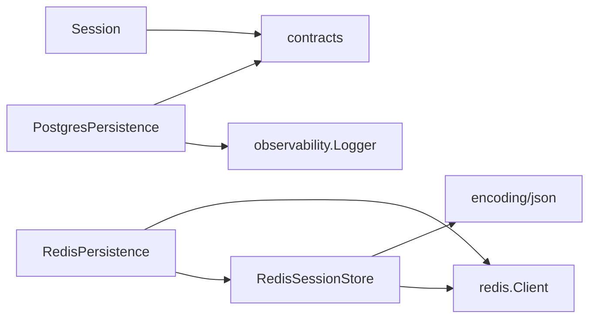

# Session Management

<cite>
**Referenced Files in This Document**
- [session.go](file://go/pkg/session/session.go)
- [state.go](file://go/pkg/session/state.go)
- [store.go](file://go/pkg/session/store.go)
- [history.go](file://go/pkg/session/history.go)
- [turn.go](file://go/pkg/session/turn.go)
- [redis_store.go](file://go/pkg/session/redis_store.go)
- [postgres_store.go](file://go/pkg/session/postgres_store.go)
- [redis.go](file://go/orchestrator/internal/persistence/redis.go)
- [postgres.go](file://go/orchestrator/internal/persistence/postgres.go)
- [fsm.go](file://go/orchestrator/internal/statemachine/fsm.go)
- [turn_manager.go](file://go/orchestrator/internal/statemachine/turn_manager.go)
</cite>

## Table of Contents
1. [Introduction](#introduction)
2. [Project Structure](#project-structure)
3. [Core Components](#core-components)
4. [Architecture Overview](#architecture-overview)
5. [Detailed Component Analysis](#detailed-component-analysis)
6. [Dependency Analysis](#dependency-analysis)
7. [Performance Considerations](#performance-considerations)
8. [Troubleshooting Guide](#troubleshooting-guide)
9. [Conclusion](#conclusion)
10. [Appendices](#appendices)

## Introduction
This document explains CloudApp’s session management system with a focus on:
- Session state machine with states: Idle, Listening, Processing, Speaking, and Interrupted
- Turn-based interaction flow and assistant turn tracking
- Conversation history management and persistence
- Session lifecycle management
- Redis cache usage for hot-state tracking and session data
- PostgreSQL persistence stubs and schema design
- Session isolation and multi-tenant handling
- Session recovery mechanisms
- Examples of state transitions, interruption handling, and persistence patterns
- Interfaces, data models, and performance considerations for high-concurrency scenarios

## Project Structure
The session management system spans three layers:
- Core session models and interfaces in the session package
- Persistence layer with Redis-backed hot-state helpers and PostgreSQL persistence stubs
- Orchestrator state machine and turn manager coordinating runtime behavior

**Diagram sources**
- [session.go:62-84](file://go/pkg/session/session.go#L62-L84)
- [state.go:82-153](file://go/pkg/session/state.go#L82-L153)
- [turn_manager.go](file://go/orchestrator/internal/statemachine/turn_manager.go)
- [redis_store.go:12-36](file://go/pkg/session/redis_store.go#L12-L36)
- [redis.go:13-36](file://go/orchestrator/internal/persistence/redis.go#L13-L36)
- [postgres.go:13-30](file://go/orchestrator/internal/persistence/postgres.go#L13-L30)

**Section sources**
- [session.go:62-84](file://go/pkg/session/session.go#L62-L84)
- [redis_store.go:12-36](file://go/pkg/session/redis_store.go#L12-L36)
- [redis.go:13-36](file://go/orchestrator/internal/persistence/redis.go#L13-L36)
- [postgres.go:13-30](file://go/orchestrator/internal/persistence/postgres.go#L13-L30)

## Core Components
- Session: Encapsulates runtime state, identifiers, provider selections, profiles, and active turn. Thread-safe setters/getters and cloning support concurrent access.
- SessionState and StateMachine: Define allowed transitions and provide callbacks for state changes.
- AssistantTurn: Tracks generated, queued-for-TTS, and spoken text, playout cursor, and interruption state.
- ConversationHistory: Manages user/assistant/system messages with trimming and prompt context composition.
- SessionStore and EventStore interfaces: Abstractions for session and event persistence.
- RedisSessionStore: Implements hot session persistence with TTL and metrics.
- RedisPersistence: Adds fine-grained hot-state helpers for turns, speaking flag, playout position, generation IDs, and session state.
- PostgresSessionStore and PostgresPersistence: Stubs with TODO markers and schema design comments.

**Section sources**
- [session.go:62-249](file://go/pkg/session/session.go#L62-L249)
- [state.go:8-153](file://go/pkg/session/state.go#L8-L153)
- [turn.go:9-230](file://go/pkg/session/turn.go#L9-L230)
- [history.go:11-233](file://go/pkg/session/history.go#L11-L233)
- [store.go:16-114](file://go/pkg/session/store.go#L16-L114)
- [redis_store.go:12-166](file://go/pkg/session/redis_store.go#L12-L166)
- [redis.go:13-317](file://go/orchestrator/internal/persistence/redis.go#L13-L317)
- [postgres_store.go:10-93](file://go/pkg/session/postgres_store.go#L10-L93)
- [postgres.go:13-196](file://go/orchestrator/internal/persistence/postgres.go#L13-L196)

## Architecture Overview
The runtime orchestrator coordinates session state and turn flow using the state machine and turn manager. Hot-state data is stored in Redis for low-latency access and updates, while durable persistence is provided via PostgreSQL stubs with a defined schema.

**Diagram sources**
- [fsm.go](file://go/orchestrator/internal/statemachine/fsm.go)
- [turn_manager.go](file://go/orchestrator/internal/statemachine/turn_manager.go)
- [redis_store.go:62-85](file://go/pkg/session/redis_store.go#L62-L85)
- [redis.go:227-278](file://go/orchestrator/internal/persistence/redis.go#L227-L278)
- [postgres.go:40-81](file://go/orchestrator/internal/persistence/postgres.go#L40-L81)

## Detailed Component Analysis

### Session State Machine
The state machine enforces a deterministic state graph with explicit transitions. It exposes callbacks for external observers and supports reset and convenience predicates.

**Diagram sources**
- [state.go:37-62](file://go/pkg/session/state.go#L37-L62)

Key behaviors:
- Transition validation prevents illegal state changes.
- Callback hook enables logging or metrics emission on state change.
- Convenience methods support active/processing/listening/speaking checks.

**Section sources**
- [state.go:81-153](file://go/pkg/session/state.go#L81-L153)

### Turn-Based Interaction Flow
AssistantTurn tracks the lifecycle of a single assistant response:
- Generated text accumulation
- Queuing for TTS
- Playout cursor advancement
- Spoken text commit and interruption marking

**Diagram sources**
- [turn.go:36-166](file://go/pkg/session/turn.go#L36-L166)

Operational notes:
- CommitSpokenText trims unspoken text and records spoken portion for history.
- GetCommittableText computes text up to the current playout cursor for safe history commits.
- Playout cursor is advanced incrementally; total audio byte accounting supports duration estimation.

**Section sources**
- [turn.go:9-230](file://go/pkg/session/turn.go#L9-L230)

### Conversation History Management
ConversationHistory maintains a bounded, thread-safe log of roles user, assistant, and system. It supports:
- Append methods for each role
- Prompt context assembly for LLM input
- Last message retrieval
- Automatic trimming to maintain size limits while preserving system messages

**Diagram sources**
- [history.go:19-198](file://go/pkg/session/history.go#L19-L198)

**Section sources**
- [history.go:11-233](file://go/pkg/session/history.go#L11-L233)

### Session Store Interfaces and Implementations
SessionStore defines CRUD operations for sessions and turn updates, plus listing and lifecycle hooks. RedisSessionStore implements these with JSON serialization, TTL, and metrics. PostgreSQL-backed stores are stubbed with TODO markers and a schema definition comment.

**Diagram sources**
- [store.go:16-35](file://go/pkg/session/store.go#L16-L35)
- [redis_store.go:12-36](file://go/pkg/session/redis_store.go#L12-L36)
- [postgres_store.go:10-23](file://go/pkg/session/postgres_store.go#L10-L23)

**Section sources**
- [store.go:16-114](file://go/pkg/session/store.go#L16-L114)
- [redis_store.go:12-166](file://go/pkg/session/redis_store.go#L12-L166)
- [postgres_store.go:10-93](file://go/pkg/session/postgres_store.go#L10-L93)

### Redis Hot-State Helpers
RedisPersistence augments the session store with specialized hot-state keys:
- turn:{session_id}: JSON-encoded AssistantTurn with updated_at
- speaking:{session_id}: boolean flag
- playout:{session_id}: playout position and updated_at
- generation:{session_id}: provider-type-specific generation IDs
- state:{session_id}: session state string with updated_at

These helpers enable efficient, atomic updates and reads for runtime coordination.

**Diagram sources**
- [redis.go:38-301](file://go/orchestrator/internal/persistence/redis.go#L38-L301)

**Section sources**
- [redis.go:13-317](file://go/orchestrator/internal/persistence/redis.go#L13-L317)

### PostgreSQL Persistence Stub and Schema Design
PostgresPersistence is a stub that logs operations and returns nil errors. The schema comment outlines tables for sessions, conversation history, and events with appropriate indexes.

**Diagram sources**
- [postgres.go:149-191](file://go/orchestrator/internal/persistence/postgres.go#L149-L191)

**Section sources**
- [postgres.go:13-196](file://go/orchestrator/internal/persistence/postgres.go#L13-L196)

### Session Lifecycle Management
Lifecycle encompasses creation, state transitions, turn updates, and cleanup:
- Creation: NewSession initializes state to Idle and timestamps.
- Updates: SetState validates transitions; SetActiveTurn, SetBotSpeaking, SetInterrupted update runtime flags.
- Cleanup: DeleteSession in RedisPersistence removes all hot-state keys; RedisSessionStore.Delete removes the session key.

**Diagram sources**
- [session.go:86-208](file://go/pkg/session/session.go#L86-L208)
- [redis_store.go:105-123](file://go/pkg/session/redis_store.go#L105-L123)
- [redis.go:280-301](file://go/orchestrator/internal/persistence/redis.go#L280-L301)

**Section sources**
- [session.go:86-249](file://go/pkg/session/session.go#L86-L249)
- [redis_store.go:105-123](file://go/pkg/session/redis_store.go#L105-L123)
- [redis.go:280-301](file://go/orchestrator/internal/persistence/redis.go#L280-L301)

### Multi-Tenant Session Handling
- Session carries an optional TenantID pointer; SetTenantID updates it atomically with timestamps.
- RedisPersistence uses a configurable key prefix to isolate namespaces per tenant or environment.
- PostgreSQL schema includes tenant_id for future relational queries and filtering.

**Section sources**
- [session.go:99-105](file://go/pkg/session/session.go#L99-L105)
- [redis.go:20-35](file://go/orchestrator/internal/persistence/redis.go#L20-L35)
- [postgres.go:152-162](file://go/orchestrator/internal/persistence/postgres.go#L152-L162)

### Session Recovery Mechanisms
- Redis hot-state restoration: On restart, RedisPersistence can reconstruct session state, turn, and playout position from Redis hashes.
- TTL-based eviction: Redis keys expire automatically, preventing stale state accumulation.
- Session listing: RedisSessionStore.List scans keys by prefix to enumerate active sessions.

**Section sources**
- [redis.go:38-91](file://go/orchestrator/internal/persistence/redis.go#L38-L91)
- [redis_store.go:125-144](file://go/pkg/session/redis_store.go#L125-L144)

### Concrete Examples

#### Example: Valid State Transitions
- Idle → Listening: Start of a new turn
- Listening → Processing: Speech recognized and being processed
- Processing → Speaking: Response generated and ready to synthesize
- Speaking → Interrupted: User interrupts synthesis
- Interrupted → Listening: Resume listening after interruption

**Section sources**
- [state.go:37-62](file://go/pkg/session/state.go#L37-L62)

#### Example: Interruption During Speech Synthesis
- While speaking, if an interruption occurs:
  - MarkInterrupted(playoutPosition) updates the turn’s interruption flag and cursor
  - CommitSpokenText captures only the text corresponding to audio already sent
  - Transition to Interrupted and reset generation/speaking flags in RedisPersistence

**Section sources**
- [turn.go:97-123](file://go/pkg/session/turn.go#L97-L123)
- [redis.go:93-129](file://go/orchestrator/internal/persistence/redis.go#L93-L129)

#### Example: Session Persistence Patterns
- Hot-state writes: StoreTurnState, StoreSessionState, SetBotSpeaking, StorePlayoutPosition
- Durable writes: SaveTranscript and SaveEvent (stub) for future PostgreSQL implementation
- Cleanup: DeleteSession removes all hot-state keys and RedisSessionStore.Delete removes the session key

**Section sources**
- [redis.go:38-301](file://go/orchestrator/internal/persistence/redis.go#L38-L301)
- [redis_store.go:38-103](file://go/pkg/session/redis_store.go#L38-L103)
- [postgres.go:40-81](file://go/orchestrator/internal/persistence/postgres.go#L40-L81)

## Dependency Analysis
- Session depends on contracts for audio format and chat messages.
- RedisSessionStore depends on Redis client and JSON serialization.
- RedisPersistence composes RedisSessionStore and uses Redis hashes for hot-state.
- PostgreSQL persistence stubs depend on observability logger and schema comments.

**Diagram sources**
- [session.go:8](file://go/pkg/session/session.go#L8)
- [redis_store.go:9](file://go/pkg/session/redis_store.go#L9)
- [redis.go](file://go/orchestrator/internal/persistence/redis.go)
- [postgres.go:8-10](file://go/orchestrator/internal/persistence/postgres.go#L8-L10)

**Section sources**
- [session.go:8](file://go/pkg/session/session.go#L8)
- [redis_store.go:9](file://go/pkg/session/redis_store.go#L9)
- [redis.go](file://go/orchestrator/internal/persistence/redis.go)
- [postgres.go:8-10](file://go/orchestrator/internal/persistence/postgres.go#L8-L10)

## Performance Considerations
- Concurrency: Session and AssistantTurn use read-write mutexes to guard mutable fields; getters return copies to prevent races.
- Hot-state caching: Redis hot-state helpers minimize round-trips for frequent updates; pipelining reduces latency.
- TTL management: Default TTL prevents memory leaks; ExtendTTL refreshes activity windows.
- Serialization: JSON marshalling is straightforward; consider binary formats (e.g., protobuf) for higher throughput.
- Scanning and listing: Redis SCAN with prefix enumerates active sessions efficiently.
- PostgreSQL stub: Replace stubs with batched inserts and proper indexing for high-throughput durability.

[No sources needed since this section provides general guidance]

## Troubleshooting Guide
Common issues and remedies:
- Invalid state transition: Attempting an illegal state switch returns a specific error; validate transitions against the allowed graph.
- Session not found: Redis GET returns a not-found error; ensure session keys are prefixed consistently.
- Interruption mismatches: Verify playout cursor alignment with audio bytes; recompute durations if timestamps are unavailable.
- Persistence stubs: PostgreSQL operations are logged as stubs; deploy schema and implement persistence before enabling durable storage.

**Section sources**
- [state.go:78-79](file://go/pkg/session/state.go#L78-L79)
- [redis_store.go:42-58](file://go/pkg/session/redis_store.go#L42-L58)
- [postgres.go:24-30](file://go/orchestrator/internal/persistence/postgres.go#L24-L30)

## Conclusion
CloudApp’s session management system combines a strict state machine, robust turn tracking, and a layered persistence strategy. Redis provides fast, ephemeral hot-state synchronization, while PostgreSQL stubs offer a clear migration path to durable storage. The design supports multi-tenancy, interruption handling, and recovery, with interfaces enabling easy substitution of implementations for high-concurrency deployments.

[No sources needed since this section summarizes without analyzing specific files]

## Appendices

### Appendix A: Session State Transition Reference
Allowed transitions:
- Idle → Listening
- Listening → Processing | Idle | Interrupted
- Processing → Speaking | Idle | Interrupted
- Speaking → Listening | Idle | Interrupted
- Interrupted → Listening | Idle | Processing

**Section sources**
- [state.go:37-62](file://go/pkg/session/state.go#L37-L62)

### Appendix B: Redis Key Naming Convention
- session:{session_id}: serialized Session
- turn:{session_id}: JSON AssistantTurn with updated_at
- speaking:{session_id}: "1"|"0"
- playout:{session_id}: position with updated_at
- generation:{session_id}: provider-type-specific IDs
- state:{session_id}: state string with updated_at

**Section sources**
- [redis.go:40-278](file://go/orchestrator/internal/persistence/redis.go#L40-L278)