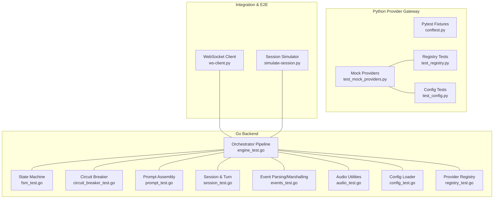
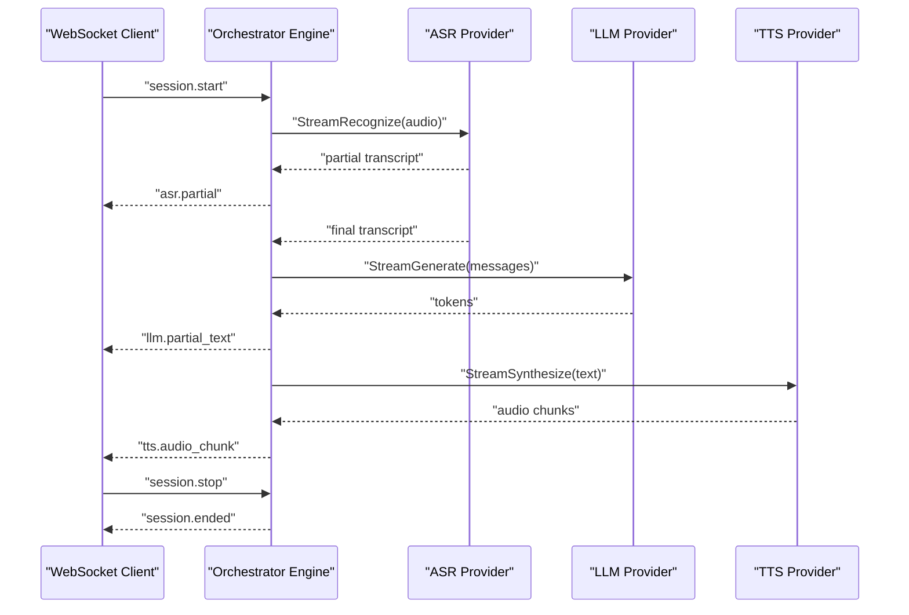
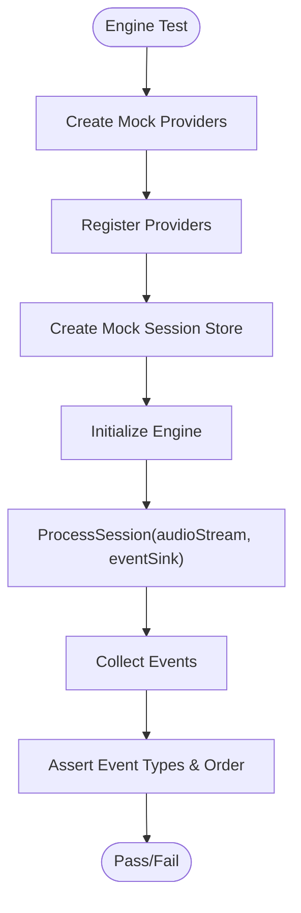
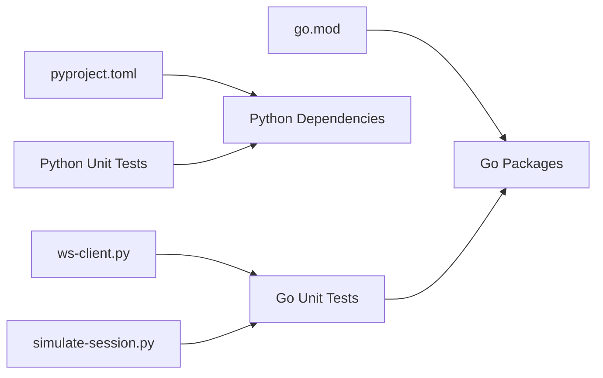

# Testing Strategy

<cite>
**Referenced Files in This Document**
- [docs/testing.md](file://docs/testing.md)
- [go/go.mod](file://go/go.mod)
- [py/provider_gateway/pyproject.toml](file://py/provider_gateway/pyproject.toml)
- [go/orchestrator/internal/pipeline/engine_test.go](file://go/orchestrator/internal/pipeline/engine_test.go)
- [go/orchestrator/internal/statemachine/fsm_test.go](file://go/orchestrator/internal/statemachine/fsm_test.go)
- [go/orchestrator/internal/pipeline/circuit_breaker_test.go](file://go/orchestrator/internal/pipeline/circuit_breaker_test.go)
- [go/orchestrator/internal/pipeline/prompt_test.go](file://go/orchestrator/internal/pipeline/prompt_test.go)
- [go/pkg/session/session_test.go](file://go/pkg/session/session_test.go)
- [go/pkg/events/events_test.go](file://go/pkg/events/events_test.go)
- [go/pkg/audio/audio_test.go](file://go/pkg/audio/audio_test.go)
- [go/pkg/config/config_test.go](file://go/pkg/config/config_test.go)
- [go/pkg/providers/registry_test.go](file://go/pkg/providers/registry_test.go)
- [py/provider_gateway/app/tests/conftest.py](file://py/provider_gateway/app/tests/conftest.py)
- [py/provider_gateway/app/tests/test_mock_providers.py](file://py/provider_gateway/app/tests/test_mock_providers.py)
- [py/provider_gateway/app/tests/test_registry.py](file://py/provider_gateway/app/tests/test_registry.py)
- [py/provider_gateway/app/tests/test_config.py](file://py/provider_gateway/app/tests/test_config.py)
- [scripts/ws-client.py](file://scripts/ws-client.py)
- [scripts/simulate-session.py](file://scripts/simulate-session.py)
</cite>

## Table of Contents
1. [Introduction](#introduction)
2. [Project Structure](#project-structure)
3. [Core Components](#core-components)
4. [Architecture Overview](#architecture-overview)
5. [Detailed Component Analysis](#detailed-component-analysis)
6. [Dependency Analysis](#dependency-analysis)
7. [Performance Considerations](#performance-considerations)
8. [Troubleshooting Guide](#troubleshooting-guide)
9. [Conclusion](#conclusion)
10. [Appendices](#appendices)

## Introduction
This document presents CloudApp’s comprehensive testing strategy across Go and Python components. It covers unit testing frameworks, integration testing approaches, mock provider testing systems, pipeline engine and state machine logic verification, provider integration testing, performance and load testing workflows, and continuous integration setup. The goal is to equip contributors with practical guidance for writing reliable, maintainable, and fast tests that ensure correctness and stability across the system.

## Project Structure
CloudApp’s repository is organized into:
- Go backend services (orchestrator, media-edge) with extensive unit tests under each package.
- Python provider gateway with pytest-based unit tests and fixtures.
- Scripts for WebSocket client and session simulation for integration testing.
- Documentation for testing procedures and coverage targets.

**Diagram sources**
- [go/orchestrator/internal/pipeline/engine_test.go:1-700](file://go/orchestrator/internal/pipeline/engine_test.go#L1-L700)
- [go/orchestrator/internal/statemachine/fsm_test.go:1-487](file://go/orchestrator/internal/statemachine/fsm_test.go#L1-L487)
- [go/orchestrator/internal/pipeline/circuit_breaker_test.go:1-402](file://go/orchestrator/internal/pipeline/circuit_breaker_test.go#L1-L402)
- [go/orchestrator/internal/pipeline/prompt_test.go:1-342](file://go/orchestrator/internal/pipeline/prompt_test.go#L1-L342)
- [go/pkg/session/session_test.go:1-380](file://go/pkg/session/session_test.go#L1-L380)
- [go/pkg/events/events_test.go:1-582](file://go/pkg/events/events_test.go#L1-L582)
- [go/pkg/audio/audio_test.go:1-757](file://go/pkg/audio/audio_test.go#L1-L757)
- [go/pkg/config/config_test.go:1-575](file://go/pkg/config/config_test.go#L1-L575)
- [go/pkg/providers/registry_test.go:1-409](file://go/pkg/providers/registry_test.go#L1-L409)
- [py/provider_gateway/app/tests/conftest.py:1-190](file://py/provider_gateway/app/tests/conftest.py#L1-L190)
- [py/provider_gateway/app/tests/test_mock_providers.py:1-373](file://py/provider_gateway/app/tests/test_mock_providers.py#L1-L373)
- [py/provider_gateway/app/tests/test_registry.py:1-180](file://py/provider_gateway/app/tests/test_registry.py#L1-L180)
- [py/provider_gateway/app/tests/test_config.py:1-263](file://py/provider_gateway/app/tests/test_config.py#L1-L263)
- [scripts/ws-client.py:1-326](file://scripts/ws-client.py#L1-L326)
- [scripts/simulate-session.py:1-554](file://scripts/simulate-session.py#L1-L554)

**Section sources**
- [docs/testing.md:1-542](file://docs/testing.md#L1-L542)
- [go/go.mod:1-43](file://go/go.mod#L1-L43)
- [py/provider_gateway/pyproject.toml:1-64](file://py/provider_gateway/pyproject.toml#L1-L64)

## Core Components
CloudApp’s testing stack combines:
- Go standard testing with table-driven tests, concurrency-safe mocks, and deterministic assertions.
- Python pytest with async fixtures, factories, and comprehensive provider tests.
- Integration scripts for end-to-end validation via WebSocket.
- Coverage expectations and CI guidance.

Key testing characteristics:
- Deterministic behavior: tests avoid external dependencies by using mocks and fixtures.
- Parallelism: Go tests leverage t.Parallel where safe; Python tests use asyncio fixtures.
- Golden-style tests: Go pipeline tests validate exact conversation history outcomes after interruptions.
- Provider abstraction: Both Go and Python rely on provider interfaces and registries for pluggable testing.

**Section sources**
- [docs/testing.md:62-182](file://docs/testing.md#L62-L182)
- [py/provider_gateway/app/tests/conftest.py:1-190](file://py/provider_gateway/app/tests/conftest.py#L1-L190)
- [go/orchestrator/internal/pipeline/engine_test.go:323-578](file://go/orchestrator/internal/pipeline/engine_test.go#L323-L578)

## Architecture Overview
The testing architecture spans unit, integration, and end-to-end layers:
- Unit tests validate individual packages and components in isolation.
- Integration tests use WebSocket clients and session simulators to exercise end-to-end flows.
- Mock providers enable repeatable, fast tests without external API calls.

**Diagram sources**
- [scripts/ws-client.py:180-250](file://scripts/ws-client.py#L180-L250)
- [go/orchestrator/internal/pipeline/engine_test.go:324-392](file://go/orchestrator/internal/pipeline/engine_test.go#L324-L392)

**Section sources**
- [scripts/ws-client.py:1-326](file://scripts/ws-client.py#L1-L326)
- [scripts/simulate-session.py:1-554](file://scripts/simulate-session.py#L1-L554)

## Detailed Component Analysis

### Go Unit Testing Patterns and Assertions
- Standard Go testing with table-driven tests for state transitions and prompt assembly.
- Deterministic mocks for providers and stores with explicit cancellation checks.
- Assertions validate event sequences, session lifecycles, and interruption handling.
- Concurrency safety: waitgroups and channels ensure proper synchronization in tests.

Representative examples:
- Session state transitions and interruption handling: [go/pkg/session/session_test.go:37-135](file://go/pkg/session/session_test.go#L37-L135)
- Pipeline end-to-end flow with mock providers: [go/orchestrator/internal/pipeline/engine_test.go:324-392](file://go/orchestrator/internal/pipeline/engine_test.go#L324-L392)
- Prompt assembly and truncation: [go/orchestrator/internal/pipeline/prompt_test.go:10-145](file://go/orchestrator/internal/pipeline/prompt_test.go#L10-L145)
- Event marshalling and parsing: [go/pkg/events/events_test.go:9-136](file://go/pkg/events/events_test.go#L9-L136)
- Audio utilities and jitter buffer behavior: [go/pkg/audio/audio_test.go:12-185](file://go/pkg/audio/audio_test.go#L12-L185)
- Configuration loading and environment overrides: [go/pkg/config/config_test.go:11-261](file://go/pkg/config/config_test.go#L11-L261)
- Provider registry resolution and overrides: [go/pkg/providers/registry_test.go:89-291](file://go/pkg/providers/registry_test.go#L89-L291)

Best practices observed:
- Use deterministic mocks for providers and stores.
- Validate golden outputs for interrupted turns.
- Assert on channel-based streaming results.
- Use context timeouts to prevent hanging tests.

**Section sources**
- [go/pkg/session/session_test.go:1-380](file://go/pkg/session/session_test.go#L1-L380)
- [go/orchestrator/internal/pipeline/engine_test.go:1-700](file://go/orchestrator/internal/pipeline/engine_test.go#L1-L700)
- [go/orchestrator/internal/pipeline/prompt_test.go:1-342](file://go/orchestrator/internal/pipeline/prompt_test.go#L1-L342)
- [go/pkg/events/events_test.go:1-582](file://go/pkg/events/events_test.go#L1-L582)
- [go/pkg/audio/audio_test.go:1-757](file://go/pkg/audio/audio_test.go#L1-L757)
- [go/pkg/config/config_test.go:1-575](file://go/pkg/config/config_test.go#L1-L575)
- [go/pkg/providers/registry_test.go:1-409](file://go/pkg/providers/registry_test.go#L1-L409)

### Python Provider Testing Framework and Fixtures
- Pytest with async fixtures for provider lifecycle and cleanup.
- Shared fixtures isolate singletons and provide mock providers.
- Comprehensive tests for mock ASR, LLM, and TTS providers, including cancellation and streaming semantics.
- Registry and configuration tests validate provider selection and environment overrides.

Representative examples:
- Pytest fixtures and singleton resets: [py/provider_gateway/app/tests/conftest.py:12-190](file://py/provider_gateway/app/tests/conftest.py#L12-L190)
- Mock provider tests (ASR/LLM/TTS): [py/provider_gateway/app/tests/test_mock_providers.py:13-373](file://py/provider_gateway/app/tests/test_mock_providers.py#L13-L373)
- Registry tests: [py/provider_gateway/app/tests/test_registry.py:10-180](file://py/provider_gateway/app/tests/test_registry.py#L10-L180)
- Configuration tests: [py/provider_gateway/app/tests/test_config.py:19-263](file://py/provider_gateway/app/tests/test_config.py#L19-L263)

Best practices observed:
- Async fixtures for resource cleanup.
- Parameterized tests for capabilities and streaming behavior.
- Environment variable isolation for settings.

**Section sources**
- [py/provider_gateway/app/tests/conftest.py:1-190](file://py/provider_gateway/app/tests/conftest.py#L1-L190)
- [py/provider_gateway/app/tests/test_mock_providers.py:1-373](file://py/provider_gateway/app/tests/test_mock_providers.py#L1-L373)
- [py/provider_gateway/app/tests/test_registry.py:1-180](file://py/provider_gateway/app/tests/test_registry.py#L1-L180)
- [py/provider_gateway/app/tests/test_config.py:1-263](file://py/provider_gateway/app/tests/test_config.py#L1-L263)

### Pipeline Engine and State Machine Testing
- Engine tests validate end-to-end ASR->LLM->TTS processing, interruption handling, provider switching, and session lifecycle.
- State machine tests verify valid/invalid transitions, interruption flows, and state predicates.
- Circuit breaker tests cover failure thresholds, timeouts, and recovery behavior.
- Prompt assembly tests validate context window limits and truncation logic.

Representative examples:
- End-to-end pipeline and interruption: [go/orchestrator/internal/pipeline/engine_test.go:324-454](file://go/orchestrator/internal/pipeline/engine_test.go#L324-L454)
- State machine transitions and hooks: [go/orchestrator/internal/statemachine/fsm_test.go:9-107](file://go/orchestrator/internal/statemachine/fsm_test.go#L9-L107)
- Circuit breaker states and recovery: [go/orchestrator/internal/pipeline/circuit_breaker_test.go:10-175](file://go/orchestrator/internal/pipeline/circuit_breaker_test.go#L10-L175)
- Prompt assembly and token limits: [go/orchestrator/internal/pipeline/prompt_test.go:38-224](file://go/orchestrator/internal/pipeline/prompt_test.go#L38-L224)

**Diagram sources**
- [go/orchestrator/internal/pipeline/engine_test.go:324-392](file://go/orchestrator/internal/pipeline/engine_test.go#L324-L392)

**Section sources**
- [go/orchestrator/internal/pipeline/engine_test.go:1-700](file://go/orchestrator/internal/pipeline/engine_test.go#L1-L700)
- [go/orchestrator/internal/statemachine/fsm_test.go:1-487](file://go/orchestrator/internal/statemachine/fsm_test.go#L1-L487)
- [go/orchestrator/internal/pipeline/circuit_breaker_test.go:1-402](file://go/orchestrator/internal/pipeline/circuit_breaker_test.go#L1-L402)
- [go/orchestrator/internal/pipeline/prompt_test.go:1-342](file://go/orchestrator/internal/pipeline/prompt_test.go#L1-L342)

### Provider Integration Testing
- Provider registry tests validate resolution precedence (request override > session > tenant > global).
- Configuration tests validate YAML loading, environment overrides, and tenant overrides.
- Mock providers enable deterministic testing of streaming, cancellation, and capabilities.

Representative examples:
- Provider resolution precedence: [go/pkg/providers/registry_test.go:201-291](file://go/pkg/providers/registry_test.go#L201-L291)
- Tenant overrides and model settings: [go/pkg/config/config_test.go:315-376](file://go/pkg/config/config_test.go#L315-L376)
- Mock provider capabilities and cancellation: [py/provider_gateway/app/tests/test_mock_providers.py:119-373](file://py/provider_gateway/app/tests/test_mock_providers.py#L119-L373)

**Section sources**
- [go/pkg/providers/registry_test.go:1-409](file://go/pkg/providers/registry_test.go#L1-L409)
- [go/pkg/config/config_test.go:315-376](file://go/pkg/config/config_test.go#L315-L376)
- [py/provider_gateway/app/tests/test_mock_providers.py:1-373](file://py/provider_gateway/app/tests/test_mock_providers.py#L1-L373)

### Integration and End-to-End Testing Workflows
- WebSocket client script supports synthetic audio and WAV file streaming, session lifecycle, and interruption.
- Session simulator script automates multi-phase scenarios, metrics collection, and interruption timing.
- Integration tests can be orchestrated in CI to validate health endpoints and basic flows.

Representative examples:
- WebSocket client: [scripts/ws-client.py:180-250](file://scripts/ws-client.py#L180-L250)
- Session simulator: [scripts/simulate-session.py:357-437](file://scripts/simulate-session.py#L357-L437)

**Section sources**
- [scripts/ws-client.py:1-326](file://scripts/ws-client.py#L1-L326)
- [scripts/simulate-session.py:1-554](file://scripts/simulate-session.py#L1-L554)
- [docs/testing.md:226-280](file://docs/testing.md#L226-L280)

## Dependency Analysis
Testing dependencies and coupling:
- Go tests import contracts, observability, providers, and session packages; mocks are embedded in test files to minimize cross-package coupling.
- Python tests import app modules and use fixtures to isolate singletons and settings.
- Integration scripts depend on websockets and protobuf/event schemas.

**Diagram sources**
- [go/go.mod:1-43](file://go/go.mod#L1-L43)
- [py/provider_gateway/pyproject.toml:1-64](file://py/provider_gateway/pyproject.toml#L1-L64)

**Section sources**
- [go/go.mod:1-43](file://go/go.mod#L1-L43)
- [py/provider_gateway/pyproject.toml:1-64](file://py/provider_gateway/pyproject.toml#L1-L64)

## Performance Considerations
- Latency benchmarks and load testing scripts are provided to measure end-to-end performance and validate service scalability.
- Coverage targets are defined per package to ensure adequate test depth.
- Use deterministic mocks to keep tests fast and reproducible.

Practical guidance:
- Prefer synthetic audio for load testing to avoid variability.
- Track latency metrics (first partial, first token, first chunk, end-to-end) to detect regressions.
- Use table-driven tests to cover multiple durations and interruption points efficiently.

**Section sources**
- [docs/testing.md:306-390](file://docs/testing.md#L306-L390)
- [docs/testing.md:281-297](file://docs/testing.md#L281-L297)

## Troubleshooting Guide
Common debugging techniques:
- Go tests: use verbose output, race detector, CPU/memory profiling, and targeted test runs.
- Python tests: use pdb, long tracebacks, and asyncio debug mode.
- Fixtures: ensure singleton resets and environment variable cleanup between tests.

Concrete references:
- Go debugging commands: [docs/testing.md:479-497](file://docs/testing.md#L479-L497)
- Python debugging commands: [docs/testing.md:499-513](file://docs/testing.md#L499-L513)
- Fixture isolation and cleanup: [py/provider_gateway/app/tests/conftest.py:36-47](file://py/provider_gateway/app/tests/conftest.py#L36-L47)

**Section sources**
- [docs/testing.md:479-513](file://docs/testing.md#L479-L513)
- [py/provider_gateway/app/tests/conftest.py:1-190](file://py/provider_gateway/app/tests/conftest.py#L1-L190)

## Conclusion
CloudApp’s testing strategy emphasizes robust unit tests, deterministic mocks, and comprehensive integration/validation through WebSocket clients and session simulators. The combination of Go’s standard testing and Python’s pytest ecosystem, along with clear coverage targets and CI guidance, ensures reliable development and deployment practices.

## Appendices

### Continuous Integration Setup
- GitHub Actions workflows run Go and Python tests, upload coverage, and execute integration tests against mocked services.
- Services are started via Docker Compose with mock configuration for deterministic environments.

References:
- CI workflow example: [docs/testing.md:391-477](file://docs/testing.md#L391-L477)

**Section sources**
- [docs/testing.md:391-477](file://docs/testing.md#L391-L477)