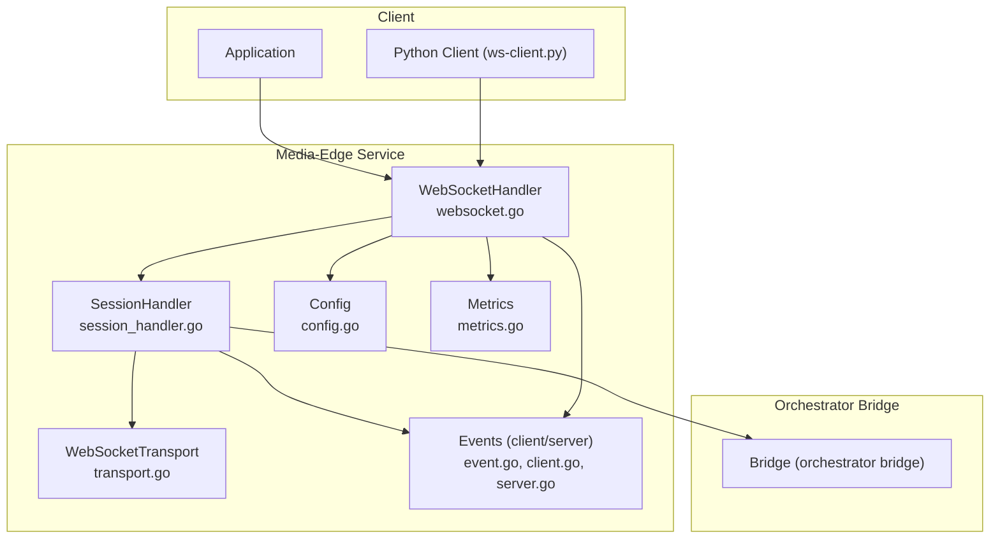
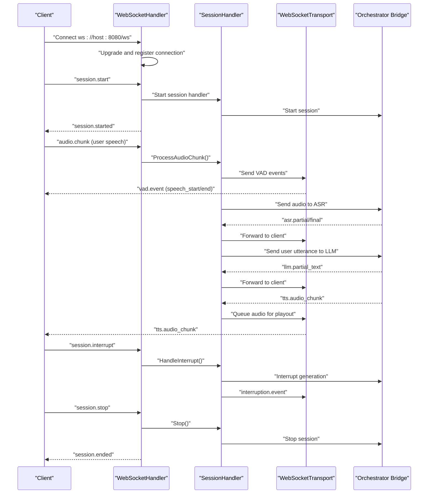
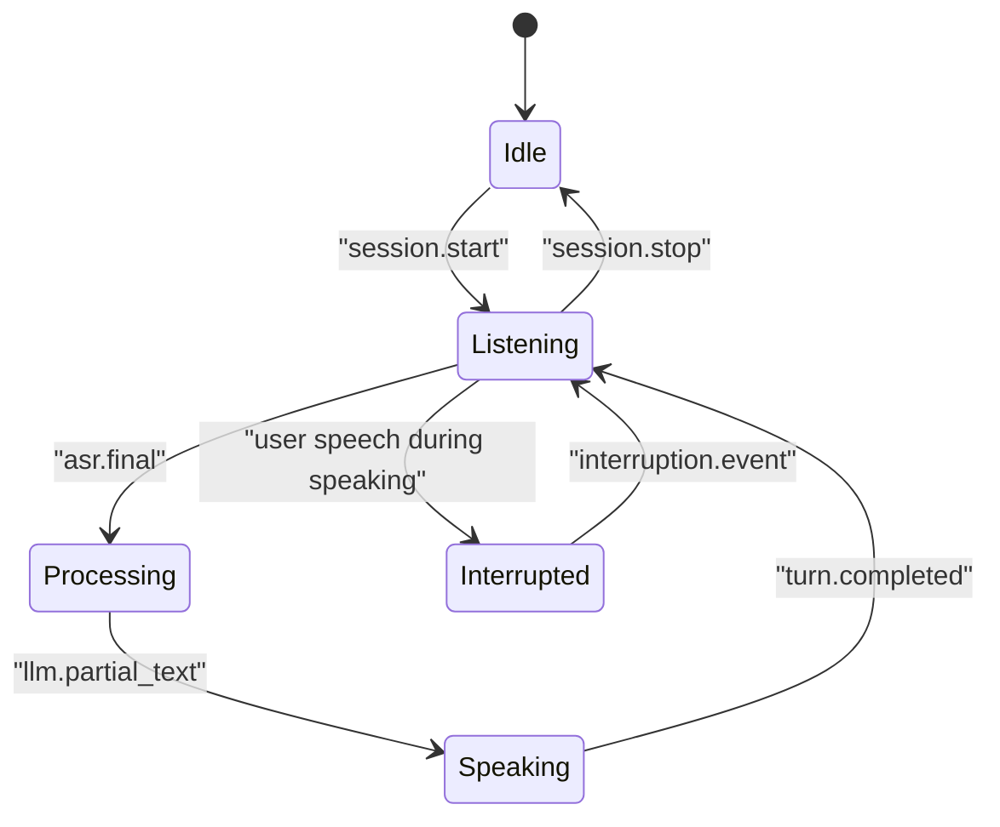
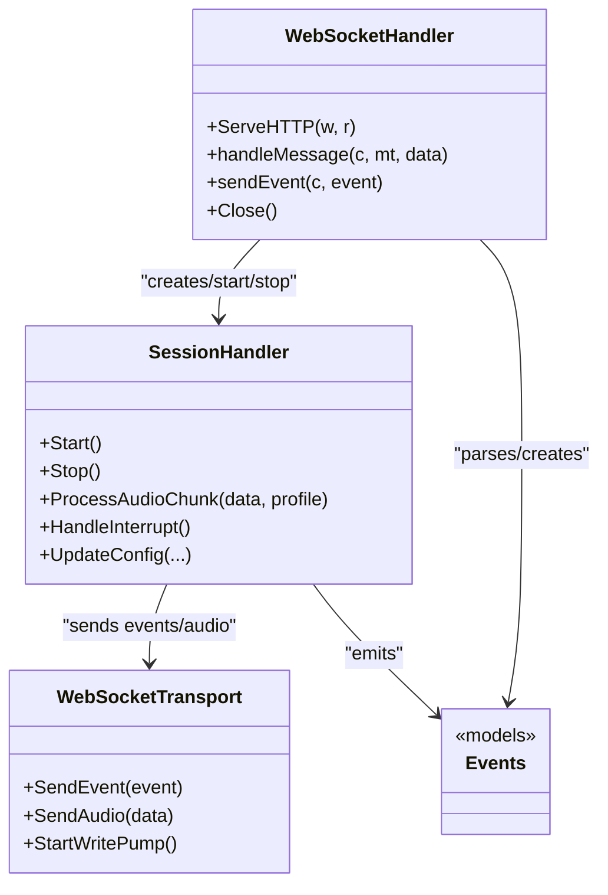
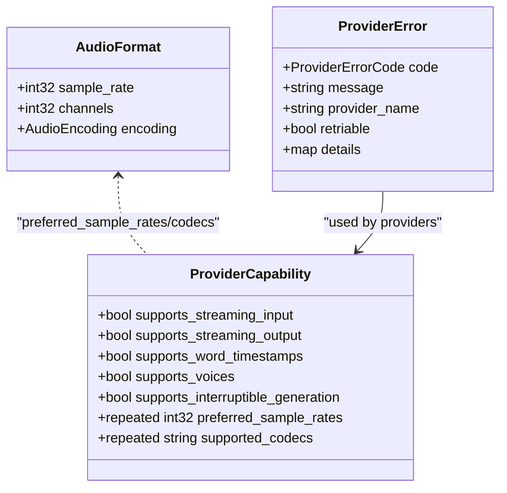

# WebSocket API Reference

<cite>
**Referenced Files in This Document**
- [websocket-api.md](file://docs/websocket-api.md)
- [ws-client.py](file://scripts/ws-client.py)
- [websocket.go](file://go/media-edge/internal/handler/websocket.go)
- [session_handler.go](file://go/media-edge/internal/handler/session_handler.go)
- [event.go](file://go/pkg/events/event.go)
- [client.go](file://go/pkg/events/client.go)
- [server.go](file://go/pkg/events/server.go)
- [transport.go](file://go/media-edge/internal/transport/transport.go)
- [config.go](file://go/pkg/config/config.go)
- [main.go](file://go/media-edge/cmd/main.go)
- [metrics.go](file://go/pkg/observability/metrics.go)
- [common.proto](file://proto/common.proto)
- [asr.proto](file://proto/asr.proto)
- [llm.proto](file://proto/llm.proto)
</cite>

## Table of Contents
1. [Introduction](#introduction)
2. [Project Structure](#project-structure)
3. [Core Components](#core-components)
4. [Architecture Overview](#architecture-overview)
5. [Detailed Component Analysis](#detailed-component-analysis)
6. [Dependency Analysis](#dependency-analysis)
7. [Performance Considerations](#performance-considerations)
8. [Troubleshooting Guide](#troubleshooting-guide)
9. [Conclusion](#conclusion)
10. [Appendices](#appendices)

## Introduction
This document specifies the WebSocket API for CloudApp’s real-time voice interaction system. It covers connection lifecycle, authentication, message formats, event types, audio streaming, control messages, interruption handling, and operational guidance for clients and operators. It also includes protocol-specific examples, debugging and monitoring approaches, and client implementation guidelines derived from the included Python client script.

## Project Structure
The WebSocket API is implemented in the media-edge service and supported by shared event models and configuration. The key areas are:
- Protocol and message definitions in Go events and Protocol Buffers
- WebSocket connection handling and session orchestration
- Transport abstraction for WebSocket messaging
- Metrics and health endpoints
- Example client for demonstration

**Diagram sources**
- [websocket.go:22-92](file://go/media-edge/internal/handler/websocket.go#L22-L92)
- [session_handler.go:17-117](file://go/media-edge/internal/handler/session_handler.go#L17-L117)
- [transport.go:44-80](file://go/media-edge/internal/transport/transport.go#L44-L80)
- [event.go:11-35](file://go/pkg/events/event.go#L11-L35)
- [client.go:3-113](file://go/pkg/events/client.go#L3-L113)
- [server.go:7-178](file://go/pkg/events/server.go#L7-L178)
- [config.go:87-94](file://go/pkg/config/config.go#L87-L94)
- [metrics.go:77-82](file://go/pkg/observability/metrics.go#L77-L82)

**Section sources**
- [websocket.go:95-129](file://go/media-edge/internal/handler/websocket.go#L95-L129)
- [main.go:94-127](file://go/media-edge/cmd/main.go#L94-L127)

## Core Components
- WebSocketHandler: Manages WebSocket upgrades, per-connection state, message routing, and lifecycle cleanup.
- SessionHandler: Runs the audio pipeline, VAD, interruption handling, and orchestrator integration.
- Events: Strongly typed JSON event models for client-to-server and server-to-client communication.
- Transport: Abstraction for sending events and audio over WebSocket.
- Config: Security, server, and limits configuration (including allowed origins and max message size).
- Metrics: Prometheus gauges and histograms for WebSocket connections and pipeline latencies.

**Section sources**
- [websocket.go:22-92](file://go/media-edge/internal/handler/websocket.go#L22-L92)
- [session_handler.go:17-117](file://go/media-edge/internal/handler/session_handler.go#L17-L117)
- [event.go:80-185](file://go/pkg/events/event.go#L80-L185)
- [transport.go:16-42](file://go/media-edge/internal/transport/transport.go#L16-L42)
- [config.go:87-94](file://go/pkg/config/config.go#L87-L94)
- [metrics.go:10-82](file://go/pkg/observability/metrics.go#L10-L82)

## Architecture Overview
The WebSocket API follows a request-response event model over a persistent connection. Clients send control and audio events; the server responds with interleaved events representing VAD, ASR, LLM, TTS, turn state, interruptions, and errors. The media-edge service maintains session state and coordinates with the orchestrator bridge.

**Diagram sources**
- [websocket.go:260-481](file://go/media-edge/internal/handler/websocket.go#L260-L481)
- [session_handler.go:176-432](file://go/media-edge/internal/handler/session_handler.go#L176-L432)
- [transport.go:82-161](file://go/media-edge/internal/transport/transport.go#L82-L161)
- [server.go:15-178](file://go/pkg/events/server.go#L15-L178)

## Detailed Component Analysis

### Connection Handling
- Endpoint: /ws (configurable via server.ws_path)
- Upgrade: Gorilla WebSocket upgrader with configurable origin policy and read/write buffer sizes
- Ping/Pong: Periodic ping with read deadline extension; idle disconnects on unexpected closure
- Metrics: Active WebSocket connections gauge updated on connect/close

Operational notes:
- Origin validation respects security.allowed_origins
- Max message size enforced by security.max_chunk_size
- Read/write timeouts configured via server.read_timeout and server.write_timeout

**Section sources**
- [websocket.go:64-92](file://go/media-edge/internal/handler/websocket.go#L64-L92)
- [websocket.go:131-192](file://go/media-edge/internal/handler/websocket.go#L131-L192)
- [config.go:21-28](file://go/pkg/config/config.go#L21-L28)
- [config.go:87-94](file://go/pkg/config/config.go#L87-L94)
- [metrics.go:139-147](file://go/pkg/observability/metrics.go#L139-L147)

### Authentication and Authorization
- Authorization header: Bearer token when security.auth_enabled is true
- Allowed origins: Controlled by security.allowed_origins; default allows all in development
- Middleware chain includes authentication and CORS handlers

**Section sources**
- [main.go:128-136](file://go/media-edge/cmd/main.go#L128-L136)
- [config.go:87-94](file://go/pkg/config/config.go#L87-L94)

### Message Format Specifications
- All messages are JSON with a type field
- Audio payloads are base64-encoded strings in specific fields
- Timestamps are Unix milliseconds

Client-to-server event types:
- session.start
- audio.chunk
- session.update
- session.interrupt
- session.stop

Server-to-client event types:
- session.started
- vad.event
- asr.partial, asr.final
- llm.partial_text
- tts.audio_chunk
- turn.event
- interruption.event
- error
- session.ended

**Section sources**
- [event.go:14-35](file://go/pkg/events/event.go#L14-L35)
- [event.go:80-185](file://go/pkg/events/event.go#L80-L185)
- [client.go:3-113](file://go/pkg/events/client.go#L3-L113)
- [server.go:7-178](file://go/pkg/events/server.go#L7-L178)

### Real-Time Interaction Patterns

#### Audio Streaming
- Clients send audio.chunk events with base64-encoded PCM16 audio
- Recommended chunk durations: 10–100 ms (e.g., 160–1600 samples at 16 kHz)
- Audio format must match audio_profile from session.start

#### Control Messages
- session.start: Initializes session, audio and voice profiles, providers, system prompt, model options, tenant_id
- session.update: Mid-conversation updates to system prompt, voice profile, model options, or provider selection
- session.interrupt: Manual interruption of assistant generation
- session.stop: Ends the session

#### Event-Driven Communication
- vad.event: Speech start/end notifications
- asr.partial/asr.final: Interim and final transcriptions
- llm.partial_text: Streaming LLM tokens
- tts.audio_chunk: Synthesized audio segments
- turn.event: Turn state transitions
- interruption.event: Details when interruption occurs
- error: Error reporting with code, message, and details
- session.ended: Session termination details

**Section sources**
- [websocket-api.md:24-442](file://docs/websocket-api.md#L24-L442)
- [session_handler.go:176-432](file://go/media-edge/internal/handler/session_handler.go#L176-L432)

### Session Lifecycle and Interruption Handling
- Start: session.start creates session state and starts the pipeline
- Listening: Awaiting user speech; VAD emits speech_start
- Processing: ASR final transcript triggers LLM generation
- Speaking: TTS audio queued and streamed; turn.completed signals end of speaking
- Interruption: User speech during bot speaking triggers interruption.event and cancels generation
- Stop: session.stop terminates handler, deletes session, and sends session.ended

**Diagram sources**
- [session_handler.go:267-314](file://go/media-edge/internal/handler/session_handler.go#L267-L314)
- [session_handler.go:379-403](file://go/media-edge/internal/handler/session_handler.go#L379-L403)

**Section sources**
- [websocket.go:260-374](file://go/media-edge/internal/handler/websocket.go#L260-L374)
- [session_handler.go:462-473](file://go/media-edge/internal/handler/session_handler.go#L462-L473)

### Protocol-Specific Examples
- Session flow example: See the documented sequence in the API reference
- Client examples: JavaScript and Python client code is provided in the API reference

**Section sources**
- [websocket-api.md:502-621](file://docs/websocket-api.md#L502-L621)

### Client Implementation Guidelines
- Use a WebSocket library to connect to ws://host:8080/ws
- Send session.start with audio_profile and optional voice_profile/system_prompt/model_options/providers/tenant_id
- Stream audio chunks at 10–100 ms intervals with base64-encoded PCM16 data
- Handle server events: vad.event, asr.partial/final, llm.partial_text, tts.audio_chunk, turn.event, interruption.event, error, session.ended
- Send session.interrupt to cancel assistant generation
- Send session.stop to end the session

Reference client implementation:
- Python client script demonstrates connecting, sending session.start, streaming audio chunks, and handling server events

**Section sources**
- [ws-client.py:125-248](file://scripts/ws-client.py#L125-L248)
- [ws-client.py:163-235](file://scripts/ws-client.py#L163-L235)
- [ws-client.py:29-70](file://scripts/ws-client.py#L29-L70)

## Dependency Analysis

**Diagram sources**
- [websocket.go:22-92](file://go/media-edge/internal/handler/websocket.go#L22-L92)
- [session_handler.go:17-117](file://go/media-edge/internal/handler/session_handler.go#L17-L117)
- [transport.go:44-80](file://go/media-edge/internal/transport/transport.go#L44-L80)
- [event.go:80-185](file://go/pkg/events/event.go#L80-L185)

**Section sources**
- [websocket.go:220-258](file://go/media-edge/internal/handler/websocket.go#L220-L258)
- [session_handler.go:316-403](file://go/media-edge/internal/handler/session_handler.go#L316-L403)

## Performance Considerations
- Audio chunk sizing: Use 10–100 ms chunks to balance latency and bandwidth
- Buffering: Jitter buffers and playout tracker manage timing; ensure adequate write channel capacity
- Timeouts: Tune server.read_timeout and server.write_timeout for network conditions
- Metrics: Monitor active connections, pipeline latencies, and provider timings
- Provider selection: Choose providers aligned with preferred sample rates and codecs

**Section sources**
- [websocket-api.md:113-118](file://docs/websocket-api.md#L113-L118)
- [session_handler.go:82-106](file://go/media-edge/internal/handler/session_handler.go#L82-L106)
- [metrics.go:10-82](file://go/pkg/observability/metrics.go#L10-L82)

## Troubleshooting Guide
Common issues and remedies:
- Connection refused or handshake failure: Verify server is running and URL is correct
- Invalid origin: Ensure Origin matches security.allowed_origins
- Message too large: Reduce payload size or increase security.max_chunk_size
- Unknown event type: Confirm event type spelling and supported types
- Session not found or already started: Check session lifecycle and session_id
- Provider errors: Inspect error.code and details; consider retries for retriable errors

Operational endpoints:
- GET /health: Basic health status
- GET /ready: Readiness probe
- GET /metrics: Prometheus metrics (when enabled)

**Section sources**
- [websocket.go:170-191](file://go/media-edge/internal/handler/websocket.go#L170-L191)
- [websocket.go:220-258](file://go/media-edge/internal/handler/websocket.go#L220-L258)
- [websocket.go:483-498](file://go/media-edge/internal/handler/websocket.go#L483-L498)
- [main.go:99-127](file://go/media-edge/cmd/main.go#L99-L127)

## Conclusion
The CloudApp WebSocket API provides a robust, event-driven foundation for real-time voice interactions. By adhering to the documented message formats, managing session lifecycle carefully, and leveraging the provided metrics and endpoints, developers can build responsive voice assistants with strong interruption handling and reliable audio streaming.

## Appendices

### Protocol Buffers Overview
Protocol Buffer definitions describe provider capabilities, audio formats, and error codes used across the system.

**Diagram sources**
- [common.proto:47-61](file://proto/common.proto#L47-L61)
- [common.proto:75-84](file://proto/common.proto#L75-L84)
- [common.proto:54-61](file://proto/common.proto#L54-L61)

**Section sources**
- [common.proto:9-31](file://proto/common.proto#L9-L31)
- [common.proto:47-61](file://proto/common.proto#L47-L61)
- [asr.proto:26-52](file://proto/asr.proto#L26-L52)
- [llm.proto:39-58](file://proto/llm.proto#L39-L58)

### Example Session Flow
See the documented sequence diagram for a typical voice interaction from session.start through session.ended.

**Section sources**
- [websocket-api.md:502-540](file://docs/websocket-api.md#L502-L540)